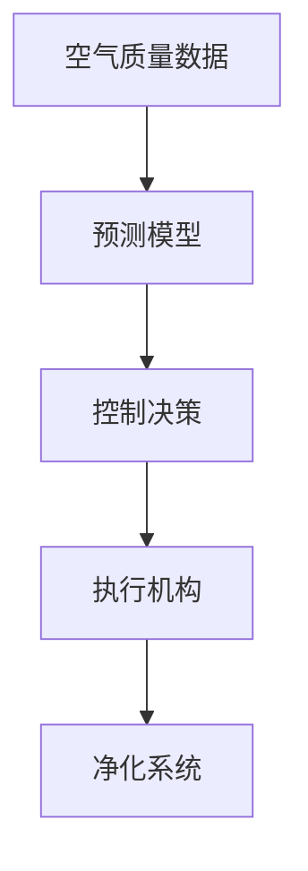
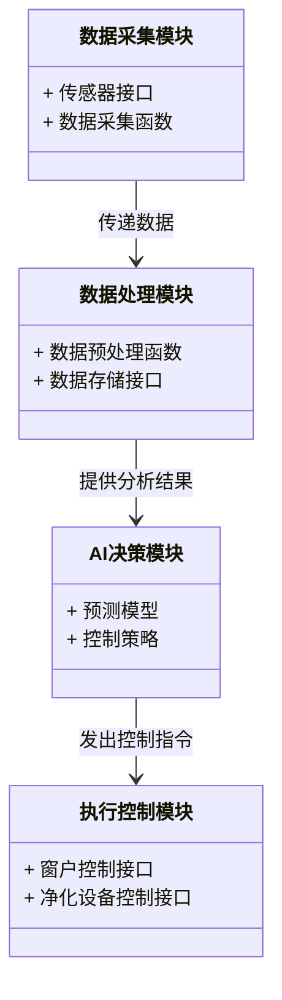
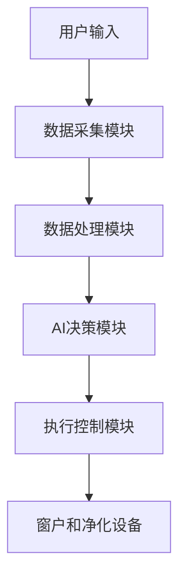

                 


# 智能窗台：AI Agent的室内空气净化控制

---

## 关键词：智能窗台，AI Agent，室内空气净化，空气质量监测，空气净化控制，物联网

---

## 摘要：

随着室内空气污染问题的日益严重，智能窗台作为一种创新的空气净化解决方案，结合AI Agent技术，能够实现智能化、高效的室内空气净化控制。本文从背景介绍、核心概念、算法原理、系统设计、项目实战到最佳实践，全面解析智能窗台的工作原理和实现方法。通过AI Agent的智能决策和物联网技术的应用，智能窗台能够实时监测空气质量，并自动调整净化策略，为用户提供健康、舒适的室内环境。

---

## 第1章：AI Agent与室内空气净化的背景

### 1.1 AI Agent的基本概念

AI Agent，即人工智能代理，是一种能够感知环境、自主决策并执行任务的智能实体。它通过传感器获取信息，利用算法进行分析和推理，最终做出决策并执行操作。AI Agent的核心功能包括信息处理、决策制定和任务执行，广泛应用于智能家居、自动驾驶、医疗健康等领域。

在室内空气净化领域，AI Agent能够通过传感器获取空气质量数据，分析污染源和环境变化，并动态调整净化设备的工作模式，从而实现智能化的空气净化控制。

### 1.2 室内空气净化的背景与挑战

随着工业化和城市化进程的加快，室内空气污染问题日益严重。常见的污染物包括PM2.5、甲醛、挥发性有机物（VOCs）等。这些问题不仅影响室内空气质量，还对人体健康造成严重威胁。传统的空气净化设备通常基于固定模式运行，无法根据实时环境变化做出调整，存在效率低下、能耗高等问题。

### 1.3 智能窗台的概念与问题描述

智能窗台是一种集成AI Agent的智能化空气净化设备，能够通过传感器实时监测室内空气质量，并根据数据动态调整窗户的开合状态和空气净化设备的工作模式。与传统空气净化设备相比，智能窗台具有以下特点：

- **智能感知**：通过多种传感器实时监测空气质量、温湿度、PM2.5等参数。
- **自主决策**：基于AI算法分析数据，动态调整窗户的开合状态和净化设备的工作模式。
- **高效节能**：通过优化通风策略，减少能耗，同时确保空气质量达标。

智能窗台的主要问题在于如何设计高效的AI算法，实现对复杂环境的实时响应，并确保系统的稳定性和可靠性。

### 1.4 智能窗台的解决思路

为了解决智能窗台的空气净化控制问题，可以采用以下思路：

1. **数据采集**：通过传感器实时采集室内空气质量数据。
2. **数据分析**：利用AI算法分析数据，预测空气质量变化趋势。
3. **决策制定**：根据分析结果，动态调整窗户的开合状态和净化设备的工作模式。
4. **执行操作**：通过执行机构（如电动窗户、空气净化器）实现空气净化。

### 1.5 智能窗台的核心要素与概念结构

智能窗台的核心要素包括：

- **传感器**：用于采集空气质量数据。
- **AI Agent**：用于分析数据并制定决策。
- **执行机构**：用于执行窗户的开合和净化设备的控制。
- **通信模块**：用于与用户或其他设备进行数据交互。

通过这些要素的协同工作，智能窗台能够实现高效的室内空气净化控制。

---

## 第2章：AI Agent与室内空气净化系统的关系

### 2.1 AI Agent与室内空气净化系统的概念属性对比

| 概念 | AI Agent | 室内空气净化系统 |
|------|----------|------------------|
| 定义 | 具备感知、决策和执行能力的智能实体 | 用于改善室内空气质量的设备和系统 |
| 核心功能 | 数据处理、决策制定、任务执行 | 空气净化、监测、通风控制 |
| 应用场景 | 智能家居、医疗健康、工业自动化 | 室内空气净化、建筑通风 |
| 交互方式 | 通过传感器和用户输入 | 通过传感器和用户输入 |

通过对比可以看出，AI Agent与室内空气净化系统在功能和应用场景上具有互补性。AI Agent能够为室内空气净化系统提供智能化的决策支持，而室内空气净化系统则为AI Agent提供数据来源和执行载体。

### 2.2 AI Agent与室内空气净化系统的ER实体关系图

```mermaid
erDiagram
    actor 用户
    actor 环境
    actor 系统
    class 传感器
    class AI Agent
    class 执行机构
    class 空气净化系统
    用户 --> 传感器 : 提供输入
    环境 --> 传感器 : 提供数据
    传感器 --> AI Agent : 传输数据
    AI Agent --> 执行机构 : 发出指令
    执行机构 --> 空气净化系统 : 执行操作
```

---

## 第3章：智能窗台的空气质量预测与控制算法

### 3.1 数据采集与预处理

空气质量数据的采集是智能窗台的核心步骤。通常，智能窗台会配备多种传感器，包括：

- **PM2.5传感器**：用于监测空气中细颗粒物的浓度。
- **温湿度传感器**：用于监测室内温湿度。
- **甲醛传感器**：用于监测甲醛浓度。
- **CO2传感器**：用于监测二氧化碳浓度。

#### 3.1.1 数据采集流程

1. 传感器采集数据。
2. 数据预处理（去噪、归一化）。
3. 数据存储（数据库或本地存储）。

#### 3.1.2 数据采集的代码实现

```python
import serial
import time

# 连接传感器
ser = serial.Serial('COM3', 9600)

def get_sensor_data():
    while True:
        data = ser.readline().decode().strip()
        if data.startswith('PM'):
            pm25 = int(data.split(':')[1])
            return pm25
        time.sleep(1)

pm25 = get_sensor_data()
print(f"PM2.5值为：{pm25} μg/m³")
```

### 3.2 空气质量预测模型

空气质量预测模型是智能窗台的核心算法之一。常用的方法包括：

- **时间序列分析**：利用历史数据预测未来空气质量。
- **机器学习模型**：如随机森林、神经网络等。
- **回归模型**：建立空气质量与环境因素的数学模型。

#### 3.2.1 空气质量预测的数学模型

$$
\text{AQI} = \alpha \times \text{PM2.5} + \beta \times \text{温湿度} + \gamma \times \text{甲醛} + \delta \times \text{CO2}
$$

其中，$\alpha$、$\beta$、$\gamma$、$\delta$为回归系数，通过训练数据确定。

### 3.3 空气净化控制策略

智能窗台的空气净化控制策略主要基于预测的空气质量数据和实时传感器数据。常见的控制策略包括：

1. **主动控制**：根据预测数据提前调整窗户的开合状态。
2. **被动控制**：根据实时数据动态调整。
3. **混合控制**：结合预测和实时数据进行综合决策。

#### 3.3.1 空气净化控制的算法流程



---

## 第4章：智能窗台的系统分析与架构设计

### 4.1 系统功能设计

智能窗台的功能模块包括：

- **数据采集模块**：负责采集室内空气质量数据。
- **数据处理模块**：对采集的数据进行预处理和分析。
- **AI决策模块**：基于分析结果制定控制策略。
- **执行控制模块**：根据决策结果控制窗户和净化设备。

#### 4.1.1 功能模块的类图



### 4.2 系统架构设计

智能窗台的系统架构包括以下几个部分：

1. **硬件层**：包括传感器、窗户、净化设备等。
2. **数据层**：包括数据采集、存储和管理。
3. **算法层**：包括空气质量预测模型和控制策略。
4. **应用层**：包括用户界面和系统管理。

#### 4.2.1 系统架构的流程图



---

## 第5章：智能窗台的项目实战

### 5.1 环境安装与配置

在实现智能窗台之前，需要进行环境安装和配置：

1. **硬件安装**：安装传感器、窗户和净化设备。
2. **软件安装**：安装Python、传感器驱动、数据库等。

#### 5.1.1 环境配置代码

```python
import serial
import time
import sqlite3

# 数据库初始化
conn = sqlite3.connect('air_quality.db')
cursor = conn.cursor()
cursor.execute('''CREATE TABLE IF NOT EXISTS sensor_data
                (id INTEGER PRIMARY KEY AUTOINCREMENT,
                 pm25 INTEGER,
                 timestamp DATETIME)''')
conn.commit()
conn.close()
```

### 5.2 核心代码实现

以下是智能窗台的核心代码实现：

#### 5.2.1 数据采集模块

```python
import serial
import time

ser = serial.Serial('COM3', 9600)

def read_pm25():
    while True:
        data = ser.readline().decode().strip()
        if data.startswith('PM'):
            pm25 = int(data.split(':')[1])
            return pm25
        time.sleep(1)

pm25 = read_pm25()
print(f"PM2.5值为：{pm25} μg/m³")
```

#### 5.2.2 数据处理与分析

```python
import sqlite3
from sklearn import linear_model

conn = sqlite3.connect('air_quality.db')
cursor = conn.cursor()

# 读取数据
cursor.execute("SELECT timestamp, pm25 FROM sensor_data")
data = cursor.fetchall()

# 训练回归模型
model = linear_model.LinearRegression()
model.fit([[d[0]] for d in data], [d[1] for d in data])

# 预测空气质量
future_time = '2023-10-01 12:00:00'
predicted_pm25 = model.predict([[future_time]])[0]
print(f"预测PM2.5值为：{predicted_pm25} μg/m³")
```

### 5.3 案例分析与解读

通过实际案例分析，验证智能窗台的空气净化效果。例如，在PM2.5浓度较高的环境下，智能窗台能够通过开启窗户和启动净化设备，迅速降低PM2.5浓度，确保室内空气质量达标。

### 5.4 项目总结

智能窗台通过AI Agent的智能决策和物联网技术的应用，实现了高效的室内空气净化控制。在实际应用中，需要考虑传感器的精度、算法的实时性和系统的稳定性。

---

## 第6章：最佳实践与注意事项

### 6.1 最佳实践

1. **传感器校准**：定期校准传感器，确保数据准确性。
2. **算法优化**：根据实际环境数据，优化空气质量预测模型。
3. **系统维护**：定期检查硬件和软件，确保系统稳定运行。

### 6.2 小结

智能窗台是一种创新的室内空气净化解决方案，通过AI Agent和物联网技术的结合，能够实现智能化、高效的空气净化控制。本文从背景、原理、设计到实战，全面解析了智能窗台的技术实现和应用。

### 6.3 注意事项

- 在实际应用中，需注意传感器的安装位置和环境干扰。
- 系统运行期间，需定期检查数据和设备状态。
- 遵循相关安全规范，确保系统的安全性和可靠性。

### 6.4 拓展阅读

- 智能家居相关技术
- AI在环境监测中的应用
- 物联网技术的最新发展

---

## 作者：AI天才研究院 & 禅与计算机程序设计艺术

通过本文的详细解析，希望能够为读者提供关于智能窗台的系统性知识和实践指导，帮助读者更好地理解和应用AI Agent技术在室内空气净化中的应用。

