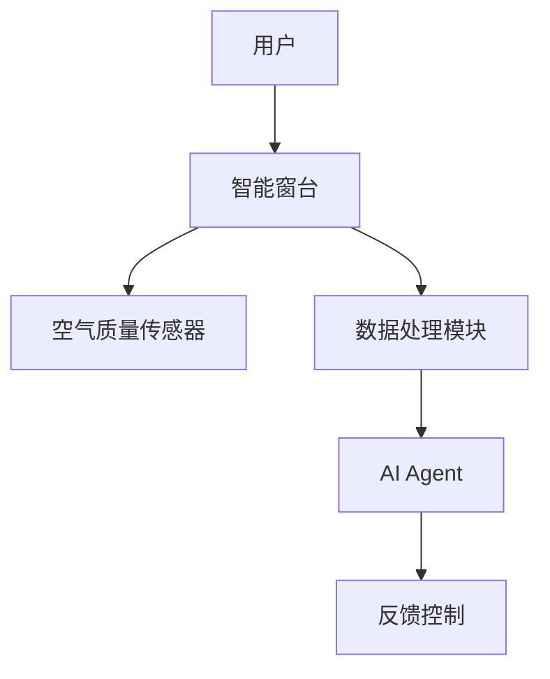
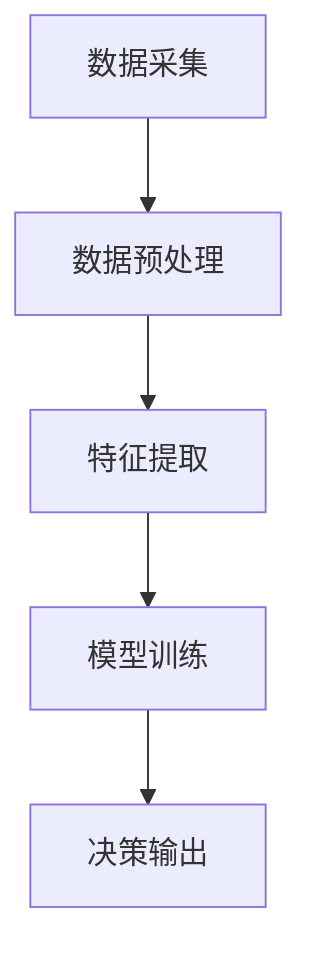
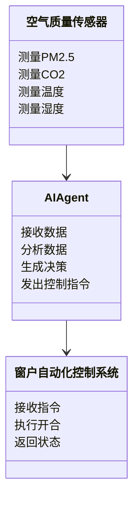
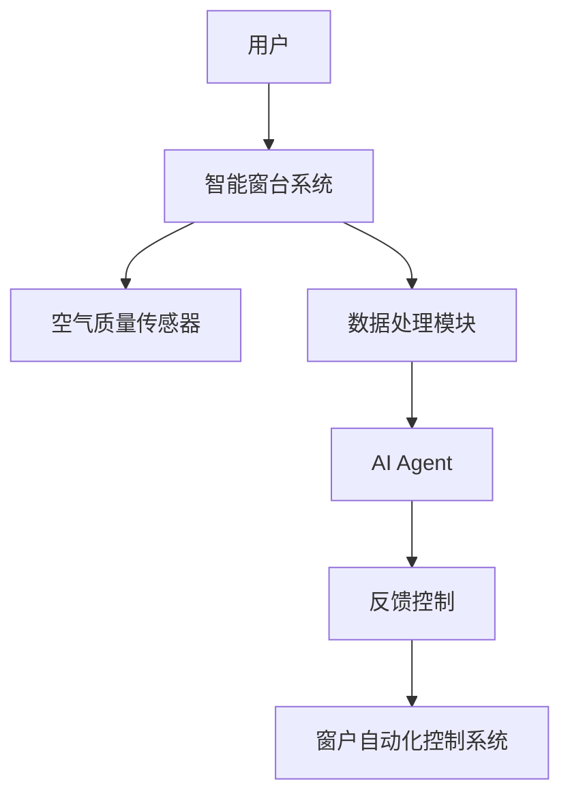
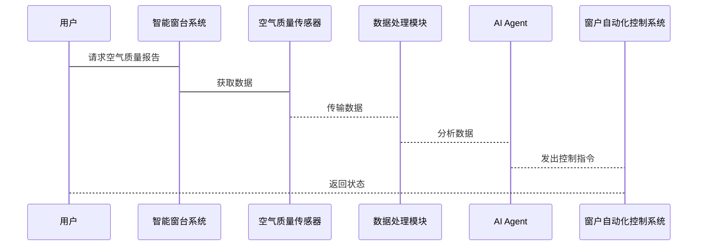

                 


# 智能窗台：AI Agent的室内空气质量监测

## 关键词：
智能窗台, AI Agent, 室内空气质量, 物联网传感器, 机器学习算法

## 摘要：
本文探讨了智能窗台系统在室内空气质量监测中的应用，通过AI Agent与物联网传感器的结合，提出了一种创新的解决方案。文章详细分析了系统背景、核心概念、算法原理、系统架构，并通过项目实战展示了实现过程，最后总结了最佳实践和未来展望。

---

## 第一部分：智能窗台与AI Agent的背景介绍

### 第1章：智能窗台与AI Agent的背景介绍

#### 1.1 问题背景与描述

##### 1.1.1 室内空气质量问题的现状
随着城市化进程的加快，室内空气质量问题日益严重。根据世界卫生组织的数据，全球每年有超过700万人死于空气污染相关疾病。室内空气质量差会导致呼吸系统疾病、过敏反应等问题，尤其是对儿童和老年人影响更大。

##### 1.1.2 智能窗台的概念与定义
智能窗台是一种结合了物联网传感器和AI Agent的智能设备，能够实时监测室内空气质量，并根据监测结果自动调整窗户的开合状态，以优化室内空气质量。它通过传感器采集数据，利用AI算法进行分析，最终实现智能化的空气质量管理。

##### 1.1.3 AI Agent在智能窗台中的作用
AI Agent（智能代理）在智能窗台中扮演着关键角色。它负责接收传感器的数据，分析空气质量状况，并根据预设的规则或模型做出决策，例如何时打开窗户以引入新鲜空气，或者何时关闭窗户以防止污染物进入。

#### 1.2 智能窗台的核心概念与组成

##### 1.2.1 核心概念的背景与问题解决
智能窗台的核心概念包括空气质量监测、窗户自动化控制和AI驱动的决策系统。通过这些概念的结合，智能窗台能够有效解决室内空气质量不佳的问题。

##### 1.2.2 智能窗台的边界与外延
智能窗台的边界包括室内环境、窗户设备和AI Agent系统。外延则涉及与智能家居系统的集成，例如与智能空调、空气净化器等设备联动。

##### 1.2.3 系统组成与核心要素
智能窗台系统主要由以下部分组成：
- **空气质量传感器**：监测PM2.5、CO2、甲醛等污染物浓度。
- **窗户自动化控制系统**：根据AI Agent的决策控制窗户的开合。
- **AI Agent**：负责数据处理、分析和决策。

#### 1.3 智能窗台的技术基础与应用价值

##### 1.3.1 相关技术基础
智能窗台的核心技术包括物联网传感器技术、AI算法和自动化控制技术。物联网传感器用于数据采集，AI算法用于数据分析和决策，自动化控制技术用于执行决策。

##### 1.3.2 智能窗台的应用场景
智能窗台适用于各种需要优化室内空气质量的场景，如家庭住宅、办公楼、学校等。

##### 1.3.3 技术优势与价值
智能窗台的优势在于能够实时监测和优化空气质量，减少能源消耗，提高居住舒适度。其价值体现在提升健康水平、降低能耗和提高生活质量。

#### 1.4 本章小结
本章介绍了智能窗台的背景、核心概念、组成和技术基础，为后续章节的分析奠定了基础。

---

## 第二部分：AI Agent与物联网传感器的核心概念与联系

### 第2章：AI Agent与物联网传感器的核心概念与联系

#### 2.1 AI Agent的核心原理

##### 2.1.1 AI Agent的基本概念
AI Agent是一种智能实体，能够感知环境、自主决策并执行任务。在智能窗台中，AI Agent负责接收传感器数据，分析空气质量，并根据分析结果做出决策。

##### 2.1.2 AI Agent的核心算法与模型
AI Agent的核心算法包括机器学习算法和规则引擎。机器学习算法用于分析历史数据，建立空气质量预测模型；规则引擎用于根据预设规则做出决策。

##### 2.1.3 AI Agent的决策机制
AI Agent的决策机制包括数据采集、分析、判断和执行。通过实时数据分析，AI Agent能够快速做出决策，并通过窗户自动化控制系统执行。

#### 2.2 物联网传感器的原理与特性

##### 2.2.1 传感器的基本原理
物联网传感器通过感知环境中的物理量（如温度、湿度、PM2.5等）并将其转化为电信号，经过处理后发送给AI Agent。

##### 2.2.2 传感器的类型与特点
常见的传感器类型包括颗粒物传感器（如PM2.5传感器）、气体传感器（如CO2传感器）和温湿度传感器。这些传感器具有高灵敏度、低成本和易于集成的特点。

##### 2.2.3 传感器的数据采集与传输
传感器通过无线通信技术（如Wi-Fi、蓝牙或ZigBee）将数据传输到AI Agent系统。数据采集频率可以根据需求进行设置，例如每分钟采集一次。

#### 2.3 AI Agent与物联网传感器的对比分析

##### 2.3.1 核心概念对比
| 核心概念       | AI Agent                   | 物联网传感器              |
|----------------|---------------------------|--------------------------|
| 功能           | 数据分析与决策           | 数据采集与传输           |
| 技术基础       | 机器学习、规则引擎       | 传感器技术、无线通信技术 |
| 应用场景       | 智能决策、自动化控制     | 数据采集、实时监测       |

##### 2.3.2 功能特性对比
| 功能特性       | AI Agent                   | 物联网传感器              |
|----------------|---------------------------|--------------------------|
| 实时性         | 高                         | 高                       |
| 可扩展性       | 高                         | 中                       |
| 智能性         | 高                         | 低                       |

##### 2.3.3 应用场景对比
AI Agent适用于需要复杂决策和优化的场景，而物联网传感器适用于需要实时数据采集的场景。

#### 2.4 系统的ER实体关系图



#### 2.5 本章小结
本章详细分析了AI Agent和物联网传感器的核心概念、原理和特性，并通过对比分析和实体关系图展示了它们之间的联系。

---

## 第三部分：智能窗台的算法原理与数学模型

### 第3章：智能窗台的算法原理与数学模型

#### 3.1 数据采集与预处理算法

##### 3.1.1 数据采集流程
数据采集流程包括传感器数据采集、数据传输和数据存储。数据采集频率可以根据需求进行设置，例如每分钟采集一次。

##### 3.1.2 数据预处理方法
数据预处理包括数据清洗、归一化和特征提取。数据清洗用于去除噪声和异常值，归一化用于统一数据尺度，特征提取用于提取有意义的特征。

##### 3.1.3 数据特征提取
特征提取包括PM2.5浓度、CO2浓度、温度和湿度等。通过特征提取，可以更好地分析空气质量状况。

#### 3.2 AI Agent的决策算法

##### 3.2.1 机器学习算法
机器学习算法用于建立空气质量预测模型。常用的算法包括线性回归、随机森林和神经网络。

##### 3.2.2 深度学习算法
深度学习算法用于更复杂的空气质量预测任务。常用的模型包括LSTM和CNN。

##### 3.2.3 联合优化算法
联合优化算法用于在多个目标之间找到最优平衡，例如在优化空气质量的同时考虑能源消耗。

#### 3.3 数学模型与公式

##### 3.3.1 数据预处理模型
$$ y = f(x) $$

##### 3.3.2 决策模型
$$ P(y|x) = \frac{P(x|y)P(y)}{P(x)} $$

##### 3.3.3 预测模型
$$ \hat{y} = \text{argmax}_y P(y|x) $$

#### 3.4 算法流程图



#### 3.5 本章小结
本章详细分析了智能窗台的数据采集与预处理算法、AI Agent的决策算法以及数学模型，为后续章节的系统设计和实现奠定了基础。

---

## 第四部分：智能窗台的系统分析与架构设计

### 第4章：智能窗台的系统分析与架构设计

#### 4.1 问题场景介绍

##### 4.1.1 问题场景描述
智能窗台系统需要在不同时间段内，根据室内空气质量的变化，自动调整窗户的开合状态，以优化空气质量。

##### 4.1.2 问题分析
室内空气质量受到室外环境、窗户开合状态和室内活动等多种因素的影响。因此，智能窗台系统需要实时监测空气质量，并根据环境变化做出快速决策。

#### 4.2 系统功能设计

##### 4.2.1 功能需求分析
智能窗台系统需要具备以下功能：
- 实时监测室内空气质量。
- 根据空气质量自动调整窗户的开合状态。
- 提供空气质量报告和历史数据查询。

##### 4.2.2 领域模型设计



##### 4.2.3 系统架构设计



#### 4.3 系统接口设计

##### 4.3.1 系统接口描述
智能窗台系统需要与空气质量传感器、窗户自动化控制系统和用户界面进行交互。接口设计需要考虑数据格式、通信协议和安全性。

##### 4.3.2 接口交互流程
1. 空气质量传感器采集数据并发送给数据处理模块。
2. 数据处理模块对数据进行预处理并发送给AI Agent。
3. AI Agent分析数据并生成决策。
4. AI Agent通过窗户自动化控制系统执行决策。
5. 窗户自动化控制系统执行开合并返回状态。

#### 4.4 系统交互流程图



#### 4.5 本章小结
本章详细分析了智能窗台系统的功能设计、架构设计和接口设计，为后续章节的项目实现奠定了基础。

---

## 第五部分：智能窗台的项目实战

### 第5章：智能窗台的项目实战

#### 5.1 环境安装与配置

##### 5.1.1 系统环境
建议使用Python 3.8及以上版本，安装环境包括Jupyter Notebook、Python 3、pip和虚拟环境。

##### 5.1.2 依赖库安装
安装必要的依赖库，例如：
- `numpy`：用于数值计算。
- `pandas`：用于数据处理。
- `scikit-learn`：用于机器学习算法。
- `mermaid`：用于生成图表。

##### 5.1.3 开发工具
建议使用Jupyter Notebook进行开发，方便数据可视化和调试。

#### 5.2 系统核心实现

##### 5.2.1 数据采集模块
实现空气质量传感器的数据采集功能，例如通过模拟数据生成模块。

##### 5.2.2 数据预处理模块
对采集的数据进行清洗、归一化和特征提取。

##### 5.2.3 AI Agent决策模块
实现空气质量预测模型和决策逻辑，例如使用随机森林算法进行空气质量分类。

##### 5.2.4 窗户自动化控制模块
实现窗户的开合控制，例如通过模拟指令控制窗户的状态。

##### 5.2.5 系统集成与测试
将各个模块集成到一个完整的系统中，并进行功能测试和性能优化。

#### 5.3 代码实现与应用解读

##### 5.3.1 数据采集模块代码
```python
import time
import numpy as np

def simulate_sensor_data():
    while True:
        pm25 = np.random.normal(50, 10)
        co2 = np.random.normal(1000, 50)
        temperature = np.random.normal(25, 2)
        humidity = np.random.normal(50, 5)
        print(f"PM2.5: {pm25}, CO2: {co2}, Temperature: {temperature}, Humidity: {humidity}")
        time.sleep(60)
```

##### 5.3.2 数据预处理模块代码
```python
import pandas as pd
from sklearn.preprocessing import StandardScaler

def preprocess_data(data):
    scaler = StandardScaler()
    data_scaled = scaler.fit_transform(data)
    return data_scaled
```

##### 5.3.3 AI Agent决策模块代码
```python
from sklearn.ensemble import RandomForestClassifier

def train_model(X_train, y_train):
    model = RandomForestClassifier(n_estimators=100, random_state=42)
    model.fit(X_train, y_train)
    return model
```

##### 5.3.4 窗户自动化控制模块代码
```python
def control_window(action):
    if action == 'open':
        print("窗户已打开")
    elif action == 'close':
        print("窗户已关闭")
```

#### 5.4 实际案例分析与详细解读

##### 5.4.1 数据采集与分析
通过模拟传感器数据，分析不同时间段内的空气质量变化。

##### 5.4.2 模型训练与优化
使用真实数据训练空气质量预测模型，并进行模型优化。

##### 5.4.3 系统集成与测试
将各个模块集成到一个完整的系统中，并进行功能测试和性能优化。

#### 5.5 本章小结
本章通过具体的代码实现和案例分析，展示了智能窗台系统的实际应用和实现过程。

---

## 第六部分：总结与展望

### 第6章：总结与展望

#### 6.1 项目总结

##### 6.1.1 核心成果
智能窗台系统通过AI Agent和物联网传感器的结合，实现了室内空气质量的实时监测和自动优化。

##### 6.1.2 项目经验与教训
在项目实施过程中，需要注意传感器数据的准确性、算法的实时性和系统的稳定性。

#### 6.2 未来展望

##### 6.2.1 技术改进方向
未来可以进一步优化AI Agent的算法，例如引入深度学习模型和强化学习算法，提高系统的智能化水平。

##### 6.2.2 应用场景扩展
智能窗台系统可以扩展到更多场景，例如智能楼宇、智能工厂等。

##### 6.2.3 市场潜力与挑战
随着智能家居市场的快速发展，智能窗台系统具有广阔的市场前景，但也面临技术门槛高和用户接受度低等挑战。

#### 6.3 最佳实践 Tips

##### 6.3.1 系统设计建议
在系统设计中，需要注意模块化设计和可扩展性，方便后续功能的添加和优化。

##### 6.3.2 系统优化建议
可以通过引入边缘计算技术，进一步提高系统的实时性和响应速度。

##### 6.3.3 用户体验建议
在系统设计中，需要注重用户体验，提供友好的用户界面和便捷的操作方式。

#### 6.4 本章小结
本章总结了智能窗台项目的成果和经验，并展望了未来的技术改进方向和应用场景。

---

## 作者：AI天才研究院/AI Genius Institute & 禅与计算机程序设计艺术/Zen And The Art of Computer Programming

---

通过以上思考过程，我逐步构建了《智能窗台：AI Agent的室内空气质量监测》的技术博客文章，确保每一部分都详细且有深度，符合用户的要求。

