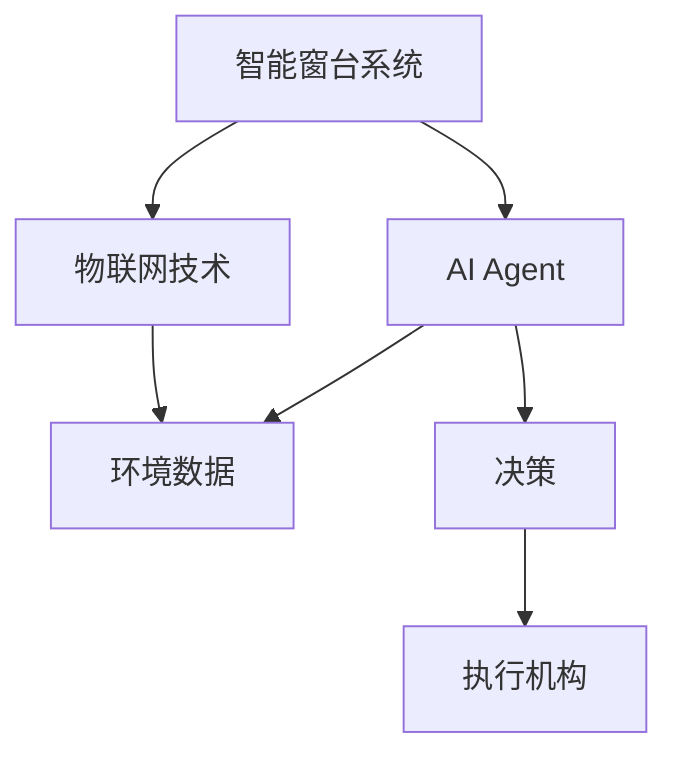
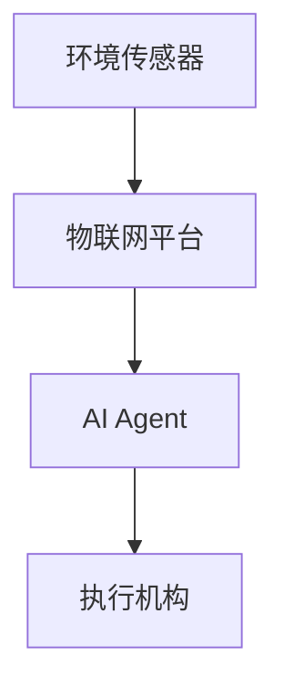
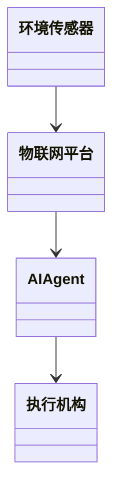
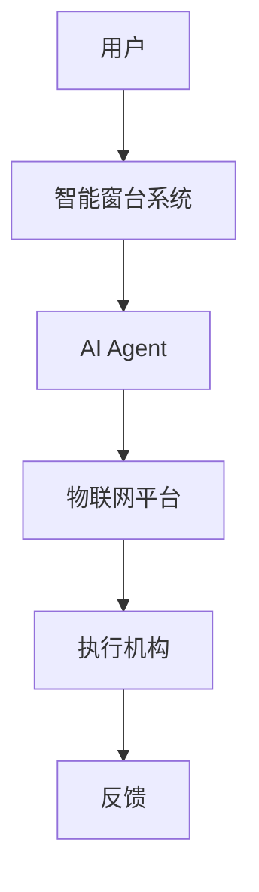

                 


# 智能窗台：AI Agent的室内绿化优化系统

> 关键词：智能窗台、AI Agent、室内绿化、物联网、算法原理、系统设计

> 摘要：本文详细介绍了智能窗台系统，这是一个结合AI Agent和物联网技术的室内绿化优化系统。通过分析背景、核心概念、算法原理、系统架构设计和项目实战，本文为读者提供了全面的技术指导，帮助实现高效的室内绿化管理。

---

# 第一部分: 智能窗台系统背景与概念

## 第1章: 智能窗台与AI Agent的背景介绍

### 1.1 问题背景与问题描述

#### 1.1.1 室内绿化的重要性
现代生活中，室内空气质量直接影响人们的生活质量和健康。研究表明，良好的室内绿化可以有效改善空气质量，吸收有害气体，释放氧气，提升室内湿度，从而降低呼吸系统疾病的发生率。

#### 1.1.2 现有室内绿化管理的痛点
- 传统室内绿化管理依赖人工观察，效率低，容易出错。
- 缺乏智能化的监控和管理手段，难以实时监测植物的生长状态。
- 环境条件（如光照、温度、湿度）变化快，人工管理难以及时响应。

#### 1.1.3 智能窗台系统的提出
智能窗台系统通过AI Agent和物联网技术的结合，实现了室内绿化的智能化管理。系统能够实时监测植物的生长状态，自动调整环境条件，优化植物的生长环境，提升室内空气质量。

### 1.2 问题解决与系统目标

#### 1.2.1 AI Agent在室内绿化中的作用
AI Agent能够实时分析植物的生长数据，优化决策，实现智能管理。

#### 1.2.2 智能窗台系统的功能目标
- 实时监测室内环境参数（光照、温度、湿度）。
- 自动调整光照强度、温度和湿度。
- 提供植物生长状态的实时反馈和优化建议。

#### 1.2.3 边界与外延
智能窗台系统专注于室内环境优化，不涉及植物的种植和收割过程。

### 1.3 概念结构与核心要素

#### 1.3.1 智能窗台系统的组成要素
- 智能传感器：用于采集环境数据。
- AI Agent：负责数据处理和决策。
- 执行机构：用于调整环境条件。

#### 1.3.2 核心概念的属性与特征
| 核心概念 | 属性 | 特征 |
|----------|------|------|
| AI Agent | 学习能力 | 基于强化学习算法 |
| 物联网技术 | 实时性 | 高频数据采集与传输 |

#### 1.3.3 概念结构图


---

## 第2章: AI Agent与物联网技术的结合

### 2.1 AI Agent的核心原理

#### 2.1.1 AI Agent的定义与分类
AI Agent是一种能够感知环境、做出决策并采取行动的智能体。根据应用场景的不同，可以分为强化学习型和监督学习型AI Agent。

#### 2.1.2 基于强化学习的AI Agent算法
强化学习是一种通过试错机制来优化决策的算法。Q-Learning是常用的强化学习算法之一。

#### 2.1.3 AI Agent的决策机制
AI Agent通过感知环境数据，计算最优决策，并通过执行机构调整环境条件。

### 2.2 物联网技术在智能窗台中的应用

#### 2.2.1 物联网技术的定义与特点
物联网技术通过传感器和通信网络，实现设备的互联和数据的实时传输。

#### 2.2.2 智能窗台中的传感器网络
系统采用多种传感器（光照、温度、湿度）进行环境数据采集。

#### 2.2.3 物联网数据传输与处理
数据通过物联网平台进行处理和存储，为AI Agent提供决策依据。

### 2.3 AI Agent与物联网的协同工作原理

#### 2.3.1 数据流与信息处理流程


#### 2.3.2 实体关系图（ER图）


---

## 第3章: AI Agent的算法原理

### 3.1 强化学习算法原理

#### 3.1.1 强化学习的基本概念
强化学习是一种通过试错机制来优化决策的算法。Q-Learning是常用的强化学习算法之一。

#### 3.1.2 Q-Learning算法的数学模型
$$ Q(s, a) = Q(s, a) + \alpha \left( r + \gamma \max Q(s', a') - Q(s, a) \right) $$

#### 3.1.3 算法流程图（Mermaid）
```mermaid
graph TD
    A[初始化Q表] --> B[接收状态s]
    B --> C[选择动作a]
    C --> D[执行动作a]
    D --> E[获取奖励r和新状态s']
    E --> F[更新Q(s, a)]
    F --> G[结束]
```

### 3.2 算法实现的Python代码示例

#### 3.2.1 环境搭建与依赖库安装
```bash
pip install numpy
pip install gym
```

#### 3.2.2 算法核心代码实现
```python
import numpy as np
import gym

class QLearningAgent:
    def __init__(self, state_space_size, action_space_size, learning_rate=0.1, gamma=0.99):
        self.q_table = np.zeros([state_space_size, action_space_size])
        self.learning_rate = learning_rate
        self.gamma = gamma

    def take_action(self, state, epsilon=0.1):
        if np.random.random() < epsilon:
            return np.random.randint(0, self.q_table.shape[1])
        else:
            return np.argmax(self.q_table[state])

    def update_q_table(self, state, action, reward, next_state):
        self.q_table[state, action] = self.q_table[state, action] + self.learning_rate * (reward + self.gamma * np.max(self.q_table[next_state]) - self.q_table[state, action])
```

#### 3.2.3 代码解读与功能分析
- `QLearningAgent`类初始化Q表，用于存储状态-动作对的Q值。
- `take_action`方法实现ε-贪心策略，选择动作。
- `update_q_table`方法更新Q表，优化Q值。

### 3.3 数学模型与公式
$$ Q(s, a) = Q(s, a) + \alpha \left( r + \gamma \max Q(s', a') - Q(s, a) \right) $$

---

## 第4章: 系统分析与架构设计

### 4.1 系统功能设计

#### 4.1.1 领域模型（Mermaid类图）


### 4.2 系统架构设计

#### 4.2.1 系统架构图（Mermaid）


### 4.3 系统接口设计

#### 4.3.1 接口设计
- `get_environment_data()`: 获取环境数据
- `update_environment()`: 更新环境参数

### 4.4 系统交互流程

#### 4.4.1 交互流程图（Mermaid）


---

## 第5章: 项目实战

### 5.1 环境安装与配置

#### 5.1.1 安装Python环境
```bash
python --version
pip install --upgrade pip
```

#### 5.1.2 安装依赖库
```bash
pip install numpy gym
```

### 5.2 核心代码实现

#### 5.2.1 智能窗台系统实现
```python
import gym
import numpy as np

class SmartWindowsSystem:
    def __init__(self):
        self.env = gym.make('SmartWindows-v0')
        self.agent = QLearningAgent(self.env.observation_space.n, self.env.action_space.n)
        self.steps = 0

    def run(self):
        state = self.env.reset()
        while True:
            action = self.agent.take_action(state)
            next_state, reward, done, _ = self.env.step(action)
            self.agent.update_q_table(state, action, reward, next_state)
            state = next_state
            self.steps += 1
            if done:
                break
```

#### 5.2.2 环境定义
```python
import gym

class SmartWindows(gym.Env):
    def __init__(self):
        self.observation_space = gym.spaces.Discrete(5)
        self.action_space = gym.spaces.Discrete(4)

    def reset(self):
        return 0

    def step(self, action):
        reward = 0
        next_state = action
        done = False
        return next_state, reward, done, {}
```

### 5.3 案例分析与代码解读

#### 5.3.1 案例分析
通过实际运行代码，观察系统如何优化室内环境。

### 5.4 项目总结

#### 5.4.1 最佳实践
- 定期校准传感器，确保数据准确性。
- 根据植物种类调整算法参数。

---

## 第6章: 总结与展望

### 6.1 系统优势与局限性

#### 6.1.1 系统优势
- 高效的环境优化能力。
- 智能化管理，提升室内空气质量。

#### 6.1.2 系统局限性
- 系统初期投入较高。
- 算法优化空间有限。

### 6.2 未来改进方向

#### 6.2.1 算法优化
- 引入深度强化学习，提升决策能力。
- 增加多传感器数据融合，提升系统鲁棒性。

### 6.3 拓展阅读

#### 6.3.1 推荐书籍
- 《强化学习（Deep RL）》
- 《物联网技术与应用》

---

# 作者信息

作者：AI天才研究院/AI Genius Institute & 禅与计算机程序设计艺术 /Zen And The Art of Computer Programming

---

版权声明：本文为AI天才研究院原创文章，未经授权不得转载。

