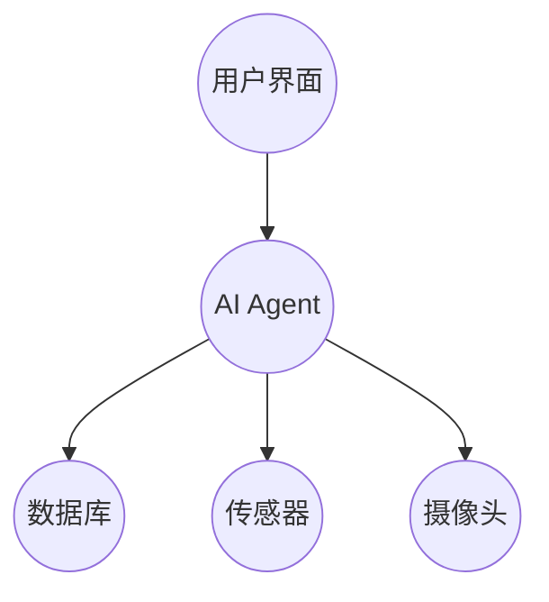
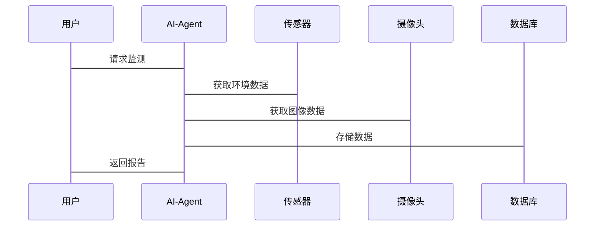

                 


# 智能窗台：AI Agent的植物生长监测

## 关键词：AI Agent、植物生长监测、智能窗台、图像识别、机器学习、系统架构

## 摘要：本文详细介绍了智能窗台系统，该系统利用AI Agent技术实现植物生长的智能化监测。文章从背景、核心概念、算法原理、系统架构到项目实战，全面解析了AI Agent在植物生长监测中的应用，结合具体案例和代码实现，为读者提供了一套完整的解决方案。

---

# 第一部分：智能窗台与AI Agent的背景介绍

## 第1章：智能窗台与AI Agent概述

### 1.1 问题背景与目标

#### 1.1.1 植物生长监测的背景与意义
植物生长监测在农业、园艺和生态学等领域具有重要意义。传统的人工监测方法效率低、精度差，难以满足大规模种植的需求。通过AI技术实现自动化监测，可以提高效率、降低成本，并实时获取植物生长的关键数据。

#### 1.1.2 AI Agent在植物监测中的作用
AI Agent（智能体）是一种能够感知环境、自主决策并采取行动的智能系统。在植物生长监测中，AI Agent可以实时采集数据、分析生长状态、预测潜在问题，并提供相应的解决方案。

#### 1.1.3 智能窗台的目标与价值
智能窗台的目标是通过AI Agent技术，实现对植物生长的实时监测、智能分析和自动反馈。其价值在于提高种植效率、优化资源利用，并为农业和园艺领域提供智能化的解决方案。

---

### 1.2 问题描述与解决方案

#### 1.2.1 植物生长监测的主要问题
1. 数据采集困难：植物生长受环境因素影响大，数据采集复杂且实时性要求高。
2. 数据分析复杂：需要处理多源异构数据，分析难度大。
3. 自动化程度低：传统监测依赖人工操作，效率低下。

#### 1.2.2 AI Agent如何解决这些问题
1. 实时数据采集：通过传感器和摄像头实时采集植物生长数据。
2. 智能分析：利用机器学习算法分析数据，识别生长异常。
3. 自动反馈：AI Agent根据分析结果自动调整环境条件，优化植物生长。

#### 1.2.3 智能窗台系统的整体架构
智能窗台系统由数据采集模块、AI处理模块和用户界面模块组成，各模块协同工作，实现对植物生长的全面监测。

---

### 1.3 系统的边界与外延

#### 1.3.1 系统的功能边界
智能窗台系统仅关注植物生长监测，不涉及种植环境的直接控制（如灌溉系统）。

#### 1.3.2 系统的外部接口
系统通过API接口与外部设备（如传感器、摄像头）和用户界面交互。

#### 1.3.3 系统的扩展性与可维护性
系统设计模块化，便于扩展功能和维护。

---

### 1.4 核心概念与组成要素

#### 1.4.1 AI Agent的核心概念
AI Agent具有感知、决策和执行能力，能够自主完成任务。

#### 1.4.2 植物生长监测的关键要素
包括光照、温度、湿度、营养吸收等环境数据，以及植物的生长速度、健康状态等指标。

#### 1.4.3 系统的整体架构与模块划分
系统分为数据采集、AI处理和用户界面三个模块，各模块协同工作。

---

## 第2章：AI Agent与植物生长监测的核心概念

### 2.1 AI Agent的基本原理

#### 2.1.1 AI Agent的定义与分类
AI Agent是一种能够感知环境、自主决策的智能系统，分为反应式和认知式两类。

#### 2.1.2 AI Agent的核心功能与特点
- **感知环境**：通过传感器和摄像头获取数据。
- **自主决策**：利用机器学习算法分析数据，做出决策。
- **执行操作**：通过接口与外部设备交互。

#### 2.1.3 AI Agent与传统自动化的区别
AI Agent具有自主学习和决策能力，而传统自动化系统依赖预设规则。

---

### 2.2 植物生长监测的关键技术

#### 2.2.1 植物生长监测的主要指标
- 生长速度
- 健康状态
- 光合效率

#### 2.2.2 基于图像识别的生长监测技术
通过摄像头采集植物图像，利用图像识别技术分析植物的生长状态。

#### 2.2.3 光谱分析与环境数据采集技术
利用光谱分析技术检测植物的营养吸收情况，同时采集环境数据（如温度、湿度）。

---

### 2.3 AI Agent与植物生长监测的结合

#### 2.3.1 AI Agent在植物监测中的应用场景
- 实时监测植物生长状态
- 预测生长趋势
- 自动识别病虫害

#### 2.3.2 AI Agent如何处理监测数据
通过机器学习算法分析数据，识别异常情况并提供解决方案。

#### 2.3.3 AI Agent的决策机制与反馈机制
AI Agent根据分析结果做出决策，并通过反馈机制优化决策过程。

---

## 第3章：AI Agent与植物生长监测的核心联系

### 3.1 核心概念的原理分析

#### 3.1.1 AI Agent的感知与学习机制
AI Agent通过传感器和摄像头获取数据，并利用机器学习算法进行分析。

#### 3.1.2 植物生长监测的数据采集与处理
数据采集包括图像采集和环境数据采集，数据处理包括预处理和特征提取。

#### 3.1.3 AI Agent如何驱动监测系统的运行
AI Agent通过分析数据，驱动监测系统的运行，实现对植物生长的全面监测。

---

### 3.2 核心概念的对比分析

#### 3.2.1 AI Agent与传统自动化的对比
| 特性                | AI Agent                   | 传统自动化               |
|---------------------|---------------------------|-------------------------|
| 决策能力            | 自主学习与决策             | 预设规则                |
| 灵活性               | 高                          | 低                      |
| 可扩展性             | 高                          | 低                      |

#### 3.2.2 植物生长监测技术的对比
| 技术                | 图像识别                   | 光谱分析               |
|---------------------|---------------------------|-------------------------|
| 优势                | 易于实现，成本低           | 更精确，数据丰富         |
| 劣势                | 对光照条件敏感            | 设备复杂，成本高         |

#### 3.2.3 不同AI模型在植物监测中的表现
- **卷积神经网络（CNN）**：适合图像识别任务。
- **随机森林**：适合分类任务。

---

### 3.3 系统架构的ER实体关系图

```mermaid
er
classDiagram
    class Plant {
        id
        growth_stage
        health_status
        timestamp
    }
    class Sensor {
        id
        type
        value
        timestamp
    }
    class Camera {
        id
        image
        timestamp
    }
    class AI-Agent {
        id
        decision
        action
    }
    Plant o- Sensor
    Plant o- Camera
    AI-Agent -> Plant
```

---

## 第4章：AI Agent与植物生长监测的算法原理

### 4.1 算法原理的概述

#### 4.1.1 算法选择
选择卷积神经网络（CNN）进行图像分类任务。

#### 4.1.2 算法流程
1. 数据预处理：图像 resize、归一化。
2. 特征提取：卷积层提取特征。
3. 分类：全连接层进行分类。

---

### 4.2 算法原理的详细分析

#### 4.2.1 卷积神经网络（CNN）的工作原理
1. **卷积层**：提取图像的局部特征。
2. **池化层**：降低计算量，提取全局特征。
3. **全连接层**：进行分类。

#### 4.2.2 算法的数学模型
CNN的数学模型如下：
$$
y = f(Wx + b)
$$
其中，\( W \) 是权重矩阵，\( x \) 是输入，\( b \) 是偏置，\( f \) 是激活函数。

---

### 4.3 算法实现的详细步骤

#### 4.3.1 数据预处理
将图像 resize 为 224x224，归一化处理。

#### 4.3.2 网络结构
```python
import torch
import torch.nn as nn

class Plant_classifier(nn.Module):
    def __init__(self):
        super(Plant_classifier, self).__init__()
        self.conv1 = nn.Conv2d(3, 64, kernel_size=3, stride=1, padding=1)
        self.pool = nn.MaxPool2d(kernel_size=2, stride=2)
        self.conv2 = nn.Conv2d(64, 128, kernel_size=3, stride=1, padding=1)
        self.pool2 = nn.MaxPool2d(kernel_size=2, stride=2)
        self.fc = nn.Linear(128*56*56, 1024)
        self.dropout = nn.Dropout(0.5)
        self.output = nn.Linear(1024, 10)

    def forward(self, x):
        x = self.conv1(x)
        x = self.pool(x)
        x = self.conv2(x)
        x = self.pool2(x)
        x = x.view(-1, 128*56*56)
        x = self.fc(x)
        x = self.dropout(x)
        x = self.output(x)
        return x
```

---

### 4.4 算法实现的案例分析

#### 4.4.1 训练过程
使用PyTorch框架，训练CNN模型，识别植物的健康状态。

#### 4.4.2 测试与验证
在测试集上验证模型的准确率，优化模型参数。

---

## 第5章：AI Agent与植物生长监测的系统架构设计

### 5.1 问题场景介绍

#### 5.1.1 系统功能需求
- 实时监测植物生长状态。
- 提供生长趋势预测。
- 自动识别病虫害。

#### 5.1.2 系统性能需求
- 实时性：秒级响应。
- 稳定性：99.9% uptime。

---

### 5.2 项目介绍

#### 5.2.1 项目目标
开发一个基于AI Agent的植物生长监测系统。

#### 5.2.2 项目范围
覆盖植物生长监测的全流程，包括数据采集、分析和反馈。

---

### 5.3 系统功能设计

#### 5.3.1 领域模型
```mermaid
classDiagram
    class Plant {
        id
        growth_stage
        health_status
        timestamp
    }
    class Sensor {
        id
        type
        value
        timestamp
    }
    class Camera {
        id
        image
        timestamp
    }
    class AI-Agent {
        id
        decision
        action
    }
    Plant o- Sensor
    Plant o- Camera
    AI-Agent -> Plant
```

---

### 5.4 系统架构设计

#### 5.4.1 系统架构图


---

### 5.5 系统接口设计

#### 5.5.1 系统接口
- **API接口**：提供RESTful API，供其他系统调用。
- **数据接口**：与传感器和摄像头的数据接口对接。

---

### 5.6 系统交互设计

#### 5.6.1 系统交互流程
1. 用户通过界面发起监测请求。
2. AI Agent调用传感器和摄像头获取数据。
3. 数据经过分析后，生成报告并反馈给用户。

#### 5.6.2 交互流程图


---

## 第6章：AI Agent与植物生长监测的项目实战

### 6.1 环境安装

#### 6.1.1 系统环境
- 操作系统：Linux
- Python版本：3.8+

#### 6.1.2 工具安装
- 安装PyTorch：`pip install torch`
- 安装OpenCV：`pip install opencv-python`

---

### 6.2 系统核心实现

#### 6.2.1 数据采集模块
```python
import cv2

def capture_image():
    cap = cv2.VideoCapture(0)
    ret, frame = cap.read()
    cv2.imwrite("plant.jpg", frame)
    cap.release()
```

#### 6.2.2 AI处理模块
```python
def classify_image():
    model = Plant_classifier()
    image = cv2.imread("plant.jpg")
    image = image / 255.0
    output = model(torch.from_numpy(image).float())
    print(output)
```

---

### 6.3 代码应用解读与分析

#### 6.3.1 代码结构
- `capture_image()`：数据采集。
- `classify_image()`：AI处理。

#### 6.3.2 代码实现细节
- 使用OpenCV进行图像采集。
- 使用PyTorch进行图像分类。

---

### 6.4 实际案例分析

#### 6.4.1 案例描述
监测一株番茄的生长状态，识别是否存在病虫害。

#### 6.4.2 数据分析
通过图像识别技术，识别出番茄叶片出现黄化现象，判断为缺铁性贫血。

#### 6.4.3 系统反馈
AI Agent建议增加铁肥的使用量，并调整光照条件。

---

## 第7章：AI Agent与植物生长监测的最佳实践

### 7.1 小结

#### 7.1.1 核心内容回顾
- AI Agent在植物生长监测中的应用。
- 系统架构设计与实现。

#### 7.1.2 项目经验总结
- 模块化设计便于扩展和维护。
- 数据预处理对模型性能影响显著。

---

### 7.2 注意事项

#### 7.2.1 系统优化
- 提高模型的泛化能力。
- 优化数据采集的实时性。

#### 7.2.2 安全提示
- 注意数据隐私保护。
- 确保系统运行环境的安全。

---

### 7.3 拓展阅读

#### 7.3.1 推荐书籍
- 《深度学习》
- 《机器学习实战》

#### 7.3.2 在线资源
- PyTorch官方文档
- OpenCV官方文档

---

## 作者：AI天才研究院/AI Genius Institute & 禅与计算机程序设计艺术 /Zen And The Art of Computer Programming

---

感谢您的阅读！希望这篇文章能为您提供关于AI Agent在植物生长监测中的应用的深入见解。如需进一步了解或参与相关项目，欢迎随时联系！

