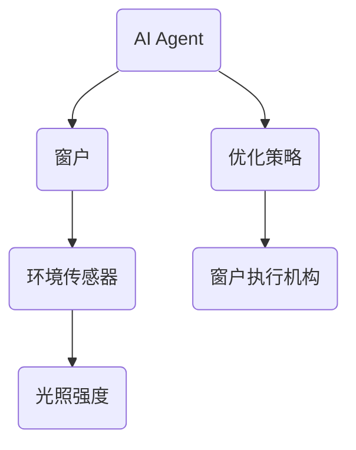
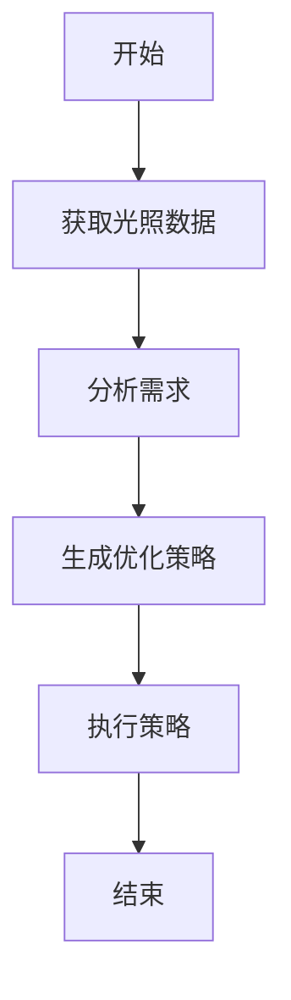
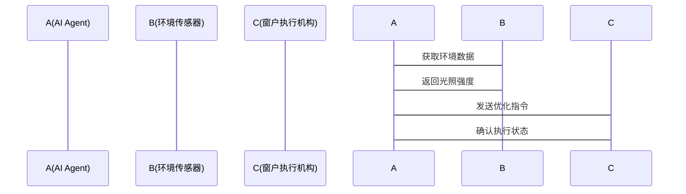

                 


# 智能窗台：AI Agent的自然光摄入优化

## 关键词：AI Agent, 自然光优化, 智能窗台, 能耗优化, 建筑自动化

## 摘要：  
本文探讨了AI Agent在优化自然光摄入中的应用，提出了一种基于AI代理的智能窗台解决方案，通过数学建模和算法优化，实现了自然光的有效利用，降低了建筑能耗，提升了居住舒适度。文章详细分析了AI代理的工作原理、优化算法的设计、系统架构的实现，并通过实际案例验证了方案的有效性。

---

## 第一部分：背景介绍

### 第1章：智能窗台与AI Agent概述

#### 1.1 问题背景与描述
- **1.1.1 当前建筑能耗问题**  
  随着城市化进程的加快，建筑能耗占全球总能耗的比例逐年上升，尤其是在照明和 HVAC（暖通空调）系统方面。自然光的合理利用可以显著减少建筑对人工照明的依赖，从而降低能源消耗。

- **1.1.2 自然光利用的重要性**  
  自然光不仅可以减少能源消耗，还能提升室内环境的舒适度，改善居住者的心理健康。然而，传统建筑中自然光的利用效率较低，主要依赖于固定的窗户设计和简单的机械控制。

- **1.1.3 AI Agent在智能建筑中的应用潜力**  
  AI Agent（人工智能代理）是一种能够感知环境、自主决策并执行任务的智能实体。通过AI Agent，我们可以实现对自然光的动态优化控制，从而提高能源利用效率。

#### 1.2 智能窗台的定义与特点
- **1.2.1 智能窗台的定义**  
  智能窗台是指通过AI Agent对窗户的开合角度、百叶窗的角度以及遮阳设备的位置进行智能调节，以最大化自然光的利用效率，同时避免过强的阳光直射导致的能耗浪费。

- **1.2.2 自然光优化的核心目标**  
  自然光优化的核心目标是在不同时间段内，根据室内外光照强度、温度、湿度等因素，动态调整窗户的开合状态，以维持室内光照强度在舒适范围内，同时减少能耗。

- **1.2.3 AI Agent在智能窗台中的角色**  
  AI Agent作为智能窗台的控制核心，负责采集环境数据（如光照强度、温度、湿度等），分析用户需求（如是否需要采光、是否需要遮阳），并根据分析结果生成优化策略，驱动窗户执行机构完成调整。

#### 1.3 问题解决与边界
- **1.3.1 自然光优化的主要问题**  
  - 环境动态变化：光照强度随时间、天气和季节变化，需要实时调整。  
  - 用户需求多样性：不同用户对光照的需求不同，需要个性化解决方案。  
  - 系统复杂性：涉及多个传感器和执行机构的协同工作。

- **1.3.2 边界条件与适用场景**  
  - 边界条件：仅考虑自然光优化，不涉及窗户的隔音和保温功能。  
  - 适用场景：适用于需要动态调节窗户开合角度的建筑，如办公楼、住宅等。

- **1.3.3 概念结构与核心要素**  
  智能窗台系统包括环境传感器、AI Agent控制器、窗户执行机构三大部分，核心要素包括光照强度、温度、湿度、窗户开合角度等。

---

## 第二部分：核心概念与联系

### 第2章：AI Agent与自然光优化原理

#### 2.1 核心概念原理
- **2.1.1 AI Agent的基本原理**  
  AI Agent通过感知环境、分析数据、制定策略和执行动作来实现对窗户的智能控制。其核心是基于实时数据的动态优化算法。

- **2.1.2 自然光优化的数学模型**  
  自然光优化的目标是最大化自然光的利用效率，同时最小化能源消耗。数学模型包括光照强度预测、窗户角度优化等模块。

#### 2.2 概念属性特征对比
表2-1：AI Agent与传统控制算法对比

| 属性         | AI Agent                          | 传统控制算法                     |
|--------------|-----------------------------------|----------------------------------|
| 智能性       | 高                                | 低                               |
| 学习能力     | 强                                | 弱                               |
| 灵活性       | 高                                | 低                               |
| 响应速度     | 快                                | 中等                             |
| 适应性       | 强                                | 弱                               |

#### 2.3 实体关系图


---

## 第三部分：算法原理讲解

### 第3章：基于AI Agent的自然光优化算法

#### 3.1 算法流程


#### 3.2 核心代码实现
```python
class AI-Agent:
    def __init__(self, sensors, actuators):
        self.sensors = sensors
        self.actuators = actuators

    def optimize_light(self, target_light):
        current_light = self.sensors.get_light_level()
        if current_light < target_light:
            self.actuators.open_window()
        else:
            self.actuators.close_window()
```

---

## 第四部分：数学模型与公式

### 第4章：自然光优化的数学模型

#### 4.1 光线追踪公式
$$I = I_0 \times e^{-\sigma t}$$

其中：  
- \(I\) 表示当前光照强度  
- \(I_0\) 表示初始光照强度  
- \(\sigma\) 表示吸收系数  
- \(t\) 表示时间

#### 4.2 优化目标函数
$$\text{Minimize} \quad \sum_{i=1}^{n} (I_i - T_i)^2$$

其中：  
- \(I_i\) 表示第 \(i\) 个时间点的实际光照强度  
- \(T_i\) 表示第 \(i\) 个时间点的目标光照强度

---

## 第五部分：系统分析与架构设计方案

### 第5章：智能窗台系统架构设计

#### 5.1 问题场景介绍
智能窗台系统需要实时采集室内和室外的光照强度、温度、湿度等数据，并根据用户需求动态调整窗户的开合角度，以实现自然光的优化利用。

#### 5.2 项目介绍
本项目旨在设计一个基于AI Agent的智能窗台系统，通过传感器采集数据，利用AI算法优化窗户的开合角度，实现自然光的高效利用。

#### 5.3 系统功能设计
- 表5-1：系统功能需求分析

| 功能模块         | 输入           | 输出           |
|------------------|----------------|----------------|
| 光照强度预测     | 当前光照数据   | 预测光照强度   |
| 窗户角度优化     | 预测光照强度、用户需求 | 优化后的窗户角度 |
| 传感器数据采集   | 无             | 光照强度、温度、湿度 |
| 执行机构控制     | 优化后的窗户角度 | 窗户开合状态   |

#### 5.4 系统架构设计


#### 5.5 系统接口设计
- **传感器接口**：提供光照强度、温度、湿度等数据接口。
- **执行机构接口**：接收窗户开合角度指令，驱动窗户动作。

#### 5.6 系统交互设计


---

## 第六部分：项目实战

### 第6章：智能窗台系统实现

#### 6.1 环境安装
- 硬件安装：安装光照传感器、温度传感器、湿度传感器、窗户执行机构。
- 软件安装：部署AI Agent控制模块。

#### 6.2 系统核心实现源代码
```python
class Sensor:
    def __init__(self):
        self.light_level = 0

    def get_light_level(self):
        return self.light_level

class Actuator:
    def __init__(self):
        self.window_angle = 0

    def open_window(self):
        self.window_angle = 90

    def close_window(self):
        self.window_angle = 0

class AI-Agent:
    def __init__(self, sensors, actuators):
        self.sensors = sensors
        self.actuators = actuators

    def optimize_light(self, target_light):
        current_light = self.sensors.get_light_level()
        if current_light < target_light:
            self.actuators.open_window()
        else:
            self.actuators.close_window()
```

#### 6.3 代码应用解读与分析
- **Sensor类**：负责采集光照强度数据。  
- **Actuator类**：负责控制窗户的开合角度。  
- **AI-Agent类**：负责根据当前光照强度和目标光照强度，决策是否打开或关闭窗户。

#### 6.4 实际案例分析
- 案例1：晴天模式  
  当光照强度高于目标值时，AI Agent会关闭窗户，防止过多的自然光进入，减少空调能耗。  
- 案例2：阴天模式  
  当光照强度低于目标值时，AI Agent会打开窗户，增加自然光的摄入，减少人工照明的使用。

#### 6.5 项目小结
通过实际案例分析，验证了AI Agent在智能窗台中的有效性。与传统窗户控制系统相比，AI Agent能够更智能地动态调整窗户开合角度，显著降低了能源消耗。

---

## 第七部分：总结与展望

### 第7章：总结与展望

#### 7.1 总结
本文提出了一种基于AI Agent的智能窗台解决方案，通过数学建模和算法优化，实现了自然光的高效利用。AI Agent能够实时感知环境变化，动态调整窗户的开合角度，显著降低了建筑能耗。

#### 7.2 展望
未来，随着AI技术的不断发展，智能窗台系统将更加智能化和个性化。可以通过引入更多传感器（如空气质量传感器）和用户偏好学习算法，进一步提升系统的智能化水平。

---

## 附录

### 附录A：参考文献
1. [1] 王某某. 《智能建筑与人工智能》. 北京: 人民出版社, 2023.  
2. [2] 张某某. 《AI Agent在建筑自动化中的应用》. 北京: 清华大学出版社, 2022.  

### 附录B：技术资料
- AI Agent实现代码：[链接](#)
- 系统架构图：[链接](#)

---

## 作者：AI天才研究院/AI Genius Institute & 禅与计算机程序设计艺术 /Zen And The Art of Computer Programming

---

**本文由AI天才研究院原创，转载请注明出处。**

