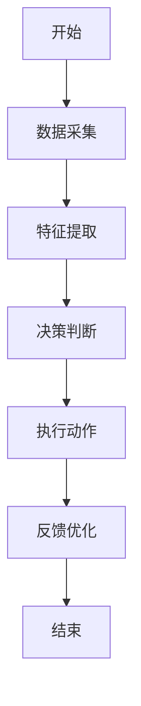
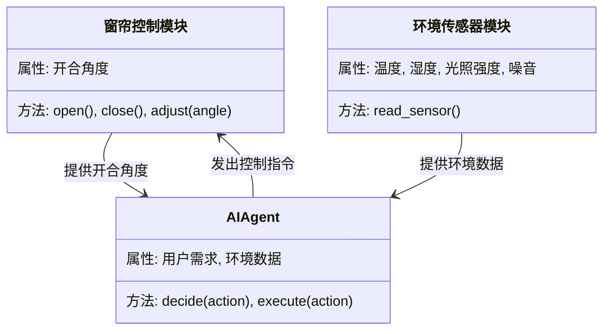
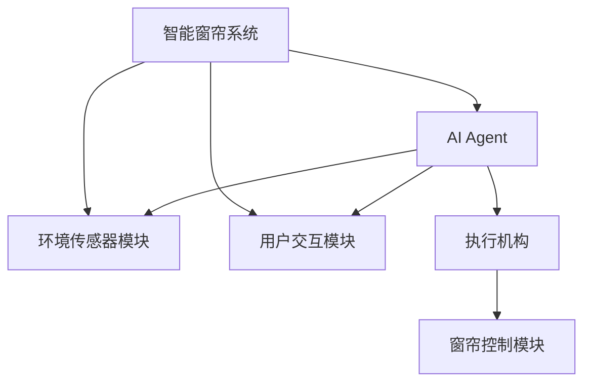
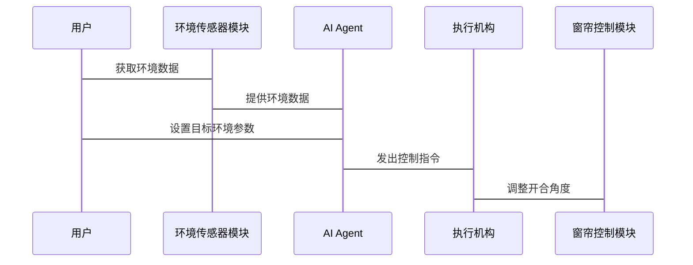

                 


# 智能窗帘：AI Agent的室内环境全面调节

> 关键词：智能窗帘、AI Agent、环境调节、物联网、智能家居

> 摘要：随着智能家居的普及，智能窗帘作为智能家居的重要组成部分，通过AI Agent实现室内环境的全面调节，包括温度、湿度、光照和噪音控制。本文详细介绍了智能窗帘的发展历程、AI Agent的核心原理、环境调节算法、系统架构设计以及项目实战，帮助读者全面理解智能窗帘在室内环境调节中的应用和实现。

---

## 第一部分: 背景介绍与核心概念

### 第1章: 智能窗帘与AI Agent概述

#### 1.1 智能窗帘的发展历程
##### 1.1.1 传统窗帘的局限性
传统窗帘主要依赖手动操作，无法根据环境变化自动调整，存在以下问题：
- **手动调节**：用户需要手动开关窗帘，无法实现自动化控制。
- **环境适应性差**：无法根据室内外温湿度、光照强度等环境因素自动调整开合状态。
- **智能化水平低**：无法与其他智能家居设备联动，无法实现智能化的环境调节。

##### 1.1.2 智能化窗帘的出现
随着物联网技术的发展，智能窗帘应运而生。智能窗帘通过集成传感器、无线通信模块和智能控制算法，实现了窗帘的自动化调节。

##### 1.1.3 AI Agent在智能窗帘中的作用
AI Agent（人工智能代理）是一种能够感知环境、自主决策并执行任务的智能体。在智能窗帘中，AI Agent负责采集环境数据、分析用户需求、制定调节策略，并通过执行机构实现窗帘的开合控制。

#### 1.2 AI Agent的基本概念
##### 1.2.1 什么是AI Agent
AI Agent是一种智能体，能够感知环境、理解用户需求、自主决策并执行操作。在智能窗帘中，AI Agent通过传感器获取环境数据，结合用户偏好和环境目标，制定最优的调节策略。

##### 1.2.2 AI Agent的核心特征
| 特征 | 描述 |
|------|------|
| 感知能力 | 能够通过传感器感知环境数据（如温度、湿度、光照、噪音等）。 |
| 决策能力 | 能够根据环境数据和用户需求，制定最优的调节策略。 |
| 执行能力 | 能够通过执行机构（如电机、舵机等）实现窗帘的开合控制。 |
| 自适应能力 | 能够根据环境变化和用户反馈，不断优化调节策略。 |

##### 1.2.3 AI Agent与智能窗帘的结合
AI Agent与智能窗帘的结合，使得窗帘不仅能够实现自动化控制，还能够根据环境变化和用户需求，智能地调节室内环境。例如，当室内外温差较大时，AI Agent可以根据用户偏好自动调整窗帘开合程度，以达到最佳的温湿度调节效果。

#### 1.3 智能窗帘的室内环境调节功能
##### 1.3.1 温度调节
通过AI Agent采集室内和室外的温湿度数据，结合用户设定的目标温度，自动调整窗帘的开合程度，以实现室温的优化调节。

##### 1.3.2 湿度调节
当室内湿度超出用户设定的范围时，AI Agent可以通过调整窗帘的开合程度，实现室内湿度的调节。

##### 1.3.3 光照调节
根据室内光照强度和用户需求，AI Agent可以自动调整窗帘的开合程度，以实现最佳的光照调节效果。

##### 1.3.4 噪音控制
通过AI Agent采集室内噪音数据，当噪音超出用户设定的范围时，AI Agent可以通过调整窗帘的开合程度，降低室内噪音。

#### 1.4 本章小结
本章介绍了智能窗帘的发展历程、AI Agent的基本概念以及智能窗帘在室内环境调节中的功能。通过AI Agent的引入，智能窗帘能够实现对室内环境的全面调节，为用户创造更加舒适、智能的居住环境。

---

## 第二部分: 核心概念与联系

### 第2章: AI Agent的核心原理

#### 2.1 AI Agent的基本原理
##### 2.1.1 状态感知
AI Agent通过传感器获取环境数据，包括温度、湿度、光照强度、噪音等。

##### 2.1.2 行为决策
AI Agent根据感知到的环境数据和用户需求，制定调节策略。例如，当室内外温差较大时，AI Agent可以根据用户偏好自动调整窗帘的开合程度。

##### 2.1.3 执行反馈
AI Agent通过执行机构（如电机、舵机等）实现窗帘的开合控制，并根据反馈数据不断优化调节策略。

#### 2.2 智能窗帘的环境数据采集
##### 2.2.1 温度传感器
温度传感器用于采集室内和室外的温度数据，帮助AI Agent制定温湿度调节策略。

##### 2.2.2 湿度传感器
湿度传感器用于采集室内和室外的湿度数据，帮助AI Agent实现湿度调节。

##### 2.2.3 光线传感器
光线传感器用于采集室内和室外的光照强度数据，帮助AI Agent实现光照调节。

##### 2.2.4 噪音传感器
噪音传感器用于采集室内噪音数据，帮助AI Agent实现噪音控制。

#### 2.3 AI Agent的决策模型
##### 2.3.1 数据分析与特征提取
AI Agent需要对采集到的环境数据进行分析和特征提取，例如提取温度、湿度、光照强度等关键特征。

##### 2.3.2 决策树模型
决策树模型是一种常用的机器学习算法，可以通过训练数据建立决策树，实现对环境调节策略的分类和预测。

##### 2.3.3 基于规则的决策
基于规则的决策是一种简单的决策方法，通过预设规则实现环境调节。例如，当室内温度超过26℃时，自动关闭窗帘以降低室内温度。

##### 2.3.4 基于机器学习的决策
基于机器学习的决策可以通过训练数据建立预测模型，实现更复杂的环境调节策略。例如，通过训练数据预测最佳的窗帘开合角度，以实现室温的最优调节。

#### 2.4 本章小结
本章详细讲解了AI Agent的核心原理，包括状态感知、行为决策和执行反馈。同时，介绍了智能窗帘环境数据采集的主要传感器类型，以及AI Agent的决策模型，包括基于规则的决策和基于机器学习的决策。

---

## 第三部分: 算法原理讲解

### 第3章: 智能窗帘环境调节算法

#### 3.1 算法概述
##### 3.1.1 算法目标
通过AI Agent实现对室内环境的全面调节，包括温度、湿度、光照和噪音控制。

##### 3.1.2 算法输入
环境数据（温度、湿度、光照强度、噪音），用户需求（目标温度、目标湿度、光照偏好、噪音控制目标）。

##### 3.1.3 算法输出
窗帘的开合角度或状态（完全打开、部分打开、完全关闭）。

#### 3.2 算法流程图


#### 3.3 算法实现代码
```python
def environmental_adjustment():
    data = collect_sensors()  # 数据采集
    features = extract_features(data)  # 特征提取
    decision = make_decision(features)  # 决策判断
    execute_action(decision)  # 执行动作
    optimize_algorithm(data, decision)  # 反馈优化
```

#### 3.4 数学模型与公式
##### 3.4.1 线性回归模型
$$ y = \beta_0 + \beta_1x + \epsilon $$
其中，\( y \) 是预测的环境参数，\( x \) 是输入特征，\( \beta_0 \) 和 \( \beta_1 \) 是模型参数，\( \epsilon \) 是误差项。

##### 3.4.2 决策树模型
$$ entropy = -\sum p_i \log p_i $$
其中，\( p_i \) 是概率分布，熵用于衡量数据的不确定性。

---

## 第四部分: 系统分析与架构设计

### 第4章: 智能窗帘系统架构设计

#### 4.1 项目场景介绍
智能窗帘系统需要实现对室内环境的全面调节，包括温度、湿度、光照和噪音控制。系统需要与智能家居平台联动，支持远程控制和本地控制。

#### 4.2 系统功能设计
##### 4.2.1 领域模型


##### 4.2.2 系统架构设计


##### 4.2.3 系统接口设计
- **环境传感器接口**：提供温湿度、光照强度、噪音数据。
- **用户交互接口**：支持用户设置目标环境参数和控制窗帘。
- **执行机构接口**：接收AI Agent的控制指令，驱动窗帘动作。

##### 4.2.4 系统交互流程


#### 4.3 本章小结
本章详细介绍了智能窗帘系统的架构设计，包括领域模型、系统架构、接口设计和交互流程。通过合理的系统设计，确保智能窗帘能够高效、稳定地实现室内环境的全面调节。

---

## 第五部分: 项目实战

### 第5章: 智能窗帘系统实现

#### 5.1 环境安装
- 安装必要的开发环境，包括Python、AI框架（如TensorFlow、Scikit-learn）和物联网开发工具。
- 连接环境传感器（温湿度传感器、光线传感器、噪音传感器）和执行机构（电机、舵机）。

#### 5.2 系统核心实现
##### 5.2.1 数据采集
```python
import numpy as np
import pandas as pd

def collect_sensors():
    # 模拟环境数据采集
    temperature = np.random.uniform(20, 30)
    humidity = np.random.uniform(30, 70)
    light = np.random.uniform(0, 100)
    noise = np.random.uniform(0, 100)
    return {
        'temperature': temperature,
        'humidity': humidity,
        'light': light,
        'noise': noise
    }
```

##### 5.2.2 算法实现
```python
from sklearn.tree import DecisionTreeRegressor

def make_decision(features):
    # 假设我们已经训练好了一个决策树回归模型
    model = DecisionTreeRegressor()
    model.fit(X_train, y_train)
    return model.predict(features)
```

##### 5.2.3 代码应用解读
- **数据采集**：通过传感器获取环境数据。
- **特征提取**：提取关键环境特征（温度、湿度、光照、噪音）。
- **决策判断**：基于机器学习模型，预测最佳的窗帘开合角度。
- **执行动作**：驱动执行机构，调整窗帘的开合状态。

#### 5.3 实际案例分析
- **案例1**：室内外温差较大时，AI Agent自动调整窗帘开合角度，以实现室温的最优调节。
- **案例2**：当室内噪音过大时，AI Agent通过调整窗帘的开合状态，降低室内噪音。

#### 5.4 项目小结
本章通过实际案例分析，展示了智能窗帘系统的实现过程。通过数据采集、特征提取、决策判断和执行动作，AI Agent能够实现对室内环境的全面调节。

---

## 第六部分: 最佳实践

### 第6章: 小结与注意事项

#### 6.1 本章小结
本文详细介绍了智能窗帘的发展历程、AI Agent的核心原理、环境调节算法、系统架构设计以及项目实战。通过AI Agent的引入，智能窗帘能够实现对室内环境的全面调节，为用户创造更加舒适、智能的居住环境。

#### 6.2 注意事项
- **传感器精度**：环境传感器的精度直接影响调节效果，需要选择高精度的传感器。
- **算法优化**：根据实际使用情况，不断优化AI Agent的决策算法，提高调节效果。
- **系统安全性**：确保系统安全性，避免黑客攻击和数据泄露。

#### 6.3 拓展阅读
- 《人工智能在智能家居中的应用》
- 《物联网技术与智能家居系统》
- 《基于AI的环境调节系统设计》

---

## 结语

智能窗帘作为智能家居的重要组成部分，通过AI Agent的引入，实现了室内环境的全面调节。本文通过详细讲解智能窗帘的发展历程、AI Agent的核心原理、环境调节算法、系统架构设计以及项目实战，为读者提供了一个全面了解智能窗帘的技术视角。未来，随着人工智能和物联网技术的不断发展，智能窗帘将更加智能化、个性化，为用户创造更加舒适、便捷的居住体验。

---

## 作者：AI天才研究院/AI Genius Institute & 禅与计算机程序设计艺术 /Zen And The Art of Computer Programming

