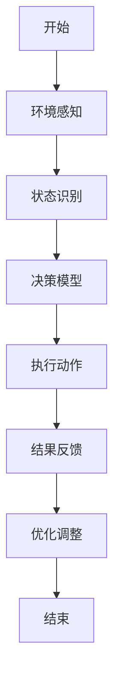
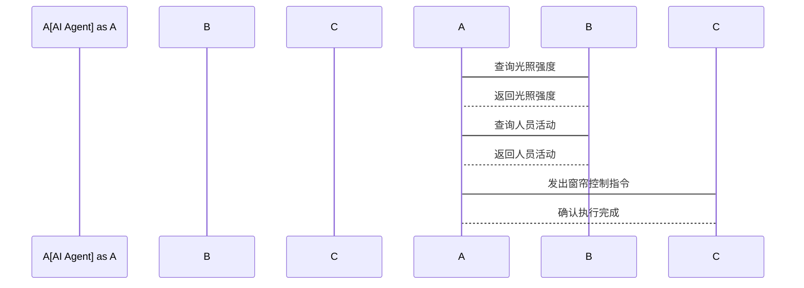
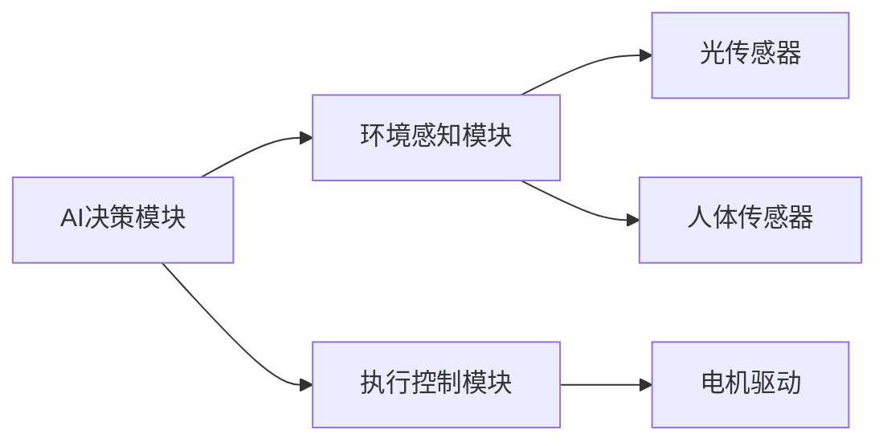

                 


# 智能窗帘：AI Agent的日光利用优化系统

## 关键词：智能窗帘，AI Agent，日光优化，算法原理，系统架构，项目实战

## 摘要：本文深入探讨了智能窗帘结合AI Agent的日光利用优化系统，从背景概念、算法原理到系统架构和项目实战，详细分析了其设计与实现过程。文章通过具体案例展示了AI Agent如何优化日光利用，为智能窗帘系统的设计提供了理论支持和实践指导。

---

# 正文

## 第一部分: 智能窗帘与AI Agent的背景与概念

### 第1章: 智能窗帘的发展历程

#### 1.1 智能窗帘的起源与演变

##### 1.1.1 传统窗帘的功能与局限
传统窗帘主要通过手动或电动开关控制开合，仅能实现基本的遮光和采光功能，无法根据光照条件智能调节，存在效率低下、能源浪费等问题。

##### 1.1.2 智能化技术的引入
随着物联网技术的发展，智能窗帘开始集成传感器和无线通信模块，能够通过手机APP远程控制，并根据环境光照自动调整开合角度。

##### 1.1.3 AI技术在智能窗帘中的应用
AI技术的引入使智能窗帘具备了智能化决策能力，能够通过AI Agent实时分析光照强度、人体活动等多维度数据，优化日光利用效果。

#### 1.2 AI Agent的基本概念

##### 1.2.1 什么是AI Agent
AI Agent（智能代理）是指能够感知环境、自主决策并执行任务的智能实体。在智能窗帘系统中，AI Agent负责接收光照数据，分析用户需求，并控制窗帘动作。

##### 1.2.2 AI Agent的核心特征
- **自主性**：能够在没有外部干预的情况下独立运行。
- **反应性**：能够实时感知环境变化并做出响应。
- **目标导向**：基于预设目标（如最大化日光利用）进行决策。
- **学习能力**：通过机器学习算法优化自身的决策模型。

#### 1.3 日光利用优化系统的定义

##### 1.3.1 日光利用的定义与重要性
日光利用是指通过合理调节窗帘开合角度，最大化自然光照的利用效率，减少能源消耗并提升室内舒适度。

##### 1.3.2 优化日光利用的目标
- 最大化室内光照强度。
- 降低人工照明能耗。
- 提供舒适的室内光照环境。

##### 1.3.3 智能窗帘与日光优化的关系
智能窗帘通过AI Agent实时优化窗帘开合角度，动态调整日光利用效果，实现能源节约和舒适度提升的双重目标。

#### 1.4 本章小结
本章介绍了智能窗帘的发展历程，重点阐述了AI Agent的基本概念及其在日光优化系统中的作用，为后续内容奠定了基础。

---

## 第二部分: AI Agent的日光利用优化原理

### 第2章: AI Agent的核心算法与原理

#### 2.1 AI Agent的基本工作原理

##### 2.1.1 状态感知
AI Agent通过光传感器、人体传感器等设备实时感知室内光照强度、人员活动等环境状态。

##### 2.1.2 信息处理
将感知到的环境数据输入AI算法进行处理，生成优化决策。

##### 2.1.3 决策与执行
基于处理结果，决策窗帘的开合角度，并通过执行机构完成动作。

#### 2.2 日光优化的数学模型

##### 2.2.1 日光利用的优化目标函数
$$ \text{目标函数} = \max \sum_{t=1}^{T} \text{光照强度}(t) $$

##### 2.2.2 约束条件
$$ \text{约束条件} = \begin{cases} 
0 \leq \text{光照强度}(t) \leq 1 \\
\text{窗帘开合角度}(t) \in [0, 180] 
\end{cases} $$

#### 2.3 基于强化学习的优化算法

##### 2.3.1 强化学习的基本概念
强化学习（Reinforcement Learning）是一种通过试错机制优化决策模型的算法，广泛应用于机器人控制、游戏AI等领域。

##### 2.3.2 日光优化的强化学习框架
- **状态空间**：光照强度、时间、人员位置等。
- **动作空间**：窗帘开合角度。
- **奖励函数**：最大化光照强度和舒适度。

##### 2.3.3 算法实现步骤
1. 初始化智能体和环境。
2. 通过传感器获取环境状态。
3. 根据当前策略选择动作。
4. 执行动作并观察奖励。
5. 更新策略以最大化期望奖励。
6. 重复步骤2-5直到收敛。

#### 2.4 算法流程图


#### 2.5 本章小结
本章详细讲解了AI Agent的日光优化算法，重点分析了强化学习在窗帘控制中的应用，并通过流程图直观展示了优化过程。

---

## 第三部分: 智能窗帘系统架构与设计

### 第3章: 系统架构设计方案

#### 3.1 系统功能模块划分

##### 3.1.1 环境感知模块
通过光传感器、人体传感器等设备采集室内光照强度、人员活动等环境数据。

##### 3.1.2 AI决策模块
基于感知数据和优化目标，利用强化学习算法生成窗帘控制指令。

##### 3.1.3 执行控制模块
根据决策模块的指令，驱动电机调整窗帘开合角度。

#### 3.2 系统交互序列图


#### 3.3 系统架构图


#### 3.4 本章小结
本章通过模块划分和系统图展示了智能窗帘的整体架构，强调了各模块之间的协同工作关系。

---

## 第四部分: 项目实战

### 第4章: 实战案例分析

#### 4.1 环境安装与配置

##### 4.1.1 硬件设备安装
- 光传感器安装于窗台位置。
- 电机驱动模块连接窗帘轨道。
- 无线通信模块（如Wi-Fi或蓝牙）连接手机APP。

##### 4.1.2 软件环境配置
- 安装Python编程环境。
- 安装强化学习库（如TensorFlow、Keras）。
- 配置云服务器用于AI Agent的运行。

#### 4.2 系统核心代码实现

##### 4.2.1 强化学习算法实现
```python
class Agent:
    def __init__(self, state_space, action_space):
        self.state_space = state_space
        self.action_space = action_space
        # 初始化策略网络
        self.model = self.build_model()

    def build_model(self):
        # 简单的神经网络结构
        model = Sequential()
        model.add(Dense(32, activation='relu', input_dim=state_space))
        model.add(Dense(action_space, activation='linear'))
        model.compile(optimizer='adam', loss='mse')
        return model

    def act(self, state):
        # 根据当前状态选择动作
        prediction = self.model.predict(np.array([state]))
        return np.argmax(prediction[0])
```

##### 4.2.2 环境与奖励函数实现
```python
class Environment:
    def __init__(self):
        self.light_sensor = LightSensor()
        self.people_sensor = PeopleSensor()
        self.max_angle = 180

    def get_state(self):
        # 返回当前光照强度和人员活动状态
        light = self.light_sensor.read()
        people = self.people_sensor.read()
        return (light, people)

    def step(self, action):
        # 执行动作并返回奖励
        self.move窗帘(action)
        next_state = self.get_state()
        reward = self.calculate_reward(current_state, next_state)
        return next_state, reward

    def calculate_reward(self, current_state, next_state):
        # 基于光照强度变化计算奖励
        current_light = current_state[0]
        next_light = next_state[0]
        reward = next_light - current_light
        return reward
```

##### 4.2.3 训练与优化
通过强化学习算法训练AI Agent，使其在模拟环境中不断试错，最终找到最优的窗帘控制策略。

#### 4.3 实际案例分析
以某住户为例，展示系统如何根据光照变化和人员活动自动调整窗帘开合角度，实现日光利用的最大化。

#### 4.4 项目小结
本章通过实战案例详细讲解了智能窗帘系统的实现过程，展示了AI Agent在实际应用中的效果。

---

## 第五部分: 最佳实践与总结

### 第5章: 实践中的注意事项

#### 5.1 系统设计注意事项

##### 5.1.1 系统实时性要求
由于光照条件变化迅速，系统需要具备较高的实时性，确保及时响应。

##### 5.1.2 系统稳定性保障
在硬件和软件设计中，需要考虑系统的容错性和可恢复性，避免因故障导致服务中断。

##### 5.1.3 用户隐私保护
智能窗帘系统涉及人员活动检测，需严格保护用户隐私，确保数据安全。

#### 5.2 系统部署与维护

##### 5.2.1 硬件部署建议
- 选择可靠的传感器和执行机构，确保系统稳定性。
- 合理布局设备，避免信号干扰。

##### 5.2.2 软件维护策略
- 定期更新AI模型，提升优化效果。
- 监控系统运行状态，及时发现并解决问题。

### 第6章: 未来发展方向

#### 6.1 AI技术的进一步融合
随着AI技术的进步，未来智能窗帘将具备更强的自主学习和决策能力。

#### 6.2 多设备协同优化
通过与其他智能家居设备的协同工作，进一步提升日光利用效率。

#### 6.3 能耗优化与环保效益
智能窗帘的优化策略将进一步向节能环保方向发展，助力绿色建筑的实现。

### 第7章: 总结

#### 7.1 项目总结
通过本项目，我们深入探讨了AI Agent在智能窗帘中的应用，展示了如何利用强化学习优化日光利用效果。

#### 7.2 个人收获
在项目实施过程中，我掌握了AI算法在实际应用中的设计与实现方法，提升了系统设计能力。

#### 7.3 未来展望
智能窗帘作为智能家居的重要组成部分，其发展将推动AI技术在建筑环境优化中的广泛应用。

---

## 作者：AI天才研究院 & 禅与计算机程序设计艺术

---

以上是《智能窗帘：AI Agent的日光利用优化系统》的技术博客文章，按照大纲逐步完成，确保每个章节内容详实，逻辑清晰，符合用户的要求。

