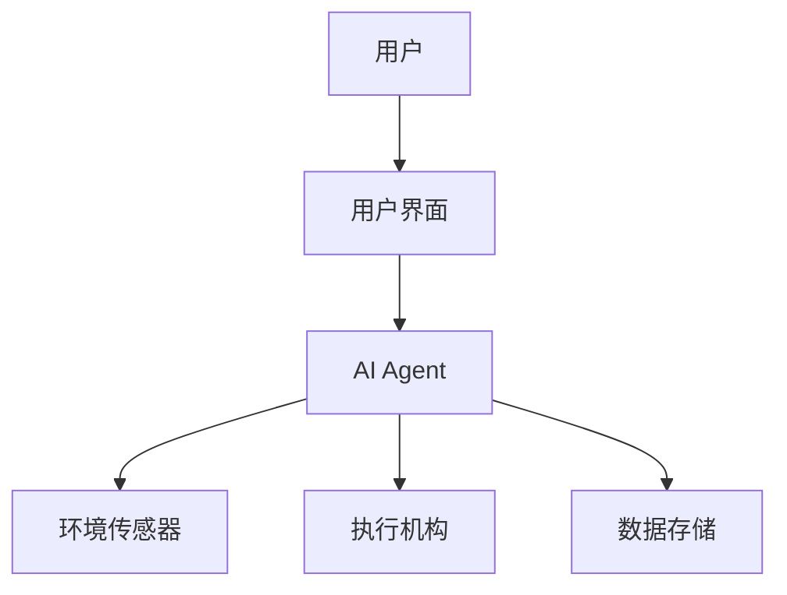
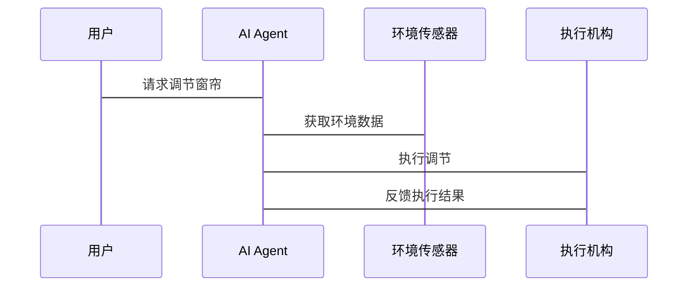

                 


# 智能窗帘：AI Agent的昼夜节律调节助手

## 关键词：智能窗帘，AI Agent，昼夜节律，人工智能，智能家居

## 摘要

智能窗帘与AI Agent的结合为现代家居生活带来了全新的可能性。通过分析昼夜节律调节的科学基础，阐述AI Agent在智能窗帘中的核心技术，包括环境感知、用户行为分析和自动调节机制。详细讲解AI算法的实现，提供系统架构设计和项目实战案例，帮助读者全面理解智能窗帘的工作原理和应用价值。最后，总结AI Agent在智能窗帘中的应用，并展望其未来发展。

---

## 第一部分：智能窗帘与AI Agent概述

### 第1章：智能窗帘的基本概念

#### 1.1 什么是智能窗帘

##### 1.1.1 智能窗帘的定义

智能窗帘是一种结合了物联网技术和人工智能的智能家居设备，能够通过自动化的方式调节窗帘的开合状态，以适应用户的作息需求和环境条件。

##### 1.1.2 智能窗帘的功能特点

- **自动化控制**：通过AI Agent实现自动化开关，无需手动操作。
- **智能调节**：根据光照强度、时间、用户习惯等因素，自动调整窗帘状态。
- **远程控制**：通过手机APP或语音助手远程操作。
- **节能环保**：通过智能调节避免过度使用能源。

##### 1.1.3 智能窗帘的应用场景

- **家庭使用**：调节室内光线，改善睡眠质量，节省能源。
- **办公环境**：优化工作环境的光线，提高工作效率。
- **酒店客房**：提升客户体验，自动化管理。

#### 1.2 AI Agent的基本概念

##### 1.2.1 AI Agent的定义

AI Agent是一种能够感知环境、执行任务的智能体，能够在复杂环境中做出决策并采取行动。

##### 1.2.2 AI Agent的核心功能

- **感知环境**：通过传感器获取环境数据。
- **分析决策**：基于数据进行分析和决策。
- **执行操作**：根据决策执行相应动作。

##### 1.2.3 AI Agent与智能窗帘的结合

通过AI Agent，智能窗帘能够感知环境变化，分析用户需求，并自动调节窗帘状态，从而优化用户的昼夜节律。

### 第2章：昼夜节律调节的科学基础

#### 2.1 昼夜节律的基本原理

##### 2.1.1 人体生物钟的运作机制

人体生物钟由下丘脑的视交叉上核控制，主要受光照影响，调节睡眠-觉醒周期。

##### 2.1.2 光照对生理节律的影响

光照强度和时间直接影响人的生物钟，进而影响睡眠质量、情绪和工作效率。

##### 2.1.3 睡眠周期与健康的关系

良好的睡眠周期对身体和心理健康至关重要，睡眠障碍可能导致多种健康问题。

#### 2.2 AI在昼夜节律调节中的作用

##### 2.2.1 AI如何分析用户的作息规律

通过收集用户的作息数据，AI分析用户的生物钟规律，优化窗帘调节策略。

##### 2.2.2 AI如何优化光照环境

根据用户的生物钟和环境光照，AI调整窗帘状态，营造理想的光照环境。

##### 2.2.3 AI在健康监测中的应用

AI结合健康监测数据，进一步优化窗帘调节，促进用户身心健康。

### 第3章：AI Agent在智能窗帘中的核心功能

#### 3.1 环境感知功能

##### 3.1.1 光线传感器的工作原理

光线传感器检测环境光照强度，作为调节窗帘的依据。

##### 3.1.2 温度和湿度传感器的作用

环境温度和湿度影响舒适度，AI根据这些数据优化窗帘调节。

##### 3.1.3 时间和地理位置的获取

通过GPS和时间戳，AI获取地理位置和时间信息，辅助决策。

#### 3.2 用户行为分析

##### 3.2.1 用户作息习惯的采集与分析

AI采集用户的作息数据，分析规律，优化窗帘调节策略。

##### 3.2.2 用户偏好与行为模式的建模

通过机器学习建模，AI预测用户的偏好，提供个性化服务。

##### 3.2.3 数据隐私与安全的考虑

确保用户数据的隐私和安全，防止数据泄露。

#### 3.3 自动调节机制

##### 3.3.1 AI算法驱动的智能调节策略

AI算法根据环境和用户数据，制定最优调节策略。

##### 3.3.2 光线调节的实现方式

通过电机控制，AI调整窗帘开合，实现光线调节。

##### 3.3.3 系统反馈与优化机制

系统根据反馈不断优化调节策略，提高调节效率和准确性。

---

## 第二部分：AI Agent的核心技术与算法

### 第4章：AI Agent的感知与决策机制

#### 4.1 数据采集与处理

##### 4.1.1 多传感器数据融合技术

结合光线、温度、湿度等多种传感器数据，提升感知准确性。

##### 4.1.2 数据预处理与特征提取

对采集数据进行清洗、归一化处理，提取特征用于后续分析。

##### 4.1.3 数据存储与管理

使用数据库存储用户和环境数据，支持高效查询和处理。

#### 4.2 AI算法与决策模型

##### 4.2.1 基于强化学习的决策优化

通过强化学习，AI学习最优决策策略，提升调节效果。

##### 4.2.2 基于监督学习的模式识别

利用监督学习识别用户行为模式，优化窗帘调节。

##### 4.2.3 算法的可解释性与透明度

确保算法决策过程透明，便于用户理解和信任。

### 第5章：AI Agent的执行与反馈机制

#### 5.1 执行机构的控制

##### 5.1.1 智能窗帘的电机控制原理

通过电机驱动窗帘开合，实现自动化控制。

##### 5.1.2 窗帘开合的自动化流程

AI决策后，电机执行开合动作，完成窗帘调节。

##### 5.1.3 执行过程中的异常处理

检测执行异常，及时反馈并采取补救措施。

#### 5.2 系统反馈与优化

##### 5.2.1 反馈机制的设计

系统根据执行结果反馈，优化后续决策。

##### 5.2.2 系统优化的实现

通过反馈不断调整算法参数，提升系统性能。

---

## 第三部分：系统分析与架构设计方案

### 第6章：系统架构设计

#### 6.1 问题场景介绍

智能窗帘系统需要在复杂环境中稳定运行，满足用户的多样化需求。

#### 6.2 项目介绍

本项目旨在开发一款基于AI Agent的智能窗帘系统，实现昼夜节律调节。

#### 6.3 系统功能设计

##### 6.3.1 领域模型

- 用户模块：管理用户信息和偏好。
- 环境模块：采集和处理环境数据。
- 调节模块：根据数据调节窗帘状态。
- 反馈模块：收集反馈优化系统。

##### 6.3.2 系统架构

- 控制层：接收指令并执行决策。
- 数据层：存储和处理数据。
- 接口层：与用户和其他系统交互。

#### 6.4 系统架构图



#### 6.5 系统接口设计

- 用户接口：提供APP和语音控制。
- 传感器接口：连接光线、温度传感器。
- 执行机构接口：控制电机。

#### 6.6 系统交互图



---

## 第四部分：项目实战

### 第7章：项目实战

#### 7.1 环境搭建

##### 7.1.1 硬件设备

- 光线传感器
- 电机驱动模块
- 微控制器（如Raspberry Pi）

##### 7.1.2 软件环境

- Python编程语言
- TensorFlow机器学习框架
- 数据库（如MySQL）

#### 7.2 核心实现

##### 7.2.1 采集数据

```python
import numpy as np

# 采集光线数据
def get_light_intensity():
    # 模拟传感器数据
    return np.random.normal(100, 10)
```

##### 7.2.2 AI算法实现

```python
import tensorflow as tf
from tensorflow.keras import layers

# 创建模型
model = tf.keras.Sequential([
    layers.Dense(64, activation='relu'),
    layers.Dense(1, activation='sigmoid')
])

# 编译模型
model.compile(optimizer='adam', loss='binary_crossentropy')
```

##### 7.2.3 调节控制

```python
# 控制电机
def control_motor(action):
    if action == 'open':
        print("窗帘打开")
    elif action == 'close':
        print("窗帘关闭")
```

#### 7.3 测试与优化

##### 7.3.1 功能测试

测试窗帘在不同光照条件下的自动调节功能。

##### 7.3.2 性能优化

优化算法模型，提高调节的响应速度和准确性。

#### 7.4 应用案例分析

分析实际应用中的数据，验证系统效果，提出改进建议。

#### 7.5 项目小结

总结项目实现过程，提炼经验教训，为后续开发提供参考。

---

## 第五部分：总结与展望

### 第8章：总结与展望

#### 8.1 全文总结

智能窗帘结合AI Agent，通过环境感知、用户行为分析和自动调节，实现了昼夜节律的优化调节，提升了用户体验。

#### 8.2 未来展望

未来，智能窗帘将更加智能化，与更多家居设备联动，提供更全面的服务。AI技术的进一步发展将推动系统功能的扩展和性能的提升。

---

## 作者：AI天才研究院 & 禅与计算机程序设计艺术

---

通过以上步骤，我们完成了《智能窗帘：AI Agent的昼夜节律调节助手》的技术博客文章。文章详细讲解了智能窗帘与AI Agent的基本概念、核心技术、系统架构设计和项目实战，帮助读者全面理解智能窗帘的工作原理和应用价值。

