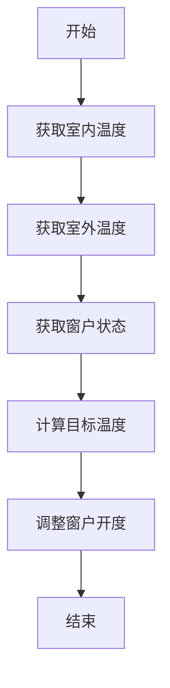
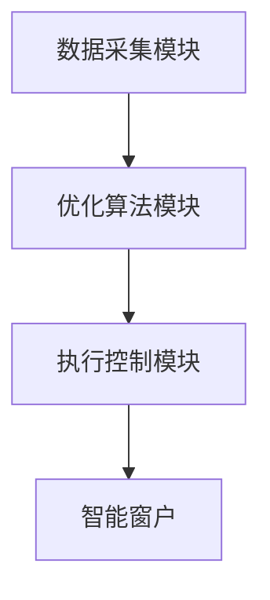
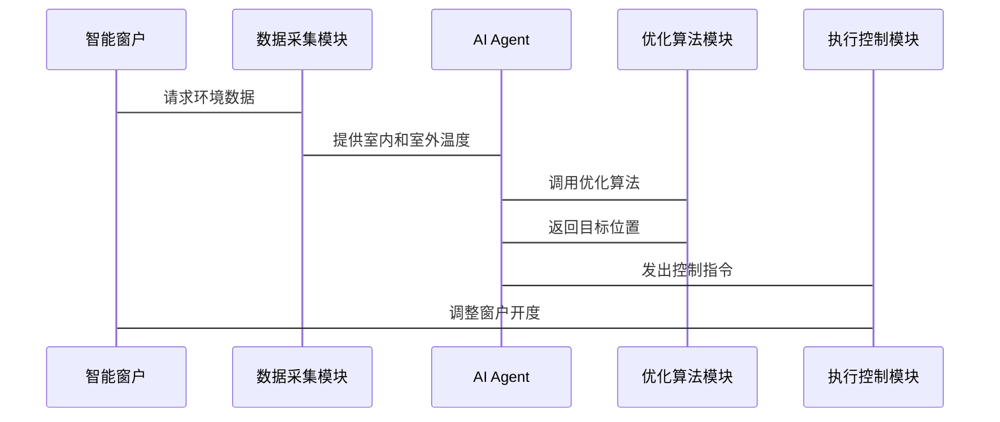

                 


# 智能窗户：AI Agent的室内温度优化控制

## 关键词：
智能窗户，AI Agent，室内温度优化，算法设计，系统架构，机器学习

## 摘要：
本文详细探讨了智能窗户与AI Agent协同优化室内温度的原理、算法设计及系统实现。通过背景分析、核心概念讲解、算法流程图展示、系统架构设计和项目实战案例，全面解析如何利用AI技术提升居住环境的舒适性和能效比。

---

## 目录

### 第1章 智能窗户与AI Agent的背景介绍

#### 1.1 问题背景
- 1.1.1 室内温度控制的重要性
- 1.1.2 智能窗户在建筑节能中的作用
- 1.1.3 AI Agent在智能窗户中的应用潜力

#### 1.2 问题描述
- 1.2.1 室内温度优化的挑战
- 1.2.2 智能窗户的传统控制方式的局限性
- 1.2.3 AI Agent在智能窗户中的优化目标

#### 1.3 问题解决
- 1.3.1 AI Agent如何优化室内温度
- 1.3.2 智能窗户与AI Agent的协同工作原理
- 1.3.3 优化算法的设计与实现

#### 1.4 边界与外延
- 1.4.1 智能窗户的物理边界
- 1.4.2 AI Agent的决策边界
- 1.4.3 系统扩展的可能性

#### 1.5 概念结构与核心要素
- 1.5.1 智能窗户的核心组成
- 1.5.2 AI Agent的组成部分
- 1.5.3 优化控制的数学模型

---

### 第2章 AI Agent与智能窗户的核心原理

#### 2.1 核心概念原理
- 2.1.1 AI Agent的基本原理
- 2.1.2 智能窗户的工作原理
- 2.1.3 优化控制的算法原理

#### 2.2 概念属性特征对比
- 2.2.1 AI Agent的属性特征
- 2.2.2 智能窗户的属性特征
- 2.2.3 对比分析与总结

#### 2.3 ER实体关系图

```mermaid
erDiagram
    class 窗户状态 {
        窗户开度
        室内温度
        室外温度
    }
    class AI Agent {
        感知数据
        决策逻辑
        执行指令
    }
    窗户状态 --> AI Agent : 提供输入
    AI Agent --> 窗户状态 : 发出指令
```

---

### 第3章 优化控制算法的实现

#### 3.1 算法原理
- 3.1.1 基于PID的温度控制算法
- 3.1.2 基于机器学习的预测控制算法
- 3.1.3 综合优化算法的设计思路

#### 3.2 算法流程图



#### 3.3 Python实现代码

```python
def optimize_window_position(indoor_temp, outdoor_temp):
    # PID控制部分
    target_temp = (indoor_temp + outdoor_temp) / 2
    error = target_temp - indoor_temp
    integral += error * dt
    derivative = (error - previous_error) / dt
    pid_output = Kp * error + Ki * integral + Kd * derivative

    # 机器学习模型预测
    model.predict([pid_output])

    # 综合决策
    new_position = (pid_output + model_prediction) / 2
    return new_position
```

---

### 第4章 系统分析与架构设计方案

#### 4.1 问题场景介绍
- 4.1.1 室内温度控制的基本需求
- 4.1.2 智能窗户的物理特性
- 4.1.3 AI Agent的决策机制

#### 4.2 系统功能设计
- 4.2.1 数据采集模块
- 4.2.2 优化算法模块
- 4.2.3 执行控制模块

#### 4.3 系统架构设计图



#### 4.4 系统接口设计
- 4.4.1 数据接口规范
- 4.4.2 控制接口规范
- 4.4.3 通信协议选择

#### 4.5 系统交互序列图



---

### 第5章 项目实战

#### 5.1 环境安装
- 5.1.1 系统环境要求
- 5.1.2 依赖库安装
- 5.1.3 开发工具配置

#### 5.2 核心代码实现
- 5.2.1 数据采集模块代码
- 5.2.2 优化算法模块代码
- 5.2.3 执行控制模块代码

#### 5.3 代码应用解读与分析
- 5.3.1 代码功能模块划分
- 5.3.2 代码实现细节分析
- 5.3.3 代码优化建议

#### 5.4 实际案例分析
- 5.4.1 案例背景介绍
- 5.4.2 系统部署与运行
- 5.4.3 实验结果与分析

#### 5.5 项目小结
- 5.5.1 项目实现的关键点
- 5.5.2 项目成果与意义
- 5.5.3 项目经验总结

---

### 第6章 总结与展望

#### 6.1 核心观点总结
- 6.1.1 AI Agent在智能窗户中的应用价值
- 6.1.2 优化算法在温度控制中的效果
- 6.1.3 系统架构设计的关键点

#### 6.2 展望未来
- 6.2.1 更智能的AI算法研究
- 6.2.2 更高效的硬件设备开发
- 6.2.3 更广泛的应用场景探索

---

### 作者：AI天才研究院/AI Genius Institute & 禅与计算机程序设计艺术 /Zen And The Art of Computer Programming

---

**注：以上是一个详细的技术博客目录大纲，每章内容可根据实际需要进一步扩展和详细阐述。**

