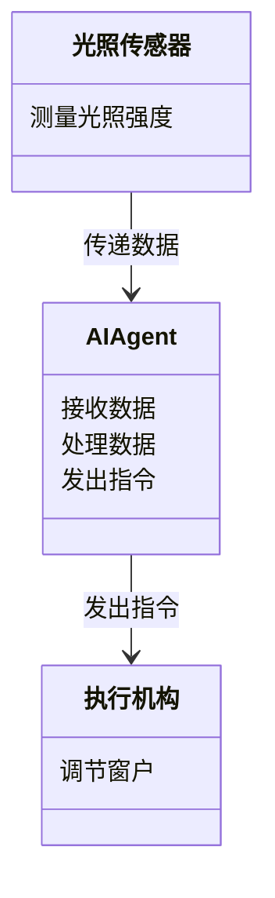
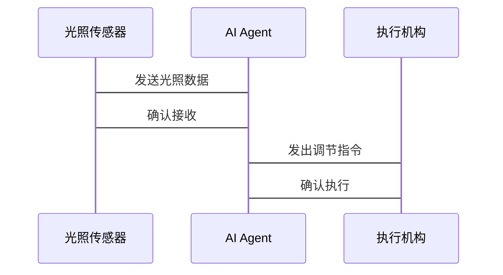

                 


# 智能窗户：AI Agent的自动调光系统

> **关键词**：智能窗户、AI Agent、自动调光系统、物联网、智能家居、智能传感器

> **摘要**：本文详细探讨了智能窗户中AI Agent的自动调光系统，从背景介绍、核心概念到算法原理、系统架构，再到项目实战和优化建议，全面解析了该系统的实现原理和应用场景。通过本文，读者将了解如何利用AI技术实现智能窗户的自动调光功能，提升居住舒适度和能源效率。

---

# 第1章: 背景介绍

## 1.1 智能窗户的背景与问题背景

### 1.1.1 传统窗户的局限性
传统窗户主要依赖手动操作，存在以下问题：
- **手动调节**：用户需要手动开关窗户或调整遮光设备，效率低下且容易遗忘。
- **能源浪费**：在光照不足或过强时，窗户的开合状态未能根据环境自动调整，导致能源浪费和舒适度下降。
- **安全性**：手动调节窗户增加了误操作的风险，尤其是在恶劣天气条件下。

### 1.1.2 智能窗户的发展趋势
随着物联网和人工智能技术的发展，智能窗户逐渐普及，成为智能家居的重要组成部分。智能窗户可以通过传感器和AI算法实现自动调光，提升用户体验和能源效率。

### 1.1.3 自动调光系统的需求与目标
自动调光系统的需求主要集中在以下几个方面：
- **自动化控制**：根据光照强度、时间、天气等因素，自动调节窗户的开合状态。
- **舒适性**：确保室内光线柔和，避免强光直射，提升居住舒适度。
- **节能降耗**：通过智能调节窗户，减少空调和照明的能耗，降低能源消耗。

## 1.2 问题描述与目标设定

### 1.2.1 窗户调光的核心问题
窗户调光的核心问题是如何实现自动化控制，确保室内光照既不过度明亮，也不过暗。这需要综合考虑光照强度、室内环境、用户需求等多个因素。

### 1.2.2 自动调光系统的功能需求
自动调光系统需要实现以下功能：
- **实时监测**：通过光照传感器实时监测室内光照强度。
- **智能决策**：根据光照强度和用户需求，智能决策窗户的开合状态。
- **自动执行**：通过电机或其他执行机构自动调节窗户。

### 1.2.3 系统设计的边界与外延
系统设计的边界包括：
- **传感器范围**：仅限于光照强度监测。
- **执行机构**：仅限于窗户的开合。
- **用户需求**：仅限于光照调节，不考虑其他功能。

## 1.3 智能窗户的核心概念与结构

### 1.3.1 AI Agent的基本概念
AI Agent（智能代理）是一种能够感知环境并采取行动以实现目标的实体。在智能窗户中，AI Agent负责接收传感器数据、分析信息并做出决策。

### 1.3.2 自动调光系统的组成要素
自动调光系统由以下部分组成：
- **光照传感器**：用于检测室内光照强度。
- **AI Agent**：负责数据处理和决策。
- **执行机构**：如电机，用于调节窗户的开合状态。

### 1.3.3 系统的运行机制与核心流程
系统的运行机制如下：
1. 光照传感器实时监测室内光照强度。
2. AI Agent接收传感器数据，结合预设的光照阈值和用户需求，做出决策。
3. 执行机构根据决策调节窗户的开合状态。

## 1.4 本章小结

### 1.4.1 智能窗户系统的背景与目标
智能窗户的目标是通过自动化调节窗户的开合状态，实现舒适性和节能降耗。

### 1.4.2 核心概念与系统结构
系统由AI Agent、传感器和执行机构组成，AI Agent负责数据处理和决策。

### 1.4.3 问题解决的方向与路径
通过AI Agent和传感器的结合，实现窗户的智能调节，提升用户体验和能源效率。

---

# 第2章: AI Agent与自动调光系统的核心原理

## 2.1 AI Agent的基本原理

### 2.1.1 AI Agent的定义与分类
AI Agent可以分为以下几类：
- **反应式AI Agent**：基于当前感知做出反应。
- **认知式AI Agent**：具备推理和规划能力。

### 2.1.2 AI Agent的核心功能与特性
AI Agent的核心功能包括：
- **感知环境**：通过传感器获取数据。
- **决策推理**：基于数据做出决策。
- **执行动作**：通过执行机构实现决策。

### 2.1.3 AI Agent在智能窗户中的应用
在智能窗户中，AI Agent负责接收光照传感器数据，分析数据并做出决策，控制窗户的开合。

## 2.2 自动调光系统的原理与机制

### 2.2.1 光强检测与传感器原理
光照传感器通过测量光强度，将数据传输给AI Agent。

### 2.2.2 调光算法的基本原理
调光算法基于光照强度和用户需求，决定窗户的开合状态。

### 2.2.3 系统的闭环控制机制
系统通过反馈机制不断调整窗户的开合状态，确保光照强度维持在预设范围内。

## 2.3 核心概念的对比分析

### 2.3.1 AI Agent与传统自动调光系统对比
AI Agent的优势在于能够根据实时数据做出智能决策，而传统系统仅能根据预设规则进行调节。

### 2.3.2 不同传感器的性能对比
不同传感器的性能差异主要体现在测量精度、响应速度和成本等方面。

### 2.3.3 不同调光算法的优缺点分析
- **基于阈值的算法**：简单易实现，但不够灵活。
- **基于反馈的算法**：能够动态调整，但实现复杂。

## 2.4 本章小结

### 2.4.1 AI Agent的基本原理
AI Agent通过感知环境、决策推理和执行动作实现智能控制。

### 2.4.2 自动调光系统的原理与机制
系统通过传感器、AI Agent和执行机构实现闭环控制，确保光照强度在预设范围内。

### 2.4.3 核心概念的对比分析
AI Agent相比传统系统更具灵活性和智能性，能够更好地适应环境变化。

---

# 第3章: 算法原理讲解

## 3.1 AI Agent的算法实现

### 3.1.1 算法概述
AI Agent的算法包括数据采集、数据处理、决策推理和执行控制四个阶段。

### 3.1.2 数据采集与预处理
通过光照传感器采集光照强度数据，并进行滤波和归一化处理。

### 3.1.3 决策推理算法
基于光照强度和用户需求，AI Agent通过模糊逻辑或机器学习算法做出决策。

### 3.1.4 执行控制算法
根据决策结果，控制执行机构调节窗户的开合状态。

## 3.2 数学模型与公式

### 3.2.1 光照强度与窗户开合度的关系
光照强度与窗户开合度呈负相关关系：
$$
L = k \cdot (1 - S)
$$
其中，$L$为光照强度，$S$为窗户开合度，$k$为比例常数。

### 3.2.2 模糊控制算法
模糊控制算法通过模糊推理实现窗户开合度的调节：
$$
S = \text{模糊推理}(\text{L})
$$

### 3.2.3 机器学习算法
使用回归算法训练窗户开合度与光照强度的关系模型。

## 3.3 算法实现步骤

### 3.3.1 数据采集
使用光照传感器采集光照强度数据。

### 3.3.2 数据预处理
对数据进行归一化处理，消除噪声。

### 3.3.3 数据分析
通过数据分析确定光照强度的阈值。

### 3.3.4 模型训练
训练机器学习模型，实现窗户开合度的预测。

### 3.3.5 模型部署
将模型部署到AI Agent中，实现实时决策。

## 3.4 本章小结

### 3.4.1 算法实现步骤
通过数据采集、预处理、分析和模型训练，实现AI Agent的决策推理。

### 3.4.2 数学模型与公式
光照强度与窗户开合度的关系通过数学公式进行建模，实现智能决策。

### 3.4.3 算法优化与改进
通过模糊控制和机器学习算法的结合，提高系统的智能性和适应性。

---

# 第4章: 系统分析与架构设计方案

## 4.1 项目背景与目标

### 4.1.1 项目背景
随着智能家居的发展，智能窗户的需求日益增长。

### 4.1.2 项目目标
实现智能窗户的自动调光功能，提升用户体验和能源效率。

## 4.2 系统功能设计

### 4.2.1 领域模型设计
使用Mermaid类图展示系统中的实体及其关系。



### 4.2.2 系统架构设计
使用Mermaid架构图展示系统架构。


### 4.2.3 系统接口设计
系统接口包括传感器接口、AI Agent接口和执行机构接口。

### 4.2.4 系统交互设计
使用Mermaid序列图展示系统交互流程。



## 4.3 本章小结

### 4.3.1 项目背景与目标
智能窗户的自动调光系统旨在提升用户体验和能源效率。

### 4.3.2 系统功能设计
通过光照传感器、AI Agent和执行机构的协同工作，实现窗户的自动调节。

### 4.3.3 系统架构与交互设计
系统采用模块化设计，各模块之间通过接口进行交互，确保系统的高效运行。

---

# 第5章: 项目实战

## 5.1 环境搭建

### 5.1.1 硬件环境
需要光照传感器、电机和相关控制电路。

### 5.1.2 软件环境
需要安装Python、机器学习库（如Scikit-learn）和Mermaid工具。

## 5.2 核心代码实现

### 5.2.1 光照传感器数据采集
代码示例：

```python
import numpy as np
import pandas as pd

# 采集光照数据
data = pd.DataFrame({
    '光照强度': np.random.uniform(0, 100, 100)
})
print(data)
```

### 5.2.2 AI Agent决策推理
代码示例：

```python
from sklearn.linear_model import LinearRegression

# 训练模型
model = LinearRegression()
X = data[['光照强度']]
y = data['窗户开合度']
model.fit(X, y)

# 预测结果
new_light = [[50]]
print(model.predict(new_light))
```

### 5.2.3 执行机构控制
代码示例：

```python
# 控制电机
def adjust_shade(desired_pos):
    # 模拟电机控制
    print(f"调节窗户到{desired_pos}的位置")

adjust_shade(model.predict([[50]]))
```

## 5.3 项目实战总结

### 5.3.1 代码实现细节
详细解释代码的功能和实现过程。

### 5.3.2 系统运行结果
展示系统运行的实际效果和数据分析。

### 5.3.3 实际案例分析
通过实际案例分析，验证系统的有效性和优化空间。

## 5.4 本章小结

### 5.4.1 环境搭建与代码实现
详细描述了硬件和软件环境的搭建，以及核心代码的实现。

### 5.4.2 系统运行与结果分析
通过实际运行结果，验证系统的有效性和优化空间。

### 5.4.3 项目实战经验总结
总结项目实施过程中的经验和教训，为后续优化提供参考。

---

# 第6章: 最佳实践与优化建议

## 6.1 最佳实践 tips

### 6.1.1 系统优化建议
- 优化算法模型，提高决策准确性。
- 增强传感器的灵敏度和稳定性。

### 6.1.2 系统维护建议
- 定期检查传感器和执行机构，确保系统正常运行。
- 更新AI Agent的决策模型，适应环境变化。

## 6.2 系统小结

### 6.2.1 系统优势
- 提升用户体验。
- 降低能源消耗。
- 增强系统智能化。

### 6.2.2 系统不足
- 初期投资较高。
- 系统复杂性较高，维护成本增加。

## 6.3 注意事项

### 6.3.1 系统运行中的注意事项
- 定期检查传感器和执行机构。
- 确保系统软件的更新和维护。

### 6.3.2 用户使用中的注意事项
- 遵循用户手册进行系统操作。
- 遇到问题及时联系技术支持。

## 6.4 拓展阅读

### 6.4.1 智能家居相关技术
- 智能门锁。
- 智能灯光系统。

### 6.4.2 人工智能相关技术
- 机器学习。
- 模糊控制。

---

# 作者：AI天才研究院/AI Genius Institute & 禅与计算机程序设计艺术 /Zen And The Art of Computer Programming

---

以上为完整的技术博客文章大纲，涵盖了智能窗户AI Agent自动调光系统的各个方面，从背景介绍到项目实战，确保读者能够全面理解系统的实现原理和应用价值。

