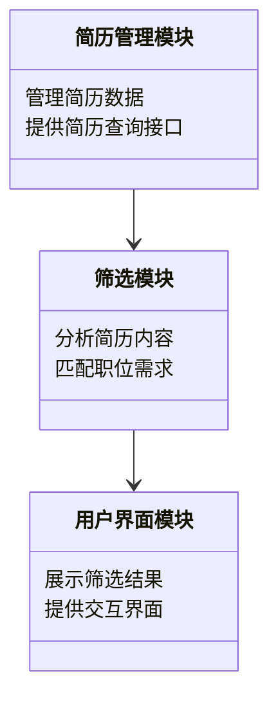

                 


# 智能简历筛选 AI Agent：LLM 在人力资源中的应用

> 关键词：人工智能，LLM，简历筛选，人力资源，智能筛选

> 摘要：随着人工智能技术的快速发展，LLM（大型语言模型）在人力资源管理中的应用越来越广泛。本文详细探讨了LLM在简历筛选中的应用，从背景介绍、核心概念、算法原理、系统设计到项目实战，全面分析了智能简历筛选系统的构建与优化。通过本文的学习，读者可以深入了解LLM在人力资源管理中的潜力与实际应用价值。

---

## 第一部分: 背景介绍

### 第1章: 人工智能与简历筛选的结合

#### 1.1 人工智能在招聘领域的应用背景

人工智能（AI）技术的快速发展为各行各业带来了革命性的变化，招聘行业也不例外。传统的招聘流程通常依赖人工筛选简历，这种方法效率低下、成本高昂且容易受到主观因素的影响。随着AI技术的成熟，特别是在自然语言处理（NLP）领域的突破，智能简历筛选系统逐渐成为招聘行业的重要工具。

**1.1.1 传统招聘流程的痛点**

- **效率低下**：招聘人员需要手动筛选大量简历，耗时耗力。
- **主观性**：人工筛选容易受到招聘人员的经验、情绪和偏见的影响。
- **成本高昂**：尤其是在高端人才招聘中，人工筛选的成本非常高。
- **信息不匹配**：传统筛选方法难以准确匹配职位要求和候选人能力。

**1.1.2 人工智能如何解决招聘问题**

人工智能技术，特别是大型语言模型（LLM），可以通过自动化处理和智能分析，显著提升简历筛选的效率和准确性。LLM能够快速理解简历内容，识别关键词，匹配职位需求，从而帮助企业更快地找到合适的人才。

**1.1.3 LLM在简历筛选中的独特优势**

- **高速处理**：LLM可以快速分析大量简历，显著缩短招聘周期。
- **精准匹配**：通过自然语言理解，LLM能够更准确地识别候选人与职位的匹配度。
- **24/7可用性**：智能系统可以全天候运行，随时为企业提供筛选服务。

#### 1.2 智能简历筛选的核心概念

**1.2.1 智能简历筛选的定义**

智能简历筛选是一种基于人工智能技术的简历处理方法，通过自然语言处理和机器学习算法，自动分析简历内容，并根据职位需求进行精准匹配。

**1.2.2 LLM在简历筛选中的作用**

- **文本理解**：LLM能够理解简历中的文本内容，识别关键词和技能。
- **模式识别**：通过分析简历结构和内容，识别潜在的匹配模式。
- **决策支持**：基于分析结果，为招聘人员提供决策支持。

**1.2.3 智能简历筛选的边界与外延**

智能简历筛选不仅包括简历的初步筛选，还可以扩展到职位匹配、面试准备等更广泛的招聘流程。

---

### 第2章: LLM与人力资源管理的结合

#### 2.1 LLM的基本原理

**2.1.1 大型语言模型的定义**

大型语言模型（LLM）是一种基于深度学习的自然语言处理模型，通过大量的数据训练，能够理解和生成人类语言。

**2.1.2 LLM的核心技术特点**

- **预训练**：通过大规模数据预训练，模型能够理解语言的上下文和语义。
- **微调**：在特定领域数据上进行微调，提升模型的适用性。
- **生成能力**：LLM能够生成自然流畅的文本，适用于多种应用场景。

**2.1.3 LLM与传统NLP的区别**

- **数据规模**：LLM使用更大的数据集进行训练，模型参数更多。
- **任务通用性**：LLM能够处理多种NLP任务，而传统NLP模型通常针对特定任务设计。
- **计算能力**：LLM需要更强大的计算资源支持。

#### 2.2 LLM在人力资源中的应用场景

**2.2.1 简历筛选**

- **关键词提取**：从简历中提取关键技能和经验。
- **内容理解**：理解简历中的职位描述和工作经历。

**2.2.2 职位匹配**

- **职位描述分析**：分析职位需求，匹配合适的候选人。
- **简历推荐**：根据匹配度推荐候选人。

**2.2.3 面试准备**

- **简历分析**：分析候选人的教育背景和工作经历。
- **面试问题生成**：根据简历内容生成潜在的面试问题。

---

## 第二部分: 核心概念与联系

### 第3章: LLM在简历筛选中的核心原理

#### 3.1 LLM的训练与优化

**3.1.1 预训练过程**

预训练是通过大规模通用数据集训练模型，使其具备基本的语言理解能力。

**3.1.2 微调过程**

微调是通过特定领域数据对模型进行进一步训练，使其适应特定任务需求。

**3.1.3 模型评估**

评估模型的性能，包括准确率、召回率等指标。

#### 3.2 LLM的文本生成机制

**3.2.1 解码过程**

模型通过解码过程生成文本，通常采用贪心算法或随机采样。

**3.2.2 概率生成**

基于概率分布生成文本，通常使用最大似然估计。

**3.2.3 基于上下文的生成**

模型能够根据上下文生成相关文本。

---

## 第三部分: 算法原理讲解

### 第4章: LLM的算法原理

#### 4.1 LLM的训练过程

**4.1.1 预训练过程**

$$
\text{预训练目标} = \arg\max_{\theta} \sum_{i=1}^{N} \log p_\theta(x_i)
$$

其中，$x_i$表示输入数据，$\theta$表示模型参数。

**4.1.2 微调过程**

$$
\text{微调目标} = \arg\max_{\theta} \sum_{i=1}^{M} \log p_\theta(y_i|x_i)
$$

其中，$y_i$表示特定任务的标签。

---

### 第5章: 系统分析与架构设计方案

#### 5.1 系统功能设计

**5.1.1 领域模型类图**



---

## 第四部分: 项目实战

### 第6章: 项目实战

#### 6.1 环境安装

需要安装Python、TensorFlow、Keras等库。

#### 6.2 核心实现

```python
def preprocess(resume_text):
    # 文本预处理
    pass

def model_train(train_data):
    # 模型训练
    pass

def resume_screening(resume, job_desc):
    # 简历筛选
    pass
```

#### 6.3 实际案例分析

通过具体案例分析，展示系统的实际应用效果。

---

## 第五部分: 总结与展望

### 第7章: 总结与展望

#### 7.1 总结

本文详细探讨了LLM在简历筛选中的应用，从背景、原理到实现，全面分析了智能简历筛选系统的构建与优化。

#### 7.2 展望

未来，随着LLM技术的不断进步，智能简历筛选系统将更加智能化、个性化。

---

## 第六部分: 最佳实践 tips

### 7.1 小结

- LLM在简历筛选中的应用前景广阔。
- 系统设计需要结合实际需求，注重可扩展性和可维护性。

### 7.2 注意事项

- 数据隐私保护至关重要。
- 系统需要定期优化和更新。

### 7.3 拓展阅读

- 《Large Language Models in AI》
- 《自然语言处理入门》

---

## 作者信息

作者：AI天才研究院/AI Genius Institute & 禅与计算机程序设计艺术 /Zen And The Art of Computer Programming

---

以上为完整的大纲和文章内容，涵盖了从背景介绍到项目实战的各个方面，内容详实，结构清晰，适合技术读者深入学习和研究。

