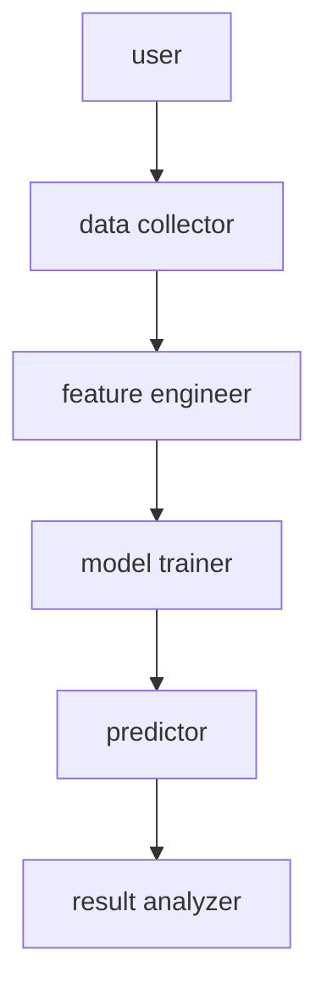
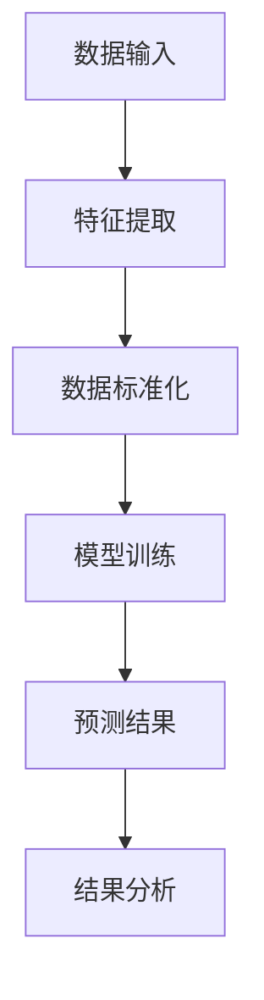
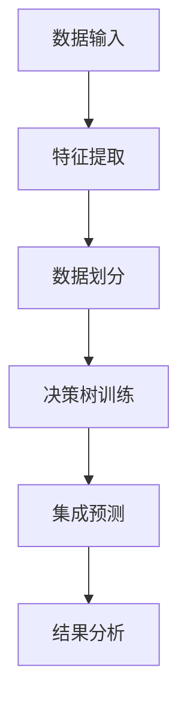
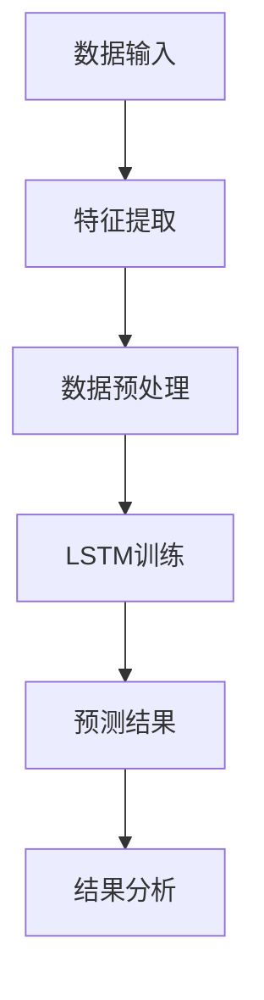
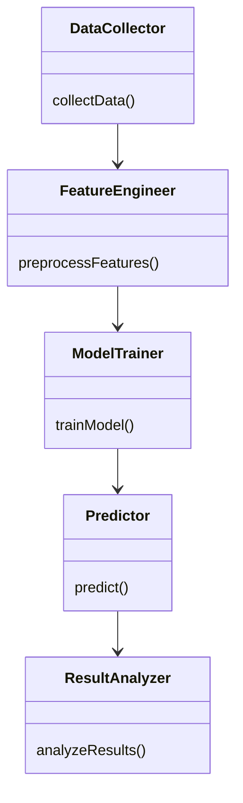
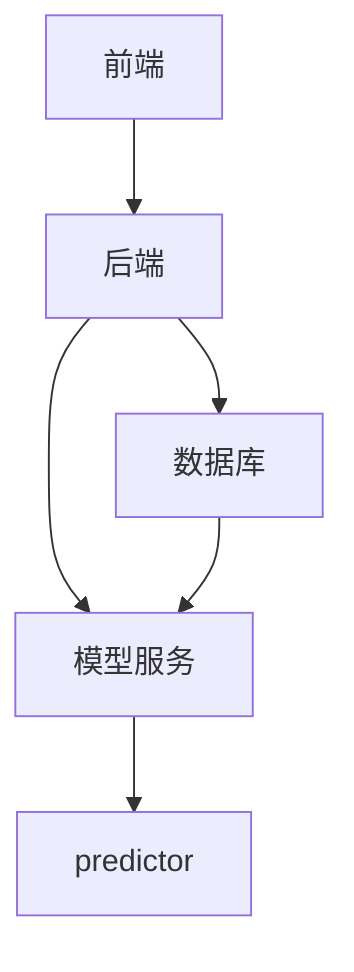
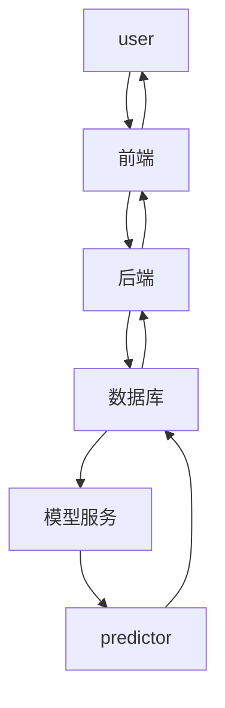

                 


# 智能经济指标预测系统

> 关键词：经济指标预测、人工智能、机器学习、大数据分析、系统架构设计

> 摘要：本文详细探讨了智能经济指标预测系统的设计与实现，从背景介绍、核心概念、算法原理到系统架构设计，再到项目实战和最佳实践，全面解析了如何利用人工智能技术构建高效的经济指标预测系统。

---

## 第1章 智能经济指标预测系统的背景介绍

### 1.1 经济指标预测的背景与意义

经济指标是反映经济运行状态的重要数据，如GDP、失业率、通胀率等。准确预测这些指标对于政府决策、企业战略规划和金融市场投资至关重要。传统的经济预测方法依赖于统计分析和专家经验，但面临数据量有限、预测精度不足等问题。

随着大数据和人工智能技术的发展，智能经济指标预测系统应运而生。通过整合海量数据，利用机器学习算法，系统能够提供更精准、实时的预测结果，帮助用户做出更科学的决策。

### 1.2 智能经济指标预测的核心目标

智能经济指标预测系统的核心目标是通过分析历史数据和实时信息，利用先进的算法模型，生成准确的经济指标预测结果。系统不仅能够提供定量预测，还能通过可视化手段帮助用户理解预测结果背后的原因。

### 1.3 智能经济指标预测的边界与外延

智能经济指标预测系统主要关注经济指标的预测，但不涉及具体的政策制定或投资建议。其外延包括数据采集、特征工程、模型训练和结果分析等多个环节，形成一个完整的预测闭环。

---

## 第2章 智能经济指标预测系统的概念与原理

### 2.1 智能经济指标预测系统的定义

智能经济指标预测系统是一种利用人工智能技术，通过对历史数据和实时信息的分析，预测未来经济指标走向的智能系统。它结合了大数据分析、机器学习和统计学等多学科知识，旨在提供更精准的预测结果。

### 2.2 系统的核心概念与联系

#### 2.2.1 数据采集模块

数据采集是预测系统的基础。系统需要从多种来源（如政府数据库、金融市场数据、新闻媒体等）获取相关数据，并进行清洗和预处理。

#### 2.2.2 特征工程模块

特征工程是提升模型性能的关键环节。通过提取和选择重要的特征，可以提高模型的预测精度。例如，可以从GDP增长率、失业率等指标中提取特征。

#### 2.2.3 模型训练模块

模型训练是系统的核心部分。利用机器学习算法（如线性回归、随机森林、LSTM等），对历史数据进行训练，生成预测模型。

#### 2.2.4 预测引擎模块

预测引擎是模型的实际应用部分。通过输入实时数据，引擎利用训练好的模型生成预测结果。

#### 2.2.5 结果分析模块

结果分析是对预测结果的解读和验证。通过可视化工具，用户可以直观地理解预测结果，并根据实际数据调整模型参数。

### 2.3 智能经济指标预测系统的实体关系图



---

## 第3章 常见算法原理与流程图

### 3.1 线性回归算法

#### 3.1.1 线性回归的基本原理

线性回归是一种简单而常用的回归分析方法。它假设自变量与因变量之间存在线性关系，通过最小化预测值与实际值之间的平方差之和来找到最佳拟合直线。

#### 3.1.2 线性回归的数学模型

线性回归的数学模型可以表示为：

$$ y = \beta_0 + \beta_1 x + \epsilon $$

其中，$\beta_0$是截距，$\beta_1$是回归系数，$\epsilon$是误差项。

#### 3.1.3 线性回归的实现流程图



### 3.2 随机森林算法

#### 3.2.1 随机森林的基本原理

随机森林是一种基于决策树的集成学习方法。它通过构建多个决策树，并将它们的结果进行投票或平均，来提高模型的准确性和稳定性。

#### 3.2.2 随机森林的数学模型

随机森林的数学模型可以表示为：

$$ y = \text{多数投票}(\{h_1(x), h_2(x), ..., h_n(x)\}) $$

其中，$h_i(x)$是第$i$棵决策树的预测结果。

#### 3.2.3 随机森林的实现流程图



### 3.3 LSTM算法

#### 3.3.1 LSTM的基本原理

LSTM（长短期记忆网络）是一种特殊的循环神经网络，适用于处理时间序列数据。它通过引入记忆单元和门控机制，可以有效捕捉数据中的长期依赖关系。

#### 3.3.2 LSTM的数学模型

LSTM的核心组件包括输入门、遗忘门和输出门，其数学模型如下：

$$
\begin{aligned}
    f_t &= \sigma(W_f x_t + U_f h_{t-1}) \\
    i_t &= \sigma(W_i x_t + U_i h_{t-1}) \\
    o_t &= \sigma(W_o x_t + U_o h_{t-1}) \\
    g_t &= \tanh(W_g x_t + U_g h_{t-1}) \\
    c_t &= f_t c_{t-1} + i_t g_t \\
    h_t &= o_t \tanh(c_t)
\end{aligned}
$$

其中，$\sigma$是sigmoid函数，$\tanh$是双曲正切函数。

#### 3.3.3 LSTM的实现流程图



---

## 第4章 系统分析与架构设计

### 4.1 问题场景介绍

智能经济指标预测系统的应用场景包括政府宏观经济决策、企业战略规划和金融投资等领域。系统需要处理大量异构数据，并提供实时预测结果。

### 4.2 系统功能设计

#### 4.2.1 系统功能模块



### 4.3 系统架构设计

#### 4.3.1 系统架构图



### 4.4 接口设计与交互流程

#### 4.4.1 系统交互流程图



---

## 第5章 项目实战

### 5.1 环境安装与配置

#### 5.1.1 安装Python和相关库

```bash
pip install numpy pandas scikit-learn tensorflow
```

### 5.2 核心代码实现

#### 5.2.1 数据预处理

```python
import pandas as pd

data = pd.read_csv('economic_indicators.csv')
data = data.dropna()
data = (data - data.mean()) / data.std()
```

#### 5.2.2 特征工程

```python
from sklearn.feature_selection import SelectKBest

selector = SelectKBest(k=5)
selected_features = selector.fit_transform(data[['gdp', 'unemployment', 'inflation']], data['target'])
```

#### 5.2.3 模型训练

```python
from sklearn.ensemble import RandomForestRegressor

model = RandomForestRegressor(n_estimators=100, random_state=42)
model.fit(selected_features, data['target'])
```

#### 5.2.4 模型预测

```python
import numpy as np

new_data = np.array([[3.5, 2.1, 0.5, ...]])  # 示例数据
predicted_result = model.predict(new_data)
```

### 5.3 项目实战案例分析

通过实际案例分析，我们可以看到智能经济指标预测系统在预测GDP增长率方面的优势。例如，利用历史数据训练模型，并对未来的GDP增长率进行预测。

### 5.4 项目小结

在项目实战中，我们学习了如何从数据采集、特征工程到模型训练和预测的完整流程。通过实际操作，我们可以更好地理解系统的实现细节。

---

## 第6章 最佳实践与总结

### 6.1 最佳实践

在实际应用中，我们需要注意数据的质量和模型的解释性。建议在数据预处理阶段进行充分的清洗和特征选择，并在模型训练阶段进行交叉验证和超参数调优。

### 6.2 系统总结

智能经济指标预测系统是一种基于人工智能的高效工具，能够为用户提供准确的经济指标预测结果。通过本文的介绍，我们了解了系统的实现流程和关键算法，并通过实际案例验证了系统的有效性。

### 6.3 未来展望

随着人工智能技术的不断发展，智能经济指标预测系统将更加智能化和自动化。未来的研究方向包括更复杂的模型设计、多模态数据融合和实时预测能力的提升。

### 6.4 注意事项

在实际应用中，需要注意数据隐私和模型的泛化能力。建议在数据采集和处理阶段进行严格的安全保护，并在模型部署阶段进行充分的测试和验证。

### 6.5 拓展阅读

推荐读者阅读《机器学习实战》和《深度学习》等书籍，以进一步深入理解人工智能技术的应用。

---

## 作者信息

作者：AI天才研究院/AI Genius Institute  
联系邮箱：contact@aicourse.com  
官方网站：https://www.aicourse.com  

---

本文通过系统的介绍和详细的分析，全面解析了智能经济指标预测系统的实现与应用。希望本文能够为读者提供有价值的技术参考和实践指导。

