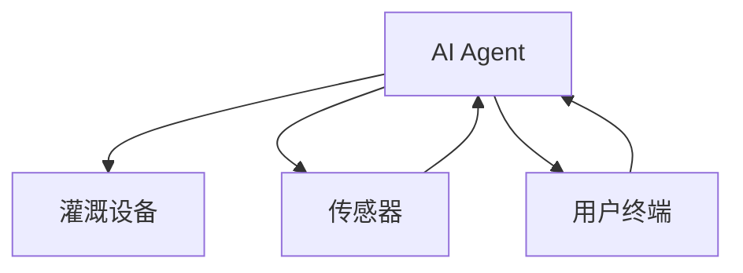
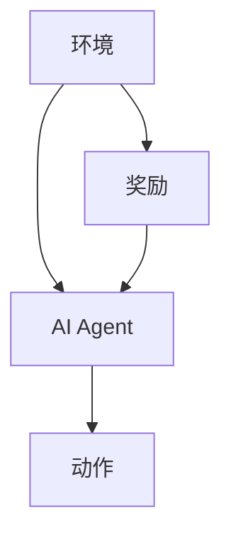
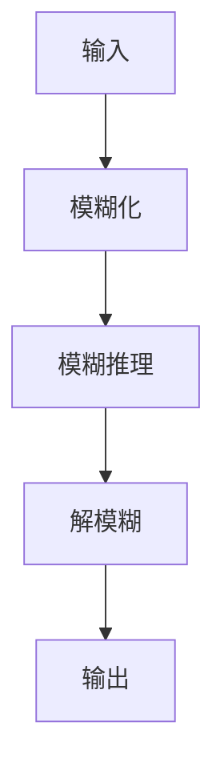
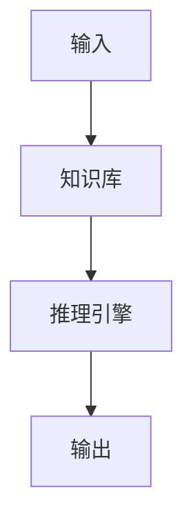
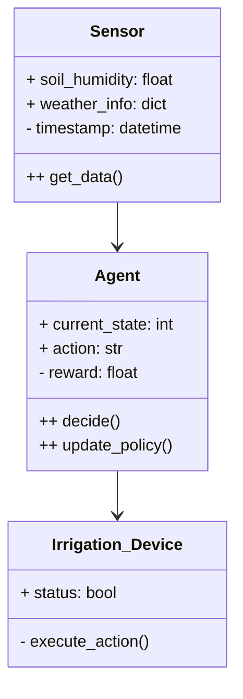
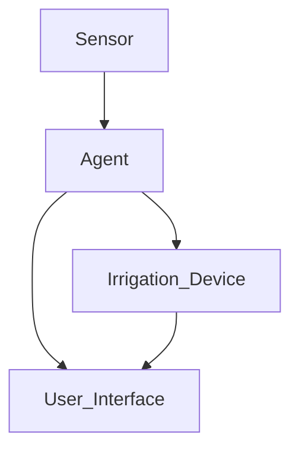
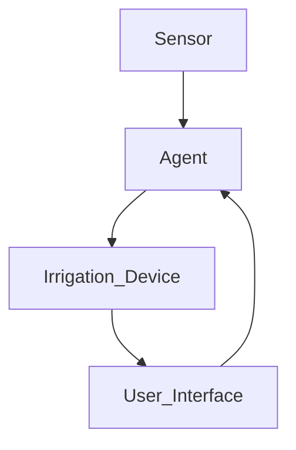

                 


# 智能花园灌溉系统：AI Agent的精准浇水控制

> 关键词：智能花园灌溉、AI Agent、精准浇水、物联网、自动化控制、强化学习

> 摘要：本文详细探讨了智能花园灌溉系统的设计与实现，重点介绍了AI Agent在精准浇水控制中的应用。通过分析系统背景、核心概念、算法原理、系统架构和项目实战，本文为读者提供了从理论到实践的全面指导。

---

# 第一部分：智能花园灌溉系统的背景与概念

# 第1章：智能花园灌溉系统概述

## 1.1 智能花园灌溉的背景与意义

### 1.1.1 传统灌溉方式的局限性
传统的花园灌溉方式主要依赖人工操作，存在以下问题：
- **水资源浪费**：无法根据土壤湿度和天气变化实时调整水量。
- **效率低下**：人工浇水需要大量时间和劳动力。
- **精准度不足**：无法实现对不同区域植物的差异化浇水。

### 1.1.2 智能化灌溉的必要性
随着物联网（IoT）和人工智能（AI）技术的快速发展，智能化灌溉成为趋势。AI Agent（智能代理）能够通过实时数据采集和智能决策，实现精准浇水控制，从而提高灌溉效率、节约水资源并降低人工成本。

### 1.1.3 AI Agent在精准浇水中的作用
AI Agent通过以下方式实现精准浇水：
- **实时感知**：采集土壤湿度、天气预报、植物需求等数据。
- **智能决策**：基于数据进行分析和预测，制定最优浇水方案。
- **自动控制**：通过物联网设备执行决策，实现自动化浇水。

## 1.2 智能花园灌溉系统的核心概念

### 1.2.1 AI Agent的基本定义
AI Agent是一种智能实体，能够感知环境、自主决策并执行任务。在智能花园灌溉系统中，AI Agent负责处理传感器数据、分析植物需求并控制灌溉设备。

### 1.2.2 精准浇水控制的实现方式
精准浇水控制主要通过以下方式实现：
- **基于传感器的数据驱动控制**：利用土壤湿度传感器、气象传感器等实时数据进行决策。
- **基于模型的智能控制**：通过建立植物生长模型和土壤水分模型，预测最佳浇水时间。
- **基于反馈的自适应控制**：根据浇水效果实时调整灌溉策略。

### 1.2.3 系统的边界与外延
智能花园灌溉系统的边界包括：
- **内部系统**：传感器、控制器、灌溉设备、AI Agent。
- **外部系统**：天气预报API、用户终端、物联网平台。

系统外延包括与其他系统的集成，如智能家居系统、环境监测系统等。

## 1.3 智能花园灌溉系统的组成与结构

### 1.3.1 系统的核心要素
智能花园灌溉系统由以下核心要素组成：
- **传感器**：土壤湿度传感器、气象传感器、植物健康监测传感器。
- **AI Agent**：负责数据处理、决策和控制。
- **灌溉设备**：智能喷头、滴灌设备。
- **物联网平台**：数据存储、通信和管理。

### 1.3.2 各要素之间的关系
各要素之间的关系可以用以下表格表示：

| 元素       | 输入       | 输出       |
|------------|------------|------------|
| 传感器      | 环境数据    | 数据信号    |
| AI Agent    | 数据信号    | 决策指令    |
| 灌溉设备    | 决策指令    | 浇水动作    |
| 用户终端    | 决策指令    | 用户反馈    |

### 1.3.3 系统的整体架构
以下是系统的整体架构图（使用Mermaid）：



## 1.4 本章小结
本章介绍了智能花园灌溉系统的背景、核心概念和组成结构。通过分析传统灌溉方式的局限性，阐述了AI Agent在精准浇水中的重要作用，并总结了系统的组成要素及其关系。

---

# 第二部分：AI Agent的核心原理与算法

# 第2章：AI Agent的基本原理

## 2.1 AI Agent的核心概念

### 2.1.1 AI Agent的定义与特点
AI Agent是一种智能实体，具有以下特点：
- **自主性**：能够自主感知和决策。
- **反应性**：能够实时响应环境变化。
- **学习能力**：能够通过数据学习优化决策策略。

### 2.1.2 AI Agent的分类与应用场景
AI Agent可以分为以下几类：
- **简单反射型Agent**：基于规则的反应式系统。
- **基于模型的反应式Agent**：基于内部模型进行决策。
- **目标驱动型Agent**：以目标为导向进行决策。
- **效用驱动型Agent**：基于效用函数进行决策。

### 2.1.3 AI Agent与传统自动控制系统的区别
AI Agent与传统自动控制系统的区别如下表所示：

| 特性               | AI Agent                     | 传统自动控制系统         |
|--------------------|------------------------------|--------------------------|
| 决策方式           | 基于学习和推理               | 基于固定规则和逻辑       |
| 灵活性             | 高，能够适应复杂环境         | 较低，适应性有限           |
| 学习能力           | 强，能够优化决策策略         | 无，无法优化               |
| 应用场景           | 复杂、动态环境               | 简单、静态环境             |

## 2.2 AI Agent的决策机制

### 2.2.1 基于规则的决策
基于规则的决策是一种简单的决策方式，适用于规则明确的场景。例如：
- 如果土壤湿度低于30%，则开启喷头。
- 如果降雨概率大于50%，则延迟浇水。

### 2.2.2 基于学习的决策
基于学习的决策是一种高级决策方式，适用于复杂场景。常见的学习算法包括：
- **强化学习**：通过奖励机制优化决策策略。
- **监督学习**：基于历史数据训练决策模型。
- **无监督学习**：通过数据聚类发现隐含规律。

### 2.2.3 基于反馈的自适应调整
基于反馈的自适应调整是一种动态优化方式，适用于环境变化较大的场景。例如：
- 根据历史浇水效果调整灌溉时间。
- 根据植物生长状态动态调整浇水频率。

## 2.3 AI Agent的核心算法

### 2.3.1 强化学习算法
强化学习是一种通过试错学习优化决策策略的算法。以下是强化学习的基本流程图（使用Mermaid）：



以下是强化学习的数学模型示例：

$$ Q(s, a) = Q(s, a) + \alpha (r + \max_{a'} Q(s', a') - Q(s, a)) $$

其中：
- \( Q(s, a) \)：状态-动作对的评估值。
- \( \alpha \)：学习率。
- \( r \)：奖励值。
- \( s' \)：下一状态。
- \( a' \)：下一动作。

### 2.3.2 模糊控制算法
模糊控制是一种基于模糊逻辑的控制方法，适用于边界条件不明确的场景。以下是模糊控制的流程图（使用Mermaid）：



### 2.3.3 专家系统算法
专家系统是一种基于知识库和推理引擎的决策方法。以下是专家系统的结构图（使用Mermaid）：



## 2.4 本章小结
本章详细介绍了AI Agent的核心概念、决策机制和算法原理。通过分析强化学习、模糊控制和专家系统等算法，为后续的系统设计奠定了理论基础。

---

# 第三部分：智能花园灌溉系统的算法实现

# 第3章：AI Agent的算法实现

## 3.1 算法原理

### 3.1.1 强化学习算法的数学模型
强化学习的数学模型可以表示为：

$$ V(s) = \max_a Q(s,a) $$

其中：
- \( V(s) \)：状态 \( s \) 的价值函数。
- \( Q(s,a) \)：动作 \( a \) 在状态 \( s \) 下的价值函数。

### 3.1.2 模糊控制算法的规则库设计
模糊控制算法的规则库设计如下：

| 输入条件       | 输出动作           |
|----------------|--------------------|
| 土壤湿度低       | 开启喷头           |
| 土壤湿度中       | 间歇浇水           |
| 土壤湿度高       | 关闭喷头           |

### 3.1.3 专家系统算法的知识库构建
专家系统算法的知识库构建如下：

| 知识点         | 描述               |
|----------------|--------------------|
| 植物类型       | 不同植物的浇水需求 |
| 土壤类型       | 不同土壤的水分特性 |
| 天气条件       | 不同天气的浇水策略 |

## 3.2 算法实现的代码示例

### 3.2.1 强化学习算法的Python实现
以下是强化学习算法的Python代码示例：

```python
import numpy as np

class Agent:
    def __init__(self, state_space, action_space):
        self.state_space = state_space
        self.action_space = action_space
        self.Q = np.zeros((state_space, action_space))
    
    def take_action(self, state):
        return np.argmax(self.Q[state, :])
    
    def update(self, state, action, reward, next_state):
        self.Q[state, action] += 0.1 * (reward + np.max(self.Q[next_state, :]) - self.Q[state, action])
```

### 3.2.2 模糊控制算法的Python实现
以下是模糊控制算法的Python代码示例：

```python
def fuzzy_control(soil_humidity):
    if soil_humidity < 30:
        return 'open'
    elif 30 <= soil_humidity < 70:
        return 'sprinkle'
    else:
        return 'close'
```

## 3.3 本章小结
本章详细介绍了强化学习、模糊控制和专家系统算法的实现原理和代码示例。通过这些算法的实现，AI Agent能够根据实时数据和历史数据制定最优的浇水策略。

---

# 第四部分：智能花园灌溉系统的系统分析与架构设计

# 第4章：系统分析与架构设计

## 4.1 问题场景介绍
智能花园灌溉系统的主要目标是实现精准浇水控制，解决传统灌溉方式中存在的水资源浪费、效率低下和精准度不足的问题。

## 4.2 系统功能设计

### 4.2.1 领域模型设计
以下是领域的模型设计图（使用Mermaid）：



### 4.2.2 系统架构设计
以下是系统的架构设计图（使用Mermaid）：



## 4.3 系统接口设计
系统的接口设计如下：

| 接口名称       | 描述               |
|----------------|--------------------|
| get_sensor_data() | 获取传感器数据     |
| decide_action()   | 决策浇水动作       |
| execute_action()   | 执行浇水动作       |
| update_policy()   | 更新决策策略       |

## 4.4 系统交互设计
以下是系统的交互流程图（使用Mermaid）：



## 4.5 本章小结
本章详细分析了智能花园灌溉系统的功能需求、系统架构和接口设计。通过系统架构图和交互流程图，明确了各组件之间的关系和协作方式。

---

# 第五部分：智能花园灌溉系统的项目实战

# 第5章：项目实战

## 5.1 环境搭建

### 5.1.1 硬件环境
需要以下硬件设备：
- 土壤湿度传感器（例如：DHT22传感器）。
- 智能喷头。
- 网络模块（例如：Wi-Fi模块）。

### 5.1.2 软件环境
需要以下软件：
- Python编程语言。
- TensorFlow库（用于强化学习）。
- MQTT协议（用于物联网通信）。

## 5.2 核心代码实现

### 5.2.1 数据采集代码
以下是数据采集代码示例：

```python
import paho.mqtt.client as mqtt

def on_connect(client, userdata, flags, rc):
    print("Connected with result code " + str(rc))
    client.subscribe("soil/humidity")

def on_message(client, userdata, msg):
    print("Received message: " + msg.payload.decode())

client = mqtt.Client()
client.on_connect = on_connect
client.on_message = on_message
client.connect("localhost", 1883)
client.loop_forever()
```

### 5.2.2 决策控制代码
以下是决策控制代码示例：

```python
import numpy as np

class Agent:
    def __init__(self, state_space, action_space):
        self.state_space = state_space
        self.action_space = action_space
        self.Q = np.zeros((state_space, action_space))
    
    def take_action(self, state):
        return np.argmax(self.Q[state, :])
    
    def update(self, state, action, reward, next_state):
        self.Q[state, action] += 0.1 * (reward + np.max(self.Q[next_state, :]) - self.Q[state, action])
```

## 5.3 实际案例分析
以下是实际案例分析：
- **干旱情况**：土壤湿度低于30%，AI Agent决策开启喷头。
- **湿润情况**：土壤湿度高于70%，AI Agent决策关闭喷头。
- **正常情况**：土壤湿度介于30%到70%之间，AI Agent决策间歇浇水。

## 5.4 本章小结
本章通过实际项目实战，详细介绍了智能花园灌溉系统的环境搭建、核心代码实现和实际案例分析。通过代码示例，读者可以清晰理解AI Agent在精准浇水控制中的具体应用。

---

# 第六部分：智能花园灌溉系统的最佳实践

# 第6章：最佳实践

## 6.1 小结
智能花园灌溉系统通过AI Agent的精准控制，实现了高效节水的灌溉方式。AI Agent的核心算法如强化学习和模糊控制在实际应用中表现出色。

## 6.2 注意事项
- **传感器精度**：确保传感器数据的准确性。
- **算法优化**：根据实际场景不断优化AI Agent的决策策略。
- **系统维护**：定期检查和维护系统硬件和软件。

## 6.3 拓展阅读
- 《强化学习：理论与实践》
- 《模糊控制原理与应用》
- 《物联网技术入门与实战》

## 6.4 本章小结
本章总结了智能花园灌溉系统的最佳实践，提出了系统优化的注意事项，并推荐了进一步学习的拓展阅读资料。

---

# 结语

智能花园灌溉系统通过AI Agent的精准控制，实现了高效节水的灌溉方式。本文从系统背景、核心概念、算法原理、系统架构到项目实战，全面详细地介绍了智能花园灌溉系统的实现过程。通过本文的学习，读者可以掌握AI Agent在精准浇水控制中的具体应用，为后续的智能控制系统设计提供参考。

---

作者：AI天才研究院/AI Genius Institute & 禅与计算机程序设计艺术 /Zen And The Art of Computer Programming

