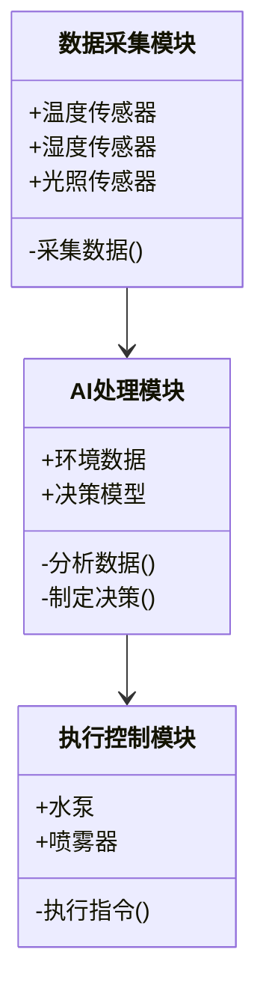
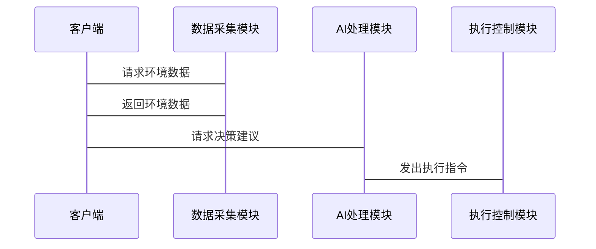

                 


# 智能花园系统：AI Agent的生态平衡维护

> 关键词：智能花园系统，AI Agent，生态平衡，物联网，机器学习，系统架构

> 摘要：本文探讨了AI Agent在智能花园系统中的应用，详细分析了AI Agent的核心概念、算法原理、系统架构以及项目实战。通过数学模型和实际案例，展示了AI Agent如何在智能花园系统中维护生态平衡，并提供了系统的最佳实践建议。

---

## 第1章: 智能花园系统的背景与现状

### 1.1 智能花园系统的发展现状

#### 1.1.1 智能花园系统的定义与特点
智能花园系统是一种结合物联网（IoT）、人工智能（AI）和自动化技术的智能系统，用于监测和管理花园环境。其特点包括：
- **自动化**：自动监测环境参数（如温度、湿度、光照）并进行相应操作（如浇水、施肥）。
- **智能化**：通过AI算法优化植物生长，提高资源利用效率。
- **远程监控**：用户可以通过手机或其他设备远程查看和控制花园状态。

#### 1.1.2 当前智能花园系统的应用现状
目前，智能花园系统已广泛应用于家庭花园、农业大棚和公共绿地。其主要应用场景包括：
- **环境监测**：实时监测土壤湿度、空气温度、光照强度等参数。
- **自动控制**：根据环境数据自动调节灌溉、遮阳系统。
- **植物健康管理**：通过AI分析识别病虫害，提供防治建议。

#### 1.1.3 智能花园系统的技术发展趋势
随着AI和物联网技术的快速发展，智能花园系统正朝着更智能化、个性化和可持续的方向发展。未来趋势包括：
- **AI驱动的决策优化**：通过强化学习优化植物生长策略。
- **绿色能源的应用**：使用太阳能等可再生能源为系统供电。
- **数据共享与协作**：建立花园数据共享平台，促进经验交流。

### 1.2 AI Agent在智能花园系统中的作用

#### 1.2.1 AI Agent的基本概念
AI Agent是一种智能主体，能够感知环境、做出决策并执行动作。在智能花园系统中，AI Agent主要用于：
- **数据处理**：分析传感器数据，识别环境变化。
- **决策制定**：基于数据分析结果，制定最优操作方案。
- **执行控制**：通过执行机构（如水泵、喷雾器）实现环境调节。

#### 1.2.2 AI Agent在智能花园系统中的应用场景
AI Agent的应用场景包括：
- **精准灌溉**：根据土壤湿度和天气预报调整灌溉时间。
- **病虫害预测**：通过图像识别技术识别植物病虫害。
- **气候适应性优化**：根据不同气候条件调整植物种植策略。

#### 1.2.3 AI Agent的优势与挑战
AI Agent的优势：
- **高效性**：能够快速处理大量数据，做出最优决策。
- **适应性**：能够根据环境变化自适应调整策略。
- **可扩展性**：可以轻松扩展到更大规模的花园系统。

AI Agent的挑战：
- **数据隐私**：传感器数据可能包含用户隐私信息，需注意数据安全。
- **系统稳定性**：AI Agent的决策可能受到数据质量和模型准确性的影响。
- **环境复杂性**：生态系统复杂，AI Agent需要处理多种不确定性因素。

### 1.3 智能花园系统与生态平衡的关系

#### 1.3.1 生态平衡的基本概念
生态平衡是指生态系统中的各种成分和功能处于相对稳定的状态。智能花园系统通过优化环境管理，帮助维持生态平衡。

#### 1.3.2 智能花园系统如何维护生态平衡
智能花园系统通过以下方式维护生态平衡：
- **精准控制**：避免过度浇水或施肥，减少对环境的污染。
- **资源优化**：合理利用水资源和能源，降低消耗。
- **生物多样性保护**：通过优化植物种植策略，保护花园中的生物多样性。

#### 1.3.3 生态平衡维护的复杂性与挑战
生态平衡的维护涉及多个因素，包括天气变化、病虫害、植物生长周期等。AI Agent需要具备强大的学习和适应能力，才能应对这些复杂性和挑战。

---

## 第2章: AI Agent的核心概念与原理

### 2.1 AI Agent的基本原理

#### 2.1.1 AI Agent的定义与分类
AI Agent可以分为以下几类：
- **基于规则的Agent**：通过预定义的规则做出决策。
- **基于模型的Agent**：使用模型表示环境并做出决策。
- **基于学习的Agent**：通过机器学习算法不断优化决策策略。

#### 2.1.2 AI Agent的核心要素
AI Agent的核心要素包括：
- **感知**：通过传感器获取环境数据。
- **决策**：基于感知数据做出决策。
- **执行**：通过执行机构执行决策。

#### 2.1.3 AI Agent的决策机制
AI Agent的决策机制可以基于以下几种方法：
- **规则推理**：通过预定义的规则进行推理。
- **逻辑推理**：通过逻辑推理得出结论。
- **机器学习**：通过训练模型进行预测和决策。

### 2.2 生态平衡维护的原理

#### 2.2.1 生态系统的组成与相互作用
生态系统由生物成分（生产者、消费者、分解者）和非生物成分（阳光、水、空气）组成。AI Agent需要考虑这些成分的相互作用。

#### 2.2.2 生态平衡的数学模型
生态平衡的数学模型可以表示为：
$$
\text{生态平衡} = f(\text{生产者}, \text{消费者}, \text{分解者}, \text{非生物成分})
$$
其中，$f$表示生态系统的相互作用关系。

#### 2.2.3 AI Agent在生态平衡维护中的作用
AI Agent通过以下方式维护生态平衡：
- **动态调整**：根据环境变化动态调整植物的生长条件。
- **优化资源利用**：合理分配水、肥、光照等资源，避免浪费。
- **预测与预警**：预测可能出现的生态失衡问题，并提前预警。

### 2.3 AI Agent与生态平衡的关系

#### 2.3.1 AI Agent如何影响生态平衡
AI Agent通过优化环境管理，促进生态系统的健康发展。

#### 2.3.2 生态平衡对AI Agent的影响
生态平衡的稳定与否直接影响AI Agent的决策效果和系统稳定性。

#### 2.3.3 AI Agent在生态平衡维护中的优化作用
AI Agent通过数据驱动的优化策略，提高生态系统的稳定性和资源利用效率。

---

## 第3章: AI Agent的算法原理与数学模型

### 3.1 基于强化学习的AI Agent算法

#### 3.1.1 强化学习的基本原理
强化学习是一种通过试错机制来优化决策策略的方法。其核心是通过奖励机制指导AI Agent做出最优决策。

#### 3.1.2 强化学习的数学模型
强化学习的数学模型可以表示为：
$$
Q(s, a) = r + \gamma \max_{a'} Q(s', a')
$$
其中，$Q(s, a)$表示状态$s$和动作$a$的Q值，$r$表示奖励，$\gamma$表示折扣因子。

#### 3.1.3 强化学习在AI Agent中的应用
强化学习可以应用于AI Agent的环境监测和资源管理，帮助系统做出最优决策。

### 3.2 基于机器学习的生态平衡预测模型

#### 3.2.1 机器学习的基本原理
机器学习是一种通过数据训练模型来预测或分类的方法。

#### 3.2.2 生态平衡预测模型的数学公式
生态平衡预测模型可以表示为：
$$
y = f(x)
$$
其中，$x$表示输入特征，$y$表示输出预测值。

#### 3.2.3 机器学习在生态平衡预测中的应用
机器学习可以用于预测生态系统的潜在风险，帮助AI Agent提前采取措施。

---

## 第4章: 智能花园系统的系统分析与架构设计

### 4.1 系统功能设计

#### 4.1.1 系统功能模块
智能花园系统的功能模块包括：
- **数据采集模块**：采集环境数据。
- **AI处理模块**：分析数据并制定决策。
- **执行控制模块**：执行决策操作。

#### 4.1.2 系统功能的mermaid类图


### 4.2 系统架构设计

#### 4.2.1 系统架构的mermaid架构图


### 4.3 系统接口设计

#### 4.3.1 系统接口的mermaid序列图


---

## 第5章: 项目实战

### 5.1 环境安装与配置

#### 5.1.1 环境安装
安装所需的工具和库：
- Python 3.8+
- TensorFlow 2.0+
- Raspberry Pi

#### 5.1.2 环境配置
配置环境变量和安装依赖库：
```bash
pip install numpy
pip install scikit-learn
pip install tensorflow
```

### 5.2 核心代码实现

#### 5.2.1 数据采集模块的实现
```python
import numpy as np

class DataCollector:
    def __init__(self):
        self.temperature = []
        self.humidity = []
        self.light = []

    def collect_data(self):
        # 模拟数据采集
        self.temperature.append(np.random.uniform(20, 30))
        self.humidity.append(np.random.uniform(40, 60))
        self.light.append(np.random.uniform(500, 1000))
```

#### 5.2.2 AI处理模块的实现
```python
from sklearn import linear_model

class AIProcessor:
    def __init__(self):
        self.model = linear_model.LinearRegression()

    def train_model(self, X, y):
        self.model.fit(X, y)

    def predict(self, X):
        return self.model.predict(X)
```

### 5.3 案例分析与解读
通过具体案例分析AI Agent在智能花园中的应用，展示系统的实际效果和优化能力。

### 5.4 项目小结
总结项目的实现过程，提出改进建议和未来的发展方向。

---

## 第6章: 最佳实践与总结

### 6.1 最佳实践
- **数据质量管理**：确保传感器数据的准确性和完整性。
- **系统安全性**：加强数据加密和访问控制。
- **用户培训**：提供用户培训和使用手册，确保系统正确使用。

### 6.2 总结与展望
总结全文的主要内容，展望未来的发展方向，如更高级的AI算法应用和系统的智能化升级。

---

## 作者信息
作者：AI天才研究院 & 禅与计算机程序设计艺术

---

这篇文章系统地探讨了AI Agent在智能花园系统中的应用，从背景、概念到算法、系统架构和项目实战，提供了全面的分析和详细的代码实现。通过这篇文章，读者可以深入了解AI Agent如何帮助维护生态平衡，并为未来的智能花园系统开发提供参考。

