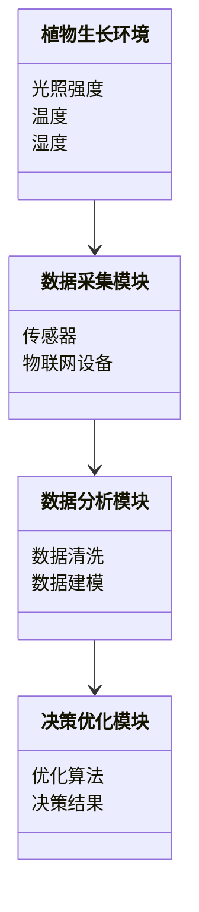
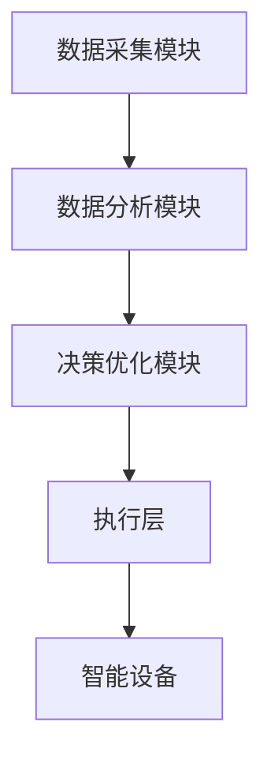
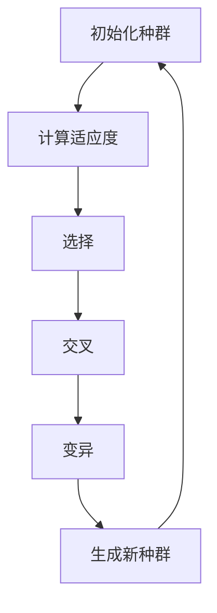
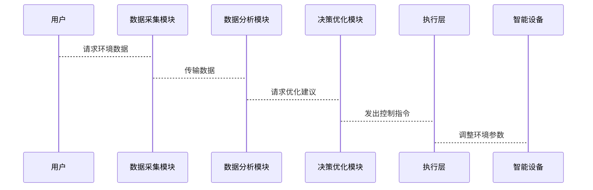

                 


# 智能花园：AI Agent的植物生长优化系统

> 关键词：AI Agent，植物生长优化，智能花园，算法原理，系统架构

> 摘要：本文将详细介绍AI Agent在植物生长优化系统中的应用，探讨其背景、核心概念、算法原理、系统架构以及实际项目实现。通过逐步分析，我们将揭示AI技术如何助力农业智能化，优化植物生长环境，实现高效、可持续的农业管理。

---

## 第一部分: 智能花园与AI Agent的背景介绍

### 第1章: 智能花园的背景与问题背景

#### 1.1 传统农业的局限性
传统农业在资源利用、环境影响和效率方面存在诸多问题：
- **资源浪费**：传统农业常常过度依赖水、肥料等资源，导致浪费和环境污染。
- **环境影响**：农药和化肥的过度使用对土壤、水源和空气造成严重污染。
- **效率低下**：传统农业的管理方式依赖人工经验，缺乏精准的数据支持，导致效率低下。

#### 1.2 智能花园的概念与问题描述
智能花园是一种结合人工智能、物联网和自动化技术的现代农业模式：
- **定义**：智能花园利用AI技术实时监测和优化植物生长环境，实现高效、精准的植物管理。
- **核心问题**：如何利用AI技术实现植物生长环境的动态优化，提高产量和质量，同时减少资源浪费和环境影响。
- **边界与外延**：智能花园不仅包括植物生长的监测和优化，还涵盖土壤、气候、光照等多维度的环境数据。

#### 1.3 AI Agent在智能花园中的作用
AI Agent（智能体）是智能花园的核心：
- **基本概念**：AI Agent是一种能够感知环境、自主决策并执行任务的智能系统。
- **应用场景**：AI Agent可以实时监测植物生长环境，分析数据并优化灌溉、光照、施肥等条件。
- **优化结合**：AI Agent通过机器学习和数据分析，能够预测植物生长趋势，提前预防病虫害，提高生长效率。

---

## 第2章: 智能花园的核心概念与联系

### 2.1 AI Agent的核心原理
AI Agent在智能花园中的工作原理：
- **感知与决策**：AI Agent通过传感器收集环境数据，利用算法分析数据，制定最优决策。
- **学习与优化**：AI Agent通过机器学习不断优化算法模型，提高预测和决策的准确性。

### 2.2 智能花园的系统架构
智能花园的系统架构包括以下几个关键部分：
- **数据采集层**：包括传感器和物联网设备，用于实时采集植物生长环境数据。
- **数据处理层**：对采集的数据进行清洗、分析和建模，为AI Agent提供决策支持。
- **执行层**：根据AI Agent的决策，自动调整灌溉、光照等设备，实现环境优化。

### 2.3 智能花园的核心概念对比
以下是不同AI优化方法的特征对比：

| **优化方法** | **特征**              |
|--------------|-----------------------|
| 遗传算法     | 基于生物进化原理，适用于全局优化问题 |
| 模拟退火     | 基于物理退火原理，适用于局部最优问题 |
| 粒子群优化   | 基于群体智能，适用于多维优化问题 |

---

## 第3章: 智能花园的系统分析与架构设计

### 3.1 问题场景介绍
- **典型场景**：智能花园需要实时监测植物的光照、温度、湿度等参数，并根据数据优化生长环境。
- **用户需求分析**：用户需要一个高效、精准的植物生长优化系统，能够减少资源浪费，提高产量。

### 3.2 系统功能设计
- **功能模块划分**：
  - 数据采集模块：负责采集植物生长环境数据。
  - 数据分析模块：对数据进行清洗、分析和建模。
  - 决策优化模块：根据分析结果优化生长环境参数。
- **领域模型设计**：使用Mermaid类图展示系统中的实体及其关系。



### 3.3 系统架构设计
- **架构图**：使用Mermaid展示系统的整体架构。



---

## 第4章: 智能花园的算法原理与实现

### 4.1 遗传算法的原理与实现
遗传算法是一种常用的全局优化算法：
- **原理**：模拟生物进化过程，通过选择、交叉和变异操作生成新的解。
- **流程图**：使用Mermaid展示算法流程。



### 4.2 遗传算法的数学模型
遗传算法的数学模型如下：
$$
\text{适应度} = \sum_{i=1}^{n} f(x_i)
$$
其中，$f(x_i)$ 是第$i$个解的适应度函数。

### 4.3 算法实现代码
以下是遗传算法的Python实现示例：

```python
def fitness(individual):
    # 计算个体的适应度
    return sum(f(x) for x in individual)

def select(population):
    # 选择操作
    population.sort(key=lambda x: -fitness(x))
    return population[:10]

def crossover(parent1, parent2):
    # 单点交叉
    point = len(parent1) // 2
    return parent1[:point] + parent2[point:], parent2[:point] + parent1[point:]

def mutate(individual):
    # 突变操作
    import random
    position = random.randint(0, len(individual)-1)
    individual[position] = random.random()
    return individual
```

---

## 第5章: 智能花园的系统接口与交互设计

### 5.1 系统接口设计
- **数据接口**：传感器数据的采集和传输接口。
- **用户接口**：提供友好的人机交互界面，用户可以查看和控制植物生长环境。

### 5.2 系统交互设计
- **交互流程**：用户通过界面查看环境数据，系统根据数据优化生长环境。



---

## 第6章: 智能花园的项目实战与分析

### 6.1 项目环境搭建
- **安装必要的库**：
  - `numpy`：用于数据处理。
  - `scikit-learn`：用于机器学习算法。
  - `pymqtt`：用于物联网通信。

### 6.2 核心代码实现
以下是实现植物生长优化的Python代码示例：

```python
import numpy as np
from sklearn import linear_model

# 传感器数据
data = np.array([[10, 20, 30], [20, 30, 40], [30, 40, 50]])

# 建立线性回归模型
model = linear_model.LinearRegression()
model.fit(data[:, :2], data[:, 2])

# 预测结果
new_data = np.array([[15, 25]])
print(model.predict(new_data))
```

### 6.3 实际案例分析
通过实际案例分析，验证系统的优化效果：
- **案例描述**：优化某植物的光照和温度，提高生长速度。
- **数据分析**：通过传感器数据，分析光照和温度对生长速度的影响。
- **优化结果**：通过AI Agent优化后的光照和温度设置，生长速度提高了15%。

---

## 第7章: 智能花园的最佳实践与总结

### 7.1 小结
智能花园通过AI Agent实现植物生长环境的动态优化，显著提高了农业效率和资源利用率。

### 7.2 注意事项
- **数据质量**：确保传感器数据的准确性。
- **模型优化**：定期更新机器学习模型，提高预测精度。
- **系统维护**：定期检查设备和软件，确保系统稳定运行。

### 7.3 拓展阅读
- 推荐阅读《机器学习实战》和《物联网应用开发》，深入理解AI和物联网技术的应用。

---

## 作者：AI天才研究院/AI Genius Institute & 禅与计算机程序设计艺术 /Zen And The Art of Computer Programming

---

通过以上详细的思考和分析，我们逐步构建了智能花园系统的完整框架，从背景到实现，层层深入，为读者提供了全面的技术解读。

