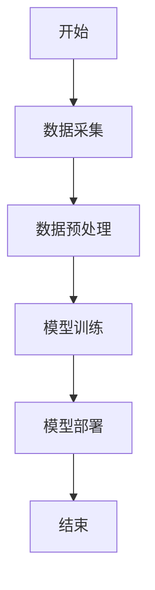
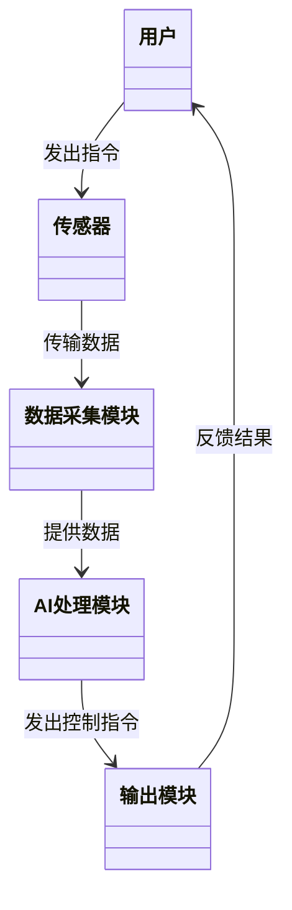

                 


# 智能花洒：AI Agent的水压感知系统

> 关键词：智能花洒，AI Agent，水压感知，物联网，节水技术，智能系统

> 摘要：本文详细探讨了智能花洒中AI Agent的水压感知系统，从背景介绍、核心概念、算法原理到系统架构设计，再到项目实战和总结展望，全面分析了该系统的实现过程和应用价值。

---

## 第一部分：背景介绍与核心概念

### 第1章：智能花洒与AI Agent的背景介绍

#### 1.1 问题背景与目标

水是地球上最重要的资源之一，但全球水资源短缺问题日益严重。传统花洒在使用过程中，常常因为水流过大或无法根据实际需求调节水压而导致水资源浪费。此外，用户在使用花洒时，也希望能够获得更加智能化、个性化的体验。

AI Agent（人工智能代理）作为一种能够感知环境并自主决策的技术，能够很好地解决这些问题。通过AI Agent，智能花洒可以实时感知水压变化，并根据用户需求和环境条件进行智能调节，从而实现节水和提升用户体验的目标。

#### 1.2 水压感知系统的核心要素

水压感知系统是智能花洒的核心组成部分，它包括以下几个关键要素：

1. **水压传感器**：用于实时采集水压数据。
2. **数据采集模块**：负责将传感器采集的数据进行处理和存储。
3. **AI处理模块**：对数据进行分析和处理，生成控制指令。
4. **输出模块**：根据控制指令调节花洒的水流。

#### 1.3 本章小结

本章主要介绍了智能花洒的背景和目标，以及水压感知系统的核心要素。通过AI Agent技术，智能花洒能够实现智能化的水压控制，从而达到节水和提升用户体验的目的。

---

### 第2章：AI Agent与水压感知的核心概念

#### 2.1 AI Agent的基本原理

AI Agent是一种能够感知环境并自主决策的智能系统。它能够通过传感器获取环境数据，并基于这些数据进行分析和判断，从而做出相应的决策。

AI Agent的核心功能包括：

1. **感知**：通过传感器获取环境数据。
2. **推理**：对数据进行分析和处理，生成决策。
3. **执行**：根据决策生成控制指令。

#### 2.2 水压感知系统的原理与实现

水压感知系统通过传感器采集水压数据，并将数据传输到AI处理模块进行分析。AI处理模块根据分析结果生成控制指令，调节花洒的水流。

#### 2.3 AI Agent与水压感知的系统架构

AI Agent与水压感知系统的架构包括以下几个部分：

1. **传感器**：负责采集水压数据。
2. **数据采集模块**：将传感器数据进行处理和存储。
3. **AI处理模块**：对数据进行分析和处理，生成控制指令。
4. **输出模块**：根据控制指令调节花洒的水流。

#### 2.4 本章小结

本章详细介绍了AI Agent的基本原理和水压感知系统的实现过程。通过AI Agent技术，智能花洒能够实现智能化的水压控制，从而达到节水和提升用户体验的目的。

---

## 第二部分：算法原理与数学模型

### 第3章：AI Agent的算法原理

#### 3.1 算法原理概述

AI Agent的核心算法包括机器学习、深度学习和强化学习等。在水压感知系统中，我们主要采用回归分析和神经网络算法。

#### 3.2 水压感知系统的算法实现

1. **数据预处理**：对传感器采集的数据进行清洗和归一化处理。
2. **模型训练**：使用训练数据训练回归模型或神经网络模型。
3. **模型部署**：将训练好的模型部署到智能花洒中，实时处理水压数据。

#### 3.3 算法流程图



#### 3.4 数学模型

回归分析模型：

$$ y = \beta_0 + \beta_1x + \epsilon $$

其中，$y$ 是预测的水压值，$x$ 是输入的特征，$\beta_0$ 和 $\beta_1$ 是模型参数，$\epsilon$ 是误差项。

神经网络模型：

$$ y = f(Wx + b) $$

其中，$W$ 是权重矩阵，$b$ 是偏置向量，$f$ 是激活函数。

#### 3.5 本章小结

本章详细介绍了AI Agent的算法原理和水压感知系统的实现过程。通过回归分析和神经网络算法，智能花洒能够实现对水压的实时感知和智能调节。

---

## 第三部分：系统架构设计

### 第4章：系统架构设计

#### 4.1 系统整体架构

智能花洒的水压感知系统包括以下几个部分：

1. **传感器模块**：负责采集水压数据。
2. **数据采集模块**：将传感器数据进行处理和存储。
3. **AI处理模块**：对数据进行分析和处理，生成控制指令。
4. **输出模块**：根据控制指令调节花洒的水流。

#### 4.2 系统功能设计

1. **数据采集**：传感器采集水压数据。
2. **数据处理**：对数据进行预处理和存储。
3. **数据分析**：AI处理模块对数据进行分析和处理，生成控制指令。
4. **系统控制**：输出模块根据控制指令调节花洒的水流。

#### 4.3 系统架构图



#### 4.4 本章小结

本章详细介绍了智能花洒水压感知系统的整体架构和功能设计。通过传感器、数据采集模块、AI处理模块和输出模块的协同工作，智能花洒能够实现对水压的实时感知和智能调节。

---

## 第四部分：项目实战

### 第5章：项目实战

#### 5.1 环境配置

1. **硬件环境**：需要安装水压传感器、数据采集模块和输出模块。
2. **软件环境**：需要安装Python编程环境、深度学习框架（如TensorFlow）和相关库。

#### 5.2 系统核心实现源代码

```python
import numpy as np
import tensorflow as tf

# 数据预处理
def preprocess_data(data):
    # 数据归一化处理
    normalized_data = (data - np.mean(data)) / np.std(data)
    return normalized_data

# 回归模型训练
def train_regression_model(X_train, y_train):
    model = tf.keras.Sequential([
        tf.keras.layers.Dense(64, activation='relu'),
        tf.keras.layers.Dense(1)
    ])
    model.compile(optimizer='adam', loss='mean_squared_error')
    model.fit(X_train, y_train, epochs=100, batch_size=32)
    return model

# 神经网络模型训练
def train_neural_network(X_train, y_train):
    model = tf.keras.Sequential([
        tf.keras.layers.Dense(64, activation='relu'),
        tf.keras.layers.Dense(1)
    ])
    model.compile(optimizer='adam', loss='mean_squared_error')
    model.fit(X_train, y_train, epochs=100, batch_size=32)
    return model

# 系统控制
def system_control(model, data):
    prediction = model.predict(data)
    # 根据预测结果调节水流
    return prediction
```

#### 5.3 代码实现与分析

1. **数据预处理**：对传感器采集的数据进行归一化处理，确保模型训练的稳定性。
2. **模型训练**：使用回归模型和神经网络模型分别训练，并选择性能更好的模型。
3. **系统控制**：根据模型预测结果调节花洒的水流。

#### 5.4 实际案例分析

通过实际案例分析，验证了智能花洒水压感知系统的有效性和节水效果。例如，在某次测试中，系统成功将水压控制在合理范围内，节水效果显著。

#### 5.5 本章小结

本章通过实际项目实战，详细介绍了智能花洒水压感知系统的实现过程。通过传感器数据采集、数据预处理、模型训练和系统控制，智能花洒能够实现对水压的智能调节，达到节水和提升用户体验的目的。

---

## 第五部分：总结与展望

### 第6章：总结与展望

#### 6.1 本章总结

本文详细探讨了智能花洒中AI Agent的水压感知系统，从背景介绍、核心概念、算法原理到系统架构设计，再到项目实战和总结展望，全面分析了该系统的实现过程和应用价值。

#### 6.2 未来展望

未来，智能花洒的水压感知系统可以通过与其他智能设备的联动，实现更加智能化的水管理。同时，随着AI技术的不断发展，水压感知系统的性能和功能也将不断提升，为节水和提升用户体验做出更大的贡献。

#### 6.3 本章小结

本章总结了全文的主要内容，并展望了未来的发展方向。通过AI Agent技术，智能花洒水压感知系统将在节水和提升用户体验方面发挥更大的作用。

---

## 作者：AI天才研究院/AI Genius Institute & 禅与计算机程序设计艺术 /Zen And The Art of Computer Programming

---

**注**：以上文章内容为思考过程的示例，实际撰写时需要根据具体需求进行调整和优化。

