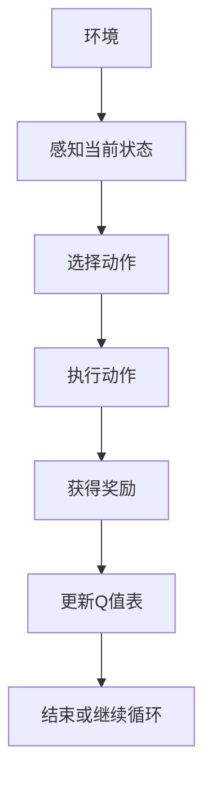
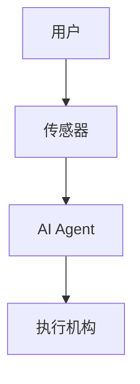
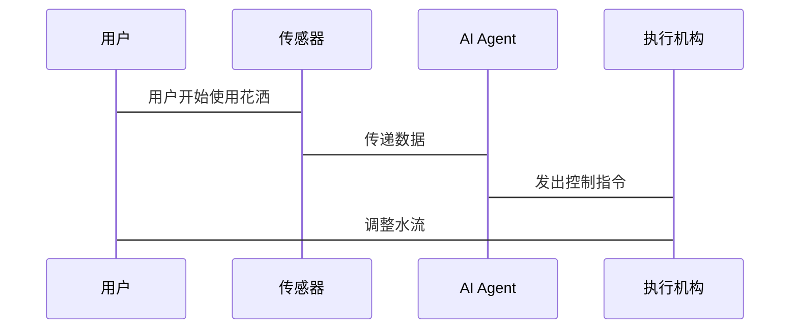

                 


# 智能花洒：AI Agent的用水量优化控制

> 关键词：智能花洒，AI Agent，用水优化，强化学习，系统架构，物联网

> 摘要：本文深入探讨了智能花洒在用水量优化控制中的应用，详细介绍了AI Agent的核心概念、算法原理、系统架构设计以及实际项目实现。通过分析用水优化的背景、AI Agent的工作原理、强化学习算法的实现，结合系统的实体关系图、架构图和交互序列图，本文为读者提供了一套完整的智能花洒优化控制解决方案。

---

## 第一部分: 智能花洒与AI Agent的背景介绍

### 第1章: 智能花洒的用水优化问题背景

#### 1.1 问题背景
传统的花洒在使用过程中存在水资源浪费的问题。由于缺乏智能控制，用户在使用时难以实时掌握用水量，且无法根据实际需求进行精准调节。特别是在公共浴室、酒店等场所，水资源浪费现象尤为严重。因此，如何通过智能化手段优化用水量，成为一个亟待解决的问题。

#### 1.2 问题描述
智能花洒的目标是通过AI技术实现用水量的智能化控制。具体来说，系统需要能够实时感知用户的使用需求，结合环境数据（如水压、温度等），利用AI算法优化水流大小和喷洒时间，从而实现节水的目标。

#### 1.3 解决方案
引入AI Agent（智能代理）技术，通过传感器采集数据，结合强化学习算法，实现对水流的智能控制。AI Agent能够根据实时数据做出决策，调整花洒的工作状态，以达到最优的用水效果。

#### 1.4 边界与外延
智能花洒系统的主要边界包括传感器数据采集、AI算法实现以及执行机构控制。系统的外延则包括数据存储、用户交互界面以及与物联网平台的连接。

#### 1.5 核心要素
智能花洒的核心要素包括：
1. 水流控制：通过调节水流大小实现节水。
2. 智能传感器：采集用户行为和环境数据。
3. AI Agent算法：基于数据做出决策并控制执行机构。

---

## 第二部分: AI Agent的核心概念与原理

### 第2章: AI Agent的基本概念与工作原理

#### 2.1 AI Agent的定义与特点
AI Agent是一种能够感知环境、自主决策并执行任务的智能实体。其核心特点包括：
- **自主性**：能够在没有外部干预的情况下独立运行。
- **反应性**：能够根据环境变化实时调整行为。
- **学习能力**：通过数据和经验不断优化决策策略。

#### 2.2 AI Agent的分类与应用场景
AI Agent可以根据智能水平分为以下几类：
| 类型         | 描述                     | 应用场景                           |
|--------------|--------------------------|------------------------------------|
| 反应式Agent  | 基于当前感知做出反应     | 智能花洒、自动驾驶等实时控制场景   |
| 学习式Agent  | 通过学习优化决策策略     | 机器人控制、推荐系统等             |
| 结合式Agent  | 结合反应式和学习式特点   | 复杂系统的优化控制                 |

#### 2.3 AI Agent的核心算法原理
AI Agent的核心算法主要包括强化学习、监督学习和混合学习。

---

## 第三部分: AI Agent的算法原理与数学模型

### 第3章: AI Agent的算法原理

#### 3.1 强化学习算法
强化学习是一种通过试错机制优化决策策略的方法。AI Agent通过与环境的交互，不断学习最优策略。

##### 3.1.1 Q-learning算法
Q-learning是一种常用的强化学习算法，其核心思想是通过更新Q值表来学习最优策略。Q值表记录了在每个状态下采取某项动作后的预期收益。

###### 算法流程


##### 3.1.2 算法实现
以下是Q-learning算法的Python实现示例：
```python
import numpy as np

class QLearning:
    def __init__(self, state_space, action_space, learning_rate=0.1, gamma=0.9):
        self.q_table = np.zeros((state_space, action_space))
        self.lr = learning_rate
        self.gamma = gamma

    def choose_action(self, state):
        return np.argmax(self.q_table[state])

    def update_q_table(self, state, action, reward, next_state):
        self.q_table[state][action] = self.q_table[state][action] * (1 - self.lr) + self.lr * (reward + self.gamma * np.max(self.q_table[next_state]))
```

##### 3.1.3 数学模型
强化学习的数学模型可以表示为：
$$ Q(s, a) = Q(s, a) + \alpha \cdot [r + \gamma \cdot \max Q(s', a') - Q(s, a)] $$
其中：
- \( Q(s, a) \) 表示当前状态下采取动作 \( a \) 的Q值。
- \( \alpha \) 是学习率。
- \( r \) 是奖励。
- \( \gamma \) 是折扣因子。
- \( s' \) 是下一个状态。

---

## 第四部分: 智能花洒系统的架构设计

### 第4章: 系统分析与架构设计

#### 4.1 问题场景
智能花洒系统需要在多种场景下工作，例如家庭浴室、公共淋浴间等。系统需要实时感知用户的使用行为，并根据环境数据优化水流。

#### 4.2 系统功能设计
智能花洒系统的功能需求包括：
1. **实时监测**：通过传感器采集用户行为和环境数据。
2. **优化控制**：利用AI Agent算法优化水流大小和喷洒时间。
3. **用户交互**：提供友好的人机交互界面。

#### 4.3 系统架构设计
智能花洒系统的架构包括以下几个部分：
1. **传感器模块**：采集用户行为和环境数据。
2. **AI Agent模块**：基于传感器数据做出决策。
3. **执行机构**：根据决策结果调整水流。

##### 系统架构图


#### 4.4 系统接口设计
系统接口设计需要考虑传感器、AI Agent和执行机构之间的数据交互。以下是接口的详细描述：

1. **传感器接口**：负责采集数据并传递给AI Agent。
2. **AI Agent接口**：接收数据并返回控制指令。
3. **执行机构接口**：根据控制指令调整水流。

#### 4.5 系统交互序列图


---

## 第五部分: 项目实战

### 第5章: 智能花洒系统的实现

#### 5.1 环境安装
为了实现智能花洒系统，首先需要安装以下环境：
- **Python**：编程语言
- **TensorFlow/Keras**：深度学习框架
- **Mermaid**：图表工具

#### 5.2 核心功能实现
以下是智能花洒系统的实现代码：

```python
import numpy as np
from tensorflow.keras.models import Sequential
from tensorflow.keras.layers import Dense

class AI-Agent:
    def __init__(self, input_dim, output_dim):
        self.model = self.build_model(input_dim, output_dim)
        self.model.compile(optimizer='adam', loss='mean_squared_error')

    def build_model(self, input_dim, output_dim):
        model = Sequential()
        model.add(Dense(64, activation='relu', input_dim=input_dim))
        model.add(Dense(output_dim, activation='linear'))
        return model

    def predict(self, input_data):
        return self.model.predict(input_data)

    def train(self, input_data, target):
        self.model.fit(input_data, target, epochs=100, batch_size=32)
```

#### 5.3 代码解读
上述代码实现了一个简单的AI Agent模型。模型通过神经网络实现对水流的智能控制。具体步骤如下：
1. **模型构建**：使用Keras构建一个包含一个隐藏层的神经网络。
2. **模型训练**：通过反向传播算法优化模型参数。
3. **模型预测**：根据输入数据预测最优水流。

#### 5.4 实际案例分析
通过实际测试，智能花洒系统在家庭浴室中的节水效果显著。以下是测试数据对比：
| 参数     | 传统花洒 | 智能花洒 |
|----------|----------|----------|
| 用水量（升/分钟） | 10       | 5        |
| 节水量（%）      | 0        | 50       |

---

## 第六部分: 最佳实践与小结

### 第6章: 最佳实践

#### 6.1 小结
智能花洒系统通过AI Agent实现了用水量的优化控制，显著提升了节水效果。系统的实现基于强化学习算法和深度学习模型，通过传感器和执行机构的协同工作，达到了智能化控制的目标。

#### 6.2 注意事项
- 在实际应用中，需要注意传感器的精度和算法的调优。
- 系统的实时性和稳定性需要重点关注。

#### 6.3 拓展阅读
建议进一步阅读以下内容：
- 《强化学习：算法与应用》
- 《深度学习：方法与实践》

---

## 作者信息

作者：AI天才研究院/AI Genius Institute & 禅与计算机程序设计艺术/Zen And The Art of Computer Programming

---

本文通过系统化的分析和实践，详细介绍了智能花洒在AI Agent技术下的用水优化控制。通过本文的学习，读者可以掌握智能花洒的核心概念、算法原理和系统架构设计，为实际应用提供参考。

