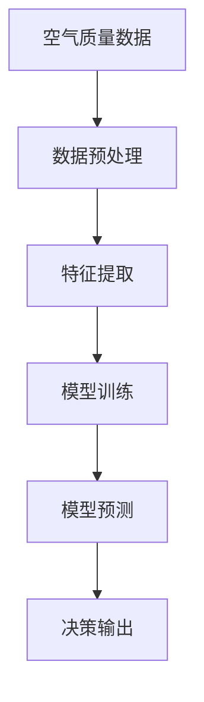
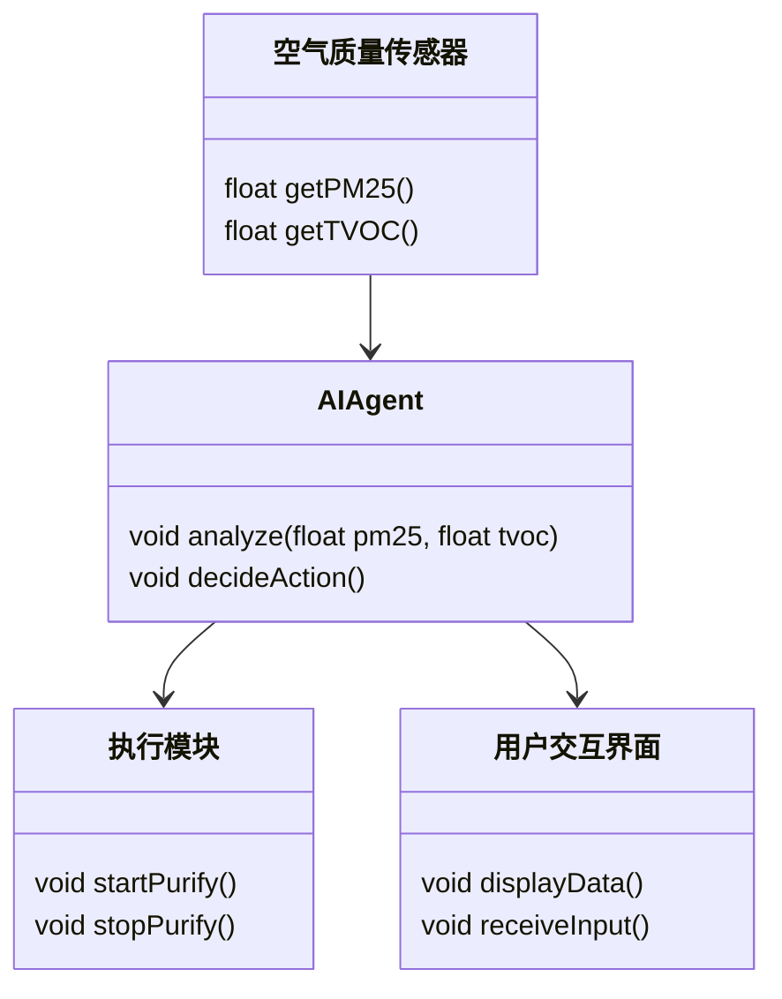
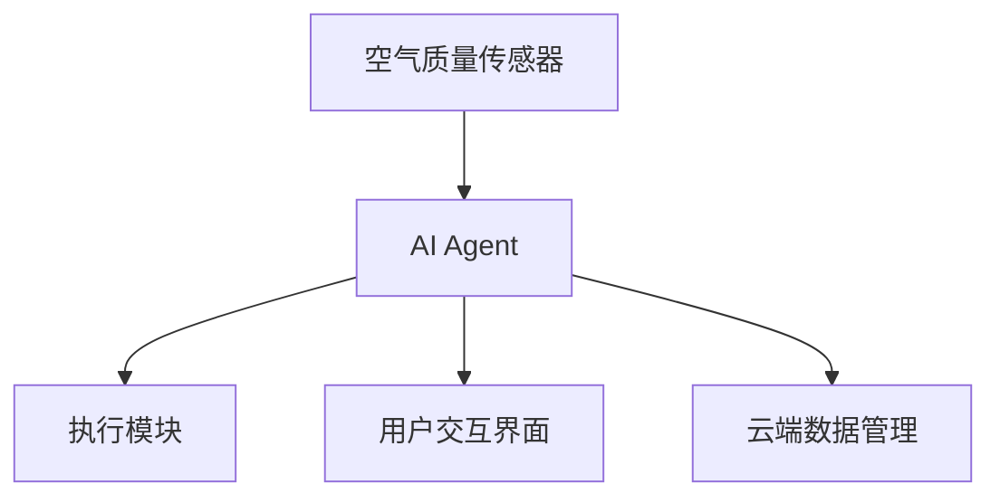
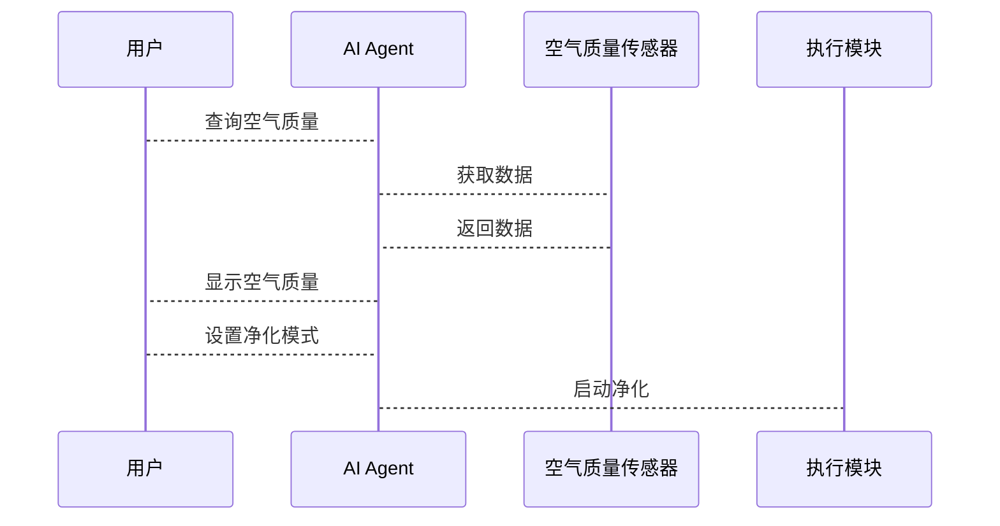

                 


# 智能花瓶：AI Agent的室内空气净化监测

> 关键词：智能花瓶, AI Agent, 室内空气净化, 传感器技术, 空气质量监测

> 摘要：本文探讨了智能花瓶作为AI Agent在室内空气净化监测中的应用。通过分析空气质量传感器、AI算法和系统架构，展示了如何利用AI技术实现智能化的空气质量监测与改善。

---

# 第1章: 智能花瓶的背景与核心概念

## 1.1 智能花瓶的定义与应用场景

### 1.1.1 智能花瓶的定义
智能花瓶是一种结合了人工智能（AI）和物联网（IoT）技术的智能家居设备，用于实时监测和改善室内空气质量。

### 1.1.2 智能花瓶的应用场景
- **家庭环境**：监测并改善家庭成员的呼吸环境。
- **办公室环境**：提升员工健康和工作效率。
- **公共场所**：如酒店、商场等，提供舒适的空气质量。

### 1.1.3 智能花瓶与传统空气净化设备的对比
- **传统设备**：被动运行，缺乏智能调节能力。
- **智能花瓶**：主动监测，智能调节，提供实时反馈。

## 1.2 室内空气净化的必要性

### 1.2.1 室内空气质量的重要性
- 室内空气污染可能导致呼吸系统疾病、过敏等问题。
- 高质量的空气环境有助于提升生活质量。

### 1.2.2 空气污染对健康的潜在威胁
- 室内污染物包括PM2.5、甲醛、TVOC等。
- 长期暴露在污染空气中可能引发严重健康问题。

### 1.2.3 智能花瓶在改善空气质量中的作用
- 实时监测空气质量。
- 智能调节净化设备，优化空气质量。

## 1.3 AI Agent的基本概念

### 1.3.1 什么是AI Agent
AI Agent（智能代理）是一种能够感知环境、自主决策并执行任务的智能实体。

### 1.3.2 AI Agent的核心功能
- **感知**：通过传感器获取环境数据。
- **决策**：基于数据进行分析和决策。
- **执行**：根据决策执行相应动作。

### 1.3.3 AI Agent在智能花瓶中的应用
- 数据采集与处理。
- 智能决策与反馈。

## 1.4 本章小结
本章介绍了智能花瓶的定义、应用场景及室内空气净化的重要性。同时，阐述了AI Agent的基本概念及其在智能花瓶中的应用。

---

# 第2章: 智能花瓶与AI Agent的核心概念

## 2.1 智能花瓶的系统架构

### 2.1.1 系统整体架构
- **传感器模块**：采集空气质量数据。
- **AI Agent模块**：分析数据并生成决策。
- **执行模块**：根据决策执行净化操作。
- **用户交互模块**：提供实时反馈和用户控制。

### 2.1.2 系统核心模块
- **传感器数据采集**：使用多种传感器监测空气质量。
- **AI算法处理**：分析数据并生成净化指令。
- **用户交互界面**：显示空气质量并接收用户指令。

### 2.1.3 系统边界与外延
- **边界**：智能花瓶内部的传感器和算法模块。
- **外延**：与外部设备（如空气净化器）的连接。

## 2.2 AI Agent的功能模块

### 2.2.1 数据采集模块
- 传感器类型：PM2.5、甲醛、TVOC传感器。
- 数据采集频率：实时采集。

### 2.2.2 数据分析模块
- 数据预处理：清洗、特征提取。
- 数据分析算法：机器学习模型。

### 2.2.3 决策与执行模块
- 决策逻辑：根据空气质量指数（AQI）决定净化强度。
- 执行动作：控制净化设备运行。

## 2.3 智能花瓶的核心要素

### 2.3.1 空气质量传感器
- 传感器类型：光学传感器、电化学传感器。
- 传感器性能：灵敏度、精度、响应时间。

### 2.3.2 AI Agent算法
- 算法选择：随机森林、支持向量机。
- 算法实现：数据训练、模型部署。

### 2.3.3 用户交互界面
- 界面设计：图形化界面、实时数据展示。
- 用户操作：手动控制、自动调节。

## 2.4 核心概念对比分析

### 2.4.1 不同传感器的对比
| 传感器类型 | 优点 | 缺点 |
|------------|------|------|
| 光学传感器 | 灵敏度高 | �易受环境干扰 |
| 电化学传感器 | 稳定性好 | 维护成本高 |

### 2.4.2 不同AI算法的对比
| 算法 | 优点 | 缺点 |
|------|------|------|
| 随机森林 | 高准确性 | 对特征工程依赖 |
| 支持向量机 | 高效分类 | 不适合高维数据 |

### 2.4.3 不同交互方式的对比
| 交互方式 | 优点 | 缺点 |
|----------|------|------|
| 图形界面 | 直观 | 学习成本高 |
| 语音交互 | 方便 | 实现复杂 |

## 2.5 本章小结
本章详细分析了智能花瓶的核心要素和AI Agent的功能模块，通过对比不同传感器和算法，为后续设计提供了参考。

---

# 第3章: AI Agent的算法原理与实现

## 3.1 数据采集与预处理

### 3.1.1 数据采集流程
- 传感器数据获取：通过I2C或UART接口采集。
- 数据存储：存储在本地或云端。

### 3.1.2 数据清洗方法
- 去除异常值：如传感器噪声。
- 数据平滑：使用滑动平均法。

### 3.1.3 数据特征提取
- 时间序列特征：最大值、最小值、平均值。
- 统计特征：标准差、方差。

## 3.2 AI Agent的算法实现

### 3.2.1 机器学习模型
- **随机森林**：用于空气质量分类。
- **支持向量机**：用于空气质量预测。

### 3.2.2 算法流程图


### 3.2.3 算法代码示例
```python
import pandas as pd
from sklearn.ensemble import RandomForestClassifier

# 数据加载
data = pd.read_csv('air_quality.csv')

# 特征与标签分离
X = data.drop('label', axis=1)
y = data['label']

# 模型训练
model = RandomForestClassifier()
model.fit(X, y)

# 预测
new_data = X.iloc[-1]
prediction = model.predict(new_data.values.reshape(1, -1))
```

## 3.3 算法原理与数学模型

### 3.3.1 随机森林算法
- **数学模型**：随机森林是基于决策树的集成算法。
- **优势**：高准确性，抗过拟合。

### 3.3.2 支持向量机算法
- **数学模型**：寻找最优超平面进行分类。
- **优势**：适用于小规模数据。

## 3.4 本章小结
本章详细讲解了AI Agent的算法原理，包括数据预处理、模型选择和实现流程。

---

# 第4章: 智能花瓶的系统分析与架构设计

## 4.1 项目介绍

### 4.1.1 项目目标
实现一个能够实时监测并改善室内空气质量的智能花瓶。

### 4.1.2 项目范围
- 传感器选择：PM2.5、甲醛传感器。
- 系统架构设计：模块化设计。

## 4.2 系统功能设计

### 4.2.1 领域模型


### 4.2.2 系统架构设计


## 4.3 系统接口设计

### 4.3.1 传感器接口
- **输入**：传感器数据。
- **输出**：空气质量指数。

### 4.3.2 用户交互接口
- **输入**：用户指令。
- **输出**：空气质量反馈。

## 4.4 系统交互流程

### 4.4.1 交互序列图


## 4.5 本章小结
本章详细描述了智能花瓶的系统架构设计和接口设计，为后续开发提供了指导。

---

# 第5章: 项目实战与案例分析

## 5.1 环境搭建

### 5.1.1 开发环境
- **硬件**：Raspberry Pi、空气质量传感器。
- **软件**：Python、机器学习库。

### 5.1.2 库的安装
```bash
pip install pandas scikit-learn
```

## 5.2 核心功能实现

### 5.2.1 数据采集模块
```python
import serial

ser = serial.Serial('COM3', 9600)
data = ser.readline().decode().strip()
print(data)
```

### 5.2.2 AI Agent算法实现
```python
def analyze_data(pm25, tvoc):
    # 数据分析逻辑
    pass

def decide_action(analyze_result):
    # 决策逻辑
    pass
```

### 5.2.3 用户交互界面
```python
def display_data(pm25, tvoc):
    print(f"PM2.5: {pm25}, TVOC: {tvoc}")
```

## 5.3 实际案例分析

### 5.3.1 案例背景
- **场景**：办公室空气质量监测。
- **数据**：PM2.5=75，TVOC=1.2。

### 5.3.2 系统响应
- **AI Agent决策**：启动净化设备。
- **用户反馈**：显示空气质量改善。

## 5.4 项目小结
本章通过实际案例展示了智能花瓶的实现过程，从环境搭建到功能实现，再到系统测试。

---

# 第6章: 总结与展望

## 6.1 本章总结
- 智能花瓶通过AI Agent实现了室内空气质量的智能化监测与改善。
- 系统架构设计合理，算法实现准确。

## 6.2 未来展望
- **传感器优化**：更高精度、更低功耗。
- **算法改进**：深度学习应用于空气质量预测。
- **扩展功能**：结合智能音箱实现语音控制。

## 6.3 最佳实践 tips
- 传感器选择：根据需求选择合适的传感器。
- 数据安全：确保数据传输加密。
- 系统维护：定期更新算法模型。

## 6.4 注意事项
- **传感器校准**：定期校准传感器以保证准确性。
- **系统兼容性**：确保与各种净化设备兼容。

---

# 作者

作者：AI天才研究院/AI Genius Institute & 禅与计算机程序设计艺术 /Zen And The Art of Computer Programming

---

以上是《智能花瓶：AI Agent的室内空气净化监测》的技术博客文章的完整目录和内容概要。如需进一步扩展或调整，请随时告知！

