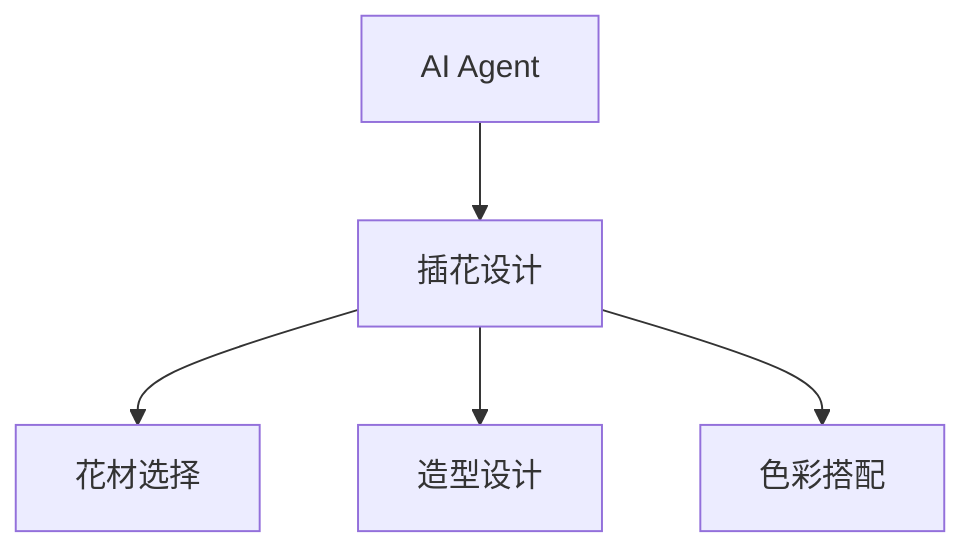
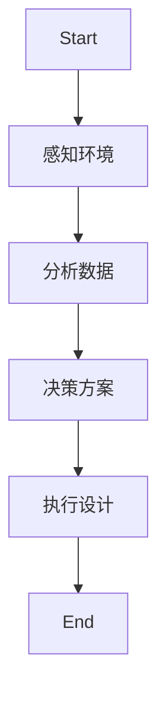
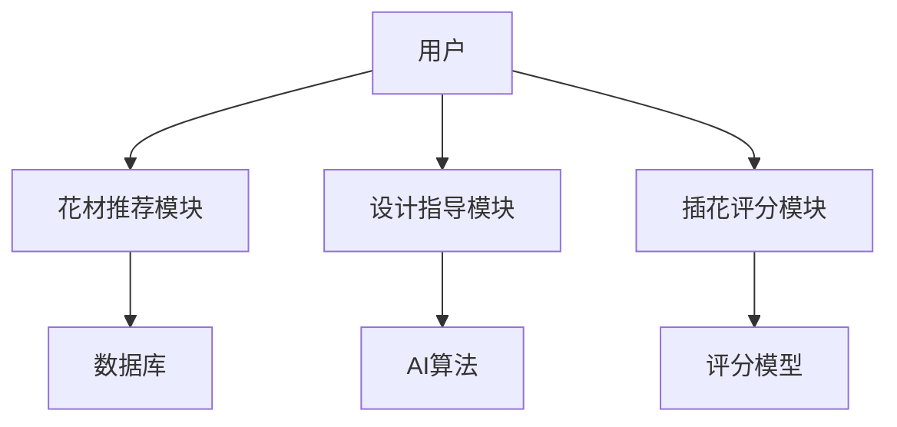

                 


# 智能花瓶：AI Agent的插花艺术指导

---

## 关键词

AI Agent, 插花艺术, 智能设计, 数字化趋势, 个性化推荐

---

## 摘要

本文探讨了AI Agent在插花艺术中的应用，分析了其如何通过感知、决策和执行能力优化插花设计，提供了基于层次分析法的插花评分系统，并设计了AI插花助手的系统架构。文章结合理论与实践，展示了AI技术如何赋能传统插花艺术。

---

# 第一部分: AI Agent与插花艺术的背景介绍

## 第1章: AI Agent与插花艺术的结合

### 1.1 AI Agent的基本概念

#### 1.1.1 什么是AI Agent
AI Agent（人工智能代理）是能够感知环境、做出决策并执行动作的智能实体。它通过传感器获取信息，利用算法处理数据，执行目标设定的操作。

#### 1.1.2 AI Agent的核心特点
- **自主性**：无需外部干预，自主完成任务。
- **反应性**：实时感知环境变化并做出响应。
- **目标导向性**：基于目标驱动行为。
- **学习能力**：通过数据训练不断提升性能。

#### 1.1.3 AI Agent与传统插花艺术的结合
AI Agent可以辅助插花设计师进行花材选择、搭配建议和设计优化，提升插花艺术的创作效率和个性化体验。

---

### 1.2 插花艺术的背景与现状

#### 1.2.1 插花艺术的历史与发展
插花艺术起源于古代，经历了从宗教仪式到生活装饰的演变，现代插花艺术注重自然美和艺术性。

#### 1.2.2 当代插花艺术的特点
- **多样性**：涵盖各种风格，如东方式、西方式和自然式。
- **个性化**：注重设计师的独特表达。
- **技术驱动**：数字化工具的应用日益广泛。

#### 1.2.3 插花艺术的数字化趋势
随着科技发展，插花艺术逐渐融入数字化工具，AI技术的应用为插花艺术注入新活力。

---

## 第2章: AI Agent在插花艺术中的应用背景

### 2.1 插花艺术中的问题与挑战

#### 2.1.1 插花设计的复杂性
插花设计需要考虑花材选择、色彩搭配、造型设计等多个因素，过程复杂且耗时。

#### 2.1.2 学习插花艺术的门槛
插花艺术的学习需要时间和实践，初学者往往难以掌握专业技巧。

#### 2.1.3 插花艺术的个性化需求
消费者对插花作品的个性化需求日益增长，传统方式难以快速满足多样化的定制需求。

---

### 2.2 AI Agent如何解决插花艺术中的问题

#### 2.2.1 提供个性化设计建议
AI Agent可以根据用户喜好推荐花材搭配，生成个性化设计方案。

#### 2.2.2 实现快速学习与模仿
通过机器学习技术，AI Agent可以快速模仿优秀插花设计，辅助设计师快速生成灵感。

#### 2.2.3 优化插花组合与搭配
AI Agent可以优化花材组合，确保色彩协调、造型美观，提升作品的艺术价值。

---

### 2.3 AI Agent在插花艺术中的边界与外延

#### 2.3.1 插花艺术的数字化边界
AI Agent的应用主要集中在设计和搭配建议，实际插花制作仍需人类完成。

#### 2.3.2 AI Agent的局限性
目前AI Agent无法完全取代人类的创造力，对复杂情感和文化内涵的理解仍有限。

#### 2.3.3 插花艺术与AI Agent的未来发展
未来，AI Agent可能在插花教育、设计工具开发等领域发挥更大作用。

---

# 第二部分: AI Agent的核心概念与插花艺术的关系

## 第3章: AI Agent的核心原理与插花艺术的结合

### 3.1 AI Agent的核心原理

#### 3.1.1 感知与数据采集
AI Agent通过摄像头、传感器等设备采集插花环境和花材信息。

#### 3.1.2 决策与推理
利用机器学习模型分析数据，生成插花设计方案。

#### 3.1.3 执行与反馈
通过显示屏或APP展示设计结果，并根据用户反馈调整方案。

---

### 3.2 插花艺术的核心要素

#### 3.2.1 花材选择与搭配
AI Agent基于花材属性和用户偏好推荐搭配方案。

#### 3.2.2 插花造型与构图
AI Agent提供多种造型建议，优化空间布局。

#### 3.2.3 插花的色彩搭配
AI Agent利用色彩理论，推荐和谐的配色方案。

---

### 3.3 AI Agent与插花艺术的实体关系图



---

## 第4章: AI Agent在插花设计中的应用分析

### 4.1 AI Agent的插花设计算法

#### 4.1.1 算法流程图



#### 4.1.2 算法实现代码

```python
def插花设计算法(花材, 颜色, 造型):
    # 数据预处理
    preprocess(花材, 颜色, 造型)
    
    # 决策模型
    model = load_model("插花设计模型")
    设计方案 = model.predict(花材, 颜色, 造型)
    
    return 设计方案
```

#### 4.1.3 数学模型与公式

插花评分公式：
$$ \text{评分} = \sum_{i=1}^{n} w_i \cdot x_i $$
其中，$w_i$ 是第i个因素的权重，$x_i$ 是对应的属性值。

---

## 第5章: AI Agent的插花艺术系统设计

### 5.1 系统功能设计

#### 5.1.1 用户需求分析
用户需求包括花材推荐、设计指导、插花评分等。

#### 5.1.2 系统功能模块
- **花材推荐模块**
- **设计指导模块**
- **插花评分模块**

#### 5.1.3 系统架构设计



---

## 第6章: 项目实战与总结

### 6.1 环境安装与代码实现

#### 6.1.1 环境安装
安装Python、TensorFlow、Pillow等库。

#### 6.1.2 核心代码实现

```python
def插花评分系统(花材, 颜色, 造型):
    # 数据预处理
    preprocess(花材, 颜色, 造型)
    
    # 评分计算
    评分 = calculate_score(花材, 颜色, 造型)
    
    return 评分
```

---

### 6.2 项目总结与展望

#### 6.2.1 项目总结
本文通过理论分析和项目实战，展示了AI Agent在插花艺术中的应用潜力。

#### 6.2.2 未来展望
未来，AI Agent可能在插花教育和个性化定制领域发挥更大作用。

---

## 第三部分: 总结与展望

### 7.1 最佳实践 tips

- **数据质量**：确保输入数据的准确性和完整性。
- **模型优化**：定期更新模型，提升推荐精准度。
- **用户体验**：设计简洁直观的交互界面。

### 7.2 小结

本文全面探讨了AI Agent在插花艺术中的应用，从理论到实践，展示了AI技术如何赋能传统艺术。

### 7.3 注意事项

- AI Agent无法完全取代人类设计师的创造力。
- 数据隐私和安全问题需谨慎处理。

### 7.4 拓展阅读

- 推荐阅读《机器学习在艺术设计中的应用》和《AI在个性化设计中的创新实践》。

---

## 作者

作者：AI天才研究院/AI Genius Institute & 禅与计算机程序设计艺术 /Zen And The Art of Computer Programming

