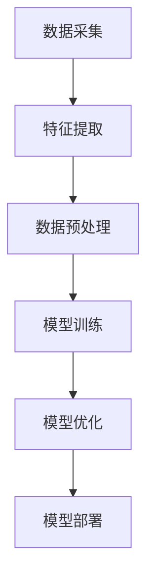
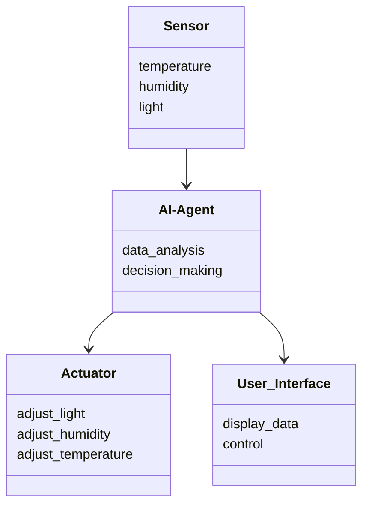

                 


# 智能花盆：AI Agent的植物生长优化管理器

> 关键词：智能花盆, AI Agent, 植物生长优化, 物联网, 环境监测, 数据驱动优化, 智能农业

> 摘要：本文详细探讨了智能花盆的设计与实现，结合AI Agent和物联网技术，优化植物生长管理。通过系统架构设计、算法原理分析、项目实战等多方面展开，深入阐述了如何利用AI技术实现植物生长的智能化管理。文章还提供了丰富的图表和代码示例，帮助读者理解并实践智能花盆的设计。

---

# 第一部分: 智能花盆的背景与核心概念

# 第1章: 智能花盆的背景与问题背景

## 1.1 智能花盆的背景介绍

### 1.1.1 智能家居与物联网的发展

智能家居和物联网技术的快速发展为现代生活带来了诸多便利。随着人们对生活质量要求的提高，智能设备逐渐渗透到家庭生活的方方面面，包括植物种植管理。物联网技术的普及使得智能花盆能够通过传感器实时监测植物的生长环境，并通过云端数据处理和AI算法优化植物的生长条件。

### 1.1.2 植物种植与农业智能化的趋势

传统农业种植依赖人工经验，存在效率低、资源浪费和管理不精细等问题。随着科技的进步，农业智能化成为趋势。通过智能花盆等设备，可以实现对植物生长环境的精准控制，提高种植效率，减少资源浪费。

### 1.1.3 AI技术在农业管理中的应用

AI技术在农业管理中的应用越来越广泛。AI Agent（智能体）能够通过数据分析和机器学习模型，优化植物的生长条件。例如，AI Agent可以根据环境数据和植物生长周期，自动调整光照、温度、湿度等参数，实现精准管理。

## 1.2 植物生长优化管理的问题背景

### 1.2.1 传统植物种植管理的痛点

传统种植管理存在以下痛点：
1. **人工依赖**：需要大量人工经验，效率低下。
2. **环境不稳定**：缺乏实时监测和自动调节能力。
3. **资源浪费**：水肥等资源使用不均匀，造成浪费。
4. **数据孤岛**：缺乏统一的数据采集和分析系统。

### 1.2.2 智能化管理的需求与挑战

智能化管理的需求：
1. **提高种植效率**：通过自动化管理，减少人工干预。
2. **精准控制环境**：实时监测并调整生长环境参数。
3. **资源优化利用**：通过数据驱动优化水肥使用。

智能化管理的挑战：
1. **技术实现难度**：需要结合物联网、AI算法和自动化控制技术。
2. **数据处理复杂性**：需要处理多源异构数据，并建立高效的分析模型。
3. **系统稳定性**：需要确保系统的可靠性和实时性。

### 1.2.3 AI Agent在植物管理中的作用

AI Agent在植物管理中的作用：
1. **实时感知**：通过传感器实时感知植物生长环境。
2. **数据处理**：分析环境数据，预测植物生长状态。
3. **决策优化**：基于数据分析结果，优化生长条件。
4. **自动控制**：通过执行器自动调整环境参数。

## 1.3 智能花盆的核心目标与边界

### 1.3.1 智能花盆的核心目标

智能花盆的核心目标是通过AI Agent和物联网技术，实现对植物生长环境的精准控制，优化植物生长条件，提高种植效率。

### 1.3.2 系统的边界与外延

系统的边界：
1. **数据采集范围**：仅限于植物生长环境的传感器数据。
2. **控制范围**：仅限于花盆内部的环境参数调整。
3. **用户交互**：仅限于移动端或PC端的简单操作。

系统的外延：
1. **扩展性**：可以扩展到更大规模的农业种植。
2. **集成性**：可以与其他智能家居设备集成。

### 1.3.3 核心要素与功能组成

智能花盆的核心要素：
1. **传感器**：用于采集环境数据。
2. **AI Agent**：用于数据分析和决策。
3. **执行器**：用于环境参数调整。
4. **通信网络**：用于数据传输和云端处理。

## 1.4 本章小结

本章介绍了智能花盆的背景，分析了传统种植管理的痛点，阐述了AI Agent在植物管理中的作用，并明确了系统的边界和核心要素。

---

# 第二部分: AI Agent与物联网的核心概念

# 第2章: AI Agent的基本原理与实现

## 2.1 AI Agent的核心概念

### 2.1.1 AI Agent的定义与特点

AI Agent（智能体）是一种能够感知环境、自主决策并执行任务的智能系统。其特点包括：
1. **自主性**：能够在没有外部干预的情况下自主运行。
2. **反应性**：能够实时感知环境并做出反应。
3. **学习性**：能够通过数据学习和优化决策模型。

### 2.1.2 AI Agent的分类与应用场景

AI Agent的分类：
1. **简单反射型**：基于规则的简单反应。
2. **基于模型的反应型**：基于环境模型进行决策。
3. **目标驱动型**：基于目标进行规划和决策。
4. **实用驱动型**：基于效用函数进行优化决策。

应用场景：
1. **智能花盆**：优化植物生长环境。
2. **智能家居**：自动化控制家庭设备。
3. **自动驾驶**：实时感知和决策。

### 2.1.3 AI Agent与传统自动化的区别

AI Agent与传统自动化的区别：
1. **决策能力**：AI Agent具备自主决策能力，而传统自动化依赖预设规则。
2. **学习能力**：AI Agent能够通过数据学习优化决策模型，而传统自动化无法。
3. **适应性**：AI Agent能够适应复杂多变的环境，而传统自动化适应性较弱。

## 2.2 物联网技术在智能花盆中的应用

### 2.2.1 物联网的基本概念与技术架构

物联网的基本概念：
物联网（IoT）是指通过各种信息传感设备，按照约定的协议，把任何物品与互联网连接起来，进行信息交换和通信，以实现智能化识别、定位、跟踪、监控和管理。

物联网技术架构：
1. **感知层**：通过传感器采集数据。
2. **网络层**：通过通信网络传输数据。
3. **应用层**：通过数据处理和应用系统实现智能化管理。

### 2.2.2 智能花盆中的物联网组件

智能花盆中的物联网组件：
1. **传感器**：用于采集环境数据，如温度、湿度、光照等。
2. **通信模块**：用于数据的上传和下载，如Wi-Fi或蓝牙模块。
3. **云端平台**：用于存储和处理数据，提供数据可视化和决策支持。

### 2.2.3 物联网与AI的结合

物联网与AI的结合：
1. **数据采集**：物联网设备采集环境数据。
2. **数据处理**：AI Agent分析数据，优化决策。
3. **执行控制**：物联网设备执行AI Agent的决策。

## 2.3 AI Agent与物联网的实体关系图

```mermaid
er
actor(AI Agent)
actor(物联网设备)
actor(用户)
rectangle(智能花盆系统)
rectangle(数据存储)
rectangle(通信网络)
rectangle(传感器)
rectangle(执行器)
```

## 2.4 本章小结

本章详细介绍了AI Agent的核心概念和物联网技术在智能花盆中的应用，通过实体关系图展示了系统的组成和交互关系。

---

# 第三部分: 算法原理与数学模型

# 第3章: 智能花盆的算法原理

## 3.1 算法原理概述

### 3.1.1 数据采集与特征提取

数据采集：
通过传感器采集植物生长环境数据，如温度、湿度、光照强度等。

特征提取：
对采集到的数据进行特征提取，例如平均温度、最大光照强度等。

### 3.1.2 数据预处理与模型训练

数据预处理：
1. 数据清洗：去除异常值和缺失值。
2. 数据归一化：将数据标准化，便于模型训练。

模型训练：
使用机器学习算法，如线性回归、随机森林等，训练植物生长预测模型。

### 3.1.3 模型部署与优化

模型部署：
将训练好的模型部署到智能花盆系统中，实时预测植物生长状态。

模型优化：
通过不断收集新数据，优化模型，提高预测准确率。

## 3.2 算法流程图



## 3.3 机器学习模型的数学公式

### 3.3.1 线性回归模型

线性回归模型用于预测植物生长状态，数学公式如下：
$$ y = \beta_0 + \beta_1x + \epsilon $$
其中：
- \( y \) 是预测值
- \( \beta_0 \) 是截距
- \( \beta_1 \) 是回归系数
- \( x \) 是自变量
- \( \epsilon \) 是误差项

### 3.3.2 神经网络模型

神经网络模型用于复杂环境数据的分类，数学公式如下：
$$ y = \sigma(w_1x_1 + w_2x_2 + \dots + w_nx_n + b) $$
其中：
- \( y \) 是输出值
- \( x_i \) 是输入特征
- \( w_i \) 是权重
- \( b \) 是偏置
- \( \sigma \) 是激活函数

---

# 第四部分: 系统分析与架构设计

# 第4章: 智能花盆系统架构设计

## 4.1 问题场景介绍

智能花盆系统需要解决以下问题：
1. 如何实时监测植物生长环境？
2. 如何优化植物生长条件？
3. 如何实现智能化管理？

## 4.2 项目介绍

智能花盆项目的目标是通过AI Agent和物联网技术，实现对植物生长环境的精准控制，优化植物生长条件，提高种植效率。

## 4.3 系统功能设计

### 4.3.1 领域模型

智能花盆的领域模型包括以下组件：
1. **传感器**：采集环境数据。
2. **AI Agent**：分析数据，优化决策。
3. **执行器**：调整环境参数。
4. **用户界面**：展示数据和控制界面。

### 4.3.2 系统架构图



## 4.4 系统架构设计

### 4.4.1 系统架构图


### 4.4.2 系统接口设计

系统接口设计：
1. **传感器接口**：提供环境数据接口。
2. **AI Agent接口**：提供数据处理和决策接口。
3. **执行器接口**：提供环境参数调整接口。
4. **用户界面接口**：提供数据展示和控制接口。

### 4.4.3 系统交互流程

系统交互流程：
1. 传感器采集环境数据。
2. AI Agent接收数据，分析并做出决策。
3. AI Agent通过执行器调整环境参数。
4. 用户通过界面查看数据和控制系统。

---

# 第五部分: 项目实战

# 第5章: 智能花盆项目实战

## 5.1 环境安装

### 5.1.1 系统环境要求

系统环境要求：
1. **操作系统**：Linux或Windows。
2. **Python版本**：3.6以上。
3. **依赖库**：numpy、pandas、scikit-learn、matplotlib。

### 5.1.2 安装步骤

安装步骤：
1. 安装Python环境。
2. 安装依赖库：`pip install numpy pandas scikit-learn matplotlib`

## 5.2 核心代码实现

### 5.2.1 数据采集与处理代码

```python
import numpy as np
import pandas as pd

# 读取数据
data = pd.read_csv('plant_data.csv')

# 数据清洗
data.dropna(inplace=True)
data = data[~data['temperature'].isnull()]
```

### 5.2.2 AI Agent实现代码

```python
from sklearn.linear_model import LinearRegression

# 训练模型
model = LinearRegression()
model.fit(X_train, y_train)

# 预测
y_pred = model.predict(X_test)
```

### 5.2.3 系统交互代码

```python
import serial

# 与传感器通信
ser = serial.Serial('COM3', 9600)
ser.write(b'fetch_data\r\n')
data = ser.readline().decode()
```

## 5.3 案例分析与详细解读

### 5.3.1 数据分析案例

数据分析案例：
通过传感器数据，分析不同光照条件下植物的生长情况，优化光照强度。

### 5.3.2 代码实现案例

代码实现案例：
通过AI Agent实现植物生长状态的实时监测和环境参数的自动调整。

---

# 第六部分: 数学模型与公式

## 6.1 线性回归模型的数学推导

线性回归模型的数学推导：
$$ y = \beta_0 + \beta_1x + \epsilon $$

最小二乘法求解：
$$ \hat{\beta_1} = \frac{\sum (x_i - \bar{x})(y_i - \bar{y})}{\sum (x_i - \bar{x})^2} $$
$$ \hat{\beta_0} = \bar{y} - \hat{\beta_1}\bar{x} $$

---

# 第七部分: 项目总结与展望

## 7.1 项目总结

智能花盆项目通过AI Agent和物联网技术，实现了植物生长环境的精准控制，提高了种植效率。系统架构设计合理，算法实现高效，具有良好的扩展性和实用性。

## 7.2 项目展望

未来展望：
1. **深度学习模型**：引入深度学习模型，提高预测准确率。
2. **传感器网络优化**：优化传感器布局，提高数据采集精度。
3. **系统集成**：与其他智能家居设备集成，实现家庭种植自动化。

---

# 作者：AI天才研究院 & 禅与计算机程序设计艺术

