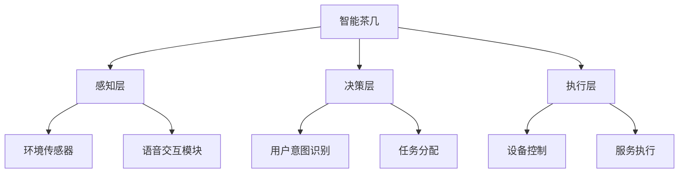

                 


# 智能茶几：AI Agent的客厅使用模式分析

## 关键词：智能茶几, AI Agent, 客厅使用模式, 智能家居, 用户行为分析

## 摘要：  
本文深入分析了智能茶几作为AI Agent在客厅环境中的使用模式，探讨了其设计原理、系统架构、用户行为分析及实际应用场景。通过结合技术背景、核心概念、算法原理和系统设计，本文为读者提供了全面的视角，展示了AI Agent在智能家居中的潜力与挑战。

---

## 第一部分：引言

### 第1章：引言

#### 1.1 智能茶几的概念与背景
- **智能茶几的定义**：智能茶几是一种集成AI技术的家具，具备环境感知、用户意图识别和执行功能的能力，能够为用户提供智能化的服务。
- **AI Agent的基本概念**：AI Agent是一种智能代理，能够感知环境、理解用户需求并执行任务，实现人与设备的高效交互。
- **发展背景**：随着智能家居的普及，客厅成为AI Agent的重要应用场景，智能茶几作为核心设备，承载了人机交互的重要功能。

#### 1.2 研究意义与目标
- **研究意义**：智能茶几的使用模式研究为智能家居的未来发展提供了重要参考，推动了AI技术在家庭场景中的应用。
- **研究目标**：分析智能茶几的设计原理、功能实现、用户行为模式及实际应用效果，提出改进建议。

---

## 第二部分：背景分析

### 第2章：AI Agent的基本概念与技术背景

#### 2.1 AI Agent的定义与特点
- **定义**：AI Agent是一种能够感知环境、自主决策并执行任务的智能体。
- **特点**：具备学习能力、自适应性、多设备协同能力。

#### 2.2 智能茶几的发展历程
- **初期阶段**：简单的智能家居设备，不具备AI功能。
- **发展阶段**：集成AI技术，具备基本的语音交互功能。
- **成熟阶段**：具备环境感知、多设备协同和个性化服务的能力。

#### 2.3 客厅场景下的应用需求
- **环境感知**：识别客厅环境中的物体、人物位置。
- **用户需求分析**：理解用户的意图，提供个性化服务。
- **多设备协同**：与智能电视、音箱等设备协同工作，实现场景联动。

---

## 第三部分：核心概念与原理

### 第3章：智能茶几的体系结构

#### 3.1 系统体系结构


#### 3.2 AI Agent的核心功能
- **环境感知**：通过传感器和摄像头获取环境信息。
- **用户意图识别**：通过语音识别和自然语言处理技术理解用户需求。
- **多设备协同**：与智能家居设备联动，实现场景化服务。

#### 3.3 设计原则
- **以用户为中心**：设计以用户体验为核心，确保交互的便捷性。
- **智能化**：通过AI技术实现自主学习和优化。
- **易用性**：界面简洁，操作直观。
- **扩展性**：支持未来功能的扩展和升级。

---

## 第四部分：系统架构与设计

### 第4章：系统架构设计

#### 4.1 系统架构图


#### 4.2 功能模块设计
- **设备连接与控制**：通过蓝牙、Wi-Fi等技术实现与智能家居设备的连接。
- **用户行为分析**：通过数据分析挖掘用户的使用习惯和偏好。
- **多设备协同**：实现设备间的联动，提供场景化的服务。
- **个性化服务**：根据用户需求提供定制化的服务。

---

## 第五部分：项目实战

### 第5章：智能茶几的实现

#### 5.1 环境搭建
- **硬件选择**：选用支持AI功能的传感器和芯片。
- **软件开发**：基于Python的AI框架进行开发。

#### 5.2 核心代码实现
```python
# 智能茶几的核心代码示例
import speech_recognition as sr
import serial

# 初始化语音识别器
r = sr.Recognizer()
mic = sr.Microphone()

# 初始化设备连接
ser = serial.Serial('COM3', 9600)

def main():
    while True:
        # 语音识别
        with mic as source:
            audio = r.listen(source)
            try:
                # 识别语音命令
                command = r.recognize_google(audio)
                print("识别到命令：", command)
                
                # 根据命令执行操作
                if "播放音乐" in command:
                    ser.write(b'play music\r\n')
                elif "调节亮度" in command:
                    ser.write(b'adjust brightness\r\n')
                # 其他命令处理
            except Exception as e:
                print("识别失败：", str(e))
                
if __name__ == "__main__":
    main()
```

#### 5.3 功能实现与案例分析
- **功能实现**：通过代码实现语音识别、设备控制和用户意图识别。
- **案例分析**：分析用户在不同场景下的使用情况，优化系统功能。

---

## 第六部分：用户行为分析

### 第6章：用户行为分析与需求挖掘

#### 6.1 用户行为分析
- **用户使用习惯**：分析用户在不同时间的使用频率和偏好。
- **用户画像**：根据数据建立用户画像，识别不同用户群体的需求。

#### 6.2 数据分析与挖掘
- **数据收集**：通过日志记录用户的交互行为。
- **数据可视化**：使用图表展示用户行为模式。

---

## 第七部分：案例分析

### 第7章：智能茶几的客厅使用案例

#### 7.1 案例背景
- **场景描述**：用户在客厅使用智能茶几，通过语音指令控制设备。

#### 7.2 系统设计与实现
- **系统设计**：基于用户需求，设计智能茶几的功能模块。
- **实际应用**：展示智能茶几在实际场景中的应用效果。

#### 7.3 优缺点分析
- **优点**：便捷性、智能化、个性化服务。
- **缺点**：设备兼容性、隐私问题、用户体验优化空间。

---

## 第八部分：未来趋势

### 第8章：智能茶几的未来发展趋势

#### 8.1 技术进步
- **AI算法优化**：深度学习技术的进一步应用。
- **设备协同增强**：多设备联动的智能化提升。

#### 8.2 用户需求变化
- **个性化服务**：用户对定制化服务的需求增加。
- **便捷性要求**：用户期望更简单、直观的交互方式。

#### 8.3 挑战与机遇
- **挑战**：隐私安全、设备兼容性、用户体验优化。
- **机遇**：技术进步带来的市场扩展和功能创新。

---

## 第九部分：总结与展望

### 第9章：总结与展望

#### 9.1 总结
- 智能茶几作为AI Agent在客厅中的应用模式，展现了智能家居的无限潜力。
- 通过系统的分析和实践，我们掌握了智能茶几的设计原理和实现方法。

#### 9.2 展望
- 随着AI技术的进步，智能茶几的功能将更加智能化和个性化。
- 智能家居的普及将推动智能茶几在客厅中的广泛应用。

---

## 作者：AI天才研究院（AI Genius Institute） & 禅与计算机程序设计艺术（Zen And The Art of Computer Programming）

---

### 相关技术博客推荐
1. [智能家居的未来发展趋势](https://example.com/smart-home-trend)
2. [AI Agent在家庭场景中的应用](https://example.com/ai-agent-home-applications)
3. [智能茶几的设计与实现](https://example.com/smart-table-design)

---

### 注意事项
- 智能茶几的设计需要考虑设备的兼容性和用户的隐私问题。
- 在实际应用中，建议先进行小范围测试，确保系统稳定性和用户体验。

---

### 拓展阅读
- 推荐阅读《人工智能：一种现代的方法》（Russell & Norvig），深入理解AI Agent的基本原理。
- 关注智能家居领域的最新动态，了解新技术和新产品的发布。

---

通过本文的详细分析，我们对智能茶几的AI Agent使用模式有了全面的理解。希望本文能为读者提供有价值的参考，推动智能家居技术的进一步发展。

