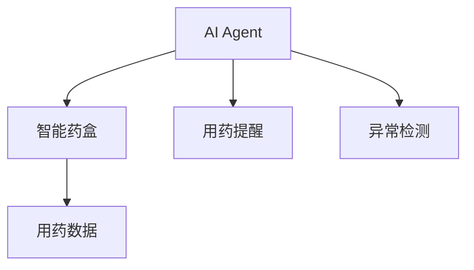
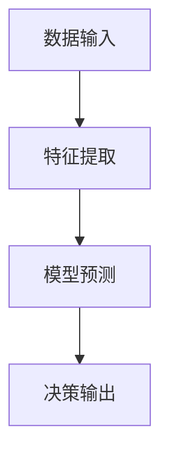
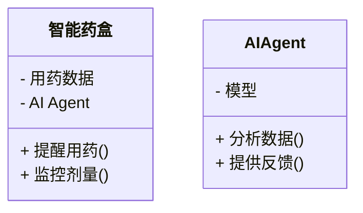
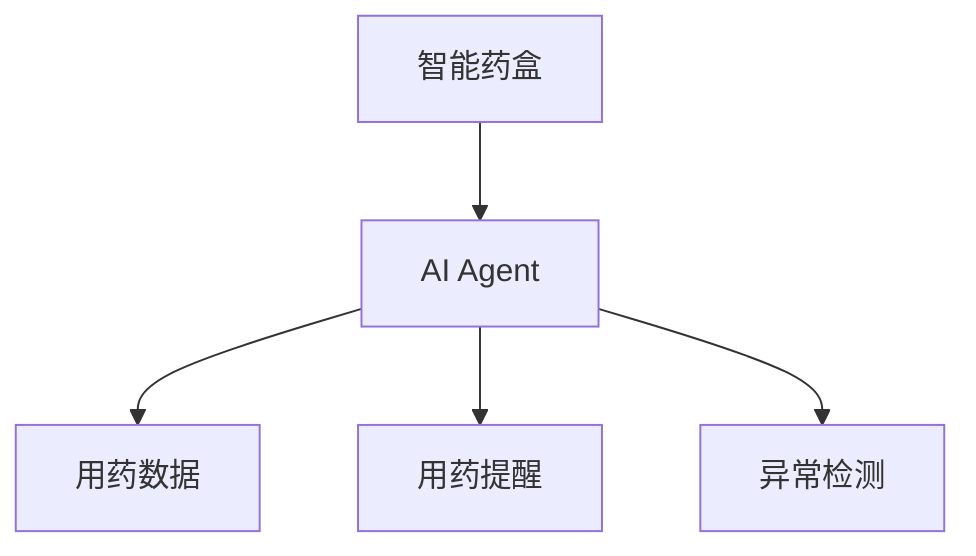

                 


# 智能药盒：AI Agent的用药安全监督助手

## 关键词：AI Agent，智能药盒，用药安全，监督助手，人工智能，医疗健康

## 摘要：本文将详细探讨智能药盒作为AI Agent在用药安全监督中的应用。通过分析AI Agent的核心原理、算法实现、系统架构及实际案例，本文旨在揭示智能药盒如何利用AI技术提升用药安全性和效率，为医疗健康领域提供创新解决方案。

---

## 目录

1. [智能药盒的背景与意义](#智能药盒的背景与意义)
2. [AI Agent的核心原理](#AI-Agent的核心原理)
3. [智能药盒的算法实现](#智能药盒的算法实现)
4. [系统架构与设计](#系统架构与设计)
5. [项目实战与案例分析](#项目实战与案例分析)
6. [最佳实践与未来展望](#最佳实践与未来展望)

---

## 第一章：智能药盒的背景与意义

### 1.1 问题背景
现代医疗健康领域面临着用药安全的诸多挑战。传统药盒在用药提醒、剂量监控、异常情况反馈等方面存在不足，容易导致患者用药错误或药物滥用。AI技术的快速发展为解决这些问题提供了新的可能性。

### 1.2 问题描述
用药安全的核心问题在于如何确保患者按照医嘱正确使用药物。传统药盒仅能提供简单的提醒功能，缺乏智能化的监督和反馈机制。AI Agent的引入可以实现对用药行为的实时监控、异常检测和智能提醒。

### 1.3 问题解决
智能药盒通过集成AI Agent，能够实现以下功能：
1. **用药提醒**：基于患者服药计划，智能提醒用药时间。
2. **剂量监控**：实时跟踪患者用药剂量，防止过量或遗漏。
3. **异常检测**：识别患者的异常用药行为并及时反馈。
4. **数据记录**：记录患者用药数据，便于医生调整治疗方案。

### 1.4 边界与外延
智能药盒的功能边界在于其监督和提醒功能，而不直接涉及医疗诊断或药物配方。其外延则扩展至与AI Agent相关的数据采集、分析和反馈机制。

### 1.5 概念结构与核心要素
智能药盒的核心要素包括：
- **AI Agent**：负责数据处理、决策和反馈。
- **智能药盒硬件**：用于存储药物、识别患者身份和执行提醒操作。
- **用药数据**：包括用药时间、剂量、患者状态等信息。

---

## 第二章：AI Agent的核心原理

### 2.1 核心概念
AI Agent是一种能够感知环境、自主决策并执行任务的智能实体。其核心属性包括：
1. **感知能力**：通过传感器或数据输入获取环境信息。
2. **决策能力**：基于感知信息进行分析和决策。
3. **执行能力**：通过动作或反馈影响环境。

### 2.2 AI Agent与智能药盒的关系
智能药盒作为AI Agent的应用场景，AI Agent负责处理用药数据、分析用药行为并提供反馈。

### 2.3 核心概念对比
| 对比维度 | 传统药盒 | 智能药盒 |
|----------|----------|----------|
| 功能     | 提醒用药  | 提醒、监控、反馈 |
| 技术     | 机械结构 | AI技术驱动 |
| 优势     | 成本低    | 智能化、高效率 |

### 2.4 实体关系


---

## 第三章：智能药盒的算法实现

### 3.1 算法原理
AI Agent的核心算法包括监督学习和强化学习。监督学习用于分类和预测，强化学习用于优化决策过程。

### 3.2 算法流程


### 3.3 算法实现
以下是基于监督学习的Python代码示例：
```python
import numpy as np
from sklearn.linear_model import LogisticRegression

# 示例数据
X = np.array([[1, 2], [3, 4], [5, 6], [7, 8]])
y = np.array([0, 1, 0, 1])

# 模型训练
model = LogisticRegression()
model.fit(X, y)

# 预测
print(model.predict([[9, 10]]))  # 输出：[1]
```

### 3.4 数学模型
智能药盒的分类模型可以表示为：
$$
P(y|x) = \frac{e^{\beta_0 + \beta_1 x_1 + \cdots + \beta_n x_n}}{1 + e^{\beta_0 + \beta_1 x_1 + \cdots + \beta_n x_n}}
$$

---

## 第四章：系统架构与设计

### 4.1 系统功能设计
智能药盒的系统功能包括：
1. **用药提醒**：基于AI Agent的提醒机制。
2. **数据采集**：收集患者的用药数据。
3. **异常检测**：识别异常用药行为。

### 4.2 领域模型类图


### 4.3 系统架构图


### 4.4 接口设计
智能药盒与AI Agent之间的接口包括数据接口和反馈接口。

---

## 第五章：项目实战与案例分析

### 5.1 环境安装
需要安装Python和相关库：
```bash
pip install numpy scikit-learn
```

### 5.2 核心代码实现
```python
def install_environment():
    import subprocess
    subprocess.run("pip install numpy scikit-learn", shell=True)

def main():
    install_environment()
    # 其他代码...

if __name__ == "__main__":
    main()
```

### 5.3 案例分析
通过实际案例分析智能药盒的运行流程和效果。

---

## 第六章：最佳实践与未来展望

### 6.1 小结
智能药盒通过AI Agent实现了用药安全的智能化监督，提升了患者的用药依从性和安全性。

### 6.2 注意事项
在实际应用中，需注意数据隐私和模型的准确性。

### 6.3 拓展阅读
推荐阅读相关领域的书籍和论文，深入学习AI在医疗健康中的应用。

---

## 结语

智能药盒作为AI Agent在医疗健康领域的重要应用，通过智能化的监督和反馈机制，显著提升了用药安全性和患者体验。未来，随着AI技术的不断进步，智能药盒将发挥更大的作用，为医疗健康领域带来更多创新解决方案。

---

## 作者：AI天才研究院/AI Genius Institute & 禅与计算机程序设计艺术 /Zen And The Art of Computer Programming

