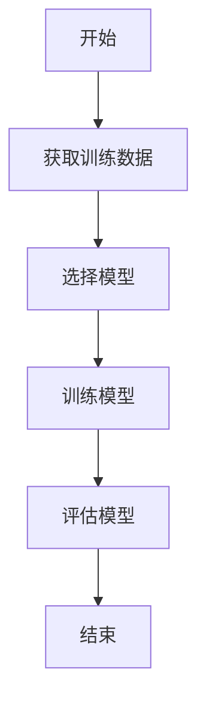
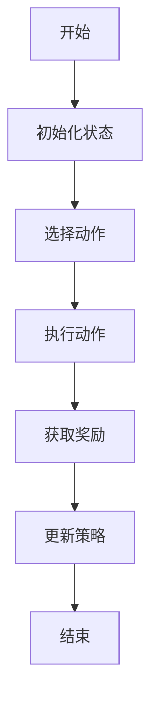
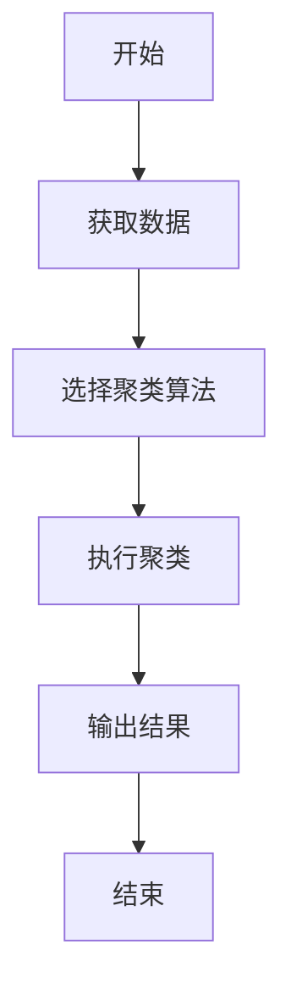

                 


# 智能药盒：AI Agent的用药提醒与管理系统

> 关键词：智能药盒，AI Agent，用药提醒，用药管理系统，人工智能，智能医疗，系统架构

> 摘要：本文深入探讨了AI Agent在智能药盒中的应用，详细分析了用药提醒与管理系统的系统设计、算法原理、数学模型和实际应用场景。通过结合AI Agent的核心算法和系统架构设计，本文为智能药盒的开发提供了理论基础和实践指导。

---

## 第一部分：背景介绍

### 第1章：智能药盒的背景与问题背景

#### 1.1 问题背景

##### 1.1.1 传统用药提醒系统的局限性
传统用药提醒系统主要依赖于简单的定时提醒功能，无法满足个性化需求。例如：
- 病人忘记服药时，系统无法主动干预。
- 病人的用药时间、剂量、药品种类等信息无法动态调整。
- 医护人员无法实时监控病人的用药情况。

##### 1.1.2 智能药盒的出现与需求
智能药盒的出现，是为了弥补传统用药提醒系统的不足。它通过结合AI Agent技术，实现了智能化的用药管理。智能药盒的核心需求包括：
- 提供个性化的用药提醒服务。
- 实现实时监控病人的用药情况。
- 支持与医院、医生的信息交互。

##### 1.1.3 AI Agent在智能药盒中的作用
AI Agent（智能代理）是一种能够感知环境、自主决策并执行任务的智能体。在智能药盒中，AI Agent主要用于：
- 根据病人的用药记录和健康数据，动态调整用药提醒计划。
- 分析病人的用药行为，发现异常情况并及时反馈。
- 与医生、护士等其他系统进行信息交互。

#### 1.2 问题描述

##### 1.2.1 病人用药提醒的痛点
- 病人容易忘记服药，导致病情反复。
- 不同病人的用药时间、剂量、药品种类差异大，传统系统难以个性化处理。
- 病人用药行为的实时反馈缺失，导致医生无法及时调整治疗方案。

##### 1.2.2 医护人员的管理难点
- 医护人员需要管理大量病人的用药信息，工作量大且容易出错。
- 病人用药行为的实时数据难以获取，影响治疗效果。
- 系统缺乏智能决策能力，无法主动提供用药建议。

##### 1.2.3 智能药盒的目标与任务
智能药盒的目标是通过AI Agent技术，实现智能化的用药提醒与管理。具体任务包括：
- 提供个性化的用药提醒服务。
- 实现实时监控病人的用药行为。
- 支持与医院、医生的信息交互。

#### 1.3 问题解决

##### 1.3.1 AI Agent如何解决用药提醒问题
AI Agent通过以下方式解决用药提醒问题：
- 根据病人的用药记录和健康数据，动态调整用药提醒计划。
- 分析病人的用药行为，发现异常情况并及时反馈。
- 与医生、护士等其他系统进行信息交互。

##### 1.3.2 智能药盒的功能与优势
智能药盒的功能包括：
- 个性化用药提醒。
- 实时监控病人用药行为。
- 支持医生调整治疗方案。
- 提供用药数据的统计与分析。

智能药盒的优势在于：
- 提高病人用药依从性。
- 减轻医护人员的工作负担。
- 优化治疗效果。

##### 1.3.3 技术实现的可行性分析
AI Agent技术的实现需要以下条件：
- 病人端的数据采集设备（如智能药盒）。
- 医院端的医疗信息系统（如电子病历系统）。
- 云端的数据存储与计算能力。

#### 1.4 边界与外延

##### 1.4.1 智能药盒的功能边界
智能药盒的功能边界包括：
- 仅提供用药提醒和管理功能。
- 不直接处理病人的健康数据（如血压、心率等）。
- 不支持医生的诊断和治疗决策。

##### 1.4.2 与外部系统的交互范围
智能药盒需要与以下系统进行交互：
- 病人端的智能设备（如智能手表）。
- 医院端的医疗信息系统。
- 第三方数据平台（如保险公司）。

##### 1.4.3 未来可能的扩展方向
智能药盒的扩展方向包括：
- 与更多医疗设备（如血糖仪）进行数据集成。
- 支持多语言、多文化环境的用药提醒。
- 提供更复杂的用药行为分析功能。

#### 1.5 核心要素组成

##### 1.5.1 AI Agent的核心要素
AI Agent的核心要素包括：
- 感知能力：通过传感器获取环境信息。
- 决策能力：根据环境信息做出决策。
- 执行能力：通过执行器完成任务。

##### 1.5.2 智能药盒的系统架构
智能药盒的系统架构包括：
- 病人端：智能药盒和移动终端。
- 医院端：医疗信息系统和医生工作站。
- 云端：数据存储和计算平台。

##### 1.5.3 关键技术与实现方法
关键技术包括：
- AI Agent的核心算法（如监督学习、强化学习）。
- 云计算和大数据处理技术。
- 物联网技术（如蓝牙、Wi-Fi）。

---

## 第二部分：核心概念与联系

### 第2章：AI Agent的核心概念

#### 2.1 AI Agent的原理与特点

##### 2.1.1 AI Agent的基本原理
AI Agent的基本原理是通过感知环境、分析信息、做出决策并执行任务。具体步骤包括：
1. 采集环境信息（如用药记录）。
2. 分析信息，生成决策。
3. 执行决策，完成任务。

##### 2.1.2 AI Agent的核心特点
AI Agent的核心特点包括：
- 智能性：能够自主决策。
- 反应性：能够实时响应环境变化。
- 学习性：能够通过经验优化决策。

##### 2.1.3 AI Agent与传统算法的对比
| 特性          | AI Agent              | 传统算法（如监督学习） |
|---------------|-----------------------|------------------------|
| 决策能力      | 强，能够自主决策     | 弱，依赖预设规则       |
| 学习能力      | 强，能够优化决策     | 弱，仅能处理已知问题   |
| 适应性        | 强，能够动态调整      | 弱，适应性有限         |

#### 2.2 核心概念的属性特征对比
| 属性           | AI Agent              | 智能药盒              |
|----------------|-----------------------|-----------------------|
| 功能           | 提供智能决策支持      | 提供用药提醒与管理    |
| 数据来源       | 医疗数据、用药记录    | 用药记录             |
| 输出结果       | 决策建议、异常提醒    | 用药提醒、用药数据   |

#### 2.3 ER实体关系图
```mermaid
erDiagram
    病人 : 病人信息表
    药盒 : 药盒信息表
    用药记录 : 用药记录表
    病人 --> 药盒 : 拥有
    药盒 --> 用药记录 : 记录
```

---

## 第三部分：算法原理讲解

### 第3章：AI Agent的核心算法

#### 3.1 算法原理

##### 3.1.1 监督学习算法
监督学习算法用于分类任务，例如识别病人是否按时服药。常用算法包括随机森林和SVM。

##### 3.1.2 强化学习算法
强化学习算法用于优化用药提醒策略。例如，通过Q-learning算法优化提醒时间。

##### 3.1.3 聚类算法
聚类算法用于将病人分为不同的用药习惯群体。例如，使用K-means算法对病人进行分群。

#### 3.2 算法流程图

##### 监督学习流程图


##### 强化学习流程图


##### 聚类算法流程图


#### 3.3 Python源代码实现

##### 监督学习代码示例
```python
# 简单监督学习示例（分类任务）
import pandas as pd
from sklearn.ensemble import RandomForestClassifier

# 加载数据
data = pd.read_csv('data.csv')

# 特征和标签分离
X = data.drop('label', axis=1)
y = data['label']

# 初始化模型
model = RandomForestClassifier()

# 训练模型
model.fit(X, y)

# 预测
预测结果 = model.predict(X)
```

##### 强化学习代码示例
```python
# 简单强化学习示例（Q-learning）
import numpy as np

# 状态空间和动作空间
states = [0, 1, 2]
actions = [0, 1]

# 初始化Q表
Q = np.zeros((3, 2))

# 训练过程
for episode in range(100):
    state = 0
    while True:
        # 选择动作
        action = np.argmax(Q[state])
        # 执行动作
        next_state = state + action
        # 获取奖励
        reward = 1 if next_state == 2 else 0
        # 更新Q值
        Q[state][action] += reward
        state = next_state
        if state == 2:
            break
```

##### 聚类算法代码示例
```python
# 简单聚类示例（K-means）
import numpy as np
from sklearn.cluster import KMeans

# 数据预处理
data = np.array([[1, 2], [3, 4], [5, 6], [7, 8]])

# 初始化模型
model = KMeans(n_clusters=2)

# 训练模型
model.fit(data)

# 预测结果
预测结果 = model.predict(data)
```

#### 3.4 算法的数学模型和公式

##### 监督学习的损失函数
$$
L = -\frac{1}{n}\sum_{i=1}^{n} y_i \log(p_i) + (1 - y_i)\log(1 - p_i)
$$

##### 强化学习的Q-learning公式
$$
Q(s, a) = Q(s, a) + \alpha \left[r + \gamma \max_{a'} Q(s', a') - Q(s, a)\right]
$$

##### 聚类算法的距离计算公式
$$
d(x, y) = \sqrt{\sum_{i=1}^{n}(x_i - y_i)^2}
$$

---

## 第四部分：数学模型和公式

### 第4章：数学模型的详细讲解

#### 4.1 监督学习的数学模型
监督学习的数学模型包括损失函数和优化算法。常用的损失函数包括交叉熵损失和均方误差损失。

#### 4.2 强化学习的数学模型
强化学习的数学模型包括Q值更新公式和策略优化算法。

#### 4.3 聚类算法的数学模型
聚类算法的数学模型包括距离计算公式和聚类评价指标。

---

## 第五部分：系统分析与架构设计方案

### 第5章：系统分析与架构设计方案

#### 5.1 问题场景介绍
智能药盒的应用场景包括家庭用药管理、医院用药管理、远程医疗等。

#### 5.2 项目介绍
智能药盒项目的目标是开发一个基于AI Agent的用药提醒与管理系统。

#### 5.3 系统功能设计
系统功能设计包括用药提醒、用药记录、数据分析等。

#### 5.4 系统架构设计
系统架构设计包括病人端、医院端、云端等部分。

#### 5.5 系统接口设计
系统接口设计包括API接口、数据库接口等。

#### 5.6 系统交互流程图
系统交互流程图包括病人使用药盒、药盒与云端交互等。

---

## 第六部分：项目实战

### 第6章：项目实战

#### 6.1 环境安装
安装Python、机器学习库、数据库等环境。

#### 6.2 系统核心实现
实现AI Agent的核心算法、系统架构、接口设计等。

#### 6.3 代码应用解读与分析
解读代码实现，分析系统的工作流程。

#### 6.4 实际案例分析
通过实际案例分析，展示智能药盒的应用效果。

#### 6.5 项目小结
总结项目实现过程中的经验和教训。

---

## 第七部分：最佳实践

### 第7章：最佳实践

#### 7.1 小结
总结智能药盒的设计与实现过程。

#### 7.2 注意事项
注意事项包括数据隐私保护、系统稳定性等。

#### 7.3 拓展阅读
推荐相关领域的书籍和论文。

---

## 作者：AI天才研究院/AI Genius Institute & 禅与计算机程序设计艺术 /Zen And The Art of Computer Programming

