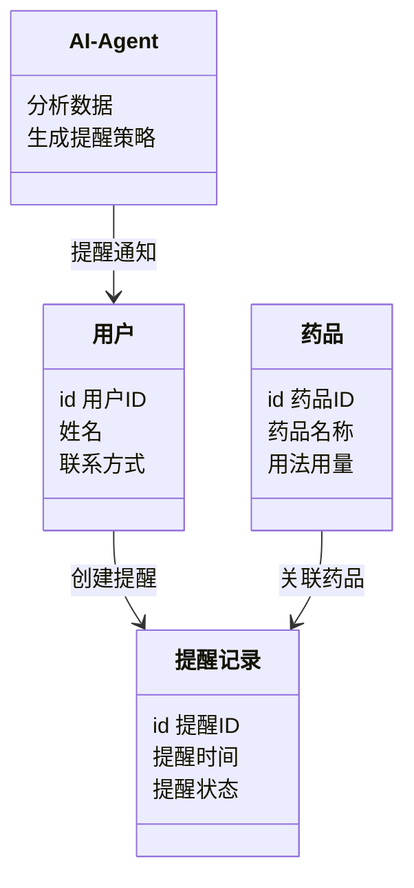
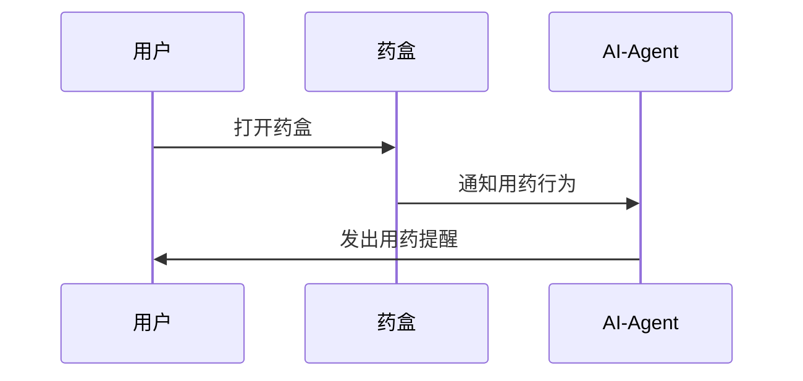

                 


# 智能药盒：AI Agent的用药提醒系统

## 关键词：
智能药盒，AI Agent，用药提醒，人工智能，系统设计，算法实现

## 摘要：
智能药盒是一种结合人工智能技术的用药提醒系统，通过AI Agent实现智能化的用药管理。本文详细介绍了智能药盒的背景、核心概念、AI Agent的工作原理、系统架构设计、项目实现以及实际应用案例，为读者提供了全面的技术解析。

---

# 第一部分: 智能药盒与AI Agent的背景介绍

## 第1章: 智能药盒的背景与问题背景

### 1.1 智能药盒的定义与应用场景
智能药盒是一种集成人工智能技术的电子设备，用于帮助用户管理用药计划。其主要应用场景包括：
- 慢性疾病患者（如糖尿病、高血压患者）的长期用药管理。
- 老年人群体的远程健康管理。
- 医院或诊所的药品分发与提醒服务。

### 1.2 用药提醒系统的核心问题
传统用药提醒系统存在以下问题：
- **准确性不足**：依赖手动设置，容易遗忘或设置错误。
- **缺乏智能性**：无法根据用户的健康状况动态调整提醒策略。
- **交互性差**：用户与系统之间的互动有限，无法提供个性化的用药建议。

### 1.3 AI Agent在智能药盒中的作用
AI Agent（人工智能代理）通过以下方式提升智能药盒的功能：
- **智能感知**：利用传感器和数据采集技术，实时监测用户的用药行为。
- **动态决策**：基于用户的健康数据，动态调整用药提醒策略。
- **自适应学习**：通过机器学习算法，不断优化用药提醒的准确性。

---

## 第2章: 智能药盒的核心概念与联系

### 2.1 智能药盒的核心概念
智能药盒由以下几个核心模块组成：
- **硬件模块**：包括药盒主体、传感器、显示屏等。
- **AI Agent模块**：负责数据处理、决策和交互。
- **用户交互模块**：包括按键、语音交互等用户操作界面。

### 2.2 AI Agent的核心原理
AI Agent的工作原理可以分为两个主要阶段：
1. **感知阶段**：通过传感器和数据接口采集用户的用药行为和健康数据。
2. **决策阶段**：基于采集的数据，通过机器学习模型生成用药提醒策略。

### 2.3 智能药盒的实体关系图

```mermaid
er
    entity 用户 {
        id 用户ID
        姓名
        联系方式
    }
    entity 药品 {
        id 药品ID
        药品名称
        用法用量
        处方信息
    }
    entity 提醒记录 {
        id 提醒ID
        提醒时间
        提醒状态
    }
    用户 -> 提醒记录 : 创建提醒
    药品 -> 提醒记录 : 关联药品
```

---

# 第二部分: AI Agent的算法原理与实现

## 第3章: AI Agent的核心算法原理

### 3.1 算法原理概述
AI Agent的核心算法包括：
- **数据采集与预处理**：通过传感器采集用户的用药记录、健康数据等。
- **特征提取**：将原始数据转化为可用于模型训练的特征向量。
- **模型训练**：使用机器学习算法（如随机森林、神经网络）训练分类模型。

### 3.2 算法实现细节
以下是AI Agent的核心算法实现步骤：

1. 数据采集：
```python
# 示例代码：读取传感器数据
def read_sensor_data():
    data = {
        'user_id': 1,
        'timestamp': '2023-10-01 08:00:00',
        'action': '药盒打开'
    }
    return data
```

2. 特征提取：
```python
# 示例代码：提取特征
def extract_features(data):
    features = {
        'user_id': data['user_id'],
        'last_action_time': data['timestamp']
    }
    return features
```

3. 模型训练：
```python
# 示例代码：训练模型
from sklearn.ensemble import RandomForestClassifier

model = RandomForestClassifier()
model.fit(X_train, y_train)
```

### 3.3 算法优化与调优
通过调整模型参数（如树的深度、特征选择）来优化算法性能。

---

## 第4章: 系统分析与架构设计

### 4.1 问题场景介绍
智能药盒需要解决的核心问题是：如何通过AI Agent实现智能化的用药提醒，并确保系统的稳定性和安全性。

### 4.2 系统功能设计
以下是系统的功能模块划分：



### 4.3 系统架构设计


### 4.4 系统接口设计
系统主要接口包括：
- 用户与药盒的交互接口。
- 药盒与AI-Agent的数据接口。

### 4.5 系统交互设计



---

# 第三部分: 项目实战与应用案例

## 第5章: 智能药盒的开发与实现

### 5.1 环境安装与配置
以下是开发环境的安装步骤：
```bash
# 示例代码：安装Python和相关库
pip install python
pip install tensorflow
pip install flask
```

### 5.2 系统核心代码实现
以下是AI-Agent的核心代码实现：

```python
# 示例代码：AI-Agent模块
from flask import Flask
import tensorflow as tf

app = Flask(__name__)
model = tf.keras.models.load_model('model.h5')

@app.route('/predict', methods=['POST'])
def predict():
    # 处理请求并返回结果
    return 'Predict Result'
```

### 5.3 代码运行与测试
运行代码并进行功能测试，确保系统的稳定性和准确性。

---

## 第6章: 实际案例分析与系统优化

### 6.1 实际应用案例
通过具体案例展示智能药盒的实际应用效果和用户反馈。

### 6.2 系统优化与改进
根据测试结果优化系统性能和用户体验。

### 6.3 项目小结
总结项目开发的经验和教训，为未来的优化提供参考。

---

# 第四部分: 最佳实践与注意事项

## 第7章: 最佳实践与开发注意事项

### 7.1 开发中的注意事项
- 确保数据安全，避免用户隐私泄露。
- 定期维护系统，及时更新软件版本。

### 7.2 系统维护与更新
- 定期检查系统运行状态，及时修复漏洞。
- 根据用户反馈优化系统功能。

### 7.3 拓展阅读与深入学习
推荐相关书籍和资源，鼓励读者深入学习人工智能和系统设计的知识。

---

## 第8章: 总结与展望

### 8.1 系统总结
智能药盒通过AI Agent实现了智能化的用药提醒，显著提升了用户的用药管理效率。

### 8.2 未来展望
未来，智能药盒可能会进一步集成更多的AI技术，如自然语言处理、计算机视觉，提供更加智能化和个性化的用药管理服务。

---

# 作者信息

作者：AI天才研究院/AI Genius Institute & 禅与计算机程序设计艺术 /Zen And The Art of Computer Programming

---

以上是《智能药盒：AI Agent的用药提醒系统》的完整目录大纲和内容概要。如果需要进一步扩展某一部分的内容，可以告诉我具体的需求，我将为您详细撰写。

