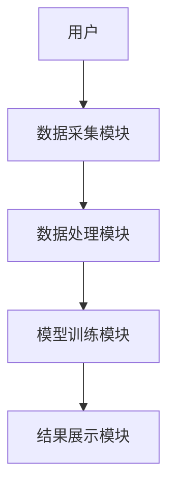

                 


# 智能营运资本效率优化系统

> 关键词：智能营运资本、效率优化、机器学习、深度学习、系统架构、资本管理

> 摘要：本文详细探讨了智能营运资本效率优化系统的构建与实现。通过结合机器学习、深度学习等人工智能技术，我们提出了一种高效的资本管理方法，能够显著提升企业的营运资本效率。文章从系统概述、数学建模与算法、系统架构与实现、项目实战以及最佳实践等多个方面展开，为读者提供全面的技术指导和实践参考。

---

# 第1章: 智能营运资本效率优化系统概述

## 1.1 智能营运资本效率优化系统背景

### 1.1.1 营运资本管理的基本概念

营运资本管理是企业管理中的核心部分，涉及资金流动、库存管理、应收账款等多个方面。传统的营运资本管理依赖于人工分析和经验判断，存在效率低下、决策滞后等问题。

### 1.1.2 传统营运资本管理的局限性

- 数据量大：传统方法难以处理海量数据。
- 决策延迟：人工分析耗时长，难以实时优化。
- 精度不足：缺乏精确的数据分析和预测能力。

### 1.1.3 智能化管理的必要性

随着人工智能技术的发展，智能化的营运资本管理能够实时分析数据，提供精准的优化建议，从而提高管理效率和企业竞争力。

## 1.2 智能营运资本效率优化系统的定义与目标

### 1.2.1 系统的定义

智能营运资本效率优化系统是一种基于人工智能技术的管理系统，通过实时数据分析和智能算法，优化企业的营运资本配置，提升管理效率。

### 1.2.2 系统的目标

- 实现营运资本的实时监控和优化。
- 提供精准的决策支持，减少资源浪费。
- 提高企业的整体运营效率和竞争力。

### 1.2.3 系统的核心要素

- 数据采集与处理模块：实时采集和处理营运资本相关数据。
- 智能分析模块：利用机器学习等技术进行数据分析和预测。
- 优化建议模块：基于分析结果，提供资本优化建议。

## 1.3 智能营运资本效率优化系统的应用场景

### 1.3.1 零售行业

在零售行业，智能系统可以优化库存管理，减少过剩库存和缺货情况，提升客户满意度。

### 1.3.2 制造业

在制造业，系统可以帮助企业优化生产流程，降低原材料浪费，提高生产效率。

### 1.3.3 金融行业

在金融行业，智能系统可以用于风险评估和投资决策，帮助金融机构优化资产配置。

## 1.4 系统与传统资本管理的区别

### 1.4.1 管理方式的差异

传统管理依赖人工分析，而智能系统通过自动化数据处理和智能算法实现高效管理。

### 1.4.2 技术手段的差异

传统管理主要依靠经验，而智能系统利用大数据和人工智能技术进行分析和优化。

### 1.4.3 效率提升的对比

智能系统能够实时处理数据，快速生成优化建议，显著提高管理效率。

## 1.5 本章小结

本章介绍了智能营运资本效率优化系统的背景、定义、目标及其应用场景，并对比了传统管理方式的差异，为后续章节的深入分析奠定了基础。

---

# 第2章: 问题建模与数据分析

## 2.1 营运资本优化的数学建模

### 2.1.1 营运资本流动的数学表示

营运资本流动可以表示为一个动态系统，涉及多个变量和约束条件。我们可以通过以下公式描述：

$$ \text{资本流动} = \text{收入} - \text{支出} $$

### 2.1.2 优化目标的数学表达

我们的优化目标是最小化资本占用，同时最大化资本回报率。数学表达如下：

$$ \min_{x} \sum_{i=1}^{n} x_i $$

$$ \text{s.t.} \quad \sum_{i=1}^{n} y_i x_i \geq C $$

其中，$x_i$ 为资本分配，$y_i$ 为收益，$C$ 为总目标收益。

### 2.1.3 约束条件的设定

常见的约束条件包括：

1. 资本分配不能为负数：$x_i \geq 0$。
2. 总资本不能超过预算：$\sum_{i=1}^{n} x_i \leq B$。

## 2.2 数据来源与特征分析

### 2.2.1 数据来源渠道

数据可以来自企业的财务系统、销售数据、供应链数据等多个渠道。

### 2.2.2 数据特征分析

- 时间序列性：数据具有时间依赖性。
- 多维性：涉及多个变量，如销售额、库存量等。
- 高维性：数据维度较高，需要进行特征选择。

### 2.2.3 数据预处理方法

- 数据清洗：去除异常值和缺失值。
- 标准化：对数据进行标准化处理，使其具有可比性。

## 2.3 核心算法与模型

### 2.3.1 机器学习算法

- 线性回归：用于预测资本需求。
- 支持向量机（SVM）：用于分类问题。
- 随机森林：用于特征重要性分析。

### 2.3.2 深度学习算法

- 神经网络：用于复杂模式识别。
- LSTM：用于时间序列预测。
- CNN：用于图像识别（如库存监控）。

### 2.3.3 组合优化算法

- 遗传算法：用于全局优化。
- 蚁群算法：用于路径优化问题。

## 2.4 算法实现与优化

### 2.4.1 算法实现步骤

1. 数据预处理：清洗、标准化。
2. 特征选择：提取关键特征。
3. 模型训练：选择合适的算法进行训练。
4. 模型评估：通过准确率、召回率等指标评估模型性能。
5. 模型优化：调整参数，提高预测精度。

### 2.4.2 算法优化策略

- 参数调优：使用网格搜索或随机搜索优化模型参数。
- 特征工程：通过特征组合和降维提高模型性能。
- 集成学习：结合多种算法结果，提高预测准确率。

### 2.4.3 算法性能评估

- 准确率：预测正确的比例。
- 召回率：实际为正被正确预测的比例。
- F1分数：综合准确率和召回率的指标。

## 2.5 本章小结

本章详细介绍了智能营运资本效率优化系统中的数学建模与数据分析方法，包括数据预处理、算法选择与优化策略，为后续系统的实现提供了理论基础。

---

# 第3章: 系统架构设计

## 3.1 系统模块划分

### 3.1.1 数据采集模块

- 负责从企业各系统中采集营运资本相关数据。
- 使用API接口或数据库连接实现数据获取。

### 3.1.2 数据处理模块

- 对采集到的数据进行清洗和标准化处理。
- 提供数据可视化的功能，帮助用户直观理解数据。

### 3.1.3 模型训练模块

- 根据数据特征选择合适的算法进行模型训练。
- 支持多种算法的集成，提供最优预测结果。

### 3.1.4 结果展示模块

- 展示模型预测结果和优化建议。
- 提供直观的可视化界面，便于用户理解和操作。

## 3.2 系统功能设计

### 3.2.1 数据可视化功能

- 提供时间序列图、柱状图等多种可视化方式。
- 支持用户自定义数据范围和展示方式。

### 3.2.2 模型选择与训练功能

- 提供多种算法选项，用户可以根据需求选择。
- 支持模型训练过程的可视化，便于用户监控训练进度。

### 3.2.3 优化建议功能

- 根据模型预测结果，提供资本优化建议。
- 提供详细的优化方案和实施步骤。

## 3.3 系统架构设计

### 3.3.1 系统架构图



### 3.3.2 模块交互流程

1. 用户通过界面输入需求。
2. 数据采集模块获取相关数据。
3. 数据处理模块对数据进行清洗和预处理。
4. 模型训练模块选择合适的算法进行训练。
5. 结果展示模块将预测结果和优化建议展示给用户。

## 3.4 本章小结

本章详细描述了智能营运资本效率优化系统的架构设计，包括模块划分、功能设计和系统交互流程，为系统的实际开发提供了指导。

---

# 第4章: 项目实战

## 4.1 环境搭建

### 4.1.1 系统需求

- 操作系统：Windows、Linux 或 macOS。
- 硬件要求：足够的内存和存储空间。
- 软件安装：安装 Python、Jupyter Notebook、scikit-learn 等工具。

### 4.1.2 环境配置

1. 安装 Python 和 pip。
2. 安装必要的库：`pip install numpy scikit-learn pandas`。

## 4.2 系统核心实现

### 4.2.1 数据采集与处理

```python
import pandas as pd
import numpy as np

# 数据采集
data = pd.read_csv('capital_data.csv')

# 数据预处理
data.dropna(inplace=True)
data['date'] = pd.to_datetime(data['date'])
```

### 4.2.2 模型训练与优化

```python
from sklearn.model import LinearRegression
from sklearn.metrics import mean_squared_error

# 数据分割
X = data[['sales', 'inventory']]
y = data['capital']

model = LinearRegression()
model.fit(X, y)

# 模型评估
y_pred = model.predict(X)
print(mean_squared_error(y, y_pred))
```

### 4.2.3 结果展示

```python
import matplotlib.pyplot as plt

plt.plot(data['date'], data['capital'], label='Actual')
plt.plot(data['date'], y_pred, label='Predicted')
plt.legend()
plt.show()
```

## 4.3 项目总结

### 4.3.1 实战总结

通过本项目，我们实现了智能营运资本效率优化系统的数据采集、处理、建模和结果展示功能，验证了系统的可行性和有效性。

### 4.3.2 实践中的注意事项

- 数据质量：确保数据的准确性和完整性。
- 模型选择：根据实际需求选择合适的算法。
- 系统维护：定期更新数据和模型，确保系统稳定运行。

## 4.4 本章小结

本章通过一个实际项目展示了智能营运资本效率优化系统的实现过程，包括环境搭建、数据处理、模型训练和结果展示，为读者提供了实践参考。

---

# 第5章: 总结与展望

## 5.1 总结

智能营运资本效率优化系统通过结合人工智能技术，显著提升了企业的营运资本管理效率。本文详细探讨了系统的构建与实现，包括数学建模、算法选择、系统架构设计和项目实战等部分。

## 5.2 未来展望

随着人工智能技术的不断发展，智能营运资本效率优化系统将更加智能化和自动化。未来的研究方向包括：

- 更加复杂的模型优化。
- 实时数据分析与决策支持。
- 多领域协同优化，如供应链与财务协同。

## 5.3 最佳实践 tips

- 数据是关键：确保数据的准确性和完整性。
- 模型选择：根据实际需求选择合适的算法。
- 系统维护：定期更新数据和模型，确保系统稳定运行。

## 5.4 本章小结

本文总结了智能营运资本效率优化系统的实现过程，并展望了未来的发展方向，为读者提供了深入的技术指导和实践参考。

---

# 作者

作者：AI天才研究院/AI Genius Institute & 禅与计算机程序设计艺术 /Zen And The Art of Computer Programming

---

以上是《智能营运资本效率优化系统》的技术博客文章，涵盖了系统概述、数学建模、算法实现、系统架构设计和项目实战等内容，旨在为读者提供全面的技术指导和实践参考。

