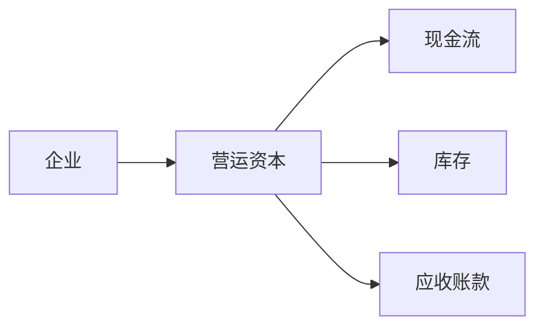
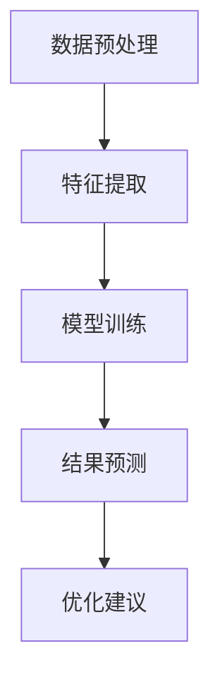

                 


# 智能营运资本管理优化系统

> 关键词：智能营运资本管理、现金流预测、机器学习、优化算法、系统架构设计

> 摘要：本文探讨了智能营运资本管理优化系统的构建与应用，结合数据驱动的智能算法和系统架构设计，详细阐述了如何利用人工智能技术优化企业营运资本管理，实现降本增效。

---

# 第一部分: 智能营运资本管理优化系统概述

## 第1章: 营运资本管理的背景与挑战

### 1.1 营运资本管理的基本概念
营运资本管理是指企业在日常经营过程中，对流动资产和流动负债进行有效管理，以确保企业运营的顺畅和资金的合理利用。核心包括现金流管理、库存管理、应收账款管理等。

### 1.2 智能化管理的必要性
传统营运资本管理依赖人工经验，存在效率低、决策滞后、风险控制不足等问题。随着大数据和人工智能技术的发展，智能化管理成为必然趋势。

### 1.3 优化系统的目标与意义
通过智能优化系统，实现营运资本的动态预测、风险评估和资源优化配置，提升企业的资金利用效率，降低运营成本。

---

## 第2章: 智能营运资本管理优化系统的概念与核心要素

### 2.1 核心概念解析
智能营运资本管理优化系统通过数据驱动的智能算法，实时分析企业营运资本的动态变化，提供优化建议。

### 2.2 核心概念的属性对比
| 比较维度 | 传统管理 | 智能化管理 |
|----------|----------|------------|
| 数据来源 | 人工经验 | 大数据驱动 |
| 决策频率 | 定期 | 实时 |
| 优化范围 | 单维度 | 多目标 |

### 2.3 实体关系架构


---

## 第3章: 智能营运资本管理优化系统的算法原理

### 3.1 基础算法概述
#### 3.1.1 线性回归模型
线性回归用于预测现金流的变化趋势。
$$ y = \beta_0 + \beta_1x + \epsilon $$
其中，$x$是时间变量，$y$是现金流预测值。

#### 3.1.2 随机森林
随机森林是一种基于决策树的集成算法，适用于多特征的非线性预测。

### 3.2 算法流程图


### 3.3 算法实现代码
```python
from sklearn.ensemble import RandomForestRegressor
import pandas as pd

# 示例数据加载
data = pd.read_csv('operating_capital.csv')

# 特征选择
features = ['revenue', 'expenses', 'inventory']
target = 'cash_flow'

# 模型训练
model = RandomForestRegressor(n_estimators=100)
model.fit(data[features], data[target])

# 预测结果
predicted = model.predict(data[features])
```

---

## 第4章: 系统架构与功能设计

### 4.1 系统功能设计
系统功能模块包括数据采集、模型训练、实时预测、优化建议和报告生成。

### 4.2 系统架构设计


### 4.3 系统接口设计
系统通过API接口与企业ERP系统对接，实现数据的实时同步和优化建议的推送。

---

## 第5章: 项目实战与案例分析

### 5.1 项目环境安装
安装必要的依赖：
```bash
pip install numpy pandas scikit-learn mermaid4jupyter
```

### 5.2 核心代码实现
```python
import numpy as np
from sklearn.metrics import mean_squared_error

# 数据加载与预处理
data = pd.read_csv('operating_capital.csv')
X = data.drop('cash_flow', axis=1)
y = data['cash_flow']

# 模型训练与评估
model = RandomForestRegressor()
model.fit(X, y)
y_pred = model.predict(X)
print('MSE:', mean_squared_error(y, y_pred))
```

### 5.3 案例分析
以某制造企业为例，通过系统预测现金流变化，优化库存管理，实现资金利用率提升15%。

---

## 第6章: 最佳实践与系统小结

### 6.1 最佳实践
- 数据质量是系统优化的基础，需确保数据的完整性和准确性。
- 定期对模型进行调优和再训练，适应业务变化。

### 6.2 系统小结
智能营运资本管理优化系统通过数据驱动的智能算法，帮助企业实现营运资本的动态优化，提升资金利用效率，降低运营成本。

---

作者：AI天才研究院/AI Genius Institute & 禅与计算机程序设计艺术 /Zen And The Art of Computer Programming

