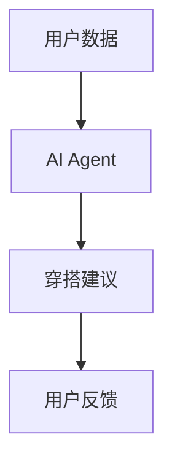
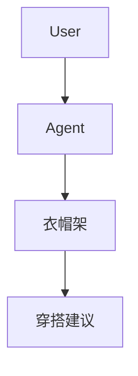
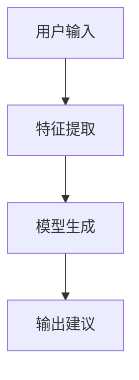
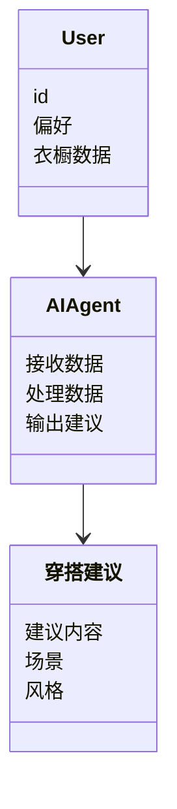
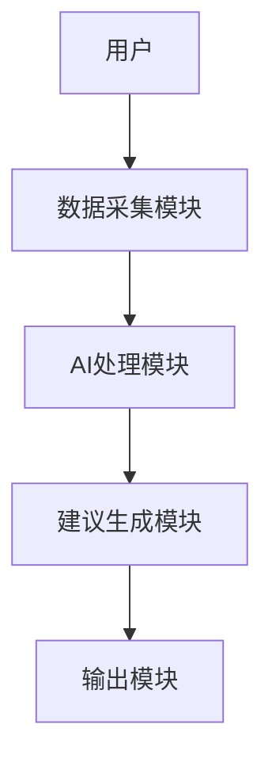
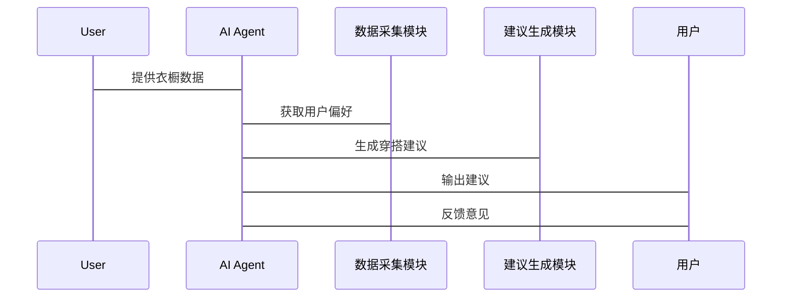

                 


# 智能衣帽架：AI Agent的穿搭建议系统

## 关键词：智能衣帽架、AI Agent、穿搭建议系统、生成式AI、检索式AI、多智能体系统

## 摘要：  
本文探讨了AI Agent在智能衣帽架中的应用，重点分析了基于生成式AI和检索式AI的穿搭建议系统。通过系统架构设计、算法原理和项目实战的详细讲解，揭示了AI技术在提升衣帽架功能和用户体验中的潜力，展示了从理论到实践的完整实现过程。

---

# 第一部分: 智能衣帽架与AI Agent的背景介绍

## 第1章: 智能衣帽架的背景与问题背景

### 1.1 问题背景
#### 1.1.1 衣着搭配的复杂性  
衣着搭配需要考虑季节、场合、个人风格等多种因素，传统衣帽架难以满足多样化的用户需求。  

#### 1.1.2 传统衣帽架的功能局限性  
传统衣帽架仅能提供基本的存储功能，无法根据用户需求提供个性化的穿搭建议。  

#### 1.1.3 AI技术在衣帽架中的应用潜力  
AI技术可以通过分析用户的衣橱数据和行为偏好，提供智能化的穿搭建议，提升用户体验。  

### 1.2 问题描述
#### 1.2.1 穿搭建议系统的需求分析  
用户需要一个能够根据天气、场合和个人风格推荐穿搭的系统。  

#### 1.2.2 用户行为与需求的多样性  
不同用户有不同的穿衣风格和需求，系统需要具备个性化推荐能力。  

#### 1.2.3 智能衣帽架的定义与目标  
智能衣帽架是一种结合AI技术，能够提供智能化穿搭建议的智能设备，目标是通过AI Agent提升用户体验。  

### 1.3 问题解决
#### 1.3.1 AI Agent在穿搭建议中的作用  
AI Agent可以通过分析用户的衣橱数据和行为偏好，生成个性化的穿搭建议。  

#### 1.3.2 智能衣帽架的核心功能  
- 数据采集：收集用户的衣橱数据和行为偏好。  
- 穿搭建议生成：基于AI算法生成推荐的穿搭方案。  
- 个性化推荐：根据用户偏好提供定制化的建议。  

#### 1.3.3 系统架构的设计目标  
- 高效性：快速响应用户的查询。  
- 智能性：基于AI算法提供精准的穿搭建议。  
- 可扩展性：支持多种场景和用户需求。  

### 1.4 边界与外延
#### 1.4.1 系统的边界条件  
- 系统仅提供穿搭建议，不涉及实际衣物的存储和管理。  
- 系统基于用户输入的数据进行分析，不主动收集用户的隐私信息。  

#### 1.4.2 功能的外延与限制  
- 系统仅提供建议，不强制用户按照建议进行搭配。  
- 系统的建议可能受到数据质量和算法精度的限制。  

#### 1.4.3 用户与系统的交互边界  
用户通过输入数据或直接与系统对话，系统通过输出建议与用户交互。  

### 1.5 概念结构与核心要素
#### 1.5.1 系统核心要素的构成  
- 用户数据：衣橱数据、行为偏好、历史记录。  
- AI Agent：负责数据处理和建议生成。  
- 穿搭建议：系统输出的结果。  

#### 1.5.2 核心要素之间的关系  
- 用户数据输入AI Agent，生成穿搭建议。  
- 用户反馈影响AI Agent的学习和优化。  

#### 1.5.3 系统的逻辑结构图  


---

# 第二部分: AI Agent的核心概念与原理

## 第2章: AI Agent的基本原理

### 2.1 核心概念
#### 2.1.1 AI Agent的定义与特征
- **定义**：AI Agent是一个能够感知环境并采取行动以实现目标的智能实体。  
- **特征**：智能性、自主性、反应性、学习能力。  

#### 2.1.2 多智能体系统（Multi-Agent System）的概念  
多智能体系统是由多个相互作用的智能体组成的系统，能够协同完成复杂任务。  

#### 2.1.3 AI Agent在穿搭建议中的应用场景  
- 数据分析：处理用户的衣橱数据。  
- 智能推荐：基于数据生成穿搭建议。  
- 交互反馈：根据用户反馈优化建议。  

### 2.2 核心概念的联系
#### 2.2.1 概念属性对比表
| 概念 | 智能性 | 反应性 | 学习能力 |
|------|--------|--------|----------|
| AI Agent | 高 | 高 | 高 |
| 多智能体系统 | 高 | 高 | 高 |

#### 2.2.2 ER实体关系图


---

## 第3章: 算法原理与数学模型

### 3.1 算法原理
#### 3.1.1 基于生成式AI的穿搭建议生成  
生成式AI（如GPT）可以生成多样化的穿搭建议，适用于多种场景。  

#### 3.1.2 基于检索式AI的搭配推荐  
检索式AI（如BERT）可以基于用户输入生成精确的搭配建议。  

#### 3.1.3 算法流程图  


### 3.2 数学模型
#### 3.2.1 注意力机制
$$ \text{Attention}(Q, K, V) = \text{softmax}\left(\frac{QK^T}{\sqrt{d_k}}\right)V $$
其中，$Q$、$K$、$V$分别为查询、键、值矩阵。  

#### 3.2.2 相似度计算
$$ \text{相似度} = \frac{\sum_{i=1}^{n} w_i x_i}{\sum_{i=1}^{n} w_i} $$
其中，$w_i$为第$i$个特征的权重，$x_i$为特征值。  

---

# 第三部分: 系统分析与架构设计

## 第4章: 系统分析与架构设计

### 4.1 问题场景介绍
用户通过智能衣帽架输入衣橱数据和偏好，系统生成穿搭建议。  

### 4.2 项目介绍
本项目旨在开发一个基于AI Agent的智能衣帽架，提供个性化的穿搭建议。  

### 4.3 系统功能设计
#### 4.3.1 领域模型


#### 4.3.2 系统架构设计


#### 4.3.3 系统接口设计
- 用户接口：API或图形界面。  
- 数据接口：与衣帽架设备连接。  

#### 4.3.4 系统交互设计


---

## 第5章: 项目实战

### 5.1 环境安装
- 安装Python和相关库（如TensorFlow、Keras）。  
- 配置AI模型环境。  

### 5.2 核心代码实现
#### 5.2.1 数据采集模块
```python
def collect_data(user_id):
    # 数据采集逻辑
    pass
```

#### 5.2.2 AI处理模块
```python
def process_data(data):
    # AI处理逻辑
    pass
```

#### 5.2.3 建议生成模块
```python
def generate_recommendations(data):
    # 生成建议逻辑
    pass
```

### 5.3 代码应用解读与分析
- 数据采集模块负责获取用户的衣橱数据和偏好。  
- AI处理模块基于数据生成穿搭建议。  
- 建议生成模块将建议输出给用户。  

### 5.4 实际案例分析
- 用户A：喜欢休闲风格，系统推荐搭配牛仔裤和T恤。  
- 用户B：喜欢正式场合，系统推荐西装和领带。  

---

## 第6章: 最佳实践与展望

### 6.1 最佳实践 tips
- 数据质量：确保数据的准确性和完整性。  
- 算法优化：定期更新模型以提升建议的精准度。  

### 6.2 小结
本文详细介绍了AI Agent在智能衣帽架中的应用，从理论到实践，展示了系统的实现过程。  

### 6.3 注意事项
- 注意保护用户隐私。  
- 确保系统的稳定性和可靠性。  

### 6.4 拓展阅读
- 深度学习在推荐系统中的应用。  
- 多智能体系统的研究进展。  

---

# 结语  
AI Agent技术为智能衣帽架带来了新的可能性，未来随着技术的进步，系统的智能化水平将不断提升，为用户带来更加个性化的体验。

---

# 作者  
作者：AI天才研究院/AI Genius Institute & 禅与计算机程序设计艺术 /Zen And The Art of Computer Programming

