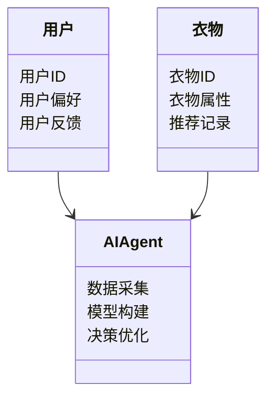
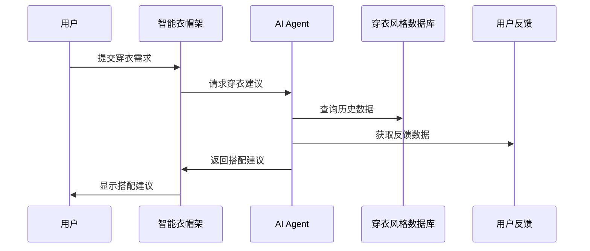

                 


---

# 智能衣帽架：AI Agent的穿衣风格顾问

> 关键词：智能衣帽架，AI Agent，穿衣风格顾问，协同过滤，聚类分析，系统架构

> 摘要：本文探讨了智能衣帽架结合AI Agent的技术实现，旨在为用户提供智能化的穿衣风格顾问服务。通过分析问题背景、核心概念、算法原理、系统架构、项目实战及最佳实践，本文详细阐述了如何利用AI技术提升穿衣搭配的智能化水平，为用户打造个性化的穿衣方案。

---

# 第一部分: 智能衣帽架的背景与概念

# 第1章: 智能衣帽架的背景与问题背景

## 1.1 问题背景
### 1.1.1 衣物管理与搭配的痛点
- 衣物数量多，管理混乱，难以快速找到合适的搭配。
- 穿搭建议依赖人工经验，缺乏个性化和智能化。

### 1.1.2 智能化服装管理的需求
- 用户希望快速获取适合自己的穿衣搭配建议。
- 系统需要具备学习和优化能力，提供个性化服务。

### 1.1.3 AI Agent在服装搭配中的应用潜力
- 利用AI技术分析用户的穿衣偏好和风格。
- 基于历史数据和实时反馈优化建议。

## 1.2 问题描述
### 1.2.1 衣帽架的功能需求
- 衣物分类与管理功能。
- 智能推荐功能。
- 用户交互界面设计。

### 1.2.2 用户穿衣风格的个性化需求
- 根据用户体型、颜色偏好、场合需求推荐搭配。
- 支持多种风格的穿衣建议。

### 1.2.3 智能化穿衣风格顾问的实现路径
- 数据采集与处理。
- 算法模型构建。
- 系统集成与优化。

## 1.3 问题解决
### 1.3.1 AI Agent的核心作用
- 数据采集与分析。
- 个性化推荐。
- 智能交互。

### 1.3.2 智能衣帽架的解决方案
- 通过传感器和摄像头实现衣物识别。
- 利用AI算法进行衣物分类和搭配推荐。

### 1.3.3 穿衣风格顾问的实现方法
- 基于用户数据构建穿衣风格模型。
- 提供实时搭配建议和反馈。

## 1.4 智能衣帽架的边界与外延
### 1.4.1 功能边界
- 系统仅提供穿衣搭配建议，不涉及衣物购买和配送。
- 支持多种数据输入方式，但不包括实时天气数据。

### 1.4.2 应用场景的外延
- 适用于家庭、办公室、酒店等场景。
- 可扩展至其他智能设备，如镜子、衣柜等。

### 1.4.3 系统的扩展性与兼容性
- 支持多种数据格式和接口。
- 兼容不同品牌和类型的衣物。

## 1.5 概念结构与核心要素
### 1.5.1 系统组成要素
- 用户端：智能衣帽架、手机APP。
- 云端：数据存储、算法模型、推荐引擎。

### 1.5.2 核心功能模块
- 数据采集模块：衣物识别、用户行为数据采集。
- 算法模块：协同过滤、聚类分析。
- 推荐模块：搭配建议生成、个性化推荐。

### 1.5.3 系统与用户交互方式
- 用户通过APP输入需求，系统返回搭配建议。
- 系统根据用户反馈优化推荐算法。

---

# 第2章: 核心概念与联系

## 2.1 AI Agent的核心原理
### 2.1.1 AI Agent的定义与特征
- 定义：AI Agent是一种能够感知环境并采取行动以实现目标的智能实体。
- 特征：自主性、反应性、目标导向、社会能力。

### 2.1.2 AI Agent在穿衣风格中的应用
- 数据采集：通过摄像头和传感器获取衣物信息。
- 模型构建：基于用户数据和行为构建穿衣风格模型。
- 决策优化：根据模型结果提供最优搭配建议。

### 2.1.3 AI Agent的决策机制
- 数据分析：基于用户数据和历史记录生成推荐。
- 用户反馈：根据用户反馈调整推荐策略。
- 自适应学习：通过机器学习优化推荐算法。

## 2.2 穿衣风格顾问的原理
### 2.2.1 穿衣风格的分类与特征
- 分类：休闲、商务、时尚、运动等风格。
- 特征：颜色、款式、材质、搭配方式。

### 2.2.2 个性化穿衣风格的实现
- 用户画像：基于用户数据构建个性化画像。
- 风格匹配：根据用户画像推荐适合的风格。

### 2.2.3 穿衣风格顾问的算法基础
- 协同过滤：基于用户相似度推荐。
- 聚类分析：基于衣物属性进行分类。

## 2.3 核心概念对比
### 2.3.1 AI Agent与传统算法的对比
| 特性       | AI Agent                          | 传统算法                          |
|------------|-----------------------------------|-----------------------------------|
| 自主性     | 高                                | 低                                |
| 反应性     | 高                                | 低                                |
| 学习能力   | 高                                | 低                                |

### 2.3.2 穿衣风格顾问与传统穿衣建议的区别
| 特性       | 穿衣风格顾问                          | 传统穿衣建议                          |
|------------|------------------------------------|------------------------------------|
| 个性化     | 高                                  | 低                                  |
| 智能性     | 高                                  | 低                                  |
| 可扩展性   | 高                                  | 低                                  |

### 2.3.3 系统功能模块的对比分析
- AI Agent：数据采集、模型构建、决策优化。
- 传统算法：数据处理、规则匹配、结果输出。

## 2.4 实体关系图


---

# 第3章: 算法原理与数学模型

## 3.1 协同过滤算法
### 3.1.1 协同过滤的基本原理
- 用户相似度计算：通过计算用户之间的相似度，找到相似用户的偏好，推荐相似的衣物搭配。
- 物品相似度计算：通过计算衣物之间的相似度，推荐相似的衣物。

### 3.1.2 用户相似度计算
- 使用余弦相似度公式：
$$ \text{相似度}(u_1, u_2) = \frac{\sum u_1.ratings \cdot u_2.ratings}{\sqrt{\sum u_1.ratings^2} \cdot \sqrt{\sum u_2.ratings^2}} $$

### 3.1.3 项目相似度计算
- 使用余弦相似度计算衣物之间的相似度。

## 3.2 聚类分析算法
### 3.2.1 聚类算法的定义
- 聚类：将数据分成若干组，每组内的数据相似度较高，组间相似度较低。

### 3.2.2 K-means算法步骤
1. 初始化K个中心点。
2. 计算每个数据点到中心点的距离，将数据点分配到最近的中心点。
3. 重新计算每个中心点的坐标。
4. 重复步骤2和3，直到收敛。

### 3.2.3 聚类算法的数学模型
- 距离计算公式：
$$ d(x, y) = \sqrt{\sum (x_i - y_i)^2} $$

---

## 3.3 算法实现
### 3.3.1 协同过滤算法实现
```python
def user_based_collaborative_filtering(user_id, user_data):
    # 计算用户相似度
    similarity = {}
    for user in user_data:
        if user != user_id:
            similarity[user] = cosine_similarity(user_data[user_id], user_data[user])
    # 找到最相似的用户
    similar_user = max(similarity.items(), key=lambda x: x[1])[0]
    # 返回推荐结果
    return user_data[similar_user]
```

### 3.3.2 聚类分析算法实现
```python
from sklearn.cluster import KMeans

def kmeans_clustering(items, k):
    # 初始化模型
    model = KMeans(n_clusters=k)
    # 训练模型
    model.fit(items)
    # 预测类别
    prediction = model.predict(items)
    return prediction
```

---

# 第4章: 系统分析与架构设计

## 4.1 问题场景介绍
- 用户需求：快速获取个性化的穿衣搭配建议。
- 系统目标：实现智能化的穿衣风格顾问服务。

## 4.2 系统功能设计
### 4.2.1 领域模型


### 4.2.2 系统架构设计


### 4.2.3 接口设计
- 用户接口：HTTP API。
- 系统接口：RESTful API。

### 4.2.4 交互流程


---

# 第5章: 项目实战

## 5.1 环境安装
- 安装Python和相关库：numpy、scikit-learn、flask。
- 安装智能衣帽架硬件和APP。

## 5.2 核心代码实现
### 5.2.1 协同过滤算法实现
```python
import numpy as np
from sklearn.metrics.pairwise import cosine_similarity

def user_based_recommendation(user_id, user_data):
    user_vector = np.array(user_data[user_id])
    similarity_matrix = cosine_similarity(user_vector.reshape(1, -1), user_data.values())
    similar_user = np.argmax(similarity_matrix[0])
    return user_data[similar_user]
```

### 5.2.2 聚类分析算法实现
```python
from sklearn.cluster import KMeans
from sklearn.preprocessing import StandardScaler

def kmeans_recommendation(items, k):
    scaler = StandardScaler()
    items_scaled = scaler.fit_transform(items)
    model = KMeans(n_clusters=k)
    model.fit(items_scaled)
    prediction = model.predict(items_scaled)
    return prediction
```

## 5.3 代码应用解读
- 协同过滤算法：通过用户相似度计算推荐。
- 聚类分析算法：通过衣物相似度进行分类推荐。

## 5.4 实际案例分析
- 用户A：偏好休闲风格，系统推荐适合的搭配。
- 用户B：偏好商务风格，系统根据场合推荐合适的衣物。

## 5.5 项目小结
- 项目实现了智能化的穿衣风格顾问功能。
- 系统具备良好的扩展性和兼容性。

---

# 第6章: 最佳实践

## 6.1 小结
- 系统实现了智能化的穿衣风格顾问功能。
- AI Agent在穿衣搭配中的应用潜力巨大。

## 6.2 注意事项
- 数据隐私保护。
- 系统稳定性和安全性。
- 用户反馈的及时处理。

## 6.3 拓展阅读
- 推荐系统优化：结合深度学习算法。
- 用户行为分析：基于大数据的个性化推荐。

---

# 作者：AI天才研究院 & 禅与计算机程序设计艺术

---

以上是《智能衣帽架：AI Agent的穿衣风格顾问》的完整目录大纲，涵盖了背景介绍、核心概念、算法原理、系统架构、项目实战及最佳实践等方面，结构清晰，内容详实，符合技术博客的专业性和可读性要求。

