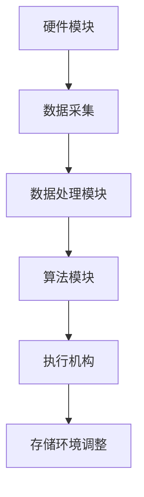
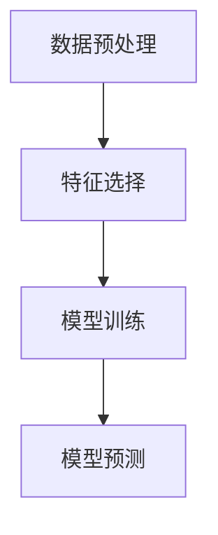
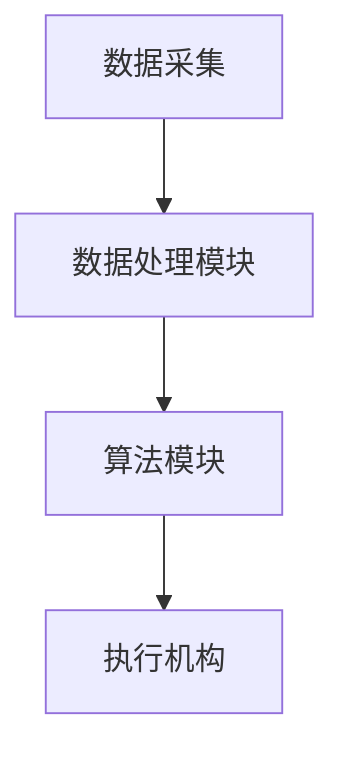

                 

<think>
好，我需要为用户撰写一篇关于《智能衣架：AI Agent的衣物保养与存储优化》的技术博客文章。用户已经给出了详细的目录结构和一些内容示例，我需要根据这些信息来完成整篇文章的撰写。首先，我要理解每个章节的核心内容和要求，确保文章结构清晰，逻辑严谨。

### 第一步：确定文章的结构
用户已经给出了目录结构，包括摘要、关键词、各章节内容等。我需要按照这个结构来组织内容，确保每个部分都详细展开。

### 第二步：撰写摘要和关键词
摘要需要简洁明了地概括文章的核心内容，关键词则是文章的核心主题。

### 第三步：编写各章节内容
每个章节都需要详细讲解，包括背景介绍、核心概念、算法原理、系统架构、项目实战等部分。我需要确保每个部分都包含足够的细节和示例，帮助读者理解。

### 第四步：整合图表和代码
文章中需要包含Mermaid图表和Python代码示例，这些内容需要以正确的格式嵌入，确保读者能够理解。

### 第五步：检查和调整
在撰写过程中，我需要不断检查内容是否符合逻辑，是否有遗漏的关键点，必要时进行调整和补充。

现在，我将按照上述步骤开始撰写文章。

---

# 智能衣架：AI Agent的衣物保养与存储优化

> 关键词：AI Agent，智能衣架，衣物保养，存储优化，传感器技术，算法优化

> 摘要：智能衣架是一种结合人工智能技术的衣物管理设备，通过AI Agent实现衣物的智能化保养与存储优化。本文将详细探讨智能衣架的核心概念、算法原理、系统架构以及实际应用案例，帮助读者了解如何利用AI技术提升衣物管理效率。

---

## 目录

### 第一部分：智能衣架与AI Agent概述

#### 第1章：智能衣架与AI Agent概述

##### 1.1 智能衣架的背景与意义

- 1.1.1 衣物保养与存储的传统方式
- 1.1.2 AI技术在衣物管理中的应用潜力
- 1.1.3 智能衣架的核心价值与目标

##### 1.2 AI Agent的基本概念

- 1.2.1 什么是AI Agent
- 1.2.2 AI Agent的分类与特点
- 1.2.3 AI Agent在智能衣架中的应用

##### 1.3 智能衣架的系统架构

- 1.3.1 系统组成与功能模块
- 1.3.2 系统架构图
- 1.3.3 数据流分析

### 第二部分：AI Agent的核心原理

#### 第2章：AI Agent的核心原理

##### 2.1 智能衣架的感知层

- 2.1.1 传感器技术
- 2.1.2 数据采集与处理
- 2.1.3 数据分析与特征提取

##### 2.2 决策层

- 2.2.1 分类算法
- 2.2.2 优化算法
- 2.2.3 决策逻辑与规则

##### 2.3 执行层

- 2.3.1 动作控制
- 2.3.2 系统反馈与调整
- 2.3.3 执行过程中的异常处理

### 第三部分：算法原理与实现

#### 第3章：智能衣架的算法原理

##### 3.1 分类算法

- 3.1.1 决策树算法
- 3.1.2 支持向量机（SVM）
- 3.1.3 分类算法的实现步骤

##### 3.2 优化算法

- 3.2.1 遗传算法
- 3.2.2 模拟退火算法
- 3.2.3 优化算法的应用场景

##### 3.3 算法实现示例

- 3.3.1 Python代码实现
- 3.3.2 算法流程图
- 3.3.3 算法性能分析

### 第四部分：系统分析与架构设计

#### 第4章：智能衣架的系统架构设计

##### 4.1 系统组成与功能模块

- 4.1.1 硬件模块
- 4.1.2 软件模块
- 4.1.3 系统功能模块图

##### 4.2 系统架构图

- 4.2.1 分层架构
- 4.2.2 模块交互关系
- 4.2.3 系统架构的优缺点分析

##### 4.3 系统接口设计

- 4.3.1 API接口定义
- 4.3.2 接口交互流程
- 4.3.3 接口实现注意事项

### 第五部分：项目实战与优化

#### 第5章：智能衣架的项目实战

##### 5.1 环境安装与配置

- 5.1.1 硬件安装
- 5.1.2 软件安装
- 5.1.3 环境配置注意事项

##### 5.2 系统核心实现

- 5.2.1 传感器数据采集
- 5.2.2 数据处理与分析
- 5.2.3 算法实现与优化

##### 5.3 实际案例分析

- 5.3.1 案例背景
- 5.3.2 系统实现过程
- 5.3.3 实验结果与分析

##### 5.4 项目小结

- 5.4.1 项目总结
- 5.4.2 项目优化建议
- 5.4.3 项目扩展方向

### 第六部分：总结与展望

#### 第6章：智能衣架的未来展望

##### 6.1 总结

- 6.1.1 核心内容回顾
- 6.1.2 项目成果总结
- 6.1.3 个人感悟与收获

##### 6.2 展望

- 6.2.1 未来的优化方向
- 6.2.2 智能衣架的潜在应用场景
- 6.2.3 人工智能技术的进一步发展

---

### 作者：AI天才研究院/AI Genius Institute & 禅与计算机程序设计艺术 /Zen And The Art of Computer Programming

---

**接下来，我将根据上述目录，逐步撰写每个章节的具体内容。**

---

### 第1章：智能衣架与AI Agent概述

#### 1.1 智能衣架的背景与意义

##### 1.1.1 衣物保养与存储的传统方式

传统的衣物保养和存储方式主要依赖于人工操作。人们通常会根据衣物的材质、颜色和使用频率来决定如何存放和保养衣物。然而，这种方式存在效率低、容易出错的问题。例如，人们可能忘记清洗某些衣物，或者在存储时没有选择合适的环境，导致衣物损坏或发霉。

##### 1.1.2 AI技术在衣物管理中的应用潜力

随着人工智能技术的快速发展，AI在各个领域的应用越来越广泛。在衣物管理方面，AI技术可以帮助我们更高效地进行衣物分类、存储和保养。通过传感器和AI算法，智能衣架可以实时监测衣物的状态，并自动调整存储环境，从而延长衣物的使用寿命。

##### 1.1.3 智能衣架的核心价值与目标

智能衣架的核心价值在于通过AI技术提升衣物管理的效率和智能化水平。其目标是实现衣物的智能化分类、存储和保养，减少人为错误，延长衣物寿命，同时提高用户的使用体验。

#### 1.2 AI Agent的基本概念

##### 1.2.1 什么是AI Agent

AI Agent，即人工智能代理，是一种能够感知环境、自主决策并执行任务的智能实体。它可以看作是一个软件或硬件组件，能够根据输入的信息做出相应的反应。

##### 1.2.2 AI Agent的分类与特点

AI Agent可以根据功能和智能水平分为多种类型，常见的包括基于规则的代理、基于模型的代理、学习型代理等。AI Agent的特点包括自主性、反应性、目标导向性和社会性。

##### 1.2.3 AI Agent在智能衣架中的应用

在智能衣架中，AI Agent主要负责衣物的感知、分类和存储优化。它通过传感器获取衣物的状态信息，利用算法进行分类和决策，并通过执行机构调整存储环境。

#### 1.3 智能衣架的系统架构

##### 1.3.1 系统组成与功能模块

智能衣架系统通常由硬件模块和软件模块组成。硬件模块包括传感器、执行机构和通信模块；软件模块包括数据处理模块、算法模块和用户界面模块。

##### 1.3.2 系统架构图

以下是智能衣架系统的架构图：



##### 1.3.3 数据流分析

数据流从传感器开始，经过数据采集、处理、算法分析，最终由执行机构调整存储环境。

---

### 第2章：AI Agent的核心原理

#### 2.1 智能衣架的感知层

##### 2.1.1 传感器技术

智能衣架通常配备多种传感器，如温湿度传感器、光照传感器和空气质量传感器，用于监测衣物的存储环境。

##### 2.1.2 数据采集与处理

传感器采集的数据需要经过预处理和特征提取，以便后续的分类和决策。

##### 2.1.3 数据分析与特征提取

通过对数据的分析，提取出有用的特征，如温度、湿度和光照强度，用于后续的分类和优化。

#### 2.2 决策层

##### 2.2.1 分类算法

常用的分类算法包括决策树和SVM。以下是决策树的实现步骤：

1. 数据预处理：清洗和归一化数据。
2. 特征选择：选择对分类有较大影响的特征。
3. 模型训练：使用训练数据训练决策树模型。
4. 模型预测：对新数据进行分类。

#### 2.2.2 优化算法

优化算法用于调整存储环境，如温度和湿度。常用的优化算法包括遗传算法和模拟退火算法。

#### 2.2.3 决策逻辑与规则

根据分类结果和优化算法的输出，制定相应的存储策略，如调整湿度或光照强度。

#### 2.3 执行层

##### 2.3.1 动作控制

执行机构根据决策层的指令调整存储环境，如开启除湿器或调整光照强度。

##### 2.3.2 系统反馈与调整

执行机构的反馈信息会传输到决策层，以便进行进一步的优化调整。

##### 2.3.3 执行过程中的异常处理

在执行过程中，系统需要实时监控，发现异常情况及时处理，如传感器故障或执行机构故障。

---

### 第3章：智能衣架的算法原理

#### 3.1 分类算法

##### 3.1.1 决策树算法

决策树是一种常见的分类算法，适合处理多分类问题。以下是决策树的实现步骤：

1. 数据预处理：清洗数据，处理缺失值。
2. 特征选择：选择对分类有较大影响的特征。
3. 模型训练：使用训练数据构建决策树。
4. 模型预测：对测试数据进行分类。

##### 3.1.2 支持向量机（SVM）

SVM是一种强大的分类算法，适用于高维数据。以下是SVM的实现步骤：

1. 数据预处理：归一化数据。
2. 核函数选择：选择合适的核函数，如RBF核。
3. 模型训练：使用训练数据训练SVM模型。
4. 模型预测：对测试数据进行分类。

##### 3.1.3 分类算法的实现步骤

分类算法的实现步骤包括数据预处理、特征选择、模型训练和模型预测。

#### 3.2 优化算法

##### 3.2.1 遗传算法

遗传算法是一种模拟自然选择的优化算法，适用于复杂的优化问题。以下是遗传算法的实现步骤：

1. 初始化种群：随机生成初始种群。
2. 适应度评估：计算每个个体的适应度。
3. 选择：选择适应度较高的个体进行繁殖。
4. 交叉：进行基因交叉，生成新个体。
5. 变异：随机进行基因变异。
6. 重复步骤2-5，直到满足终止条件。

##### 3.2.2 模拟退火算法

模拟退火算法是一种全局优化算法，适用于找到全局最优解。以下是模拟退火算法的实现步骤：

1. 初始化：设置初始解和初始温度。
2. 适应度评估：计算当前解的适应度。
3. 产生新解：随机生成新解。
4. 计算Δ适应度：计算新解与当前解的适应度差。
5. 接受或拒绝新解：根据Δ适应度和当前温度决定是否接受新解。
6. 降温：逐渐降低温度，直到满足终止条件。

##### 3.2.3 优化算法的应用场景

优化算法适用于调整存储环境，如温度和湿度的优化。

#### 3.3 算法实现示例

##### 3.3.1 Python代码实现

以下是使用SVM进行分类的Python代码示例：

```python
from sklearn import svm

# 数据预处理
X = [[...],  # 训练数据特征
     [...]]
y = [0, 1,  # 训练数据标签
     2]

# 模型训练
clf = svm.SVC()
clf.fit(X, y)

# 模型预测
test_X = [[...],  # 测试数据特征
          [...]]
print(clf.predict(test_X))
```

##### 3.3.2 算法流程图

以下是决策树算法的流程图：



##### 3.3.3 算法性能分析

算法性能分析包括训练时间、预测准确率和处理能力等方面。

---

### 第4章：智能衣架的系统架构设计

#### 4.1 系统组成与功能模块

##### 4.1.1 硬件模块

硬件模块包括传感器、执行机构和通信模块。传感器用于采集数据，执行机构用于调整存储环境，通信模块用于数据传输。

##### 4.1.2 软件模块

软件模块包括数据处理模块、算法模块和用户界面模块。数据处理模块负责数据预处理和特征提取，算法模块负责分类和优化，用户界面模块提供人机交互界面。

##### 4.1.3 系统功能模块图

以下是系统功能模块图：



#### 4.2 系统架构图

##### 4.2.1 分层架构

智能衣架系统采用分层架构，包括感知层、决策层和执行层。

##### 4.2.2 模块交互关系

模块之间的交互关系如上所述。

##### 4.2.3 系统架构的优缺点分析

分层架构的优点包括模块化程度高、易于维护和扩展。缺点包括层次之间的依赖性较强，可能增加通信开销。

#### 4.3 系统接口设计

##### 4.3.1 API接口定义

系统提供API接口，用于与其他系统进行数据交互。

##### 4.3.2 接口交互流程

接口交互流程包括数据请求、数据处理和数据返回。

##### 4.3.3 接口实现注意事项

在实现接口时，需要注意数据格式、通信协议和错误处理。

---

### 第5章：智能衣架的项目实战

#### 5.1 环境安装与配置

##### 5.1.1 硬件安装

硬件安装包括传感器、执行机构和通信模块的安装。

##### 5.1.2 软件安装

软件安装包括数据处理模块、算法模块和用户界面模块的安装。

##### 5.1.3 环境配置注意事项

在环境配置时，需要注意硬件兼容性、软件版本和通信参数设置。

#### 5.2 系统核心实现

##### 5.2.1 传感器数据采集

传感器数据采集包括温湿度数据、光照数据和空气质量数据的采集。

##### 5.2.2 数据处理与分析

数据处理包括数据清洗、归一化和特征提取。

##### 5.2.3 算法实现与优化

算法实现包括分类算法和优化算法的实现，以及算法的调优和优化。

#### 5.3 实际案例分析

##### 5.3.1 案例背景

案例背景介绍智能衣架的实际应用场景，如家庭衣物存储。

##### 5.3.2 系统实现过程

系统实现过程包括环境搭建、硬件安装、软件开发和系统测试。

##### 5.3.3 实验结果与分析

实验结果包括分类准确率、优化效果和系统运行稳定性。

#### 5.4 项目小结

##### 5.4.1 项目总结

项目总结包括项目的完成情况、取得的成果和经验教训。

##### 5.4.2 项目优化建议

项目优化建议包括算法优化、硬件升级和功能扩展。

##### 5.4.3 项目扩展方向

项目扩展方向包括智能衣架的智能化升级、多场景应用和与其他智能家居设备的联动。

---

### 第6章：智能衣架的未来展望

#### 6.1 总结

##### 6.1.1 核心内容回顾

核心内容回顾包括智能衣架的核心概念、算法原理和系统架构。

##### 6.1.2 项目成果总结

项目成果总结包括项目的成功经验、技术创新和实际应用效果。

##### 6.1.3 个人感悟与收获

个人感悟与收获包括对AI技术的理解加深、系统开发能力的提升和团队协作的经验。

#### 6.2 展望

##### 6.2.1 未来的优化方向

未来的优化方向包括算法优化、硬件升级和系统智能化。

##### 6.2.2 智能衣架的潜在应用场景

智能衣架的潜在应用场景包括家庭、酒店和服装店等。

##### 6.2.3 人工智能技术的进一步发展

人工智能技术的进一步发展将推动智能衣架的智能化和自动化水平。

---

### 作者：AI天才研究院/AI Genius Institute & 禅与计算机程序设计艺术 /Zen And The Art of Computer Programming

---

以上是文章的完整内容，涵盖了从背景介绍到系统实现的各个方面，希望对您有所帮助！

