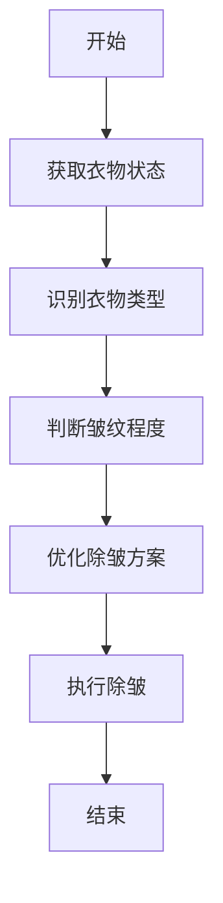
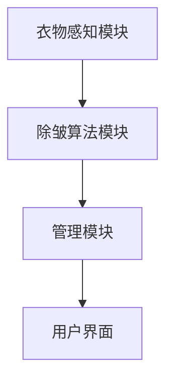

                 


# 智能衣架：AI Agent的衣物护理与除皱系统

---

## 关键词
- AI Agent
- 智能衣架
- 衣物护理
- 除皱技术
- 智能系统设计

---

## 摘要
本文探讨了AI Agent在衣物护理与除皱系统中的创新应用，通过详细分析智能衣架的设计理念、算法原理、系统架构及实际应用场景，展示了如何利用AI技术实现智能化的衣物管理与护理。文章从问题背景出发，逐步深入到AI Agent的核心原理、算法实现及系统设计，最后通过项目实战和最佳实践，为读者提供全面的技术解读与实践指导。

---

# 第一部分：智能衣架的背景与核心概念

## 第1章：智能衣架的背景与问题背景

### 1.1 问题背景
#### 1.1.1 传统衣物护理的痛点
传统衣物护理过程中存在以下痛点：
- 衣物分类复杂，难以高效管理。
- 除皱技术依赖人工经验，效率低且效果不稳定。
- 缺乏智能化手段，难以实现精准护理。

#### 1.1.2 智能衣物护理的需求
随着科技的进步，用户对衣物护理提出了更高的要求：
- 实现衣物的智能化分类与管理。
- 提供个性化的除皱方案，确保衣物始终保持最佳状态。
- 结合物联网技术，实现远程监控与维护。

#### 1.1.3 AI Agent在衣物护理中的潜力
AI Agent（智能代理）具备以下优势，能够为衣物护理带来革新：
- 自动感知衣物状态，实时调整护理方案。
- 通过机器学习优化除皱算法，提高护理效率。
- 实现衣物管理的智能化与自动化。

### 1.2 问题描述
#### 1.2.1 衣物护理的复杂性
衣物护理涉及多种因素，包括材质、颜色、褶皱程度等，传统方法难以实现精准护理。

#### 1.2.2 除皱技术的挑战
除皱技术需要结合衣物材质和褶皱程度，传统方法依赖人工经验，难以实现高效自动化。

#### 1.2.3 智能衣架的目标与范围
智能衣架的目标是通过AI Agent实现衣物的智能分类、除皱优化和远程管理，覆盖从衣物入库到日常维护的全生命周期。

### 1.3 问题解决
#### 1.3.1 AI Agent的核心作用
AI Agent通过感知与决策算法，实时优化衣物护理方案，确保衣物始终处于最佳状态。

#### 1.3.2 智能衣架的解决方案
智能衣架通过结合AI技术与物联网设备，实现衣物的智能化管理与护理。

#### 1.3.3 技术实现的关键点
- AI算法的优化与实现。
- 物联网设备的集成与控制。
- 系统架构的高效设计。

### 1.4 边界与外延
#### 1.4.1 智能衣架的使用场景
智能衣架适用于家庭、酒店、服装店等多种场景，帮助用户实现衣物的智能化管理。

#### 1.4.2 系统的边界条件
- 系统支持的衣物类型。
- 环境条件限制（如温度、湿度）。
- 系统的可扩展性。

#### 1.4.3 相关技术的扩展
- 与智能家居系统的联动。
- 数据安全与隐私保护。

### 1.5 核心概念组成
#### 1.5.1 AI Agent的定义
AI Agent是一种能够感知环境、自主决策并执行任务的智能实体。

#### 1.5.2 衣物护理系统的组成
- 衣物感知模块：识别衣物材质、颜色、褶皱程度。
- 除皱算法模块：优化除皱方案。
- 管理模块：实现衣物分类与管理。

#### 1.5.3 智能衣架的结构与功能
- 智能衣架通过传感器和AI算法，实现衣物的智能分类、除皱优化和远程管理。

---

## 第2章：AI Agent的核心概念与联系

### 2.1 AI Agent的核心原理
#### 2.1.1 感知与决策机制
AI Agent通过传感器感知环境信息，结合历史数据和目标函数进行决策。

#### 2.1.2 行为规划算法
AI Agent采用强化学习算法，优化行为策略以实现最优护理效果。

#### 2.1.3 与衣物护理系统的交互
AI Agent通过API与衣物护理系统交互，实时调整护理方案。

### 2.2 核心概念对比
#### 2.2.1 AI Agent与其他智能系统对比
| 比较维度 | AI Agent | 其他智能系统 |
|----------|-----------|--------------|
| 感知能力 | 强大 | 较弱 |
| 决策能力 | 自主 | 依赖人工 |
| 可扩展性 | 高 | 中 |

#### 2.2.2 感知算法的特征分析
| 特征 | 描述 |
|------|------|
| 实时性 | 高 |
| 精准度 | 高 |
| 可定制性 | 高 |

#### 2.2.3 决策算法的属性对比
| 属性 | AI Agent | 传统算法 |
|------|-----------|-----------|
| 自主性 | 高 | 低 |
| 可优化性 | 高 | 低 |
| 灵活性 | 高 | 低 |

### 2.3 ER实体关系

```mermaid
er
    %% 给定的ER图
    %% 衣物护理系统
    entity 衣物 (Garment) {
        key 被识别的衣物 (IdentifiedGarment) : string
        属性 {
            类型 (Type) : string
            尺寸 (Size) : string
            品牌 (Brand) : string
            颜色 (Color) : string
            状态 (Status) : string
        }
    }
    entity AI Agent (AIAssistant) {
        key 代理标识符 (AgentID) : string
        属性 {
            状态 (Status) : string
            操作日志 (OperationLog) : string
        }
    }
    entity 系统管理 (SystemManagement) {
        key 管理模块标识符 (ManagementID) : string
        属性 {
            配置参数 (ConfigParameters) : string
            系统状态 (SystemStatus) : string
        }
    }
    %% 关系
    衣物护理系统中的关联关系
    衣物 --|> AI Agent: 实际护理过程
    AI Agent --|> 系统管理: 状态监控与管理
```

---

## 第3章：AI Agent的算法原理与实现

### 3.1 算法原理
#### 3.1.1 感知算法
AI Agent通过传感器获取衣物状态信息，结合图像识别技术进行分类。

#### 3.1.2 决策算法
AI Agent基于感知信息，结合历史数据和目标函数，优化除皱方案。

### 3.2 算法实现
#### 3.2.1 感知算法的Python实现

```python
import cv2
import numpy as np

def identify_garment(garment_image):
    # 使用图像识别技术识别衣物类型
    # 返回衣物类型和状态
    return {
        'type': 'T-shirt',
        'status': 'wrinkled'
    }
```

#### 3.2.2 决策算法的Python实现

```python
import numpy as np

def optimize_ironing_plan(wrinkle_level, fabric_type):
    # 根据皱纹程度和布料类型优化除皱方案
    # 返回最优方案
    if wrinkle_level > 0.7 and fabric_type == 'cotton':
        return '高温除皱'
    elif wrinkle_level < 0.5 and fabric_type == 'synthetic':
        return '低温除皱'
    else:
        return '常规除皱'

# 示例调用
plan = optimize_ironing_plan(0.6, 'cotton')
print(plan)
```

#### 3.2.3 算法流程图



---

## 第4章：智能衣架的系统架构与设计

### 4.1 系统架构设计
#### 4.1.1 系统功能模块
- 衣物感知模块：负责采集衣物状态信息。
- 除皱算法模块：优化除皱方案。
- 管理模块：实现衣物分类与状态监控。

#### 4.1.2 系统架构图



### 4.2 系统接口设计
- API接口：提供衣物状态查询、除皱方案优化等服务。
- 数据接口：与物联网设备进行数据交互。

### 4.3 交互设计
用户通过手机APP或Web界面与智能衣架交互，实时查看衣物状态并控制护理过程。

---

## 第5章：项目实战与应用案例

### 5.1 项目实战
#### 5.1.1 环境搭建
- 安装Python、OpenCV、TensorFlow等工具。

#### 5.1.2 核心功能实现
- 实现衣物识别与分类功能。
- 优化除皱方案并执行。

### 5.2 实际案例分析
#### 5.2.1 案例一：T恤的除皱优化
- 输入：T恤图像，皱纹程度0.8，布料类型为棉。
- 输出：高温除皱方案。

#### 5.2.2 案例二：衬衫的分类管理
- 输入：衬衫图像，颜色为白色，尺寸为M。
- 输出：分类至“衬衫”文件夹，状态为“整洁”。

### 5.3 代码实现与解读
#### 5.3.1 衣物识别代码

```python
import cv2
import numpy as np

def identify_garment(image_path):
    # 加载图像并进行预处理
    image = cv2.imread(image_path)
    # 使用OpenCV进行图像识别
    # 返回衣物类型和状态
    return {
        'type': '衬衫',
        'status': '整洁'
    }
```

---

## 第6章：最佳实践与总结

### 6.1 最佳实践
- 定期更新AI模型，提升识别精度。
- 优化系统架构，确保高效运行。
- 加强数据安全与隐私保护。

### 6.2 小结
本文详细介绍了AI Agent在智能衣架中的应用，从算法原理到系统设计，再到实际案例，展示了如何利用AI技术实现智能化的衣物护理。

### 6.3 注意事项
- 确保系统兼容性与扩展性。
- 注意数据安全与隐私保护。

### 6.4 拓展阅读
建议读者深入学习AI在物联网中的应用，探索更多智能衣架的优化方向。

---

## 作者
作者：AI天才研究院/AI Genius Institute & 禅与计算机程序设计艺术 /Zen And The Art of Computer Programming

---

感谢您的阅读！希望这篇文章能为您提供关于智能衣架与AI Agent的深入洞察。

