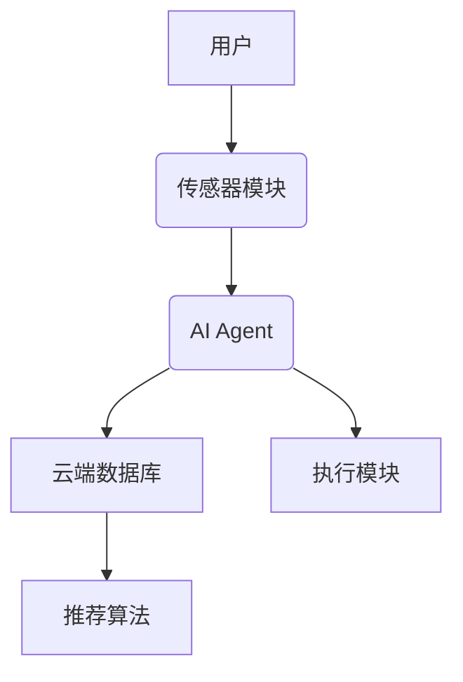
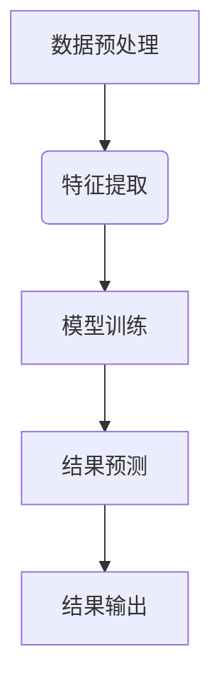
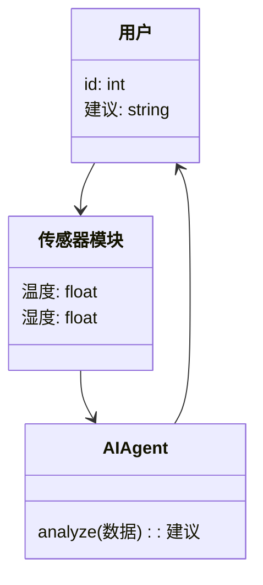

                 


# 智能衣架：AI Agent的衣物护理建议

## 关键词：AI Agent, 智能衣架, 衣物护理, 推荐算法, 系统架构

## 摘要：  
本文探讨了AI Agent在衣物护理中的创新应用，重点介绍了智能衣架的设计与实现。通过分析衣物护理的核心需求与痛点，结合AI技术，提出了一种基于推荐算法的智能衣架解决方案。文章详细讲解了AI Agent的工作原理、推荐算法的数学模型、系统架构设计，并通过实际案例展示了项目的实现过程与成果。最终，本文总结了智能衣架的优势与未来发展方向，为衣物护理智能化提供了新的思路。

---

# 第1章: AI Agent与智能衣架概述

## 1.1 AI Agent的基本概念  
### 1.1.1 AI Agent的定义与特点  
AI Agent（人工智能代理）是指能够感知环境、自主决策并执行任务的智能实体。其特点包括：  
1. **自主性**：无需人工干预，能够独立完成任务。  
2. **反应性**：能够实时感知环境变化并做出响应。  
3. **学习能力**：通过数据反馈不断优化自身行为。  

### 1.1.2 AI Agent在衣物护理中的应用前景  
AI Agent在衣物护理中的应用潜力巨大，尤其是在衣物分类、清洁建议和存储优化等方面，能够显著提升衣物护理的效率和效果。  

### 1.1.3 智能衣架的核心功能与目标  
智能衣架的目标是通过AI技术，为用户提供智能化的衣物护理建议，帮助用户更好地管理衣物。其核心功能包括：  
1. 衣物分类与识别。  
2. 清洁建议与提醒。  
3. 存储优化与推荐。  

---

## 1.2 衣物护理的背景与挑战  
### 1.2.1 衣物护理的基本需求  
衣物护理的基本需求包括清洗、晾晒、折叠、存放等，但传统方法效率低、易出错。  

### 1.2.2 传统衣物护理的痛点与不足  
传统衣物护理的痛点包括：  
1. 时间成本高。  
2. 专业知识不足。  
3. 管理不系统。  

### 1.2.3 AI技术在衣物护理中的潜在价值  
AI技术能够通过数据驱动的方式，提供个性化、智能化的衣物护理建议，显著提升效率和效果。  

---

## 1.3 智能衣架的定义与应用场景  
### 1.3.1 智能衣架的定义  
智能衣架是一种结合AI技术的衣物管理工具，能够通过传感器和AI算法，为用户提供智能化的衣物护理建议。  

### 1.3.2 智能衣架的主要功能模块  
1. **传感器模块**：采集衣物的状态信息（如温度、湿度等）。  
2. **AI Agent模块**：分析数据并生成护理建议。  
3. **用户交互模块**：通过App或语音助手与用户互动。  

### 1.3.3 智能衣架的典型应用场景  
1. **家庭衣物管理**：帮助用户更好地管理家庭衣物。  
2. **酒店与商场**：优化衣物存储与管理流程。  

---

## 1.4 本章小结  
本章介绍了AI Agent的基本概念、智能衣架的核心功能与目标，并分析了传统衣物护理的痛点与AI技术的潜在价值。通过这些内容，我们为后续章节的展开奠定了基础。

---

# 第2章: 智能衣架的核心概念与联系

## 2.1 AI Agent的核心原理  
### 2.1.1 AI Agent的感知模块  
感知模块负责采集环境数据，如衣物的温度、湿度等。  

### 2.1.2 AI Agent的决策模块  
决策模块通过分析感知数据，生成衣物护理建议。  

### 2.1.3 AI Agent的执行模块  
执行模块负责将决策模块的建议转化为具体操作，如提醒用户清洗衣物。  

---

## 2.2 衣物护理的数学模型与特征分析  
### 2.2.1 衣物护理的基本特征  
衣物护理的基本特征包括：  
1. **材质特征**：不同材质的衣物需要不同的护理方法。  
2. **使用频率**：衣物的使用频率影响其护理策略。  

### 2.2.2 衣物护理的数学模型构建  
基于特征分析，构建衣物护理的数学模型，用于生成个性化建议。  

### 2.2.3 衣物护理特征的对比分析表  
| 特征 | 高端衣物 | 普通衣物 |  
|------|----------|----------|  
| 材质 | 羊毛、丝绸 | 棉、涤纶 |  
| 清洗频率 | 低 | 高 |  

---

## 2.3 智能衣架的系统架构图  


---

## 2.4 本章小结  
本章详细讲解了AI Agent的核心原理，并通过对比分析和系统架构图，展示了智能衣架的整体设计思路。

---

# 第3章: 智能衣架的算法原理

## 3.1 推荐算法的基本原理  
### 3.1.1 基于协同过滤的推荐算法  
协同过滤是一种常见的推荐算法，通过分析用户行为相似性，推荐相似的衣物护理方法。  

### 3.1.2 基于内容的推荐算法  
内容推荐算法通过分析衣物的特征（如材质、颜色等），生成个性化建议。  

### 3.1.3 混合推荐算法  
混合推荐算法结合协同过滤和内容推荐的优势，提供更精准的建议。  

---

## 3.2 推荐算法的数学模型  
### 3.2.1 协同过滤的数学公式  
$$相似度计算公式：sim(i,j) = \frac{\sum_{k} (r_{i,k} - \bar{r}_i)(r_{j,k} - \bar{r}_j)}{\sqrt{\sum_{k} (r_{i,k} - \bar{r}_i)^2} \cdot \sqrt{\sum_{k} (r_{j,k} - \bar{r}_j)^2}}$$  

### 3.2.2 内容推荐的特征提取方法  
通过主成分分析（PCA）提取衣物材质的关键特征。  

---

## 3.3 算法实现的流程图  


---

## 3.4 本章小结  
本章详细讲解了推荐算法的基本原理，并通过数学公式和流程图，展示了算法实现的步骤。

---

# 第4章: 智能衣架的系统分析与架构设计

## 4.1 系统功能设计  
### 4.1.1 用户需求分析  
用户需求包括：  
1. 实时监测衣物状态。  
2. 获取个性化护理建议。  

### 4.1.2 功能模块划分  
1. **数据采集模块**：采集衣物状态数据。  
2. **AI处理模块**：分析数据并生成建议。  
3. **用户交互模块**：与用户互动并展示结果。  

---

## 4.2 系统架构设计  
### 4.2.1 领域模型（mermaid类图）  


### 4.2.2 系统架构图  


---

## 4.3 本章小结  
本章通过系统分析与架构设计，详细展示了智能衣架的实现过程。

---

# 第5章: 智能衣架的项目实战

## 5.1 环境安装与配置  
### 5.1.1 Python环境安装  
安装Python 3.8及以上版本，安装必要的库（如numpy、pandas、scikit-learn）。  

### 5.1.2 传感器模块配置  
配置温度和湿度传感器，确保数据采集正常。  

---

## 5.2 核心代码实现  
### 5.2.1 数据采集代码  
```python
import numpy as np
import pandas as pd

# 数据采集代码
def collect_data():
    temperature = 25.0  # 模拟温度数据
    humidity = 60.0     # 模拟湿度数据
    return temperature, humidity
```

### 5.2.2 推荐算法代码  
```python
from sklearn.neighbors import NearestNeighbors

# 协同过滤算法实现
def collaborative_filtering(data, user_id):
    model = NearestNeighbors(n_neighbors=5).fit(data)
    distances, indices = model.kneighbors([data[user_id]])
    return indices.flatten()
```

---

## 5.3 代码解读与分析  
1. 数据采集代码用于获取衣物状态数据。  
2. 推荐算法代码通过协同过滤生成个性化建议。  

---

## 5.4 实际案例分析  
以一件羊毛衣物为例，分析系统的实际运行过程。  

---

## 5.5 本章小结  
本章通过实际案例和代码实现，展示了智能衣架的可行性与实用性。

---

# 第6章: 智能衣架的最佳实践

## 6.1 小结  
智能衣架通过AI技术显著提升了衣物护理的效率和效果。  

## 6.2 注意事项  
1. 数据隐私保护。  
2. 系统稳定性保障。  

## 6.3 拓展阅读  
推荐阅读相关领域的书籍，如《机器学习实战》和《人工智能：一种现代方法》。

---

# 作者：AI天才研究院 & 禅与计算机程序设计艺术

