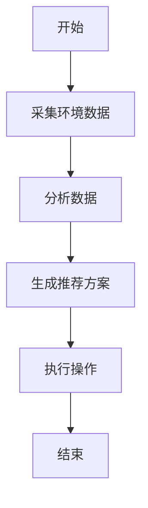
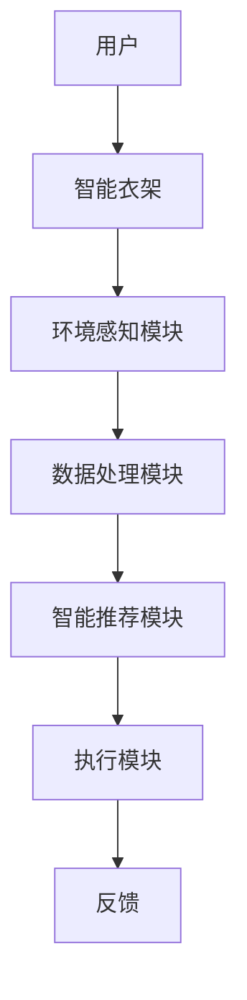

                 


# 智能衣架：AI Agent的衣物除味与保养建议

> **关键词**：AI Agent、智能衣架、衣物除味、衣物保养、环境感知、智能推荐  
> **摘要**：本文深入探讨了AI Agent技术在智能衣架中的应用，重点分析了衣物除味与保养的核心算法、系统架构设计以及实际应用场景。通过详细的技术分析和实例演示，展示了如何利用AI技术提升衣物管理的智能化水平。

---

# 第1章: AI Agent与智能衣架概述

## 1.1 AI Agent的基本概念
### 1.1.1 AI Agent的定义与特点
AI Agent（人工智能代理）是指能够感知环境、自主决策并执行任务的智能实体。它具备以下特点：
- **自主性**：无需外部干预，自主完成任务。
- **反应性**：能够实时感知环境变化并做出响应。
- **目标导向**：基于预设目标或用户需求执行操作。

### 1.1.2 AI Agent的核心功能与应用场景
AI Agent的核心功能包括：
- 信息采集与处理
- 智能决策与推荐
- 自动化执行

应用场景：
- 智能家居
- 个人助手
- 物流配送

### 1.1.3 智能衣架的定义与基本功能
智能衣架是一种结合AI Agent技术的衣物管理设备，具备以下功能：
- **智能除味**：通过环境感知和AI算法推荐除味方案。
- **衣物保养建议**：根据衣物材质和环境数据提供建议。
- **自动化管理**：智能分类、存储和提醒更换衣物。

---

## 1.2 衣物除味与保养的现状与挑战
### 1.2.1 衣物除味的传统方法与局限性
传统除味方法包括：
- **晾晒**：依赖自然条件，效率低。
- **化学除味剂**：可能对衣物和环境造成损害。
- **物理吸附**：效果有限，难以彻底去除异味。

### 1.2.2 衣物保养的常见问题与解决方案
常见问题：
- **材质损坏**：不当清洁导致衣物受损。
- **保养周期不明确**：缺乏科学依据。

解决方案：
- **AI推荐**：基于衣物材质和环境数据提供个性化保养建议。
- **自动化提醒**：通过AI算法计算最佳保养时间。

### 1.2.3 AI技术在衣物除味与保养中的应用前景
AI技术的优势：
- **精准感知**：通过传感器精确采集环境数据。
- **智能推荐**：基于大数据分析提供最优解决方案。
- **自动化执行**：通过AI Agent实现自动操作。

---

## 1.3 智能衣架的定义与应用场景
### 1.3.1 智能衣架的核心功能
- **环境感知**：通过传感器采集温度、湿度、气味等数据。
- **智能推荐**：基于数据推荐除味方案和保养计划。
- **自动化管理**：实现衣物分类、存储和提醒更换。

### 1.3.2 智能衣架的用户需求与市场定位
用户需求：
- **高效除味**：快速去除衣物异味。
- **智能化管理**：通过AI技术实现衣物的智能管理。
- **便捷性**：操作简单，节省时间。

市场定位：
- **智能家居**：作为智能家居的一部分，提升生活品质。
- **个人用户**：满足家庭和个人用户的衣物管理需求。

### 1.3.3 智能衣架的未来发展与潜力
未来发展：
- **技术融合**：与其他智能家居设备联动。
- **服务扩展**：提供更多衣物管理相关服务。
- **用户体验优化**：通过反馈不断优化AI算法。

---

## 1.4 本章小结
本章介绍了AI Agent的基本概念、智能衣架的核心功能以及衣物除味与保养的现状与挑战。通过分析，我们明确了智能衣架在提升衣物管理智能化水平方面的巨大潜力。

---

# 第2章: AI Agent的核心技术

## 2.1 AI Agent的核心技术原理
### 2.1.1 语音交互技术
- **语音识别**：通过麦克风采集用户指令并转化为文本。
- **自然语言处理**：理解用户意图并生成回应。

### 2.1.2 环境感知技术
- **传感器数据采集**：温度、湿度、气味等环境数据的采集。
- **数据融合**：通过算法整合多源数据，提高感知精度。

### 2.1.3 智能推荐算法
- **基于规则的推荐**：根据预设规则推荐解决方案。
- **基于机器学习的推荐**：通过训练模型实现个性化推荐。

---

## 2.2 AI Agent的功能模块与实现
### 2.2.1 语音识别与自然语言处理
- **语音识别实现**：使用Python的`speech_recognition`库实现语音识别。
- **自然语言处理**：基于`spaCy`进行语义分析。

### 2.2.2 数据采集与分析
- **传感器数据采集**：通过`Raspberry Pi`采集环境数据。
- **数据分析**：使用`Python`进行数据清洗和特征提取。

### 2.2.3 智能决策与执行
- **决策算法**：基于`决策树`或`随机森林`进行决策。
- **执行模块**：通过`GPIO`控制执行机构。

---

## 2.3 AI Agent的算法原理与流程
### 2.3.1 算法流程图（Mermaid图）


### 2.3.2 算法实现代码
```python
import speech_recognition as sr
from datetime import datetime

# 初始化语音识别器
r = sr.Recognizer()

# 采集语音输入
with sr.Microphone() as source:
    print("请开始说话...")
    audio = r.listen(source)

# 识别语音
try:
    text = r.recognize_google(audio)
    print(f"识别到：{text}")
except sr.UnknownValueError:
    print("抱歉，未能识别到语音。")
```

---

## 2.4 本章小结
本章详细介绍了AI Agent的核心技术，包括语音交互、环境感知和智能推荐算法的实现原理和流程。通过代码示例和流程图，帮助读者更好地理解AI Agent的技术细节。

---

# 第3章: 智能衣架的系统架构设计

## 3.1 系统功能设计
### 3.1.1 用户需求分析
- **用户需求**：快速去除衣物异味，智能化管理衣物。
- **功能需求**：环境感知、智能推荐、自动化管理。

### 3.1.2 功能模块划分
- **环境感知模块**：采集环境数据。
- **智能推荐模块**：生成除味方案。
- **自动化执行模块**：控制执行机构。

### 3.1.3 界面设计与交互流程
- **界面设计**：简洁直观的用户界面。
- **交互流程**：用户输入需求，系统执行操作并反馈结果。

---

## 3.2 系统架构设计
### 3.2.1 分层架构设计（Mermaid图）


### 3.2.2 模块间接口设计
- **环境感知模块接口**：提供温度、湿度、气味数据。
- **智能推荐模块接口**：接收数据并返回推荐方案。
- **执行模块接口**：根据推荐方案执行操作。

### 3.2.3 系统扩展性设计
- **模块化设计**：便于功能扩展。
- **兼容性设计**：支持多种传感器和执行机构。

---

## 3.3 系统实现与代码分析
### 3.3.1 环境搭建与工具安装
- **硬件工具**：Raspberry Pi、传感器模块。
- **软件工具**：Python、相关库（如`speech_recognition`、`numpy`）。

### 3.3.2 核心算法实现（Python代码示例）
```python
import numpy as np

# 环境数据
temperature = np.array([25.0])
humidity = np.array([60.0])
odour_level = np.array([3.5])

# 智能推荐算法
def recommend_cleaning_method(temp, hum, odour):
    if odour > 3.0:
        return "使用专业除味剂"
    elif temp > 25 and hum > 60:
        return "建议晾晒"
    else:
        return "无需处理"

# 执行推荐
method = recommend_cleaning_method(*[temperature[0], humidity[0], odour_level[0]])
print(f"推荐的除味方法：{method}")
```

### 3.3.3 系统功能实现与测试
- **功能实现**：环境感知、智能推荐、自动化执行。
- **测试验证**：通过实际测试验证系统的稳定性和准确性。

---

## 3.4 本章小结
本章详细描述了智能衣架的系统架构设计，包括功能模块划分、系统架构设计和代码实现。通过实际代码示例，帮助读者理解系统的实现过程。

---

# 第4章: 智能衣架的算法实现与优化

## 4.1 除味算法的设计与实现
### 4.1.1 算法原理
- **数据采集**：通过传感器采集环境数据。
- **数据分析**：基于机器学习算法分析数据，生成推荐方案。
- **优化策略**：根据用户反馈不断优化算法。

### 4.1.2 算法流程图（Mermaid图）


### 4.1.3 算法实现代码
```python
import numpy as np
from sklearn.svm import SVC

# 数据集
X = np.array([[25, 60, 3.5], [26, 65, 4.0], [24, 55, 2.8]])
y = np.array(["使用除味剂", "晾晒", "无需处理"])

# 训练模型
model = SVC()
model.fit(X, y)

# 预测
new_data = np.array([[25, 60, 3.5]])
print(f"推荐的除味方法：{model.predict(new_data)}")
```

---

## 4.2 系统优化与改进
### 4.2.1 算法优化
- **特征选择**：优化数据采集和处理流程。
- **模型优化**：改进算法以提高准确率。

### 4.2.2 系统性能提升
- **硬件优化**：选用更高精度的传感器。
- **软件优化**：优化代码实现，提高运行效率。

---

## 4.3 本章小结
本章详细探讨了智能衣架的算法实现与优化，包括除味算法的设计、流程图绘制和代码实现。通过优化策略，进一步提高了系统的智能化水平。

---

# 第5章: 项目实战与应用

## 5.1 项目环境搭建
### 5.1.1 硬件环境
- **Raspberry Pi**：作为系统控制中心。
- **传感器模块**：用于采集环境数据。
- **执行机构**：用于自动化操作。

### 5.1.2 软件环境
- **Python**：编程语言。
- **相关库**：`speech_recognition`、`numpy`等。

---

## 5.2 核心功能实现
### 5.2.1 语音交互实现
```python
import speech_recognition as sr

# 初始化语音识别器
r = sr.Recognizer()

# 采集语音输入
with sr.Microphone() as source:
    print("请开始说话...")
    audio = r.listen(source)

# 识别语音
try:
    text = r.recognize_google(audio)
    print(f"识别到：{text}")
except sr.UnknownValueError:
    print("抱歉，未能识别到语音。")
```

### 5.2.2 智能推荐实现
```python
import numpy as np
from sklearn.svm import SVC

# 数据集
X = np.array([[25, 60, 3.5], [26, 65, 4.0], [24, 55, 2.8]])
y = np.array(["使用除味剂", "晾晒", "无需处理"])

# 训练模型
model = SVC()
model.fit(X, y)

# 预测
new_data = np.array([[25, 60, 3.5]])
print(f"推荐的除味方法：{model.predict(new_data)}")
```

---

## 5.3 系统测试与优化
### 5.3.1 测试方案
- **功能测试**：测试各功能模块的正常运行。
- **性能测试**：测试系统的响应时间和稳定性。
- **用户体验测试**：收集用户反馈，优化系统设计。

### 5.3.2 优化策略
- **算法优化**：提高模型准确率。
- **系统优化**：优化代码实现，提升运行效率。

---

## 5.4 本章小结
本章通过项目实战，详细展示了智能衣架的实现过程，包括环境搭建、核心功能实现和系统测试与优化。通过实际操作，帮助读者更好地理解和掌握智能衣架的实现技术。

---

# 第6章: 最佳实践与未来展望

## 6.1 最佳实践
### 6.1.1 小结
- **功能实现**：智能衣架的核心功能包括环境感知、智能推荐和自动化管理。
- **系统优化**：通过算法优化和系统优化提升系统性能。
- **用户体验**：注重用户体验，优化界面设计和交互流程。

### 6.1.2 注意事项
- **数据隐私**：确保用户数据的安全性和隐私性。
- **系统稳定性**：确保系统在各种环境下稳定运行。
- **用户反馈**：及时收集用户反馈，持续优化系统。

### 6.1.3 拓展阅读
- **AI技术**：深入学习机器学习和深度学习技术。
- **智能家居**：研究智能家居的其他应用场景。

---

## 6.2 未来展望
- **技术融合**：与更多智能家居设备联动，构建完整的智能家居生态系统。
- **服务扩展**：提供更多衣物管理相关服务，如智能洗衣、智能收纳等。
- **用户体验优化**：通过AI技术不断优化用户体验，提升用户满意度。

---

# 作者：AI天才研究院/AI Genius Institute & 禅与计算机程序设计艺术 /Zen And The Art of Computer Programming

---

以上是《智能衣架：AI Agent的衣物除味与保养建议》的技术博客文章的完整目录和内容概要。通过本文，我们详细探讨了AI Agent技术在智能衣架中的应用，从算法实现到系统设计，再到项目实战，为读者提供了全面的技术指导和实践方案。

