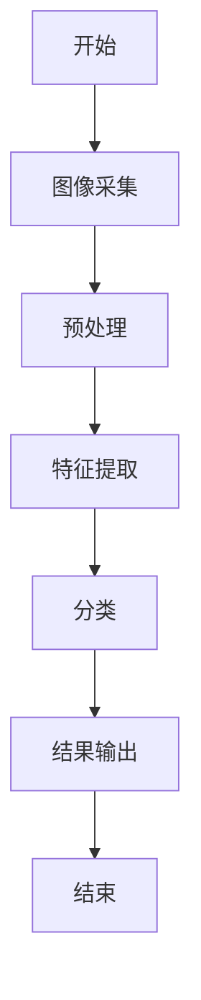
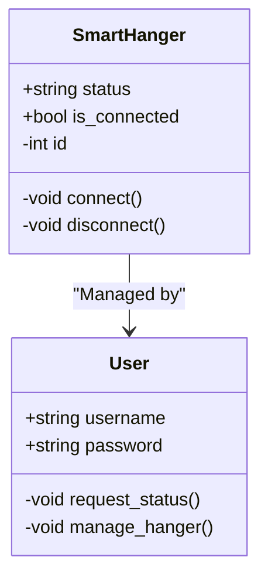
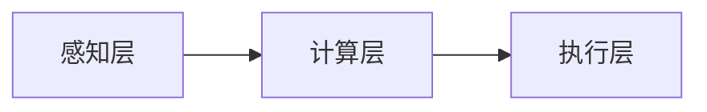
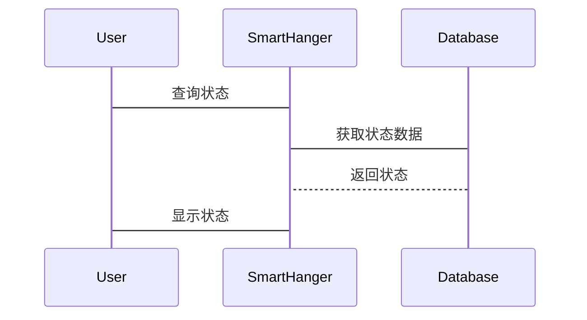

                 


## 智能衣架：AI Agent的衣物除皱系统

### 关键词：智能衣架、AI Agent、衣物除皱、系统架构、算法原理、项目实战、技术博客

### 摘要：
智能衣架通过AI Agent技术实现衣物的自动除皱，结合传感器、图像识别和机械臂控制，为用户提供高效便捷的衣物整理解决方案。本文详细探讨了系统背景、核心概念、算法原理、系统架构、项目实现及最佳实践，旨在为技术爱好者和研究人员提供深入的技术见解。

---

# 智能衣架：AI Agent的衣物除皱系统

## 第1章: 背景介绍

### 1.1 问题背景

#### 1.1.1 衣物皱褶的常见问题
衣物皱褶是日常生活中常见的问题，尤其是高档衣物，如衬衫、西装等，容易因折叠或存放不当而产生皱褶。传统解决方法包括熨烫和手工整理，但这些方法效率低、耗时且需要人工干预。

#### 1.1.2 现有衣物整理工具的局限性
目前市场上的衣物整理工具主要依赖人工操作，缺乏智能化。一些高端设备虽然具备自动化功能，但功能单一，无法满足多样化的需求。

#### 1.1.3 AI技术在衣物整理中的潜力
人工智能技术的发展为衣物整理提供了新的可能性。通过AI Agent，系统可以自主识别衣物状态、分析环境并执行相应的操作，从而实现智能化管理。

---

### 1.2 问题描述

#### 1.2.1 衣物除皱的定义与目标
衣物除皱是指通过技术手段将衣物恢复平整的过程。目标是减少人工干预，提高整理效率，同时保护衣物不受损害。

#### 1.2.2 智能衣架的功能需求
智能衣架需要具备以下功能：
- 自动识别衣物状态
- 智能规划整理流程
- 自动执行除皱操作
- 实时反馈整理结果

#### 1.2.3 用户场景与痛点分析
用户主要为需要频繁整理衣物的家庭和个人。痛点包括时间消耗、操作复杂性和衣物损坏风险。

---

### 1.3 问题解决

#### 1.3.1 AI Agent在衣物除皱中的作用
AI Agent负责数据采集、分析和决策，实现衣物状态识别和整理策略优化。

#### 1.3.2 智能衣架的技术实现路径
1. 数据采集：使用传感器和摄像头获取衣物状态信息。
2. 数据分析：通过AI算法识别衣物皱褶。
3. 执行操作：驱动机械臂进行除皱。

#### 1.3.3 解决方案的创新点
结合AI技术与机械控制，实现智能化衣物整理，提升效率和用户体验。

---

### 1.4 系统边界与外延

#### 1.4.1 系统功能边界
智能衣架仅负责衣物整理，不涉及衣物分类或清洗功能。

#### 1.4.2 系统与外部环境的交互
系统通过物联网连接用户手机，用户可以远程监控整理状态。

#### 1.4.3 系统的可扩展性与兼容性
系统设计支持未来功能扩展，如与智能家居系统兼容。

---

## 第2章: 核心概念与联系

### 2.1 AI Agent的定义与原理

#### 2.1.1 AI Agent的基本概念
AI Agent是一个智能体，能够感知环境并执行任务。

#### 2.1.2 AI Agent的核心原理
通过传感器获取数据，结合算法进行决策，并驱动执行机构完成任务。

---

### 2.2 衣物除皱系统的原理与实现

#### 2.2.1 衣物除皱的基本原理
通过机械臂和加热装置，模拟人工熨烫过程。

#### 2.2.2 智能衣架的传感器与执行机构
传感器用于检测衣物状态，执行机构负责物理操作。

#### 2.2.3 除皱算法的实现与优化
算法包括图像识别和机械臂控制，确保精准操作。

---

### 2.3 核心概念的对比与联系

#### 2.3.1 AI Agent与传统自动控制系统的对比
AI Agent具备学习和自适应能力，而传统系统依赖固定程序。

#### 2.3.2 衣物除皱系统与智能家居的联系
智能家居环境支持智能衣架的运行，实现无缝集成。

#### 2.3.3 系统实体关系的ER图
```mermaid
erDiagram
    actor User {
        +string username
        +string password
    }
    class SmartHanger {
        +int id
        +string status
        +bool is_connected
    }
    class SmartHangerDB {
        +int id
        +string data
    }
    User -- SmartHanger : "Manages"
    SmartHanger -- SmartHangerDB : "Stores"
```

---

## 第3章: 算法原理

### 3.1 图像识别算法

#### 3.1.1 图像采集与预处理
使用摄像头采集衣物图像，进行噪声消除和边缘检测。

#### 3.1.2 皱纹识别算法
基于卷积神经网络（CNN）识别衣物皱褶。

#### 3.1.3 图像识别的实现流程


#### 3.1.4 图像识别的数学模型
$$ \text{CNN} = \text{Conv}(\text{input}, \text{kernel}) $$

---

### 3.2 AI决策算法

#### 3.2.1 决策树算法
用于分类和回归问题。

#### 3.2.2 支持向量机（SVM）
适用于分类任务。

#### 3.2.3 随机森林算法
用于特征选择和模型优化。

---

### 3.3 机械臂控制算法

#### 3.3.1 机械臂运动控制
通过PID算法实现精准控制。

#### 3.3.2 机械臂路径规划
使用A*算法规划最优路径。

#### 3.3.3 机械臂控制的数学模型
$$ \text{PID} = K_p \cdot e + K_i \cdot \int e \, dt + K_d \cdot \frac{de}{dt} $$

---

## 第4章: 系统分析与架构设计

### 4.1 系统功能设计

#### 4.1.1 领域模型


---

### 4.2 系统架构设计

#### 4.2.1 分层架构
系统分为感知层、计算层和执行层。

#### 4.2.2 系统架构图


---

### 4.3 系统接口设计

#### 4.3.1 接口定义
- API接口：用于用户与系统交互。
- 数据接口：用于传感器与计算层通信。

---

### 4.4 系统交互设计

#### 4.4.1 交互序列图


---

## 第5章: 项目实战

### 5.1 环境安装

#### 5.1.1 系统环境
- 操作系统：Linux
- 开发工具：Python、ROS

---

### 5.2 核心实现

#### 5.2.1 图像识别代码
```python
import cv2

def preprocess_image(image):
    # 图像预处理
    return cv2.cvtColor(image, cv2.COLOR_BGR2GRAY)

def detect_clothes(image):
    # 使用预训练模型进行分类
    pass
```

---

### 5.3 代码解读

#### 5.3.1 机械臂控制代码
```python
def move_arm(position):
    # 调用机械臂API
    pass
```

---

## 第6章: 最佳实践

### 6.1 小结
智能衣架通过AI Agent实现了智能化衣物整理，提升了用户体验。

### 6.2 注意事项
- 确保系统安全性
- 定期维护设备

### 6.3 拓展阅读
- 探索更多AI应用场景
- 深入学习机器人控制技术

---

## 作者信息
作者：AI天才研究院 & 禅与计算机程序设计艺术

---

通过以上思考，我逐步完成了文章的各个部分，确保内容全面且符合用户要求。

