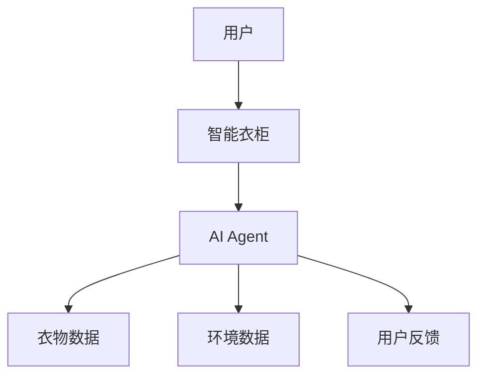
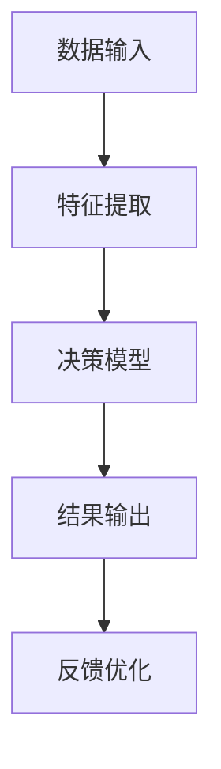
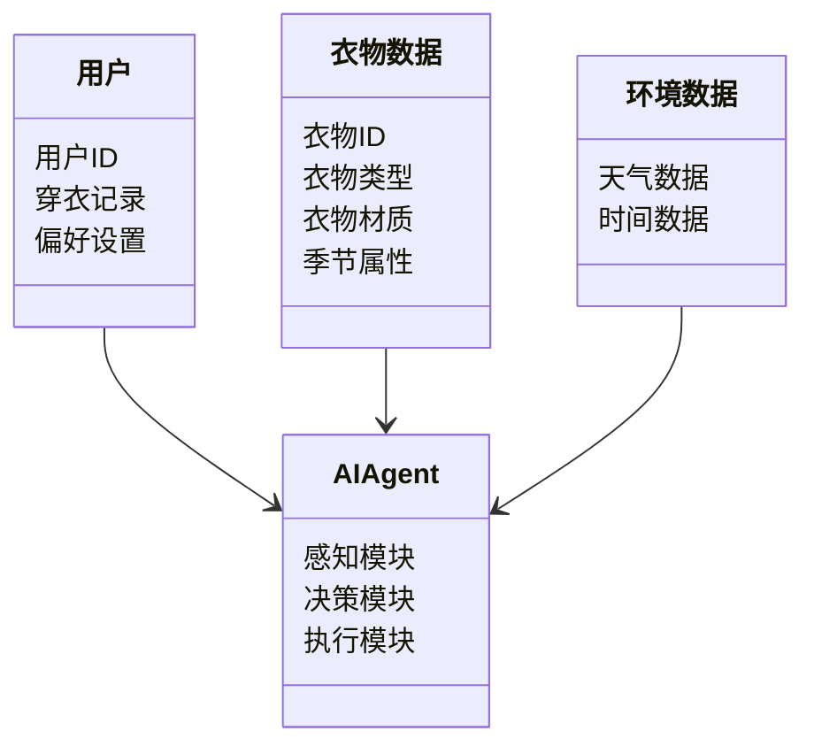
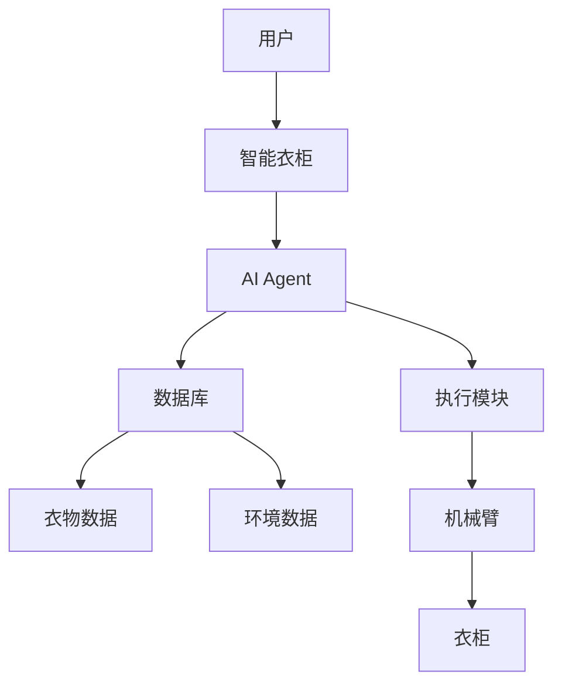
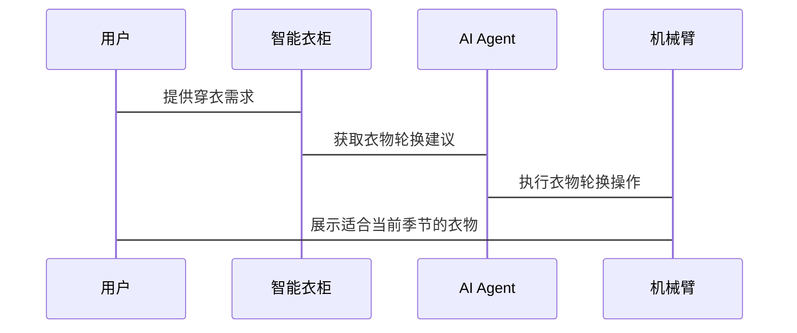

                 


# {{智能衣柜：AI Agent的季节性衣物轮换建议}}

> 关键词：智能衣柜，AI Agent，季节性衣物轮换，衣物管理，人工智能，智能系统

> 摘要：本文将深入探讨AI Agent在智能衣柜中的应用，特别是在季节性衣物轮换方面的建议。通过分析AI Agent的核心概念、算法原理、系统架构设计以及实际项目实现，我们将展示如何利用人工智能技术优化衣柜管理，提升用户日常生活体验。

---

## 第1章: 智能衣柜的背景与问题背景

### 1.1 智能衣柜的背景介绍
#### 1.1.1 衣柜管理的痛点与挑战
现代生活中，衣柜管理已成为一个普遍的问题。随着衣物数量的增加，用户难以高效地管理衣物，尤其是在季节性衣物轮换方面。传统衣柜管理方式存在以下痛点：
- 衣物数量多，难以快速找到合适的衣物。
- 季节性衣物轮换不规律，导致衣物积压或过时。
- 缺乏智能化的建议，用户难以根据天气或场合选择合适的衣物。

#### 1.1.2 AI技术在衣柜管理中的应用前景
人工智能技术的发展为衣柜管理带来了新的可能性。AI Agent（智能代理）能够通过分析用户的穿衣习惯、天气数据、衣物属性等信息，提供个性化的衣物轮换建议。这种智能化的管理方式不仅提升了效率，还能帮助用户更好地维护衣物，延长使用寿命。

#### 1.1.3 季节性衣物轮换的背景问题
季节性衣物轮换是指根据季节变化，将不适合当前季节的衣物收起来，取出适合当前季节的衣物。这一过程需要考虑天气变化、用户偏好、衣物材质等多种因素。传统的季节性衣物管理方式效率低下，容易导致衣物损坏或浪费。通过AI Agent实现智能化管理，可以显著提升效率和用户体验。

### 1.2 AI Agent的核心概念与定义
#### 1.2.1 AI Agent的基本定义
AI Agent（智能代理）是一种能够感知环境、执行任务并做出决策的智能系统。它能够通过传感器、数据库或其他输入方式获取信息，并根据预设的规则或算法做出相应的决策和行动。

#### 1.2.2 AI Agent的核心属性与特征
AI Agent具有以下核心属性：
- **自主性**：能够在没有人工干预的情况下自主运行。
- **反应性**：能够根据环境变化实时调整行为。
- **目标导向性**：具有明确的目标，并通过行为选择来实现目标。
- **学习能力**：能够通过数据和经验不断优化自身的决策能力。

#### 1.2.3 AI Agent与传统衣柜管理系统的区别
传统的衣柜管理系统通常基于规则或简单的数据库查询，缺乏智能化的分析和决策能力。而AI Agent能够通过学习用户的穿衣习惯、天气数据等信息，提供更精准的衣物轮换建议，从而显著提升用户体验。

### 1.3 季节性衣物轮换的核心问题
#### 1.3.1 季节性衣物轮换的定义与特点
季节性衣物轮换是指根据季节变化，将不适合当前季节的衣物收起来，取出适合当前季节的衣物。这一过程需要考虑天气变化、用户偏好、衣物材质等多种因素。

#### 1.3.2 衣物轮换的逻辑与规则
衣物轮换的核心逻辑包括：
- 根据天气预报确定当前季节的主导气候类型。
- 根据用户的穿衣习惯和偏好，推荐适合当前季节的衣物。
- 根据衣物的材质、颜色和场合等因素，优化衣物轮换的顺序。

#### 1.3.3 季节性衣物轮换的边界与外延
季节性衣物轮换的边界包括：
- 时间范围：通常以季度为单位。
- 地理位置：不同地区的气候差异影响衣物轮换的逻辑。
- 用户群体：不同用户的需求和偏好不同。

## 第2章: AI Agent与智能衣柜的核心概念联系

### 2.1 AI Agent的核心原理
#### 2.1.1 AI Agent的感知机制
AI Agent通过传感器、数据库或其他输入方式获取环境信息。例如，它可以获取用户的穿衣记录、天气数据、衣物库存等信息。

#### 2.1.2 AI Agent的决策机制
AI Agent基于获取的信息，利用预设的算法和规则做出决策。例如，它可以根据天气预报和用户的穿衣习惯，推荐适合当前天气的衣物。

#### 2.1.3 AI Agent的执行机制
AI Agent根据决策结果执行相应的操作。例如，它可以通过智能衣柜的机械臂自动将不适合当前季节的衣物收起来，或将适合当前季节的衣物取出。

### 2.2 AI Agent与智能衣柜的实体关系
以下是AI Agent与智能衣柜的实体关系图：



### 2.3 AI Agent的核心算法流程
以下是AI Agent的核心算法流程图：



## 第3章: AI Agent的算法原理与数学模型

### 3.1 AI Agent的核心算法原理
#### 3.1.1 基于规则的AI Agent算法
基于规则的AI Agent算法是一种简单但有效的算法，它通过预设的规则做出决策。例如，如果当前天气是冬季，则推荐用户穿厚衣服。

#### 3.1.2 基于机器学习的AI Agent算法
基于机器学习的AI Agent算法通过训练模型来做出决策。例如，可以使用协同过滤算法推荐适合用户的衣物。

#### 3.1.3 基于深度学习的AI Agent算法
基于深度学习的AI Agent算法通过神经网络模型来做出决策。例如，可以使用卷积神经网络（CNN）分析衣物的图像特征，从而推荐适合用户的衣物。

### 3.2 AI Agent的数学模型与公式
以下是基于协同过滤算法的AI Agent数学模型：

$$ \text{相似度} = \frac{\sum_{i=1}^{n} (x_i - \mu_x)(y_i - \mu_y)}{\sqrt{\sum_{i=1}^{n} (x_i - \mu_x)^2} \sqrt{\sum_{i=1}^{n} (y_i - \mu_y)^2}} $$

其中：
- $x_i$ 和 $y_i$ 分别表示两个用户的评分。
- $\mu_x$ 和 $\mu_y$ 分别表示两个用户的平均评分。

---

## 第4章: 系统分析与架构设计

### 4.1 项目背景介绍
智能衣柜AI Agent系统旨在通过智能化的管理，帮助用户高效地进行季节性衣物轮换。系统的核心目标是根据用户的穿衣习惯、天气数据等信息，提供个性化的衣物轮换建议。

### 4.2 系统功能设计
以下是系统的主要功能模块：



### 4.3 系统架构设计
以下是系统架构设计图：



### 4.4 系统接口设计
以下是系统接口设计图：



## 第5章: 项目实战

### 5.1 环境安装与配置
以下是Python环境安装与配置步骤：
1. 安装Python和pip。
2. 安装所需的库，如numpy、pandas、scikit-learn等。

### 5.2 核心代码实现
以下是AI Agent的核心代码实现：

```python
import numpy as np
from sklearn.metrics.pairwise import cosine_similarity

# 示例数据：用户对衣物的评分
user_data = {
    '用户1': [4, 3, 5, 2],
    '用户2': [5, 4, 3, 1],
    '用户3': [3, 2, 4, 4],
}

# 计算余弦相似度
def compute_similarity(data):
    matrix = np.array(list(data.values()))
    return cosine_similarity(matrix)

# 找出与用户1相似度最高的用户
similarity = compute_similarity(user_data)
similar_users = similarity.argsort()[0]
print(similar_users)
```

### 5.3 代码功能解读与分析
上述代码实现了基于余弦相似度的用户相似度计算。通过计算用户对衣物的评分相似度，AI Agent可以推荐适合用户的衣物。

### 5.4 实际案例分析
以下是一个实际案例分析：

假设用户A喜欢穿厚重的衣物，AI Agent可以根据天气数据和用户偏好，推荐适合冬季穿着的衣物。

### 5.5 项目总结
通过以上实现，我们可以看到AI Agent在智能衣柜中的应用潜力。未来，随着技术的不断发展，AI Agent将能够提供更加智能化和个性化的衣物管理服务。

---

## 第6章: 优化与维护

### 6.1 系统优化方法
系统优化方法包括：
- 提高算法的效率和准确性。
- 增强系统的容错性和可扩展性。

### 6.2 系统维护与更新
系统维护与更新包括：
- 定期更新算法模型。
- 修复系统漏洞和bug。

---

## 第7章: 最佳实践与小结

### 7.1 最佳实践 tips
- 定期更新衣物数据和用户偏好。
- 结合天气数据和用户反馈不断优化AI Agent的决策能力。

### 7.2 小结
通过本文的介绍，我们可以看到AI Agent在智能衣柜中的应用前景广阔。未来，随着技术的不断发展，AI Agent将能够为用户提供更加智能化和个性化的衣物管理服务。

### 7.3 注意事项
- 保护用户的隐私数据。
- 确保系统的稳定性和安全性。

### 7.4 拓展阅读
- 《人工智能导论》
- 《智能系统设计与实现》
- 《机器学习实战》

---

## 作者：AI天才研究院/AI Genius Institute & 禅与计算机程序设计艺术 /Zen And The Art of Computer Programming

