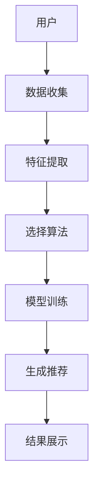
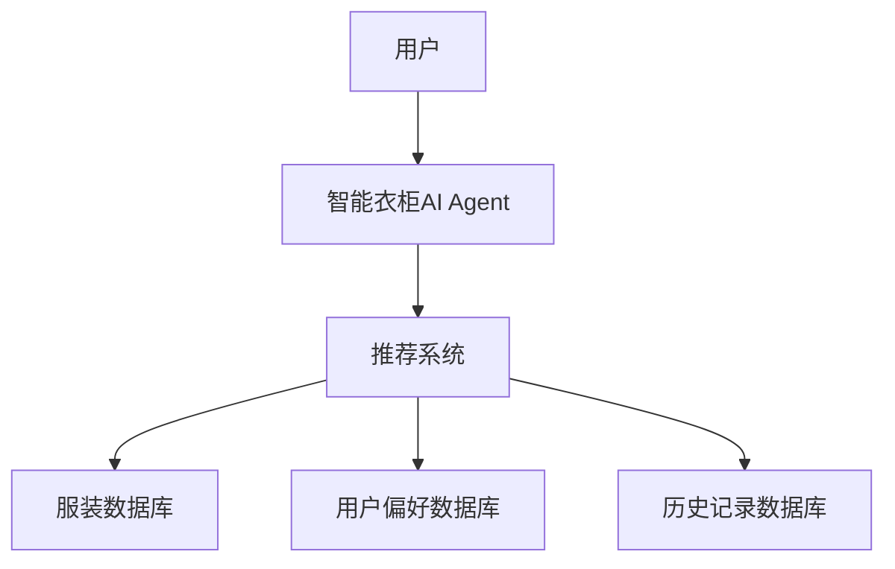
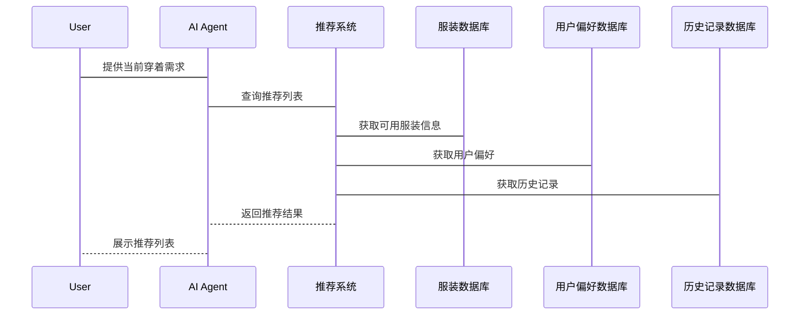

                 


# 第二章: AI Agent与推荐系统的原理

## 2.1 AI Agent的基本原理

### 2.1.1 AI Agent的感知与决策机制
AI Agent如何通过传感器和数据源获取信息，并根据这些信息做出决策。

### 2.1.2 AI Agent的学习与优化过程
AI Agent如何通过机器学习算法不断优化其推荐能力。

### 2.1.3 AI Agent的通信与协作能力
AI Agent如何与其他系统或用户进行交互和协作。

## 2.2 推荐系统的核心原理

### 2.2.1 推荐系统的分类与特点
介绍基于协同过滤、基于内容的推荐，以及混合推荐系统的特点。

### 2.2.2 基于协同过滤的推荐算法
解释协同过滤的基本原理，包括基于用户的协同过滤和基于物品的协同过滤。

### 2.2.3 基于深度学习的推荐算法
介绍深度学习在推荐系统中的应用，如神经网络协同过滤（Neural Collaborative Filtering）。

## 2.3 AI Agent与推荐系统的联系

### 2.3.1 AI Agent在推荐系统中的角色
AI Agent如何作为中间桥梁，连接用户需求和推荐系统。

### 2.3.2 推荐系统的数据流与AI Agent的交互
展示推荐系统的数据流，以及AI Agent如何在其中起到优化作用。

### 2.3.3 AI Agent如何优化推荐效果
通过具体案例，说明AI Agent如何提升推荐的准确性和用户体验。

## 2.4 核心概念对比表格

### 表2.1: AI Agent与传统推荐系统的对比
| 特性                | AI Agent推荐系统            | 传统推荐系统            |
|---------------------|---------------------------|-----------------------|
| 数据来源            | 用户行为数据、历史记录      | 用户评分、点击数据      |
| 推荐机制            | 基于AI学习和上下文感知      | 基于协同过滤或内容分析  |
| 个性化程度          | 高度个性化                 | 中等个性化             |
| 自适应能力          | 强，能实时调整推荐策略      | 较弱，策略相对固定       |
| 技术复杂度          | 高，涉及深度学习和NLP       | 中等，主要依赖算法模型   |

## 2.5 ER实体关系图

```mermaid
er
    entity 用户 {
        id 用户ID
        属性 服装偏好
    }
    entity 服装 {
        id 服装ID
        属性 类型、品牌、颜色、尺寸
    }
    entity 推荐结果 {
        id 推荐ID
        属性 推荐等级
    }
    relation 用户-服装-

    用户 -> 推荐结果
    服装 -> 推荐结果
    用户 -> 服装
```

---

## 2.6 推荐系统算法流程图



---

## 2.7 算法实现示例代码

### 协同过滤算法示例

```python
import numpy as np

# 假设 ratings 矩阵为用户-物品的评分矩阵
def collaborative_filtering(ratings, k=5):
    # 基于用户的协同过滤
    user_similarity = np.zeros_like(ratings)
    for i in range(ratings.shape[0]):
        for j in range(ratings.shape[1]):
            if i == j:
                user_similarity[i][j] = 1
            else:
                user_similarity[i][j] = np.corrcoef(ratings[i], ratings[j])[0, 1]
    
    # 选择最相似的k个用户
    user_similarity[user_similarity < 0.5] = 0
    user_similarity[user_similarity >= 0.5] = 1
    
    # 生成推荐
    recommendations = np.zeros_like(ratings)
    for i in range(ratings.shape[0]):
        for j in range(ratings.shape[1]):
            if ratings[i][j] == 0:
                recommendations[i][j] = np.sum(user_similarity[i] * ratings[:, j])
    
    return recommendations
```

---

## 2.8 算法数学模型

### 协同过滤的数学模型

$$ \text{推荐评分}(i,j) = \sum_{k=1}^{K} w_{ijk} \cdot r_{k,j} $$

其中：
- \( i \) 是目标用户
- \( j \) 是目标物品
- \( K \) 是相似用户的数量
- \( w_{ijk} \) 是用户 \( i \) 和用户 \( k \) 的相似度
- \( r_{k,j} \) 是用户 \( k \) 对物品 \( j \) 的评分

### 深度学习模型的数学表达

$$ p(\text{推荐}|x) = \text{softmax}(f(x)) $$

其中：
- \( x \) 是输入特征
- \( f(x) \) 是深度神经网络的输出
- \( \text{softmax} \) 是概率分布函数

---

## 2.9 系统架构与交互流程

### 系统架构图



### 交互流程图



---

## 2.10 本章小结

本章详细介绍了AI Agent和推荐系统的核心原理，探讨了两者结合的必要性，并通过对比分析和图表展示了它们之间的关系。通过具体的代码示例和数学模型，读者可以更好地理解推荐系统的实现过程，以及AI Agent在其中发挥的作用。

