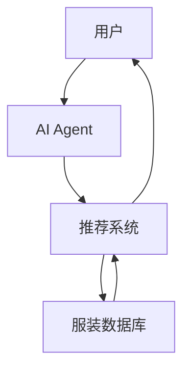
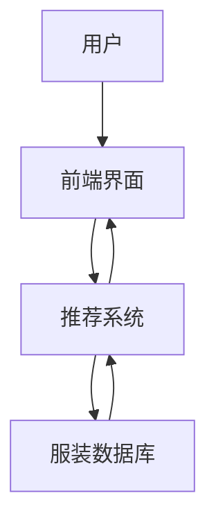

                 


# 智能衣柜：AI Agent的虚拟试衣与搭配建议

## 关键词：智能衣柜，AI Agent，虚拟试衣，搭配建议，人工智能，服装推荐系统

## 摘要：本文详细探讨了智能衣柜的概念、技术背景、核心算法及其在服装搭配中的应用。通过分析AI代理在虚拟试衣和搭配建议中的作用，结合协同过滤和深度学习算法，构建了一个智能衣柜系统，并通过实际案例展示了其应用场景和实现过程。本文还提供了系统的架构设计、项目实战指南以及最佳实践建议，为读者提供了全面的技术指导。

---

## 第一部分：智能衣柜的背景与概念

### 第1章：智能衣柜的定义与背景

#### 1.1 智能衣柜的定义
- **1.1.1 智能衣柜的基本概念**
智能衣柜是一种结合人工智能和物联网技术的智能服装存储和管理设备，能够通过AI代理为用户提供个性化的虚拟试衣和搭配建议。

- **1.1.2 智能衣柜的核心功能**
智能衣柜不仅能够存储和管理用户的衣物，还能通过AI算法推荐适合用户的服装搭配，提供虚拟试衣服务，并根据用户的偏好优化推荐结果。

- **1.1.3 智能衣柜的市场现状**
随着人工智能和物联网技术的快速发展，智能衣柜逐渐成为智能家居的重要组成部分，市场潜力巨大。

#### 1.2 AI Agent在智能衣柜中的应用
- **1.2.1 AI Agent的基本概念**
AI Agent是一种智能代理，能够通过学习和推理帮助用户完成特定任务。在智能衣柜中，AI Agent主要用于服装推荐和搭配建议。

- **1.2.2 AI Agent在智能衣柜中的作用**
AI Agent通过分析用户的穿着习惯、体型、肤色等信息，为用户提供个性化的试衣和搭配建议。

- **1.2.3 AI Agent与智能衣柜的结合方式**
AI Agent通过与智能衣柜的传感器和数据库连接，实时获取用户的试衣需求，并通过算法生成推荐结果。

#### 1.3 虚拟试衣与搭配建议的背景
- **1.3.1 传统试衣的痛点**
传统试衣过程繁琐，用户需要多次试穿不同款式和尺码的衣物，耗时且不便。

- **1.3.2 虚拟试衣的技术基础**
虚拟试衣基于计算机视觉和增强现实技术，通过3D建模和图像处理实现虚拟试穿效果。

- **1.3.3 搭配建议的用户需求**
用户希望通过智能衣柜获得个性化的服装搭配建议，提升穿衣品味和效率。

---

## 第二部分：智能衣柜的核心概念与联系

### 第2章：智能衣柜的核心概念与联系

#### 2.1 核心概念原理
- **2.1.1 AI Agent的推荐算法**
AI Agent通过协同过滤和深度学习算法，分析用户的穿衣数据，推荐适合的服装搭配。

- **2.1.2 虚拟试衣的技术实现**
虚拟试衣基于增强现实技术，通过摄像头和传感器捕捉用户的体型和动作，实现虚拟试穿效果。

- **2.1.3 搭配建议的规则引擎**
规则引擎根据用户的偏好和场合需求，生成个性化的搭配建议。

#### 2.2 核心概念属性对比
| 概念 | 描述 | 优势 | 局限性 |
|------|------|------|--------|
| AI Agent | 智能代理 | 高度个性化 | 需要大量数据训练 |
| 虚拟试衣 | 增强现实试穿 | 方便快捷 | 依赖硬件设备 |
| 搭配建议 | 个性化推荐 | 提升穿衣品味 | 需要实时数据 |

#### 2.3 ER实体关系图
```mermaid
erDiagram
    user {
        id
        username
        preferences
    }
    clothing_item {
        id
        type
        size
        color
    }
    wardrobe_system {
        id
        user_id
        item_id
        recommendation_score
    }
    user --> wardrobe_system : "使用"
    clothing_item --> wardrobe_system : "被推荐"
```

---

## 第三部分：智能衣柜的算法原理

### 第3章：智能衣柜的算法原理

#### 3.1 推荐算法的数学模型
协同过滤是一种常用的推荐算法，其数学模型如下：
$$
\text{score}(u, i) = \frac{\sum_{u' \in N(u)} sim(u, u') \times rating(u', i)}{\sum_{u' \in N(u)} sim(u, u')}
$$

#### 3.2 协同过滤算法
协同过滤算法通过分析用户的行为数据，找到与目标用户相似的用户群体，推荐他们喜欢的物品。



#### 3.3 深度学习模型
深度学习模型通过多层神经网络学习用户的穿衣偏好，生成推荐结果。

```python
import numpy as np
from sklearn.metrics.pairwise import cosine_similarity

def collaborative_filtering(user_id, items):
    # 计算用户相似度
    user_similarity = cosine_similarity(user_matrix)
    # 找到最相似的用户
    similar_users = np.argsort(user_similarity[user_id])[::-1]
    # 推荐物品
    recommendations = []
    for user in similar_users:
        if user != user_id:
            recommendations.extend(users[user]['items'])
    return recommendations
```

---

## 第四部分：智能衣柜的系统分析与架构设计

### 第4章：智能衣柜的系统分析与架构设计

#### 4.1 系统功能设计
智能衣柜的主要功能包括：
- 用户信息管理
- 服装数据存储
- 推荐系统
- 虚拟试衣

#### 4.2 系统架构设计


#### 4.3 接口设计
智能衣柜通过API接口与用户交互，提供试衣和搭配建议服务。

#### 4.4 交互流程
用户通过前端界面输入试衣需求，系统通过AI算法生成推荐结果，并返回给用户。

---

## 第五部分：智能衣柜的项目实战

### 第5章：智能衣柜的项目实战

#### 5.1 环境搭建
需要安装Python、TensorFlow和OpenCV等依赖库。

#### 5.2 核心功能实现
实现虚拟试衣和搭配建议的核心算法，包括用户数据采集、推荐系统和图像处理。

#### 5.3 实际案例分析
通过实际案例分析，展示智能衣柜在不同场景下的应用效果。

---

## 第六部分：智能衣柜的最佳实践

### 第6章：智能衣柜的最佳实践

#### 6.1 项目小结
总结项目实施过程中的关键点和经验教训。

#### 6.2 注意事项
提醒读者在实际应用中需要注意的事项，如数据隐私和系统稳定性。

#### 6.3 拓展阅读
推荐相关领域的书籍和资源，供读者进一步学习。

---

## 结语

智能衣柜通过AI Agent实现了虚拟试衣和搭配建议，极大提升了用户的穿衣体验。本文详细介绍了智能衣柜的核心概念、算法原理、系统架构和项目实战，为读者提供了全面的技术指导。

---

## 作者：AI天才研究院/AI Genius Institute & 禅与计算机程序设计艺术 /Zen And The Art of Computer Programming

