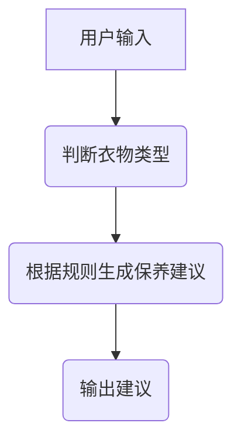
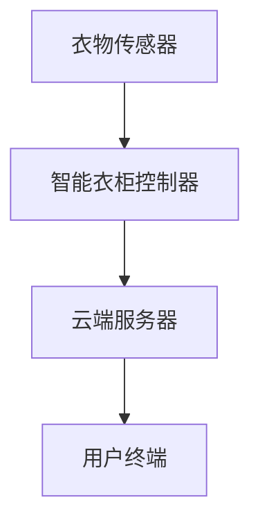
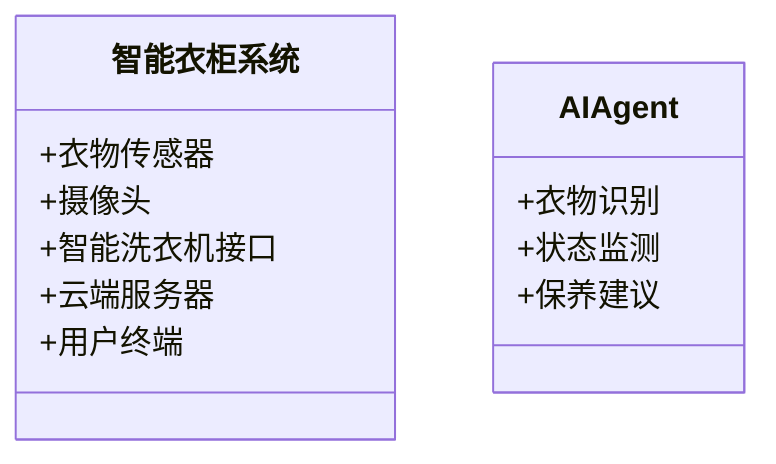

                 


# 智能衣柜：AI Agent的衣物保养建议

> 关键词：智能衣柜，AI Agent，衣物保养，物联网，人工智能

> 摘要：本文探讨了智能衣柜的概念、核心技术与系统架构，并详细介绍了AI Agent在衣物保养中的应用。通过分析衣物识别、保养建议、智能推荐等核心功能，展示了如何利用AI技术提升衣物管理的智能化水平。文章还提供了系统设计与实现的详细步骤，包括算法实现、系统架构设计、项目实战等内容，为读者提供全面的技术指导。

---

# 第一部分: 智能衣柜的背景与概念

## 第1章: 智能衣柜的核心概念与背景

### 1.1 智能衣柜的定义与特点

智能衣柜是一种结合人工智能和物联网技术的智能衣物管理设备，能够通过传感器和AI算法实现衣物的自动识别、分类、保养建议和智能推荐。其核心特点包括：

- **智能化管理**：通过AI Agent实时监测衣物的状态，如湿度、温度、褶皱程度等，并提供相应的保养建议。
- **个性化推荐**：根据用户的穿衣习惯和衣物的材质特性，推荐最优的搭配方案和清洗建议。
- **节能环保**：通过优化衣物存储和清洗计划，减少能源消耗。

### 1.2 AI Agent在智能衣柜中的应用

AI Agent（智能代理）是一种能够感知环境并执行任务的智能程序，其在智能衣柜中的应用主要体现在以下几个方面：

- **衣物识别**：通过图像识别技术，AI Agent可以识别衣物的类型、颜色和品牌。
- **状态监测**：通过传感器数据，AI Agent可以监测衣物的湿度、温度和褶皱程度。
- **保养建议**：基于衣物的状态和材质，AI Agent会推荐清洗方式、晾晒方法和存储建议。

### 1.3 智能衣柜的背景与发展趋势

随着人工智能和物联网技术的快速发展，智能衣柜逐渐成为衣物管理领域的热门方向。其发展趋势包括：

- **智能化**：通过AI技术实现衣物的自动识别和管理。
- **节能环保**：通过优化衣物存储和清洗计划，减少能源消耗。
- **个性化服务**：根据用户的穿衣习惯和衣物特性，提供个性化的保养建议。

---

## 第2章: AI Agent的核心原理与技术

### 2.1 AI Agent的基本原理

AI Agent的核心原理包括感知、决策和执行三个步骤：

1. **感知**：通过传感器和图像识别技术获取衣物的状态信息。
2. **决策**：基于获取的信息，AI Agent会根据预设的规则或机器学习模型生成相应的保养建议。
3. **执行**：通过与智能洗衣机、晾衣架等设备的连接，执行相应的操作。

### 2.2 AI Agent的算法原理

以下是基于规则的AI Agent和基于机器学习的AI Agent的对比：

| 特性           | 基于规则的AI Agent        | 基于机器学习的AI Agent       |
|----------------|---------------------------|-----------------------------|
| 决策方式       | 预设规则                   | 数据驱动的预测模型           |
| 优势           | 实现简单，易于维护         | 高精度，适应复杂场景         |
| 劣势           | 难以应对复杂场景           | 需要大量数据训练             |

以下是一个基于规则的AI Agent的流程图：



### 2.3 AI Agent的优缺点与适用场景

- **优点**：
  - 实现简单，易于维护。
  - 高精度，适应复杂场景。
- **缺点**：
  - 难以应对复杂场景。
  - 需要大量数据训练。

---

## 第3章: 物联网技术在智能衣柜中的应用

### 3.1 物联网技术的基本概念

物联网（IoT）通过传感器和网络技术实现设备间的互联。在智能衣柜中，物联网技术主要用于以下方面：

1. **衣物状态监测**：通过湿度传感器、温度传感器等监测衣物的状态。
2. **数据传输**：通过Wi-Fi或蓝牙将监测数据传输到云端。
3. **设备控制**：通过物联网技术控制智能洗衣机、晾衣架等设备。

### 3.2 智能衣柜中的物联网架构

以下是一个智能衣柜的物联网系统架构图：



---

## 第4章: 智能衣柜的系统架构与功能设计

### 4.1 智能衣柜的系统架构

智能衣柜的系统架构包括硬件部分和软件部分：

- **硬件部分**：包括衣物传感器、摄像头、智能洗衣机接口等。
- **软件部分**：包括AI Agent算法、云端服务器、用户终端应用程序。

### 4.2 智能衣柜的功能设计

以下是智能衣柜的功能模块：



---

## 项目实战

### 5.1 环境安装

以下是一个简单的Python环境搭建步骤：

1. 安装Python：`python --version`
2. 安装相关库：`pip install numpy`

### 5.2 系统核心实现源代码

以下是一个基于规则的AI Agent的Python实现示例：

```python
# 定义衣物类型
class ClothesType:
    def __init__(self, type_name):
        self.type_name = type_name

# 基于规则的AI Agent
class AIAssistant:
    def __init__(self):
        self.rules = {}

    def add_rule(self, condition, action):
        self.rules[condition] = action

    def execute_rule(self, condition):
        if condition in self.rules:
            return self.rules[condition]
        else:
            return "无对应规则"

# 示例
assistant = AIAssistant()
assistant.add_rule("棉质衣物", "手洗")
assistant.add_rule("涤纶衣物", "机洗")
print(asst.execute_rule("棉质衣物"))  # 输出：手洗
```

### 5.3 案例分析与详细讲解

假设用户有一件棉质衬衫，AI Agent会根据预设的规则推荐手洗。通过物联网传感器，系统会监测衣物的湿度，并在衣物完全干燥后通知用户。

---

## 总结

智能衣柜通过AI Agent和物联网技术的结合，能够实现衣物的智能化管理。本文详细介绍了智能衣柜的核心概念、技术原理和系统架构，并提供了具体的实现案例。未来，随着AI和物联网技术的进一步发展，智能衣柜将为用户提供更加个性化的衣物管理服务。

---

**作者：AI天才研究院/AI Genius Institute & 禅与计算机程序设计艺术 /Zen And The Art of Computer Programming**

