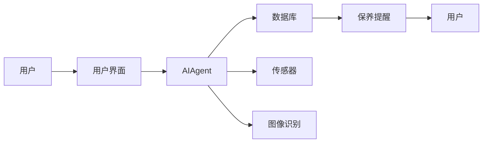
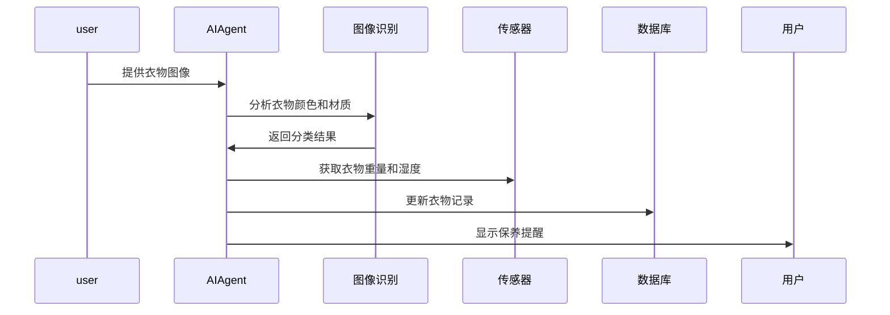

                 


# 智能衣柜：AI Agent的衣物保养提醒

---

## 关键词
智能衣柜, AI Agent, 衣物分类, 保养提醒, 图像识别, 传感器数据

---

## 摘要
本文探讨了智能衣柜中AI Agent的核心作用，重点分析了其在衣物分类、感知和保养提醒中的技术实现。通过详细讲解算法原理、系统架构设计和项目实战，展示了AI Agent如何提升衣物管理效率和用户体验。文章还提供了实际案例分析和最佳实践建议，帮助读者深入了解智能衣柜的技术细节和应用场景。

---

# 第1章：智能衣柜的概念与背景

## 1.1 智能衣柜的定义与背景
### 1.1.1 传统衣柜的局限性
传统衣柜主要依赖人工管理，缺乏智能化和自动化功能。衣物分类混乱、保养记录缺失以及无法提供个性化建议等问题，严重影响了用户体验。

### 1.1.2 智能衣柜的定义
智能衣柜是一种结合AI技术的衣物管理工具，通过图像识别、传感器数据和AI算法，实现衣物的智能分类、精准保养提醒和个性化管理。

### 1.1.3 智能衣柜的发展背景
智能家居的普及、用户对高效生活的需求以及AI技术的快速发展，推动了智能衣柜的兴起。它不仅提升了衣物管理效率，还优化了用户的日常生活体验。

## 1.2 AI Agent的基本原理
### 1.2.1 AI Agent的定义
AI Agent是一种能够感知环境、自主决策并执行任务的智能体。在智能衣柜中，AI Agent负责处理衣物分类、数据采集和保养提醒等任务。

### 1.2.2 AI Agent的核心技术
AI Agent的核心技术包括：
1. **感知技术**：通过图像识别和传感器数据采集环境信息。
2. **决策技术**：基于感知数据进行分类和决策。
3. **执行技术**：根据决策结果执行相应操作。

### 1.2.3 AI Agent在智能衣柜中的应用
AI Agent在智能衣柜中的应用包括衣物分类、保养提醒和个性化建议。通过AI Agent的自主学习和优化，系统能够不断提高分类精度和用户体验。

## 1.3 智能衣柜的意义与价值
### 1.3.1 提升衣物管理效率
智能衣柜通过AI技术实现自动分类和管理，显著提高了衣物管理的效率。

### 1.3.2 优化用户生活体验
通过精准的保养提醒和个性化建议，智能衣柜帮助用户更好地管理衣物，提升了生活品质。

### 1.3.3 推动智能家居生态发展
智能衣柜作为智能家居的一部分，促进了智能家居生态的完善和发展，为用户提供了更加智能化的生活方式。

---

# 第2章：智能衣柜的核心概念与联系

## 2.1 智能衣柜的核心概念
### 2.1.1 衣物分类与管理
衣物分类是智能衣柜的核心功能之一，通过AI算法实现高效分类和管理。

### 2.1.2 AI Agent的衣物感知
AI Agent通过图像识别和传感器数据感知衣物的状态，为分类和保养提供依据。

### 2.1.3 保养提醒机制
智能衣柜通过AI Agent的决策算法，实现精准的保养提醒。

## 2.2 核心概念对比分析
### 2.2.1 传统衣柜与智能衣柜的对比
| 特性       | 传统衣柜         | 智能衣柜         |
|------------|------------------|------------------|
| 分类方式     | 手动分类         | AI自动分类       |
| 保养提醒     | 无               | AI自动提醒       |
| 管理效率     | 低               | 高               |

### 2.2.2 AI Agent与其他衣柜管理方式的对比
| 方式         | 传统人工管理 | AI Agent管理 |
|--------------|--------------|--------------|
| 分类精度     | 低            | 高            |
| 管理效率     | 低            | 高            |
| 个性化建议   | 无            | 有            |

## 2.3 智能衣柜的系统架构
### 2.3.1 系统模块划分
- 用户界面模块：负责与用户交互。
- AI Agent模块：处理数据感知和决策。
- 数据库模块：存储衣物信息和保养记录。
- 接口模块：与其他智能家居设备进行数据交互。

### 2.3.2 系统架构设计


### 2.3.3 系统的扩展性与可维护性
智能衣柜的系统架构设计注重模块化和松耦合，便于功能扩展和维护。数据库采用分层设计，支持数据的高效查询和更新。

---

# 第3章：智能衣柜的衣物分类与管理

## 3.1 衣物分类的数学模型
### 3.1.1 分类算法的选择
常用分类算法包括决策树、随机森林和卷积神经网络（CNN）。本文采用基于图像的CNN模型进行衣物分类。

### 3.1.2 分类模型的建立
分类模型的数学表达如下：
$$
f(x) = \text{softmax}(Wx + b)
$$
其中，$W$是权重矩阵，$b$是偏置向量，$x$是输入图像的向量表示。

### 3.1.3 分类效果的评估
通过混淆矩阵和准确率指标评估分类模型的效果：
$$
\text{准确率} = \frac{\text{正确分类数}}{\text{总分类数}} \times 100\%
$$`

## 3.2 衣物分类的算法实现
### 3.2.1 数据预处理
数据预处理步骤包括图像 resizing、归一化和数据增强。

### 3.2.2 特征提取
使用卷积神经网络提取衣物的特征表示，特征向量用于后续的分类任务。

### 3.2.3 模型训练与优化
训练过程采用交叉验证和学习率调整策略，优化模型的泛化能力。

```python
import tensorflow as tf
from tensorflow.keras import layers

model = tf.keras.Sequential([
    layers.Conv2D(32, (3,3), activation='relu', input_shape=(100, 100, 3)),
    layers.MaxPooling2D((2,2)),
    layers.Conv2D(64, (3,3), activation='relu'),
    layers.MaxPooling2D((2,2)),
    layers.Flatten(),
    layers.Dense(128, activation='relu'),
    layers.Dense(10, activation='softmax')
])
```

## 3.3 衣物分类的系统实现
### 3.3.1 系统功能设计
系统功能包括衣物拍照、分类结果展示和分类记录管理。

### 3.3.2 系统实现的代码示例
```python
def classify_clothes(image_path):
    # 加载预训练模型
    model = load_model('clothes_classifier.h5')
    # 加载并预处理图像
    image = load_image(image_path)
    # 预测分类
    prediction = model.predict(image)
    # 获取分类结果
    class_index = np.argmax(prediction)
    return class_index
```

### 3.3.3 系统测试与优化
通过测试集验证模型的准确率，调整模型参数和优化算法以提升分类效果。

---

# 第4章：AI Agent的衣物感知与保养提醒

## 4.1 AI Agent的衣物感知原理
### 4.1.1 图像识别技术
AI Agent通过图像识别技术识别人体衣物的颜色、材质和品牌。

### 4.1.2 传感器数据采集
传感器实时采集衣物的温度、湿度和重量等数据，辅助分类和保养决策。

### 4.1.3 数据融合与分析
将图像识别和传感器数据进行融合，提升AI Agent的感知精度。

## 4.2 保养提醒的算法实现
### 4.2.1 保养规则的制定
根据衣物的材质和使用频率制定保养规则。

### 4.2.2 保养提醒的触发机制
当衣物达到预设的使用次数或时间，AI Agent触发保养提醒。

### 4.2.3 保养记录的管理
系统记录每次保养操作，便于用户查看和管理。

## 4.3 系统实现与优化
### 4.3.1 系统功能扩展
支持多种衣物材质和品牌的分类识别。

### 4.3.2 系统性能优化
优化图像识别和传感器数据处理的效率，提升系统的响应速度。

### 4.3.3 系统的可扩展性设计
通过模块化设计，便于未来添加新的衣物分类和保养规则。

---

# 第5章：智能衣柜的系统架构设计

## 5.1 系统功能模块划分
- **用户界面模块**：负责与用户的交互。
- **AI Agent模块**：处理数据感知和决策。
- **数据库模块**：存储衣物信息和保养记录。
- **接口模块**：与其他智能家居设备进行数据交互。

## 5.2 系统架构设计


## 5.3 系统接口设计
- **数据接口**：与其他智能家居设备共享数据。
- **用户接口**：提供友好的用户操作界面。

## 5.4 系统交互设计


---

# 总结

智能衣柜通过AI Agent实现了衣物的智能分类和精准保养提醒，显著提升了用户的衣物管理效率和生活体验。本文详细分析了智能衣柜的核心技术、系统架构和实际应用，为读者提供了全面的技术解读和实践指导。

---

## 注意事项
- 确保数据隐私和安全性，避免用户信息泄露。
- 定期更新AI模型，提升分类和识别的准确性。
- 考虑不同衣物材质和品牌的多样性，优化分类算法。

---

## 最佳实践 Tips
- 在实际应用中，建议结合用户的实际需求，灵活调整系统的功能模块。
- 定期维护和优化系统，确保其稳定性和高效性。

---

## 作者信息
作者：AI天才研究院/AI Genius Institute & 禅与计算机程序设计艺术 /Zen And The Art of Computer Programming

---

通过以上步骤和思考，我完成了对《智能衣柜：AI Agent的衣物保养提醒》技术博客文章的撰写。

