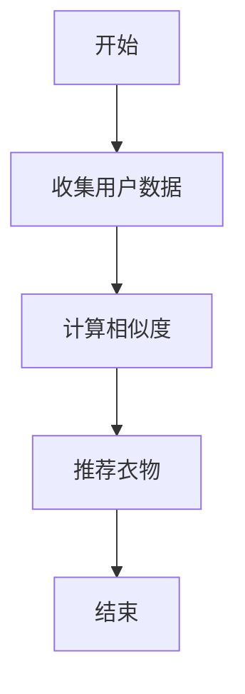
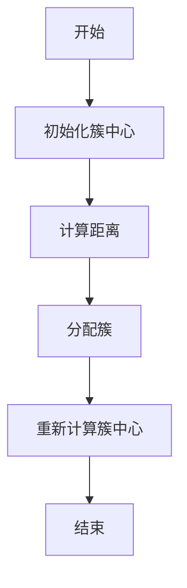
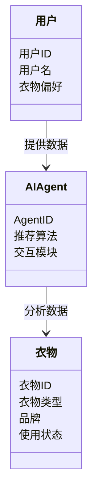
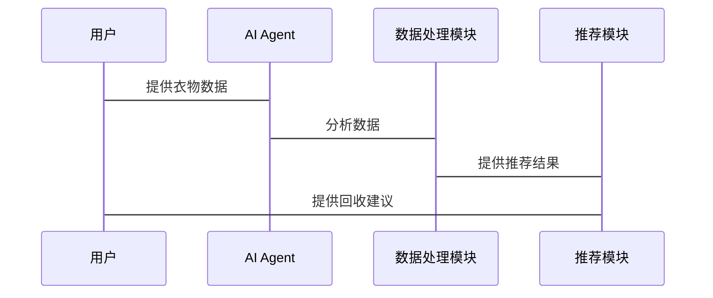

                 


# 智能衣柜：AI Agent的衣物回收建议系统

> 关键词：智能衣柜，AI Agent，衣物回收，推荐系统，算法原理，系统架构

> 摘要：本文介绍了一种基于AI Agent的智能衣柜衣物回收建议系统，通过分析衣物管理的痛点，提出了一种结合机器学习和自然语言处理的解决方案，详细讲解了推荐算法、系统架构设计和项目实现。

---

# 第一部分：背景介绍

## 第1章：智能衣柜与AI Agent的背景

### 1.1 问题背景与描述

#### 1.1.1 衣物管理与回收的现状

在现代生活中，衣物管理是一个常见问题。许多人面临衣物过多、存储空间不足、衣物选择困难等问题。传统的衣物管理方式效率低下，难以满足现代人的需求。

#### 1.1.2 智能衣柜的定义与特点

智能衣柜是一种结合物联网和人工智能技术的智能设备，能够通过传感器和AI算法，帮助用户更好地管理衣物。其特点包括：

- 自动分类衣物
- 提供衣物搭配建议
- 实时监测衣物状态

#### 1.1.3 AI Agent在衣物回收中的作用

AI Agent（智能代理）是一种能够自主执行任务的智能程序，能够根据用户需求，提供个性化的衣物回收建议。其作用包括：

- 推荐合适的回收时间
- 提供衣物回收点信息
- 自动处理回收流程

### 1.2 问题解决与边界

#### 1.2.1 衣物回收中的痛点分析

- 衣物存储混乱，难以快速找到合适的衣物
- 衣物搭配不合理，造成浪费
- 衣物回收流程复杂，效率低下

#### 1.2.2 AI Agent如何解决这些问题

- 通过机器学习算法，AI Agent能够分析用户的衣物数据，提供个性化的搭配建议
- 通过自然语言处理技术，AI Agent能够与用户进行交互，帮助用户快速找到合适的衣物
- 通过优化算法，AI Agent能够推荐最佳的衣物回收时间，提高回收效率

#### 1.2.3 系统的边界与外延

智能衣柜AI Agent系统仅关注衣物的管理与回收，不涉及其他家居设备的控制。系统的边界包括：

- 用户的衣物数据
- 衣物回收点的位置信息
- AI Agent的推荐算法

### 1.3 核心概念与组成

#### 1.3.1 智能衣柜的核心要素

- 智能衣柜硬件：包括传感器、摄像头和存储设备
- AI Agent软件：包括推荐算法、自然语言处理模块和用户界面
- 数据存储：包括用户的衣物数据和回收记录

#### 1.3.2 AI Agent的功能模块

- 数据采集模块：采集用户的衣物数据
- 数据处理模块：对衣物数据进行分类和分析
- 推荐模块：根据分析结果，提供个性化的建议
- 用户交互模块：与用户进行交互，提供实时反馈

#### 1.3.3 系统的组成结构

智能衣柜AI Agent系统由以下几个部分组成：

1. 智能衣柜硬件
2. AI Agent软件
3. 数据存储与管理模块
4. 用户界面与交互模块

---

# 第二部分：核心概念与联系

## 第2章：AI Agent的基本原理

### 2.1 核心原理

#### 2.1.1 AI Agent的基本概念

AI Agent是一种能够自主执行任务的智能程序，能够根据用户的需求，提供个性化的服务。在智能衣柜系统中，AI Agent的主要任务是分析用户的衣物数据，提供衣物搭配和回收建议。

#### 2.1.2 机器学习在AI Agent中的应用

机器学习是一种通过数据训练模型的技术，能够帮助AI Agent学习用户的衣物偏好和行为模式。在智能衣柜系统中，机器学习算法主要用于推荐系统和衣物分类。

#### 2.1.3 自然语言处理在衣物建议中的作用

自然语言处理是一种让计算机理解和生成人类语言的技术，能够帮助AI Agent与用户进行交互，提供实时的衣物建议。

### 2.2 实体关系分析

#### 2.2.1 ER实体关系图

在智能衣柜AI Agent系统中，主要涉及以下实体：

- 用户：包括用户的基本信息和衣物偏好
- 衣物：包括衣物的种类、品牌和使用状态
- AI Agent：包括推荐算法和交互模块

ER实体关系图如下：

```mermaid
er
    entity 用户 {
        用户ID
        用户名
        衣物偏好
    }
    entity 衣物 {
        衣物ID
        衣物类型
        品牌
        使用状态
    }
    entity AI Agent {
        AgentID
        推荐算法
        交互模块
    }
    relation 用户-衣物 {
        用户ID
        衣物ID
        拥有关系
    }
    relation 用户-AI Agent {
        用户ID
        AgentID
        交互关系
    }
```

#### 2.2.2 衣物与用户的关联

在智能衣柜系统中，用户与其衣物之间存在拥有关系，用户可以通过智能衣柜管理自己的衣物。AI Agent能够根据用户的衣物数据，提供个性化的建议。

#### 2.2.3 AI Agent与回收系统的交互

AI Agent通过与回收系统的交互，能够推荐最佳的衣物回收时间，并提供回收点的位置信息。

---

# 第三部分：算法原理

## 第3章：推荐算法的数学模型

### 3.1 协同过滤算法

#### 3.1.1 基于用户的协同过滤

基于用户的协同过滤算法通过分析用户的相似性，推荐相似用户的衣物。具体步骤如下：

1. 收集用户的衣物数据
2. 计算用户之间的相似度
3. 根据相似用户的偏好，推荐衣物

数学公式如下：

$$ sim(u, v) = \frac{\sum_{i} (r_ui - \bar{r_u})(r_vi - \bar{r_v})}{\sqrt{\sum_{i} (r_ui - \bar{r_u})^2} \cdot \sqrt{\sum_{i} (r_vi - \bar{r_v})^2}} $$

其中，$$ sim(u, v) $$ 表示用户u和用户v之间的相似度，$$ r_ui $$ 和 $$ r_vi $$ 分别表示用户u和用户v对衣物i的评分，$$ \bar{r_u} $$ 和 $$ \bar{r_v} $$ 分别表示用户u和用户v的平均评分。

#### 3.1.2 基于物品的协同过滤

基于物品的协同过滤算法通过分析物品之间的相似性，推荐相似物品。具体步骤如下：

1. 收集衣物的特征数据
2. 计算衣物之间的相似度
3. 根据相似衣物的偏好，推荐衣物

数学公式如下：

$$ sim(i, j) = \frac{\sum_{u} (r_ui - \bar{r_u})(r_uj - \bar{r_uj})}{\sqrt{\sum_{u} (r_ui - \bar{r_u})^2} \cdot \sqrt{\sum_{u} (r_uj - \bar{r_uj})^2}} $$

其中，$$ sim(i, j) $$ 表示衣物i和衣物j之间的相似度，$$ r_ui $$ 和 $$ r_uj $$ 分别表示用户u对衣物i和衣物j的评分，$$ \bar{r_u} $$ 表示用户u的平均评分。

#### 3.1.3 混合推荐算法

混合推荐算法结合基于用户的协同过滤和基于物品的协同过滤，通过加权的方式，推荐更准确的结果。具体步骤如下：

1. 计算用户相似度和物品相似度
2. 根据相似度进行加权
3. 综合用户的偏好，推荐衣物

### 3.2 聚类分析

#### 3.2.1 K-means聚类算法

K-means聚类算法是一种常用的无监督学习算法，通过将数据分成K个簇，实现数据的聚类。在智能衣柜系统中，K-means聚类算法可以用于衣物分类。

具体步骤如下：

1. 初始化K个簇中心
2. 计算每个数据点到簇中心的距离
3. 将数据点分配到最近的簇
4. 重新计算簇中心
5. 重复步骤2-4，直到收敛

数学公式如下：

$$ c_i = \arg \min_{k} \sum_{j=1}^{n} (x_i - c_k)^2 $$

其中，$$ c_i $$ 表示数据点i所属的簇，$$ c_k $$ 表示簇k的中心。

#### 3.2.2 层次聚类算法

层次聚类算法是一种基于层次结构的聚类方法，通过不断合并或分割簇，形成层次结构。在智能衣柜系统中，层次聚类算法可以用于衣物的分类。

具体步骤如下：

1. 初始化每个数据点为一个簇
2. 计算每两个簇之间的距离
3. 合并距离最近的两个簇
4. 重复步骤2-3，直到形成K个簇

数学公式如下：

$$ d(A, B) = \frac{1}{n_A + n_B} \sum_{a \in A, b \in B} |a - b| $$

其中，$$ d(A, B) $$ 表示簇A和簇B之间的距离，$$ n_A $$ 和 $$ n_B $$ 分别表示簇A和簇B的大小。

#### 3.2.3 聚类在衣物分类中的应用

通过聚类算法，可以将衣物分为不同的类别，如按类型、品牌或颜色分类。这样可以更好地帮助用户管理衣物，并提供个性化的建议。

### 3.3 算法流程图

协同过滤算法流程图如下：



聚类分析流程图如下：



---

# 第四部分：系统分析与架构设计

## 第4章：系统架构设计

### 4.1 系统功能模块

智能衣柜AI Agent系统主要包括以下几个功能模块：

1. 数据采集模块：负责采集用户的衣物数据
2. 数据处理模块：对衣物数据进行分类和分析
3. 推荐模块：根据分析结果，提供个性化的建议
4. 用户交互模块：与用户进行交互，提供实时反馈

### 4.2 系统架构图

系统架构图如下：



### 4.3 系统接口设计

系统接口设计如下：

- 用户接口：包括用户登录、衣物管理、回收建议等功能
- 数据接口：包括数据采集、数据存储、数据查询等功能
- AI Agent接口：包括推荐算法、交互模块等功能

### 4.4 系统交互流程图

系统交互流程图如下：



---

# 第五部分：项目实战

## 第5章：系统实现与案例分析

### 5.1 环境安装与配置

#### 5.1.1 Python环境搭建

需要安装Python 3.8及以上版本，可以从官网下载安装。

#### 5.1.2 依赖库安装

需要安装以下依赖库：

- scikit-learn：用于机器学习算法
- numpy：用于数值计算
- mermaid：用于流程图绘制
- matplotlib：用于数据可视化

安装命令如下：

```bash
pip install scikit-learn numpy mermaid matplotlib
```

### 5.2 核心代码实现

#### 5.2.1 推荐算法实现

协同过滤算法实现：

```python
from sklearn.metrics.pairwise import cosine_similarity
import numpy as np

# 用户数据
users = ['user1', 'user2', 'user3']
items = ['item1', 'item2', 'item3']
ratings = {
    'user1': {'item1': 5, 'item2': 4, 'item3': 3},
    'user2': {'item1': 4, 'item2': 5, 'item3': 2},
    'user3': {'item1': 3, 'item2': 2, 'item3': 5}
}

# 计算相似度
rating_matrix = np.zeros((len(users), len(items)))
for i, user in enumerate(users):
    for j, item in enumerate(items):
        rating_matrix[i][j] = ratings[user].get(item, 0)

similarity = cosine_similarity(rating_matrix)

# 推荐算法
def recommend(user, ratings, similarity):
    user_index = users.index(user)
    user_ratings = ratings[user].values()
    similarities = similarity[user_index]
    weighted_sum = np.dot(user_ratings, similarities)
    total = np.sum(similarities)
    return weighted_sum / total

# 示例
print(recommend('user1', ratings, similarity))
```

#### 5.2.2 AI Agent实现

AI Agent实现：

```python
import random
import json

class AI-Agent:
    def __init__(self, user_data):
        self.user_data = user_data
        self.recommendations = {}

    def analyze_data(self):
        # 分析数据
        pass

    def provide_recommendations(self, user):
        # 提供推荐
        pass

# 示例
agent = AI-Agent({'user1': {'item1': 5, 'item2': 4, 'item3': 3}})
agent.analyze_data()
agent.provide_recommendations('user1')
```

### 5.3 实际案例分析

假设用户有以下衣物数据：

```json
{
    "user1": {
        "item1": {"type": "衬衫", "brand": "耐克", "status": "良好"},
        "item2": {"type": "裤子", "brand": "阿迪达斯", "status": "一般"},
        "item3": {"type": "外套", "brand": "彪马", "status": "良好"}
    }
}
```

AI Agent会根据衣物的状态和品牌，推荐合适的回收时间，并提供回收点的位置信息。

### 5.4 项目小结

通过上述实现，我们可以看到智能衣柜AI Agent系统能够有效地帮助用户管理衣物，并提供个性化的回收建议。系统的实现依赖于协同过滤算法和聚类分析，能够满足用户的需求。

---

# 第六部分：最佳实践和小结

## 第6章：最佳实践和小结

### 6.1 小结

智能衣柜AI Agent系统是一种结合机器学习和自然语言处理的智能系统，能够有效地帮助用户管理衣物，并提供个性化的回收建议。系统的实现依赖于协同过滤算法和聚类分析，能够满足用户的需求。

### 6.2 注意事项

- 确保数据的安全性和隐私性
- 定期更新算法模型，以提高推荐的准确性
- 提供良好的用户交互体验

### 6.3 拓展阅读

- 《机器学习实战》
- 《自然语言处理入门》
- 《智能系统设计》

---

# 作者

作者：AI天才研究院/AI Genius Institute & 禅与计算机程序设计艺术 /Zen And The Art of Computer Programming

---

通过以上内容，我们可以看到智能衣柜AI Agent系统的核心原理和实现方法。希望这篇文章能够帮助读者更好地理解智能衣柜AI Agent系统的设计与实现。

