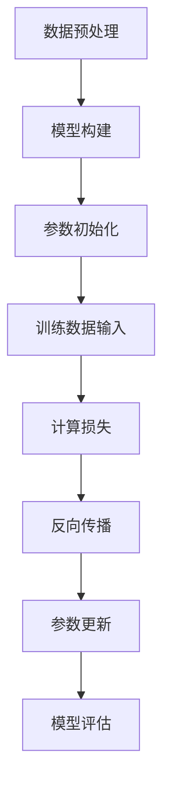
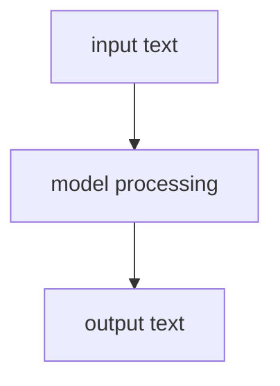
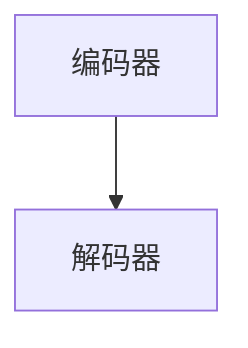
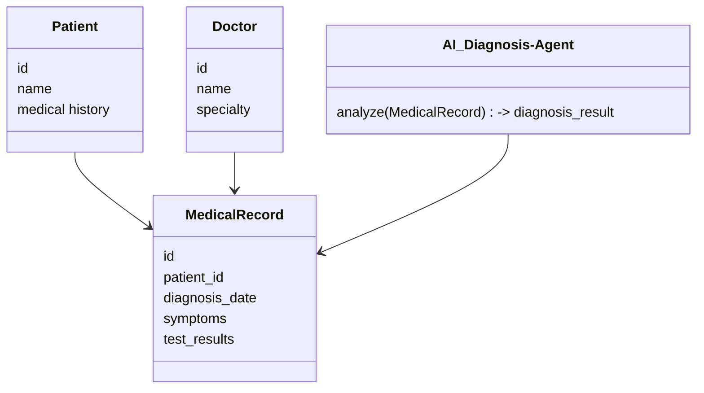
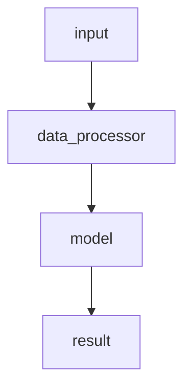
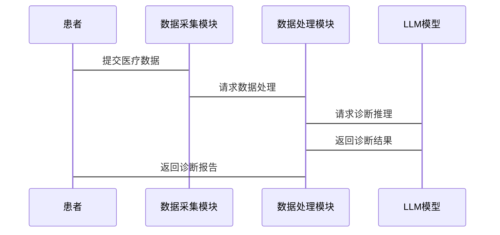

                 


```markdown
# 智能诊断AI Agent：LLM在医疗健康领域的应用

> 关键词：LLM, 医疗诊断, AI Agent, 人工智能, 智能系统

> 摘要：本文深入探讨了大语言模型（LLM）在医疗健康领域的应用，特别是智能诊断AI Agent的构建与实现。通过分析LLM的核心原理、系统架构、项目实战及最佳实践，展示了如何利用先进的AI技术提升医疗诊断的效率与准确性。

---

# 第一部分: 智能诊断AI Agent的背景与概念

# 第1章: 智能诊断AI Agent概述

## 1.1 问题背景与问题描述

### 1.1.1 医疗诊断的现状与挑战
医疗诊断是保障患者健康的关键环节，但传统诊断方式存在以下问题：
- 诊断效率低：医生需要手动分析病历、检查结果和影像资料，耗时耗力。
- 误诊率高：由于医生经验有限或疲劳，可能导致误诊或漏诊。
- 资源分配不均：医疗资源集中在大城市，基层医疗机构缺乏专业诊断人员。

### 1.1.2 问题解决方法
引入人工智能技术，特别是大语言模型（LLM），可以显著提升医疗诊断的效率和准确性。LLM通过处理海量医疗数据，辅助医生快速做出诊断。

### 1.1.3 智能诊断AI Agent的目标
智能诊断AI Agent旨在通过自然语言处理和深度学习技术，帮助医生分析病历、影像资料和其他医疗数据，提供诊断建议和决策支持。

## 1.2 LLM在医疗健康领域的潜力

### 1.2.1 LLM的基本概念
大语言模型（LLM）是一种基于深度学习的自然语言处理模型，能够理解和生成人类语言。它通过大量数据训练，掌握了丰富的语言知识和模式。

### 1.2.2 LLM在医疗诊断中的应用场景
- 病历分析：快速提取病历中的关键信息，生成初步诊断建议。
- 影像识别：辅助医生分析医学影像，识别病变区域。
- 药物推荐：根据患者病情推荐合适的治疗方案和药物。

### 1.2.3 LLM的优势与局限性
优势：
- 高效性：快速处理大量医疗数据，提高诊断效率。
- 准确性：通过大量数据训练，提升诊断准确性。
- 可扩展性：适用于多种医疗场景，易于扩展。

局限性：
- 数据隐私：医疗数据敏感，需要严格的数据保护措施。
- 模型泛化能力：LLM在特定医疗领域的表现可能不如专门训练的模型。
- 伦理问题：AI诊断结果需谨慎处理，避免误诊带来的责任问题。

## 1.3 智能诊断AI Agent的定义与特点

### 1.3.1 AI Agent的基本概念
AI Agent是一种智能体，能够感知环境、执行任务并做出决策。在医疗领域，AI Agent通常用于辅助诊断、治疗规划和患者管理。

### 1.3.2 智能诊断AI Agent的核心特征
- **智能化**：基于LLM，能够理解并生成自然语言。
- **实时性**：快速响应用户查询，提供即时诊断建议。
- **可解释性**：诊断结果需清晰可解释，便于医生审核。

### 1.3.3 与传统医疗诊断工具的对比
| 特性         | 传统诊断工具 | 智能诊断AI Agent |
|--------------|---------------|-------------------|
| 诊断速度     | 较慢          | 快速              |
| 诊断准确率   | 依赖医生经验  | 高                |
| 可扩展性     | 有限          | 强                |
| 使用成本     | 高            | 低                |

## 1.4 本章小结
本章介绍了智能诊断AI Agent的背景、核心概念和特点，强调了LLM在医疗诊断中的潜力和优势，为后续章节的深入分析奠定了基础。

---

# 第二部分: LLM与智能诊断AI Agent的核心概念

# 第2章: LLM的原理与实现

## 2.1 LLM的基本原理

### 2.1.1 大语言模型的训练过程
LLM的训练过程包括数据预处理、模型构建、参数优化和模型评估四个阶段。以下是具体的训练流程：



### 2.1.2 模型的输入输出机制
LLM的输入可以是文本、图像或其他形式的数据，输出则是生成的文本或分类结果。以下是模型的输入输出机制：



### 2.1.3 模型的推理过程
推理过程包括编码、解码和生成三个步骤：

1. **编码**：将输入文本转换为模型可以理解的向量表示。
2. **解码**：通过解码器将向量表示转换为输出文本。
3. **生成**：根据解码结果生成最终的诊断建议。

## 2.2 LLM的核心算法

### 2.2.1 变压器（Transformer）模型
Transformer模型由编码器和解码器组成，广泛应用于自然语言处理任务。以下是模型的结构：



### 2.2.2 注意力机制（Attention）
注意力机制用于捕捉输入文本中的关键信息，提升模型的语义理解能力。以下是注意力机制的计算公式：

$$
\text{Attention}(Q, K, V) = \text{softmax}\left(\frac{QK^T}{\sqrt{d_k}}\right)V
$$

其中，\(Q\) 是查询向量，\(K\) 是键向量，\(V\) 是值向量，\(d_k\) 是向量的维度。

### 2.2.3 梯度下降与优化算法
常用的优化算法包括随机梯度下降（SGD）和Adam优化器。以下是Adam优化器的更新公式：

$$
\theta_{t+1} = \theta_t - \eta \frac{\rho_1 g_t + (1-\rho_1)g_t^2}{\sqrt{(\rho_2 s_t^2 + (1-\rho_2)s_t^2)}}
$$

其中，\(\eta\) 是学习率，\(\rho_1\) 和 \(\rho_2\) 是动量参数，\(g_t\) 是梯度。

## 2.3 LLM的数学模型与公式

### 2.3.1 模型的数学表达式
LLM的数学模型通常基于Transformer架构，其核心公式包括：

1. **自注意力机制**：
$$
\text{Attention}(Q, K, V) = \text{softmax}\left(\frac{QK^T}{\sqrt{d_k}}\right)V
$$

2. **前馈网络**：
$$
f(x) = \text{ReLU}(Wx + b)
$$

### 2.3.2 注意力机制的公式推导
注意力机制的计算过程可以分为以下步骤：

1. 计算查询向量 \(Q\)、键向量 \(K\) 和值向量 \(V\)。
2. 计算 \(QK^T\)，并对结果进行缩放。
3. 使用Softmax函数计算注意力权重。
4. 加权求和得到最终的注意力输出。

### 2.3.3 模型的训练目标函数
常用的训练目标函数是交叉熵损失函数：

$$
\mathcal{L} = -\sum_{i=1}^{n} y_i \log(p_i)
$$

其中，\(y_i\) 是真实标签，\(p_i\) 是模型预测的概率。

## 2.4 本章小结
本章详细介绍了LLM的核心原理和实现方法，包括模型的训练过程、输入输出机制、注意力机制和优化算法。这些内容为后续章节的系统设计和项目实现奠定了理论基础。

---

# 第三部分: 智能诊断AI Agent的系统架构与实现

# 第3章: 智能诊断AI Agent的系统架构

## 3.1 系统功能设计

### 3.1.1 领域模型设计
以下是智能诊断AI Agent的领域模型：



### 3.1.2 功能模块划分
系统主要功能模块包括：
- **数据采集**：获取患者的病历、检查结果和影像资料。
- **数据处理**：对采集的数据进行清洗和预处理。
- **模型推理**：调用LLM进行诊断推理。
- **结果输出**：生成诊断报告并提供诊断建议。

## 3.2 系统架构设计

### 3.2.1 系统架构图
以下是系统的架构图：



### 3.2.2 接口设计
系统的主要接口包括：
- **输入接口**：接收患者的医疗数据。
- **输出接口**：返回诊断结果和建议。

### 3.2.3 交互流程
以下是系统的交互流程图：



## 3.3 本章小结
本章详细设计了智能诊断AI Agent的系统架构，包括功能模块划分、系统架构图和交互流程图。这些设计为系统的实现提供了清晰的指导。

---

# 第四部分: 智能诊断AI Agent的项目实战

# 第4章: 项目实战

## 4.1 环境安装与配置

### 4.1.1 安装Python
```bash
python --version
pip install --upgrade pip
```

### 4.1.2 安装必要的库
```bash
pip install transformers
pip install torch
pip install matplotlib
```

## 4.2 核心代码实现

### 4.2.1 数据预处理代码
```python
import pandas as pd

def preprocess_data(data):
    # 数据清洗
    data = data.dropna()
    # 数据标准化
    data = (data - data.mean()) / data.std()
    return data
```

### 4.2.2 LLM模型实现
```python
import torch
import torch.nn as nn

class LLM(nn.Module):
    def __init__(self, input_dim, hidden_dim, output_dim):
        super(LLM, self).__init__()
        self.encoder = nn.Linear(input_dim, hidden_dim)
        self.decoder = nn.Linear(hidden_dim, output_dim)
        self.relu = nn.ReLU()

    def forward(self, x):
        x = self.encoder(x)
        x = self.relu(x)
        x = self.decoder(x)
        return x
```

### 4.2.3 模型训练代码
```python
def train_model(model, criterion, optimizer, data_loader):
    for epoch in range(num_epochs):
        for inputs, labels in data_loader:
            outputs = model(inputs)
            loss = criterion(outputs, labels)
            loss.backward()
            optimizer.step()
            optimizer.zero_grad()
```

## 4.3 案例分析与解读

### 4.3.1 案例分析
假设我们有一个病人的病历数据，包括症状、检查结果和影像资料。我们将这些数据输入到AI Agent中，模型将生成诊断建议。

### 4.3.2 代码实现解读
1. **数据预处理**：清洗和标准化数据，确保模型输入的格式正确。
2. **模型训练**：定义损失函数和优化器，训练模型参数。
3. **模型推理**：使用训练好的模型对新的数据进行预测，生成诊断结果。

## 4.4 本章小结
本章通过实际案例展示了智能诊断AI Agent的实现过程，包括环境配置、代码实现和案例分析。这些内容帮助读者更好地理解如何将理论应用于实际。

---

# 第五部分: 智能诊断AI Agent的最佳实践与展望

# 第5章: 最佳实践

## 5.1 实践建议

### 5.1.1 数据质量管理
确保医疗数据的准确性和完整性，避免数据噪声对模型的影响。

### 5.1.2 模型优化策略
- 使用更复杂的模型结构，如多层Transformer。
- 增加数据增强，提升模型的泛化能力。
- 定期更新模型参数，保持模型的前沿性。

### 5.1.3 伦理与隐私保护
严格遵守数据隐私法规，确保患者数据的安全性和隐私性。

## 5.2 小结
本章总结了智能诊断AI Agent的最佳实践，包括数据管理、模型优化和伦理保护等方面。

## 5.3 未来展望

### 5.3.1 技术发展
随着AI技术的不断进步，智能诊断AI Agent将更加智能化和个性化，能够处理更复杂的医疗场景。

### 5.3.2 应用拓展
未来，AI Agent将不仅仅用于诊断，还将扩展到治疗方案制定、药物研发等领域。

### 5.3.3 伦理与法律
随着AI在医疗领域的广泛应用，相关伦理和法律问题将更加重要，需要制定相应的规范和政策。

---

# 结语

智能诊断AI Agent作为人工智能技术的重要应用之一，正在改变医疗行业的诊断方式。通过本文的深入分析，我们看到了LLM在医疗诊断中的巨大潜力，也了解了其实现的复杂性和挑战。未来，随着技术的进步和应用场景的拓展，智能诊断AI Agent将为医疗行业带来更多的创新和突破。

---

# 作者：AI天才研究院/AI Genius Institute & 禅与计算机程序设计艺术 /Zen And The Art of Computer Programming
```

