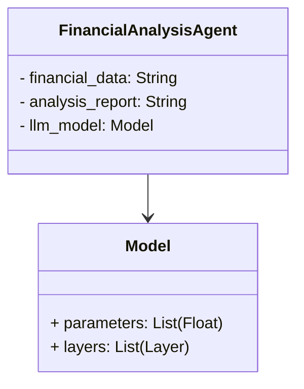
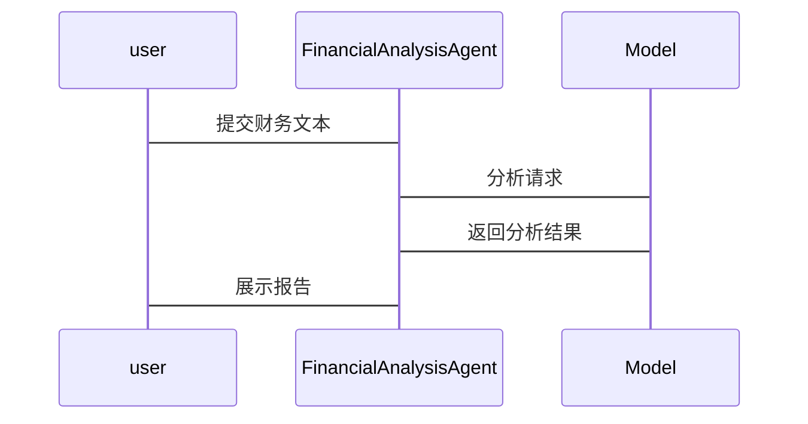

                 


# 智能财务分析 AI Agent：LLM 在企业财务管理中的应用

---

## 关键词：LLM、AI Agent、智能财务分析、企业财务管理、大语言模型

---

## 摘要：本文探讨了大语言模型（LLM）在企业财务管理中的应用，重点分析了智能财务分析AI Agent的核心概念、算法原理、系统架构及实际案例。通过详细的技术分析和实际应用，揭示了LLM如何赋能企业财务管理，提升效率和决策能力。

---

## 第1章: LLM 与智能财务分析AI Agent 的背景与概念

### 1.1 背景介绍

#### 1.1.1 大语言模型（LLM）的基本概念
大语言模型（Large Language Models，LLM）是基于深度学习的自然语言处理模型，能够理解和生成人类语言。LLM通过大量数据训练，具备强大的文本处理能力，广泛应用于文本生成、翻译、问答等领域。

#### 1.1.2 智能财务分析AI Agent 的概念
智能财务分析AI Agent是一种基于LLM的智能代理系统，能够自动处理和分析财务数据，生成财务报告，提供决策支持。它结合了自然语言处理和财务管理的专业知识，能够理解复杂的财务文本，并生成结构化的财务分析结果。

#### 1.1.3 问题背景与需求
传统财务分析依赖人工处理，效率低、成本高且容易出错。随着企业数据量的爆炸式增长，人工分析难以满足实时性和精确性的需求。LLM的引入为企业财务管理带来了智能化的解决方案，能够快速处理大量数据，提供精准的分析结果。

---

### 1.2 核心概念与联系

#### 1.2.1 核心概念的解释
- **LLM**：大语言模型，能够理解和生成自然语言文本。
- **AI Agent**：智能代理，能够感知环境并执行任务的智能系统。
- **智能财务分析**：利用AI技术对财务数据进行自动化分析和决策支持。

#### 1.2.2 核心概念的联系
智能财务分析AI Agent通过LLM处理财务文本，结合财务知识库进行分析，生成结构化的财务报告和预测结果。LLM作为AI Agent的核心技术，提供了强大的自然语言处理能力，而AI Agent则将这种能力应用于具体的财务管理任务中。

#### 1.2.3 概念结构与核心要素
- **输入**：财务文本数据（如财务报表、业务报告）。
- **处理**：LLM对文本进行理解、分析和生成。
- **输出**：结构化的财务分析结果（如财务指标、趋势预测）。
- **应用**：财务报告生成、风险预警、决策支持。

---

## 第2章: LLM 在财务分析中的算法原理

### 2.1 LLM 的数学基础

#### 2.1.1 概率论基础
概率论是LLM的核心基础。模型通过概率分布预测下一个词，例如：
$$ P(word_{n+1} | word_1, word_2, ..., word_n) $$

#### 2.1.2 信息论基础
信息论用于衡量数据的不确定性。熵公式为：
$$ H(X) = -\sum_{i=1}^{n} P(x_i) \log P(x_i) $$

#### 2.1.3 语言模型的训练目标
LLM的训练目标是最小化预测错误，通常使用交叉熵损失函数：
$$ \mathcal{L} = -\sum_{i=1}^{n} \log P(x_i | x_{<i}) $$

---

### 2.2 LLM 的训练过程

#### 2.2.1 预训练目标
预训练目标是生成与上下文相关的文本。例如：
$$ P(\text{context}) \rightarrow \text{continuation} $$

#### 2.2.2 微调过程
微调是将模型适配具体任务的过程。例如，在财务分析任务中，使用财务文本数据进行微调：
$$ \mathcal{L}_{\text{financial}} = \mathcal{L}_{\text{base}} + \mathcal{L}_{\text{task}} $$

---

### 2.3 LLM 的生成机制

#### 2.3.1 解码器的生成策略
解码器通过贪心搜索或采样生成文本：
$$ y_{i} = \arg\max P(y_i | y_{<i}, x) $$

#### 2.3.2 贝叶斯推断在生成中的应用
贝叶斯推断用于概率生成：
$$ P(y|x) = \frac{P(x|y)P(y)}{P(x)} $$

---

## 第3章: 智能财务分析AI Agent 的系统架构

### 3.1 系统功能设计

#### 3.1.1 领域模型设计
领域模型包括以下模块：


#### 3.1.2 系统架构设计
系统架构分为数据层、模型层和应用层：


---

### 3.2 系统接口设计

#### 3.2.1 接口定义
API接口定义如下：
```python
class FinancialAnalysisAgent:
    def __init__(self, model_path):
        self.model = load_model(model_path)
    
    def analyze(self, input_text):
        return self.model.generate(input_text)
```

#### 3.2.2 交互流程
交互流程如下：


---

## 第4章: 项目实战

### 4.1 环境安装

#### 4.1.1 安装依赖
安装必要的库：
```bash
pip install transformers numpy pandas
```

### 4.2 核心实现

#### 4.2.1 代码实现
实现财务分析AI Agent的代码：
```python
from transformers import AutoTokenizer, AutoModelForCausalLM
import torch

class FinancialAnalysisAgent:
    def __init__(self, model_name):
        self.tokenizer = AutoTokenizer.from_pretrained(model_name)
        self.model = AutoModelForCausalLM.from_pretrained(model_name)
    
    def analyze(self, text):
        inputs = self.tokenizer(text, return_tensors="pt")
        outputs = self.model.generate(inputs.input_ids, max_length=500)
        return self.tokenizer.decode(outputs[0], skip_special_tokens=True)
```

### 4.3 实际案例

#### 4.3.1 案例分析
分析财务报告并生成摘要：
```python
agent = FinancialAnalysisAgent("gpt2")
report = agent.analyze("公司2022年收入增长率为15%，净利润率提高5%。")
print(report)
```

---

## 第5章: 总结与展望

### 5.1 最佳实践 Tips
- 数据质量是关键，确保财务文本的准确性和完整性。
- 定期更新模型，保持对最新财务知识的学习。

### 5.2 小结
本文详细探讨了LLM在智能财务分析AI Agent中的应用，从算法原理到系统架构，再到实际案例，展示了LLM在企业财务管理中的巨大潜力。

### 5.3 注意事项
- 数据隐私和安全问题需要高度重视。
- 模型的可解释性是实际应用中的重要考量。

### 5.4 拓展阅读
建议阅读以下资料：
- [Transformers官方文档](https://huggingface.co/transformers)
- [深度学习与自然语言处理](https://www.deeplearningbook.org/)

---

## 作者：AI天才研究院（AI Genius Institute） & 禅与计算机程序设计艺术（Zen And The Art of Computer Programming）

---

**本文由AI天才研究院团队撰写，转载请注明出处。**

