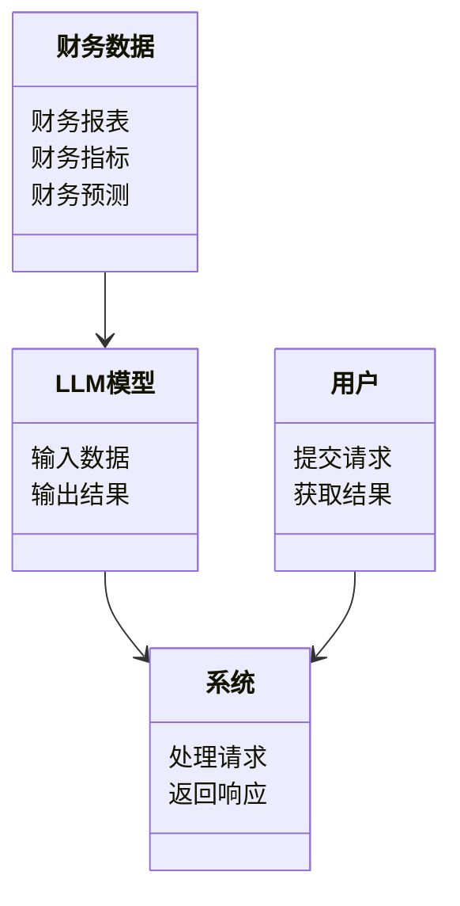
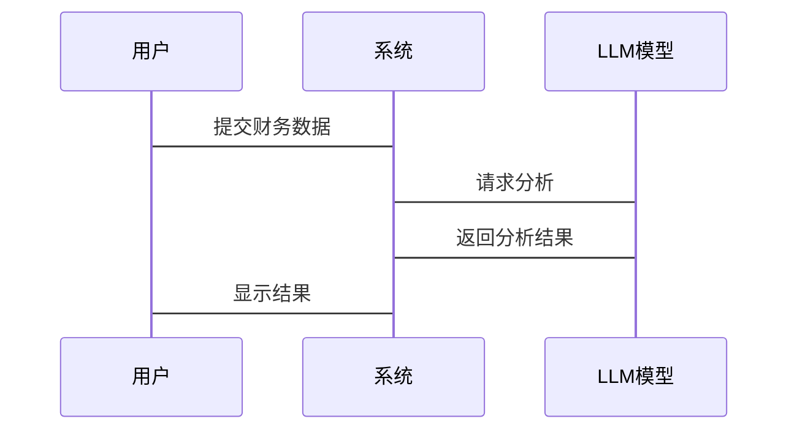
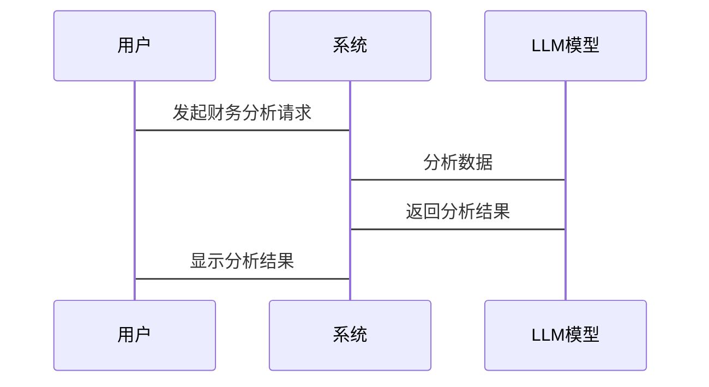

                 


# 智能财务分析AI Agent：LLM在企业决策中的应用

> **关键词**：智能财务分析，LLM，企业决策，大语言模型，财务数据，AI技术  
> **摘要**：随着人工智能技术的飞速发展，大语言模型（LLM）在财务分析和企业决策中的应用越来越广泛。本文将详细探讨LLM在智能财务分析中的核心原理、应用场景、系统架构以及实际项目中的应用，为企业利用AI技术优化财务分析和决策提供深度洞察。

---

## 第1章: 智能财务分析的背景与意义

### 1.1 财务分析的传统方法与痛点

#### 1.1.1 传统财务分析的局限性
传统的财务分析方法依赖于人工操作，效率低下且容易出错。分析师需要手动整理和处理大量数据，导致分析周期长、成本高。此外，传统方法难以应对复杂的数据关联性和实时性需求。

#### 1.1.2 企业决策中的数据孤岛问题
企业在不同部门和系统中积累了大量的数据，但由于数据格式和存储方式的差异，往往形成数据孤岛。这使得跨部门的数据整合和分析变得困难，影响了企业决策的及时性和准确性。

#### 1.1.3 财务分析的效率与准确性挑战
传统财务分析方法依赖于经验丰富的分析师，但随着企业规模的扩大和数据量的激增，单靠人工分析难以满足需求。此外，人为因素可能导致分析结果的偏差，影响决策的准确性。

### 1.2 AI技术在财务分析中的应用前景

#### 1.2.1 AI技术的基本概念与分类
人工智能（AI）技术包括机器学习、自然语言处理（NLP）、计算机视觉等多种分支。在财务分析中，AI技术可以帮助企业实现自动化数据处理、智能预测和决策支持。

#### 1.2.2 大语言模型（LLM）的崛起
大语言模型（LLM）是基于Transformer架构的NLP模型，具有强大的文本理解和生成能力。LLM在财务分析中的应用潜力巨大，可以实现财务报告生成、数据清洗和智能分析等任务。

#### 1.2.3 LLM在财务分析中的潜在价值
LLM可以通过自然语言处理技术，帮助企业在财务报告中提取关键信息，生成财务摘要，并提供实时的财务分析支持。这不仅提高了分析效率，还增强了决策的准确性。

---

## 第2章: 大语言模型（LLM）的核心原理

### 2.1 LLM的基本概念与技术特点

#### 2.1.1 什么是大语言模型
大语言模型是基于Transformer架构的深度学习模型，通过预训练和微调技术，能够理解和生成人类语言。LLM的核心在于其强大的上下文理解和生成能力。

#### 2.1.2 LLM的核心技术特点
- **大规模数据训练**：LLM通常基于海量数据进行预训练，具备广泛的知识覆盖能力。
- **自注意力机制**：通过自注意力机制，模型可以捕捉文本中的长距离依赖关系，实现更精准的理解和生成。
- **可扩展性**：LLM可以通过微调技术快速适应特定领域的任务需求。

#### 2.1.3 LLM与传统NLP模型的区别
传统的NLP模型通常依赖于特定任务的标注数据，而LLM通过预训练的方式，可以在多种任务上通用，减少了数据依赖性。

### 2.2 LLM的训练与微调

#### 2.2.1 预训练的概念与流程
预训练是指在大规模通用数据上训练模型，使其具备基本的语言理解和生成能力。预训练过程通常包括词嵌入、自注意力机制和前馈网络的优化。

#### 2.2.2 微调（Fine-tuning）的原理
微调是指在预训练的基础上，针对特定任务对模型进行进一步优化。通过微调，模型可以更好地适应特定领域的数据和任务需求。

#### 2.2.3 基于LLM的定制化模型开发
企业可以根据自身需求，基于LLM构建定制化的财务分析模型，例如自动生成财务报告、预测财务趋势等。

### 2.3 LLM的数学模型与公式

#### 2.3.1 Transformer模型的数学公式
Transformer模型由编码器和解码器组成，编码器负责将输入序列映射为语义向量，解码器则根据编码器的输出生成目标序列。自注意力机制的计算公式如下：

$$
\text{Attention}(Q, K, V) = \text{softmax}\left(\frac{QK^T}{\sqrt{d_k}}\right)V
$$

其中，$Q$、$K$、$V$分别为查询、键和值矩阵，$d_k$为键的维度。

#### 2.3.2 多头注意力机制的数学推导
多头注意力机制通过并行计算多个自注意力头，增强了模型的表达能力。每个头的注意力计算如下：

$$
\text{Multi-head}(Q, K, V) = \text{Concat}(\text{Head}_1, \text{Head}_2, \ldots, \text{Head}_n)
$$

其中，$\text{Head}_i$表示第$i$个自注意力头的输出。

---

## 第3章: LLM在财务分析中的应用场景

### 3.1 财务报告的自动生成

#### 3.1.1 财务报告生成的基本流程
通过LLM，企业可以将财务数据输入模型，生成结构化或非结构化的财务报告。生成过程包括数据预处理、模型调用和结果输出。

#### 3.1.2 基于LLM的财务报告生成案例
例如，企业可以通过输入季度财务数据，生成包含财务摘要、关键指标分析和趋势预测的财务报告。

### 3.2 财务数据的智能分析

#### 3.2.1 数据清洗与预处理
LLM可以帮助企业清洗和预处理财务数据，例如自动识别并修复数据中的错误或缺失值。

#### 3.2.2 财务数据的智能分析与预测
通过LLM，企业可以实现财务数据的智能分析，例如预测未来财务状况、识别财务风险等。

### 3.3 企业决策支持系统

#### 3.3.1 基于LLM的决策支持系统架构
LLM可以作为决策支持系统的核心模块，提供实时的财务分析和预测支持。

#### 3.3.2 LLM在企业战略决策中的应用
例如，企业在制定投资决策时，可以通过LLM分析市场趋势、财务数据，提供决策支持。

---

## 第4章: LLM在财务分析中的算法原理

### 4.1 Transformer模型的原理

#### 4.1.1 Transformer的基本结构
Transformer由编码器和解码器组成，编码器负责将输入序列映射为语义向量，解码器则根据编码器的输出生成目标序列。

#### 4.1.2 自注意力机制的实现
自注意力机制通过计算输入序列中每个词与其他词的相关性，生成注意力权重矩阵，从而捕捉序列中的长距离依赖关系。

#### 4.1.3 前馈神经网络的设计
前馈神经网络通常包括多个全连接层和激活函数，用于对输入特征进行非线性变换。

### 4.2 LLM的训练流程

#### 4.2.1 预训练任务的设计
预训练任务通常包括掩码语言模型（MLM）和下文预测（Causal Language Model）等任务，帮助模型学习语言的语法和语义。

#### 4.2.2 模型的并行训练策略
通过并行计算和分布式训练，可以提高模型的训练效率，降低训练成本。

#### 4.2.3 模型的评估与优化
模型的评估通常基于验证集的准确率、召回率等指标，通过调整超参数和优化算法，可以进一步提升模型性能。

---

## 第5章: LLM的数学模型与公式

### 5.1 注意力机制的数学公式

#### 5.1.1 自注意力机制的计算公式
自注意力机制的计算公式如下：

$$
\text{Attention}(Q, K, V) = \text{softmax}\left(\frac{QK^T}{\sqrt{d_k}}\right)V
$$

其中，$Q$、$K$、$V$分别为查询、键和值矩阵，$d_k$为键的维度。

#### 5.1.2 多头注意力机制的数学推导
多头注意力机制通过并行计算多个自注意力头，增强了模型的表达能力。每个头的注意力计算如下：

$$
\text{Multi-head}(Q, K, V) = \text{Concat}(\text{Head}_1, \text{Head}_2, \ldots, \text{Head}_n)
$$

其中，$\text{Head}_i$表示第$i$个自注意力头的输出。

### 5.2 Transformer模型的损失函数

#### 5.2.1 交叉熵损失函数
交叉熵损失函数用于衡量模型预测结果与真实标签之间的差异，公式如下：

$$
\text{Loss} = -\sum_{i=1}^{n} y_i \log(p_i) + (1 - y_i) \log(1 - p_i)
$$

其中，$y_i$是真实标签，$p_i$是模型预测的概率。

#### 5.2.2 模型优化的技巧与策略
通过调整学习率、批量大小和优化算法（如Adam、SGD等），可以进一步优化模型的训练效果。

---

## 第6章: 系统分析与架构设计方案

### 6.1 系统功能设计

#### 6.1.1 领域模型（ER图）
以下是基于LLM的智能财务分析系统的领域模型：



#### 6.1.2 系统架构设计
以下是系统的架构图：


### 6.2 接口设计与交互流程

#### 6.2.1 系统接口设计
以下是系统的接口设计：



#### 6.2.2 系统交互流程
以下是系统的交互流程：



---

## 第7章: 项目实战

### 7.1 环境安装与配置

#### 7.1.1 安装Python环境
安装Python 3.8或更高版本，并安装必要的库，如TensorFlow、PyTorch、Hugging Face Transformers等。

#### 7.1.2 安装LLM框架
安装Hugging Face Transformers库，用于加载和使用预训练的LLM模型。

### 7.2 核心代码实现

#### 7.2.1 数据预处理
```python
import pandas as pd
import torch
from transformers import AutoTokenizer, AutoModelForCausalLM

# 加载预训练模型和分词器
model_name = "gpt2"
tokenizer = AutoTokenizer.from_pretrained(model_name)
model = AutoModelForCausalLM.from_pretrained(model_name)

# 定义数据预处理函数
def preprocess_data(text):
    inputs = tokenizer.encode(text, return_tensors="pt")
    return inputs

# 示例数据
text = "Please generate a financial report for Q1 2023."
inputs = preprocess_data(text)
```

#### 7.2.2 模型调用与结果生成
```python
# 调用模型生成财务报告
outputs = model.generate(inputs, max_length=500, num_beams=5, temperature=0.7)

# 解码生成结果
decoded = tokenizer.decode(outputs[0], skip_special_tokens=True)
print(decoded)
```

### 7.3 项目小结
通过以上代码示例，我们可以看到LLM在财务分析中的强大能力。企业可以根据自身需求，基于LLM构建定制化的财务分析系统，提升分析效率和决策能力。

---

## 第8章: 最佳实践与小结

### 8.1 最佳实践 tips
- 在使用LLM进行财务分析时，确保数据的准确性和隐私性。
- 定期对模型进行微调，以适应业务变化和数据更新。
- 结合可视化工具，提升用户体验和分析效果。

### 8.2 小结
随着LLM技术的不断发展，其在财务分析和企业决策中的应用前景广阔。通过合理设计和优化，企业可以充分利用LLM的优势，提升财务分析效率和决策能力。

### 8.3 注意事项
- 数据隐私和安全是使用LLM进行财务分析时需要重点关注的问题。
- 在实际应用中，需要结合企业的具体需求，选择合适的LLM模型和优化策略。

### 8.4 拓展阅读
建议读者进一步阅读Hugging Face的官方文档，了解如何加载和使用各种LLM模型。同时，可以参考相关论文，深入理解LLM的核心原理和技术细节。

---

## 作者

**作者：AI天才研究院/AI Genius Institute & 禅与计算机程序设计艺术 /Zen And The Art of Computer Programming**

---

通过以上内容，我们可以看到LLM在智能财务分析中的巨大潜力和实际应用价值。企业可以充分利用LLM技术，构建高效、智能的财务分析系统，为企业的决策提供有力支持。

