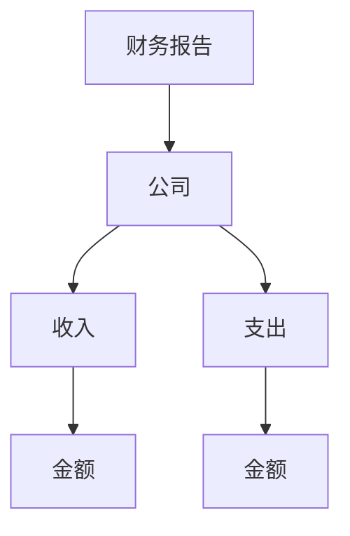
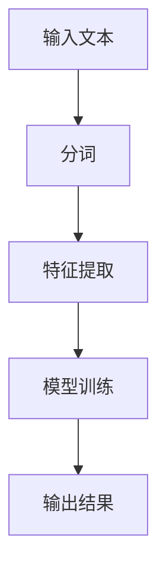
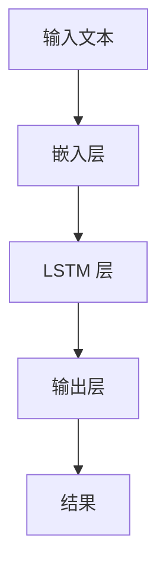
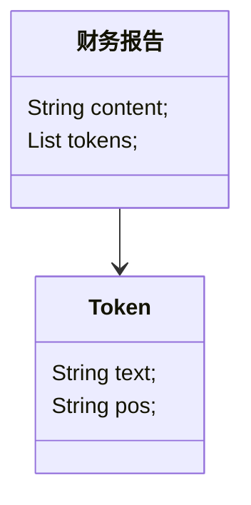
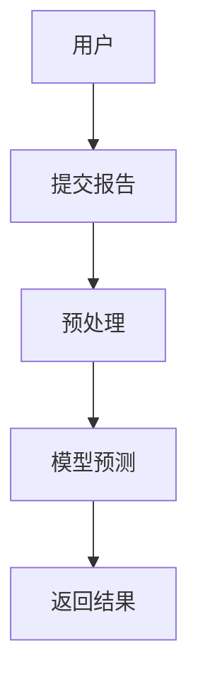

                 


# 智能财务报告关键信息提取工具

## 关键词：智能财务报告，信息提取，自然语言处理，机器学习，深度学习，规则引擎

## 摘要：智能财务报告关键信息提取工具结合了自然语言处理和机器学习技术，旨在解决传统财务报告信息提取效率低、准确性差的问题。本文详细探讨了该工具的核心概念、算法原理、系统架构及其实现方案，提供了从理论到实践的全面指导。

---

## 第1章 财务报告关键信息提取的背景与问题

### 1.1 问题背景

#### 1.1.1 传统财务报告处理的痛点
传统财务报告的处理方式依赖人工操作，存在效率低、误差率高、成本高等问题。随着企业规模的扩大和数据量的增加，人工提取关键信息的效率难以满足需求。

#### 1.1.2 智能化提取的需求驱动
企业对财务数据的实时性和准确性要求不断提高，智能化信息提取工具成为提升财务处理效率的关键。

#### 1.1.3 人工智能技术的应用潜力
自然语言处理（NLP）和机器学习（ML）技术的发展为财务信息提取提供了新的解决方案。

### 1.2 问题描述

#### 1.2.1 财务报告信息提取的核心问题
如何从非结构化文本中准确提取关键信息，如收入、支出、利润等。

#### 1.2.2 数据结构与语义分析的挑战
财务报告中的数据通常以复杂文本形式出现，语义分析需要考虑上下文和专业术语。

#### 1.2.3 多语言与多格式的复杂性
财务报告可能涉及多种语言和格式，增加了信息提取的难度。

### 1.3 问题解决思路

#### 1.3.1 自然语言处理技术的应用
利用分词、句法分析等技术处理财务报告文本。

#### 1.3.2 机器学习与深度学习的结合
使用机器学习模型（如CRF）和深度学习模型（如LSTM）进行信息提取。

#### 1.3.3 规则引擎与模型训练的融合
通过规则引擎处理结构化数据，模型训练处理非结构化数据。

### 1.4 边界与外延

#### 1.4.1 信息提取的边界条件
仅提取财务相关数据，不处理其他信息。

#### 1.4.2 相关领域的外延扩展
如税务处理、审计等。

#### 1.4.3 工具的适用范围与限制
适用于结构化和非结构化财务数据，不适用于完全无结构的数据。

### 1.5 核心概念结构

#### 1.5.1 智能财务报告工具的组成要素
文本预处理、特征提取、模型训练、结果展示。

#### 1.5.2 关键信息提取的流程框架
数据采集 → 预处理 → 特征提取 → 模型训练 → 结果分析。

#### 1.5.3 工具与用户交互的关系
用户输入报告，工具输出提取结果，用户可调整规则或模型参数。

---

## 第2章 关键信息提取的核心概念与联系

### 2.1 核心概念原理

#### 2.1.1 文本预处理技术
去除停用词、分词、句法分析等。

#### 2.1.2 特征提取与向量化
使用词袋模型、TF-IDF、Word2Vec提取特征。

#### 2.1.3 模型训练与优化
利用CRF、LSTM等模型进行训练，调整参数优化性能。

### 2.2 核心概念对比表

| 技术        | 特点                     | 优缺点                          | 应用场景                 |
|-------------|--------------------------|----------------------------------|--------------------------|
| 规则引擎    | 基于预定义规则           | 简单易懂，但灵活性差           | 结构化数据提取           |
| 机器学习    | 数据驱动，适应性强       | 需大量数据，训练时间长         | 非结构化数据提取         |
| 深度学习    | 强大学习能力             | 计算资源需求高                 | 复杂语义分析             |

### 2.3 ER实体关系图



---

## 第3章 算法原理

### 3.1 算法选择与流程

#### 3.1.1 条件随机场（CRF）
用于序列标注任务，适合处理财务报告中的实体识别。

#### 3.1.2 长短期记忆网络（LSTM）
适合处理长文本序列，提取上下文信息。

### 3.2 算法实现

#### 3.2.1 CRF流程图



#### 3.2.2 LSTM流程图



### 3.3 代码实现

#### 3.3.1 CRF实现

```python
import sklearn_crfsuite
from sklearn_crfsuite import CRF
from sklearn_crfsuite.utils import mean_length_of_sentence_in_corpus

# 数据预处理
X_train = [...]  # 特征向量
y_train = [...]  # 标签

# 模型训练
crf = CRF()
crf.fit(X_train, y_train)

# 预测
X_test = [...]  # 测试数据
y_pred = crf.predict(X_test)
```

### 3.4 数学模型

#### 3.4.1 CRF公式
$$ P(y|x) = \frac{1}{Z} \exp(\sum_{i=1}^n \sum_{j=1}^m w_j f_j(x,y)) $$

#### 3.4.2 LSTM公式
$$ h_t = \text{LSTM}(h_{t-1}, x_t) $$

---

## 第4章 系统分析与架构设计

### 4.1 项目背景
智能财务报告工具旨在提高财务信息提取的效率和准确性。

### 4.2 功能设计

#### 4.2.1 领域模型



#### 4.2.2 系统架构


#### 4.2.3 接口设计
RESTful API：`POST /extract`

#### 4.2.4 交互流程图



---

## 第5章 项目实战

### 5.1 环境安装
安装Python和相关库（如scikit-learn、spaCy）。

### 5.2 核心代码实现

#### 5.2.1 文本预处理

```python
import spacy

nlp = spacy.load("en_core_web_sm")
doc = nlp(text)
tokens = [token.text for token in doc]
```

#### 5.2.2 模型训练

```python
from sklearn.feature_extraction.text import TfidfVectorizer

vectorizer = TfidfVectorizer()
X = vectorizer.fit_transform(documents)
```

### 5.3 实际案例分析

#### 5.3.1 案例分析
从财务报告中提取收入和支出信息。

#### 5.3.2 代码实现

```python
from sklearn_crfsuite import CRF

crf = CRF()
crf.fit(X_train, y_train)
```

### 5.4 项目总结

#### 5.4.1 关键点总结
模型选择、数据预处理、规则引擎与模型结合。

#### 5.4.2 注意事项
数据质量、模型调优、错误处理。

---

## 第6章 最佳实践与小结

### 6.1 最佳实践

#### 6.1.1 工具使用建议
结合规则引擎和模型优化。

#### 6.1.2 注意事项
数据清洗、模型调优、错误处理。

### 6.2 未来发展方向
多语言支持、实时处理、动态规则调整。

### 6.3 参考文献
[1] 《自然语言处理实战》  
[2] 《机器学习算法实战》  

---

## 作者：AI天才研究院/AI Genius Institute & 禅与计算机程序设计艺术 /Zen And The Art of Computer Programming

