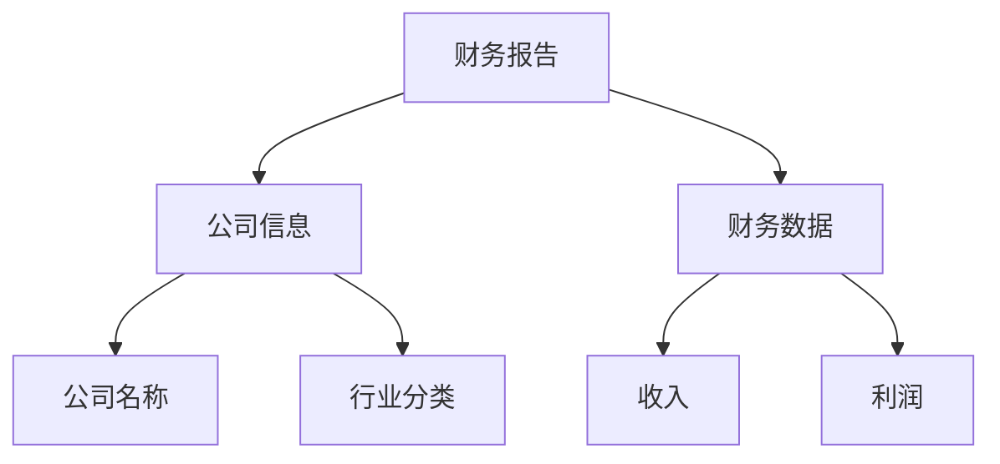
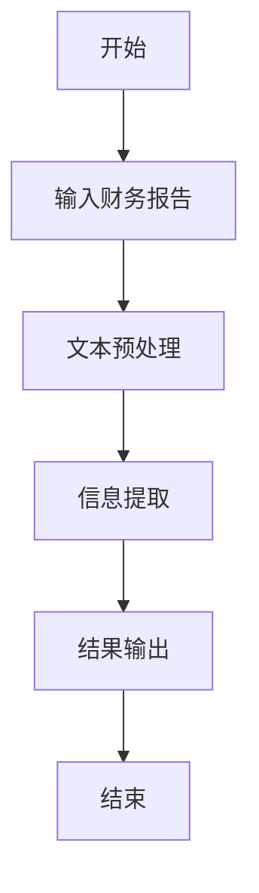
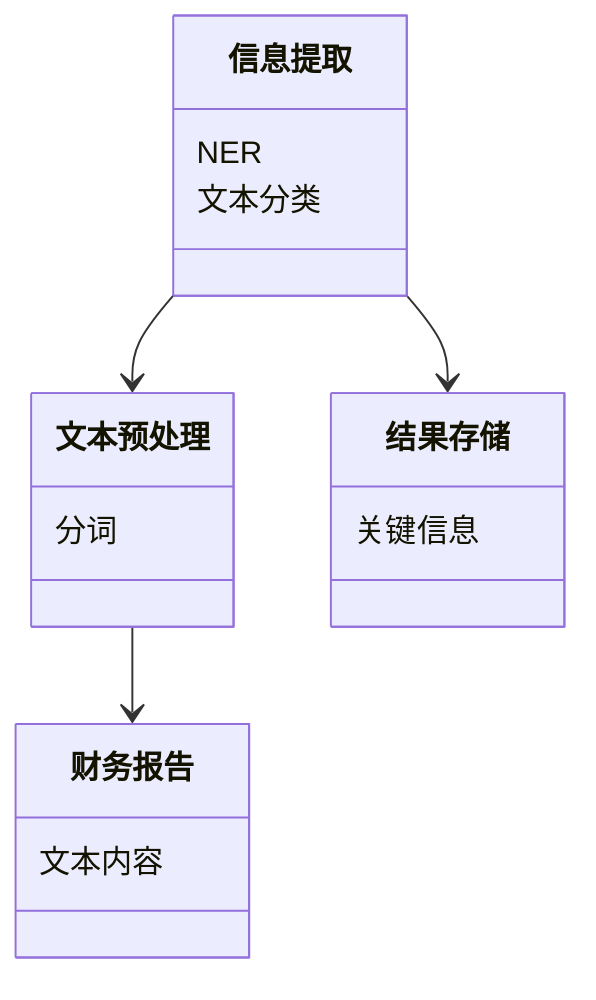
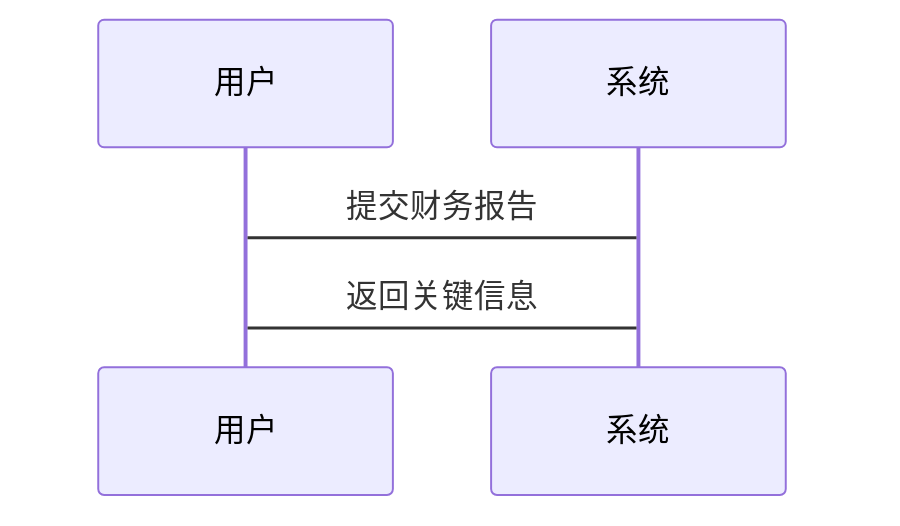

                 


# 智能财务报告关键信息提取系统

> 关键词：智能财务报告、关键信息提取、自然语言处理、机器学习、信息抽取、实体识别

> 摘要：本文详细介绍了智能财务报告关键信息提取系统的设计与实现，从问题背景到系统架构，从算法原理到项目实战，全面剖析了该系统的核心技术与应用场景。通过结合自然语言处理与机器学习，该系统能够高效准确地提取财务报告中的关键信息，为企业决策提供数据支持。

---

## 第一部分: 智能财务报告关键信息提取系统概述

### 第1章: 背景介绍

#### 1.1 问题背景
随着企业规模的不断扩大和业务复杂性的增加，财务报告的生成和分析变得越来越重要。传统的财务报告分析依赖于人工操作，效率低且容易出错。如何快速、准确地从财务报告中提取关键信息，成为企业信息化建设的重要课题。

#### 1.2 问题描述
财务报告中的信息通常以文本形式呈现，包含大量非结构化数据。人工提取这些信息不仅耗时，而且容易遗漏重要信息。因此，开发一个智能系统，能够自动提取财务报告中的关键信息（如公司名称、营业收入、净利润等），具有重要的现实意义。

#### 1.3 问题解决
通过结合自然语言处理（NLP）和机器学习技术，智能财务报告关键信息提取系统能够自动识别和提取文本中的关键信息。该系统不仅可以提高信息提取的效率，还能降低人为错误。

#### 1.4 边界与外延
智能财务报告关键信息提取系统的边界主要集中在文本信息的提取部分，不包括报告生成和数据可视化功能。其外延则涉及与之相关的领域，如财务数据分析、商业智能等。

#### 1.5 概念结构与核心要素
系统的核心概念包括：
- **输入**：财务报告文本
- **输出**：提取的关键信息（如公司名称、财务数据）
- **核心算法**：命名实体识别（NER）、文本分类
- **系统架构**：基于微服务的分布式架构

---

## 第二部分: 核心概念与联系

### 第2章: 核心概念与联系

#### 2.1 关键概念的原理
- **自然语言处理（NLP）**：通过语言学规则和机器学习算法，对文本进行理解和分析。
- **机器学习**：利用数据训练模型，识别文本中的模式和规律。

#### 2.2 概念属性特征对比
| 概念 | 属性 | 特征 |
|------|------|------|
| NER  | 精度 | 高 |
| 文本分类 | 召回率 | 高 |
| 混淆矩阵 | F1分数 | 平衡精度和召回率 |

#### 2.3 ER实体关系图架构


---

## 第三部分: 算法原理讲解

### 第3章: 算法原理

#### 3.1 算法流程图


#### 3.2 数学模型与公式
##### 3.2.1 命名实体识别（NER）模型
NER模型的目标是识别文本中的命名实体（如公司名称、金额）。常用的模型包括条件随机场（CRF）和基于深度学习的模型（如LSTM）。

条件随机场（CRF）的转移概率公式：
$$ P(y_i | y_{i-1}, x) = \frac{\exp(s(y_{i-1}, y_i))}{\sum_{y_j} \exp(s(y_{i-1}, y_j))} $$
其中，$s$ 是得分函数。

##### 3.2.2 文本分类模型
文本分类模型用于将文本划分为不同的类别（如“收入”、“利润”）。常用的算法包括支持向量机（SVM）和随机森林。

随机森林的分类公式：
$$ y = \text{多数投票}(\{h_1(x), h_2(x), ..., h_n(x)\}) $$
其中，$h_i$ 是决策树。

---

## 第四部分: 系统分析与架构设计

### 第4章: 系统分析与架构设计

#### 4.1 系统架构设计
系统采用基于微服务的分布式架构，包括以下几个模块：
- **文本预处理模块**：负责清洗和分词。
- **信息提取模块**：负责使用NER和文本分类提取关键信息。
- **结果存储模块**：将提取的信息存储到数据库中。
- **接口模块**：提供API供其他系统调用。

#### 4.2 系统功能设计
- **领域模型**：


#### 4.3 系统接口设计
- **输入接口**：提供财务报告文本的输入接口。
- **输出接口**：返回提取的关键信息。
- **API接口**：提供RESTful API供其他系统调用。

#### 4.4 系统交互设计


---

## 第五部分: 项目实战

### 第5章: 项目实战

#### 5.1 环境安装
- 安装Python环境。
- 安装必要的库（如spaCy、scikit-learn）。

#### 5.2 系统核心实现
##### 5.2.1 安装环境
```bash
pip install spacy scikit-learn
python -m spacy download en
```

##### 5.2.2 核心代码实现
```python
import spacy
from sklearn.feature_extraction.text import TfidfVectorizer
from sklearn.svm import SVC

# 加载模型
nlp = spacy.load("en")

def extract_entities(text):
    doc = nlp(text)
    entities = []
    for ent in doc.ents:
        entities.append((ent.text, ent.label_))
    return entities

# 文本分类
vectorizer = TfidfVectorizer()
model = SVC()
# 假设我们已经训练好了模型并进行了文本向量化
# 这里仅展示分类过程
predicted_labels = model.predict(vectorized_texts)
```

##### 5.2.3 代码解读
- **实体识别**：使用spaCy进行NER任务。
- **文本分类**：使用TF-IDF和SVM进行分类。

#### 5.3 案例分析
假设输入文本为“公司在2023年实现营业收入100亿元，净利润20亿元。”，系统提取的关键信息为：
- 公司名称：未明确提及。
- 营业收入：100亿元。
- 净利润：20亿元。

---

## 第六部分: 总结与展望

### 第6章: 总结与展望

#### 6.1 最佳实践 tips
- 数据预处理是关键，尤其是分词和停用词处理。
- 模型调参可以显著提高准确率。

#### 6.2 小结
本文详细介绍了智能财务报告关键信息提取系统的设计与实现，从背景到算法，从系统架构到项目实战，全面剖析了该系统的实现过程。

#### 6.3 注意事项
- 数据质量直接影响提取效果。
- 系统需要定期更新模型以适应新的文本格式。

#### 6.4 拓展阅读
- 《自然语言处理实战》
- 《机器学习实战》

---

## 作者

作者：AI天才研究院/AI Genius Institute & 禅与计算机程序设计艺术 /Zen And The Art of Computer Programming

