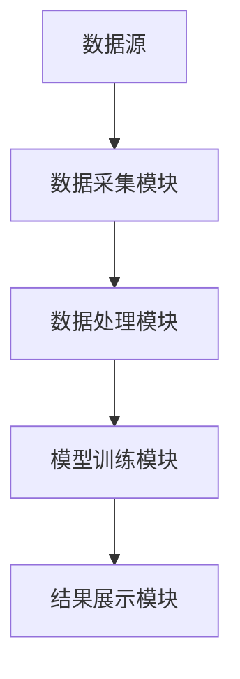
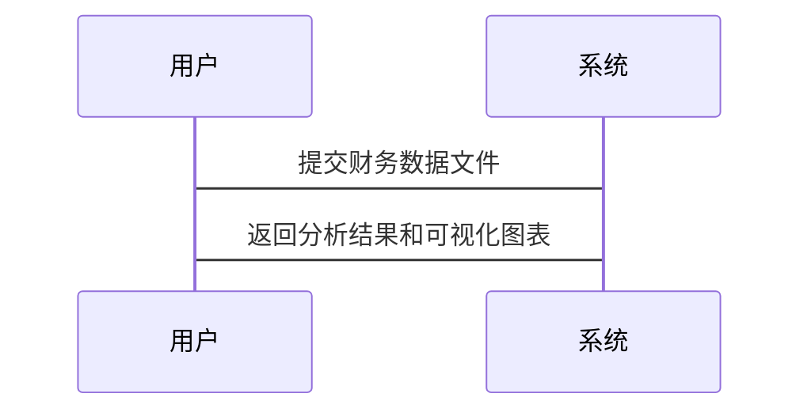

                 


# 智能财务报表分析与解读

## 关键词：智能财务报表分析、人工智能、机器学习、深度学习、财务数据分析

## 摘要：智能财务报表分析是通过人工智能技术，如机器学习和深度学习，对财务数据进行自动化和智能化的分析与解读。本文将详细探讨智能财务报表分析的背景、核心概念、算法原理、系统架构设计、项目实战以及最佳实践，帮助读者全面理解并掌握这一技术。

---

## 第1章：智能财务报表分析的背景与意义

### 1.1 问题背景与挑战

随着企业规模的不断扩大和业务的复杂化，财务报表数据呈现出数据量大、维度多、信息复杂的特点。传统的财务报表分析方法依赖于人工经验，容易受到主观因素的影响，且效率低下。面对海量数据，传统方法难以快速、准确地提取有价值的信息，这使得企业难以及时做出决策。

此外，财务数据的多样性和动态变化对分析的准确性和实时性提出了更高的要求。传统的统计分析方法在面对复杂数据时显得力不从心，难以满足现代企业的需求。

### 1.2 问题解决与技术优势

人工智能技术，特别是机器学习和深度学习，为财务报表分析带来了革命性的变化。通过自动化数据处理、模式识别和预测分析，AI能够快速从大量数据中提取关键信息，帮助财务分析师做出更准确、更及时的决策。

AI技术的优势体现在以下几个方面：
1. **数据处理能力**：能够快速处理和分析大量复杂数据。
2. **模式识别**：通过机器学习算法发现数据中的潜在模式和关系。
3. **预测能力**：利用历史数据预测未来趋势，辅助决策。

### 1.3 应用场景与未来趋势

智能财务报表分析在多个场景中得到广泛应用，包括财务预测、风险评估、欺诈检测等。未来，随着AI技术的不断进步，财务分析将更加智能化和自动化，为企业提供更强大的数据支持和决策依据。

---

## 第2章：智能财务报表分析的核心概念

### 2.1 数据预处理与特征提取

数据预处理是智能财务分析的关键步骤，包括数据清洗、标准化和特征工程。特征工程通过选择和构造有效的特征，提升模型的性能。

#### 2.1.1 数据清洗与标准化
- **数据清洗**：去除噪声数据和冗余信息，确保数据质量。
- **标准化**：将数据标准化到同一尺度，便于模型处理。

#### 2.1.2 特征工程
- **特征选择**：通过统计方法或模型评估选择重要特征。
- **特征构造**：通过组合现有特征或引入新特征，提升模型性能。

### 2.2 机器学习与深度学习在财务分析中的应用

机器学习和深度学习在财务分析中各有优势。机器学习适用于规则明确的问题，而深度学习则擅长处理复杂非结构化数据。

#### 2.2.1 机器学习的应用
- **分类与回归**：用于财务预测和分类问题。
- **聚类分析**：用于客户群体分析和市场细分。

#### 2.2.2 深度学习的应用
- **文本分析**：用于分析财务报告和新闻，识别市场趋势。
- **图像识别**：用于识别和分析财务报表中的图像信息。

### 2.3 智能分析的特征对比

| 特征维度       | 传统方法                   | 智能方法                   |
|----------------|---------------------------|---------------------------|
| 数据处理       | 手动处理，效率低           | 自动化处理，效率高         |
| 分析深度       | 局限于表面数据             | 可发现潜在模式和关系       |
| 预测能力       | 精度低，依赖经验           | 精度高，基于数据驱动       |

---

## 第3章：机器学习算法原理

### 3.1 监督学习算法

#### 3.1.1 线性回归
- **原理**：通过最小化预测值与实际值的平方差之和，找到最佳拟合直线。
- **公式**：$$ y = \beta_0 + \beta_1x + \epsilon $$
- **应用**：用于财务预测，如销售额预测。

#### 3.1.2 支持向量机
- **原理**：通过构建超平面将数据点分开，适用于分类和回归。
- **优势**：在小样本数据上表现优异。

#### 3.1.3 决策树与随机森林
- **决策树**：通过树状结构进行分类和回归。
- **随机森林**：集成多个决策树，提升准确性和鲁棒性。

### 3.2 非监督学习算法

#### 3.2.1 聚类分析
- **K-means**：将数据分成K个簇，适用于客户群体分析。
- **层次聚类**：通过构建层次结构进行聚类。

#### 3.2.2 主成分分析（PCA）
- **原理**：降维技术，提取数据的主要特征。
- **应用**：减少数据维度，提升模型效率。

---

## 第4章：深度学习算法原理

### 4.1 神经网络基础

#### 4.1.1 前馈神经网络
- **结构**：数据向前传递，层间连接。
- **应用**：用于分类和回归任务。

#### 4.1.2 卷积神经网络（CNN）
- **结构**：适合处理图像数据，如财务报表中的图表识别。
- **卷积核**：提取局部特征。

#### 4.1.3 循环神经网络（RNN）
- **结构**：适用于序列数据，如时间序列分析。
- **长短期记忆网络（LSTM）**：解决RNN的梯度消失问题。

### 4.2 深度学习在财务分析中的应用

#### 4.2.1 文本数据处理
- **自然语言处理（NLP）**：分析财务报告和新闻，识别市场趋势。
- **情感分析**：判断市场情绪，辅助投资决策。

#### 4.2.2 图像识别
- **光学字符识别（OCR）**：识别财务报表中的文字信息。
- **图表分析**：识别财务图表中的趋势和异常。

### 4.3 深度学习模型的训练与优化

#### 4.3.1 模型训练
- **训练过程**：通过反向传播和优化器（如Adam）更新权重。
- **公式**：损失函数：$$ L = \frac{1}{n}\sum_{i=1}^{n}(y_i - \hat{y}_i)^2 $$
  优化器：$$ \theta := \theta - \eta \frac{\partial L}{\partial \theta} $$

#### 4.3.2 模型优化
- **超参数调整**：如学习率、批量大小。
- **正则化技术**：防止过拟合，如L1/L2正则化。

---

## 第5章：系统架构设计

### 5.1 系统功能模块划分

#### 5.1.1 数据采集模块
- **功能**：从数据库或文件中获取财务数据。
- **工具**：使用Pandas进行数据加载。

#### 5.1.2 数据处理模块
- **功能**：清洗、标准化和特征工程。
- **工具**：使用Scikit-learn进行特征选择。

#### 5.1.3 模型训练模块
- **功能**：训练机器学习或深度学习模型。
- **工具**：使用Scikit-learn或Keras构建模型。

#### 5.1.4 结果展示模块
- **功能**：可视化分析结果，如图表展示。
- **工具**：使用Matplotlib或Seaborn进行可视化。

### 5.2 系统架构图



### 5.3 接口设计与交互流程

#### 5.3.1 系统接口
- **输入接口**：接收财务数据文件。
- **输出接口**：返回分析结果和可视化图表。

#### 5.3.2 交互流程



---

## 第6章：项目实战

### 6.1 环境安装与配置

#### 6.1.1 安装Python与库
```bash
pip install numpy pandas scikit-learn keras matplotlib
```

### 6.2 核心代码实现

#### 6.2.1 数据预处理
```python
import pandas as pd
import numpy as np

# 加载数据
df = pd.read_csv('financial_data.csv')

# 数据清洗
df.dropna()
df['revenue'] = df['revenue'].astype(float)

# 特征工程
from sklearn.preprocessing import StandardScaler
scaler = StandardScaler()
df_scaled = scaler.fit_transform(df[['revenue', 'profit']])
```

#### 6.2.2 模型训练
```python
from sklearn.ensemble import RandomForestRegressor
model = RandomForestRegressor(n_estimators=100)
model.fit(df[['revenue', 'profit']], df['stock_price'])
```

#### 6.2.3 结果展示
```python
import matplotlib.pyplot as plt

predicted = model.predict(df[['revenue', 'profit']])
plt.scatter(df['revenue'], df['stock_price'], c='blue')
plt.scatter(df['revenue'], predicted, c='red')
plt.xlabel('Revenue')
plt.ylabel('Stock Price')
plt.show()
```

### 6.3 项目小结

通过项目实战，读者可以掌握从数据处理到模型训练的整个流程，理解智能财务报表分析的实际应用。

---

## 第7章：最佳实践与小结

### 7.1 学习小结

智能财务报表分析结合了人工智能技术，能够高效处理复杂数据，为企业提供决策支持。通过本文的学习，读者可以掌握从数据预处理到模型部署的全过程。

### 7.2 注意事项

- **数据质量**：确保数据准确性和完整性。
- **模型调优**：通过交叉验证选择最佳模型。
- **结果解释**：确保分析结果的可解释性。

### 7.3 拓展阅读

- 推荐书籍：《机器学习实战》、《深度学习》。
- 在线资源：Kaggle上的财务数据分析项目。

---

## 作者：AI天才研究院/AI Genius Institute & 禅与计算机程序设计艺术 /Zen And The Art of Computer Programming

---

通过以上内容，本文详细探讨了智能财务报表分析的各个方面，从基础概念到算法实现，再到系统设计和项目实战，帮助读者全面掌握这一技术。

