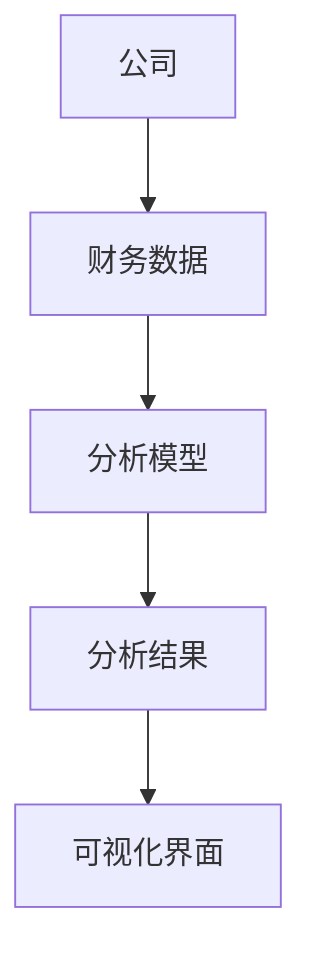

                 


# 智能财务报表分析器

> 关键词：智能财务报表分析器，人工智能，财务数据分析，机器学习，深度学习，可视化分析

> 摘要：智能财务报表分析器是一种结合人工智能技术的工具，用于自动化、智能化地分析和解读企业财务报表。本文从背景、核心概念、算法原理、系统架构到项目实战，全面解析智能财务报表分析器的构建与应用。

---

# 第一部分: 智能财务报表分析器的背景与核心概念

## 第1章: 财务报表分析的智能化转型

### 1.1 财务报表分析的现状与挑战

#### 1.1.1 传统财务报表分析的局限性
传统的财务报表分析依赖人工解读，耗时且易出错。企业财务数据量庞大，人工分析效率低下，且难以发现隐藏的趋势和异常。

#### 1.1.2 数据量增长带来的分析难题
随着企业业务的扩展，财务数据量激增。传统方法难以处理海量数据，且缺乏实时性，无法满足现代企业的高效分析需求。

#### 1.1.3 智能化分析的必要性
人工智能技术的快速发展，为财务报表分析带来了新机遇。智能化分析能够快速处理大量数据，发现潜在问题和机会，提升企业决策效率。

---

### 1.2 智能财务报表分析器的定义与目标

#### 1.2.1 智能财务报表分析器的核心定义
智能财务报表分析器是一种基于人工智能技术的工具，通过机器学习、深度学习等算法，自动分析和解读企业财务报表，提供实时、精准的分析结果。

#### 1.2.2 分析器的目标与应用场景
- **目标**：实现财务数据的自动化分析、异常检测、趋势预测和决策支持。
- **应用场景**：企业财务分析、投资决策、风险管理、审计等。

#### 1.2.3 边界与外延
智能财务报表分析器专注于数据的智能分析，不直接涉及企业业务流程的优化或其他领域。

---

### 1.3 智能财务报表分析器的核心要素

#### 1.3.1 数据来源与处理
- **数据来源**：财务报表数据（如利润表、资产负债表、现金流量表）。
- **数据处理**：数据清洗、特征提取、标准化。

#### 1.3.2 分析算法与模型
- **算法选择**：机器学习（如线性回归、支持向量机）和深度学习（如LSTM、CNN）。
- **模型优化**：超参数调整、模型评估与验证。

#### 1.3.3 可视化与交互界面
- **可视化**：图表展示分析结果（如柱状图、折线图、饼图）。
- **交互界面**：用户友好的操作界面，支持数据查询、分析结果展示和交互操作。

---

## 第2章: 智能财务报表分析器的核心概念与联系

### 2.1 核心概念原理

#### 2.1.1 数据预处理与特征提取
- **数据清洗**：去除重复、错误数据。
- **特征提取**：从财务数据中提取关键特征（如收入增长率、利润率）。

#### 2.1.2 智能分析算法的选择与优化
- **算法选择**：根据分析目标选择合适的算法。
- **模型优化**：通过交叉验证、网格搜索等方法优化模型性能。

#### 2.1.3 可视化结果的呈现方式
- **图表类型**：柱状图、折线图、饼图等。
- **交互设计**：支持用户自定义分析维度、时间范围。

---

### 2.2 核心概念对比分析

#### 2.2.1 传统分析与智能分析的对比

| 对比维度 | 传统分析 | 智能分析 |
|----------|----------|----------|
| 数据处理 | 人工处理 | 自动处理 |
| 分析效率 | 低效 | 高效 |
| 精度 | 易出错 | 高精度 |

#### 2.2.2 不同分析算法的优劣势对比

| 算法 | 优势 | 劣势 |
|------|------|------|
| 线性回归 | 简单、易于解释 | 无法处理非线性关系 |
| LSTM | 能处理时间序列数据 | 计算复杂度高 |

#### 2.2.3 数据来源的多样性与分析结果的相关性分析
- 数据来源的多样性能够提高分析的准确性。
- 数据的相关性需要通过统计方法（如相关系数）进行评估。

---

### 2.3 实体关系图架构



---

# 第二部分: 智能财务报表分析器的算法原理

## 第3章: 常用算法与模型

### 3.1 机器学习算法

#### 3.1.1 线性回归模型
线性回归用于预测连续型变量，公式如下：
$$ y = \beta_0 + \beta_1x + \epsilon $$

#### 3.1.2 支持向量机（SVM）
SVM用于分类和回归，通过最大化间隔进行分类。

### 3.2 深度学习模型

#### 3.2.1 神经网络结构
神经网络通过多层结构学习数据特征，如下图所示：


#### 3.2.2 长短期记忆网络（LSTM）
LSTM用于处理时间序列数据，公式如下：
$$ \text{LSTM} = \text{门控机制} \oplus \text{细胞状态} $$

---

## 第4章: 算法实现与优化

### 4.1 算法实现

#### 4.1.1 线性回归实现
```python
import numpy as np

# 数据准备
X = np.array([1, 2, 3, 4, 5])
y = np.array([2, 4, 5, 4, 5])

# 训练模型
beta = np.linalg.inv(X.T @ X) @ (X.T @ y)

# 预测
y_pred = beta[0] + beta[1] * X
```

#### 4.1.2 LSTM实现
```python
import keras

model = keras.Sequential()
model.add(keras.layers.LSTM(64, input_shape=(1, 1)))
model.add(keras.layers.Dense(1))
model.compile(loss='mean_squared_error', optimizer='adam')
model.fit(X_train, y_train, epochs=10)
```

### 4.2 算法优化

#### 4.2.1 超参数调整
- 调整学习率、批次大小、 epochs 等参数。

#### 4.2.2 模型评估
- 使用准确率、召回率、F1分数等指标评估模型性能。

---

# 第三部分: 智能财务报表分析器的系统分析与架构设计

## 第5章: 系统分析与架构设计方案

### 5.1 问题场景介绍
- **问题场景**：企业需要实时分析财务报表，发现潜在风险和机会。
- **项目介绍**：构建一个智能财务报表分析器，支持多维度分析和实时监控。

---

## 第6章: 系统架构设计

### 6.1 系统功能设计
- **功能模块**：
  - 数据采集模块：从财务系统中获取数据。
  - 数据处理模块：清洗、特征提取。
  - 分析引擎模块：运行机器学习模型。
  - 可视化模块：展示分析结果。

---

## 第7章: 接口设计与交互流程

### 7.1 系统接口设计
- **输入接口**：接收财务数据。
- **输出接口**：提供分析结果和可视化界面。

### 7.2 系统交互流程
1. 用户输入财务数据。
2. 系统处理数据并运行模型。
3. 系统生成分析结果并展示。

---

# 第四部分: 智能财务报表分析器的项目实战

## 第8章: 项目实战

### 8.1 环境安装
- **工具安装**：安装Python、TensorFlow、Pandas等工具。

### 8.2 系统核心实现

#### 8.2.1 数据处理代码
```python
import pandas as pd

# 数据加载
df = pd.read_csv('financial_data.csv')

# 数据清洗
df.dropna(inplace=True)

# 特征提取
features = df[['revenue', 'net_profit', 'assets']]
```

#### 8.2.2 分析引擎实现
```python
import keras

# 模型训练
model = keras.Sequential()
model.add(keras.layers.Dense(64, activation='relu', input_dim=3))
model.add(keras.layers.Dense(1, activation='sigmoid'))
model.compile(loss='binary_crossentropy', optimizer='adam')
model.fit(features, labels, epochs=50, batch_size=32)
```

### 8.3 实际案例分析
- **案例分析**：分析某企业的财务报表，预测其未来业绩。

### 8.4 项目小结
- **总结**：智能财务报表分析器能够显著提升分析效率和准确性。
- **注意事项**：数据质量和模型选择是关键。

---

# 第五部分: 总结与扩展阅读

## 第9章: 总结与扩展阅读

### 9.1 总结
智能财务报表分析器结合人工智能技术，为企业提供了高效、精准的财务分析工具。

### 9.2 最佳实践 tips
- 数据预处理是关键。
- 模型选择要根据具体问题。

### 9.3 拓展阅读
- 《机器学习实战》
- 《深度学习入门：基于Python的理论与实现》

---

作者：AI天才研究院/AI Genius Institute & 禅与计算机程序设计艺术/Zen And The Art of Computer Programming

