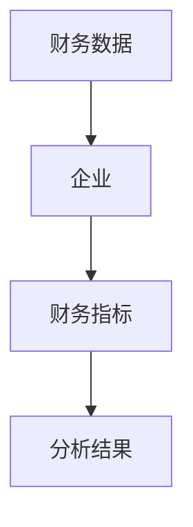
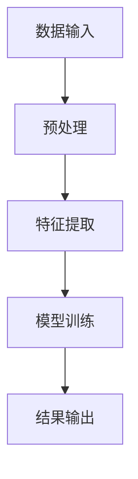
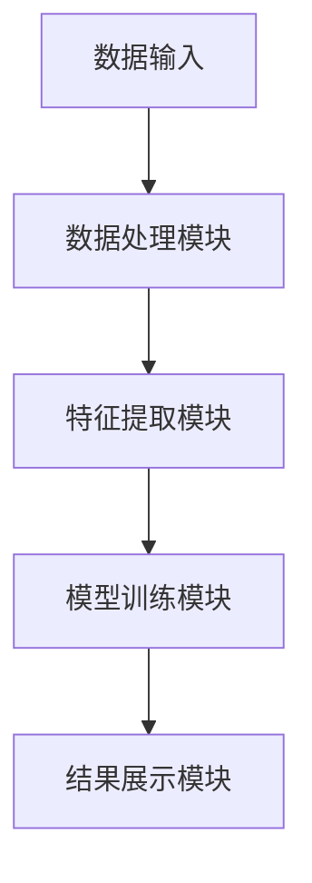

                 


# 智能财务报表比较分析系统

## 关键词：智能财务报表、比较分析、数据分析、机器学习、系统架构

## 摘要：  
本文探讨了智能财务报表比较分析系统的设计与实现，通过结合数据预处理、特征提取、模型训练和系统架构等技术，提出了一种高效的企业财务数据自动化分析方法。系统采用机器学习算法，能够实现财务报表的智能对比与分析，为企业决策提供支持。

---

# 第1章 背景介绍

## 1.1 问题背景

随着企业规模的不断扩大，财务数据的复杂性和多样性也在不断增加。传统的财务报表分析依赖于人工操作，效率低下且容易出错。企业在进行跨年度、跨部门或跨行业的财务数据比较时，往往需要投入大量的人力和时间。这种传统方式难以满足现代企业对高效、精准财务管理的需求。

此外，企业在进行财务分析时，通常需要处理来自不同来源的财务数据，这些数据可能格式不一、内容复杂。人工分析不仅耗时，而且容易受到主观因素的影响，难以保证分析结果的客观性和准确性。

## 1.2 问题描述

1. **数据异构化**：不同企业或不同会计准则下的财务报表格式和内容差异较大，导致数据难以统一处理。
2. **分析效率低**：传统财务分析依赖人工操作，效率低下，难以应对海量数据。
3. **决策支持不足**：企业需要更精准、更及时的财务分析结果来支持决策，但传统方法难以满足这一需求。

## 1.3 问题解决

智能财务报表比较分析系统通过引入智能化技术，能够自动处理异构数据，提取关键特征，并利用机器学习算法进行分析，从而提高分析效率和准确性。系统能够自动识别财务数据中的异常值，发现潜在的财务风险，并提供个性化的分析结果，为企业决策提供有力支持。

## 1.4 边界与外延

智能财务报表比较分析系统的边界主要集中在财务数据的处理和分析部分，不涉及企业的其他业务系统。其外延包括数据采集、清洗、建模、分析和结果展示等环节，能够与企业现有的ERP、CRM等系统进行集成。

## 1.5 核心概念结构

智能财务报表比较分析系统的核心概念包括：

1. **数据预处理**：将非结构化数据转化为结构化数据，确保数据的统一性和规范性。
2. **特征提取**：从财务数据中提取关键特征，为后续分析提供基础。
3. **模型训练**：利用机器学习算法，构建预测模型，实现财务数据的智能分析。
4. **结果展示**：将分析结果以可视化形式呈现，便于企业理解和应用。

---

# 第2章 核心概念与联系

## 2.1 核心概念原理

智能财务报表比较分析系统的核心原理在于将财务数据转化为可计算的特征，并利用机器学习算法进行分析。系统通过数据预处理，消除数据异构性的影响，提取有用的特征，然后利用分类、回归等算法，对财务数据进行建模和预测。

## 2.2 核心概念属性对比表

| 概念         | 属性             | 描述                                         |
|--------------|------------------|----------------------------------------------|
| 数据预处理   | 输入格式         | 非结构化数据（如PDF、Excel）                 |
|              | 输出格式         | 结构化数据（如标准化表格）                   |
| 特征提取     | 方法             | 词袋模型、TF-IDF、Word2Vec                 |
| 模型训练     | 算法             | 分类（如随机森林、支持向量机）、回归（如线性回归） |

## 2.3 ER实体关系图



---

# 第3章 算法原理讲解

## 3.1 算法流程图



## 3.2 数据预处理

数据预处理是智能财务报表分析的关键步骤，主要包括数据清洗和标准化。

### 数据清洗

```python
def preprocess(data):
    # 删除缺失值
    data = data.dropna()
    # 标准化处理
    data = (data - data.mean()) / data.std()
    return data
```

## 3.3 特征提取

特征提取是将文本数据转化为数值特征的过程，常用的算法包括TF-IDF和Word2Vec。

### TF-IDF特征提取

```python
from sklearn.feature_extraction.text import TfidfVectorizer

vectorizer = TfidfVectorizer()
X = vectorizer.fit_transform(documents)
```

## 3.4 模型训练

模型训练是利用机器学习算法对特征进行训练，构建预测模型。

### 随机森林分类器

```python
from sklearn.ensemble import RandomForestClassifier
model = RandomForestClassifier()
model.fit(X, y)
```

---

# 第4章 系统架构设计

## 4.1 功能模块设计

智能财务报表比较分析系统的功能模块包括：

1. 数据采集模块：负责从多种数据源采集财务数据。
2. 数据处理模块：对采集的数据进行清洗和标准化处理。
3. 特征提取模块：从处理后的数据中提取特征。
4. 模型训练模块：利用机器学习算法训练预测模型。
5. 结果展示模块：将分析结果以可视化形式展示。

## 4.2 系统架构设计



## 4.3 系统接口设计

系统接口主要包括：

1. 数据接口：与企业财务系统对接，获取财务数据。
2. 用户接口：提供用户交互界面，展示分析结果。
3. API接口：供其他系统调用分析结果。

---

# 第5章 项目实战

## 5.1 环境配置

项目实战需要以下环境：

1. Python 3.8+
2. 数据处理库：pandas、numpy
3. 特征提取库：scikit-learn
4. 数据可视化库：matplotlib

## 5.2 数据获取与预处理

### 数据获取

```python
import pandas as pd
df = pd.read_csv('financial_data.csv')
```

### 数据清洗

```python
df.dropna(inplace=True)
```

## 5.3 特征工程

### 特征提取

```python
from sklearn.feature_selection import SelectKBest
selector = SelectKBest(k=10)
X_selected = selector.fit_transform(X, y)
```

## 5.4 模型实现

### 模型训练

```python
from sklearn.model_selection import train_test_split
from sklearn.linear_model import LinearRegression

X_train, X_test, y_train, y_test = train_test_split(X_selected, y, test_size=0.2)
model = LinearRegression()
model.fit(X_train, y_train)
```

## 5.5 结果展示

### 可视化分析

```python
import matplotlib.pyplot as plt
plt.scatter(y_test, model.predict(X_test))
plt.xlabel('Actual')
plt.ylabel('Predicted')
plt.show()
```

## 5.6 系统优化

### 超参数调优

```python
from sklearn.model_selection import GridSearchCV

param_grid = {'n_neighbors': [1, 3, 5]}
grid = GridSearchCV(KNeighborsClassifier(), param_grid)
grid.fit(X_train, y_train)
print(grid.best_params_)
```

---

# 第6章 最佳实践

## 6.1 小结

智能财务报表比较分析系统通过智能化技术，显著提高了财务数据处理和分析的效率和准确性。系统采用数据预处理、特征提取和机器学习算法，能够自动处理异构数据，并提供精准的分析结果。

## 6.2 注意事项

1. 数据隐私和安全：在处理企业财务数据时，必须确保数据的安全性。
2. 系统性能优化：在大规模数据处理时，需要优化系统性能。
3. 模型可解释性：在实际应用中，需要确保模型的可解释性。

## 6.3 未来展望

未来的智能财务报表比较分析系统将更加智能化和自动化。随着深度学习技术的发展，系统将能够处理更复杂的财务数据，并提供更精准的分析结果。同时，系统将更加注重数据隐私和安全，确保企业在数字化转型中的数据安全。

---

# 作者：AI天才研究院

---

感谢您的阅读！如需进一步了解，请关注AI天才研究院的后续报道。

