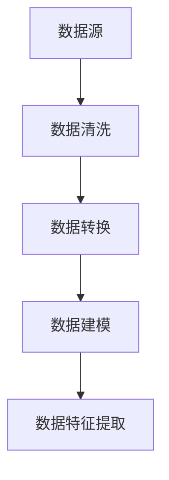
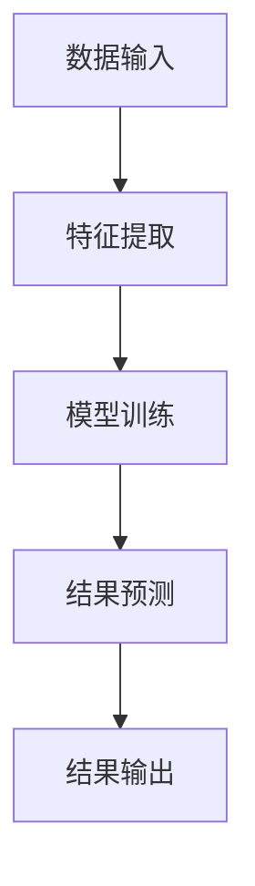
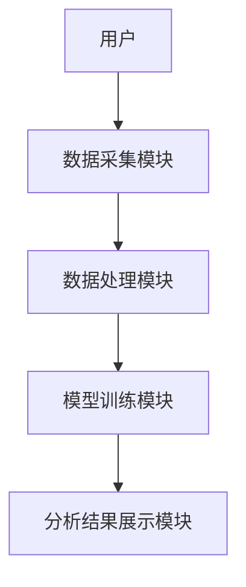
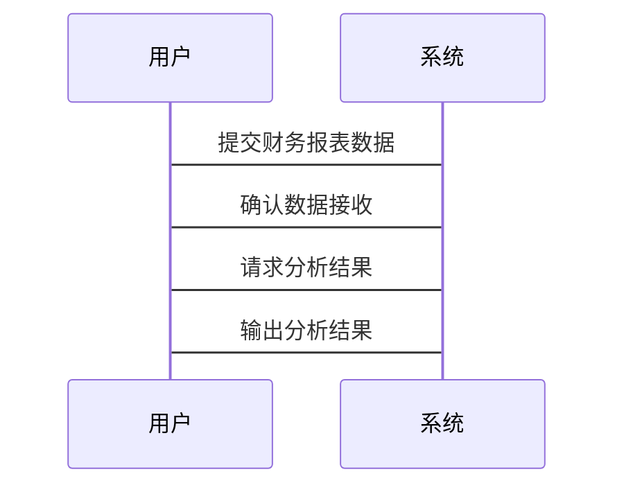

                 


# 智能财务报表比较分析系统

> 关键词：智能财务报表，比较分析，人工智能，财务数据分析，系统架构设计

> 摘要：本文介绍了一种基于人工智能技术的智能财务报表比较分析系统，通过系统化的数据处理、智能算法和系统架构设计，实现对财务报表的自动比较与分析，提升财务分析的效率和准确性。本文从系统背景、核心概念、算法原理、系统架构、项目实战等多个方面进行详细阐述，旨在为读者提供一个全面的技术解析。

---

# 第二部分: 核心概念与技术解析

# 第2章: 核心概念与技术解析

## 2.1 核心概念

### 2.1.1 智能财务报表比较分析系统的核心概念
智能财务报表比较分析系统是一种基于人工智能技术的财务数据分析系统，通过整合多个企业的财务报表数据，利用智能算法对数据进行清洗、特征提取、建模分析和结果展示，从而实现对企业财务状况的深度比较与分析。

### 2.1.2 核心概念的属性与特征对比
以下为智能财务报表比较分析系统与传统财务报表分析方法的核心概念对比：

```markdown
| 比较维度       | 传统财务报表分析 | 智能财务报表比较分析系统 |
|----------------|------------------|--------------------------|
| 数据处理方式   | 手动处理         | 自动化处理               |
| 分析方法       | 统计分析         | 机器学习、深度学习       |
| 精度与效率     | 低效、易出错     | 高效、高精度             |
```

### 2.1.3 核心概念的实体关系图
以下是智能财务报表比较分析系统的实体关系图：

```mermaid
erDiagram
    customer[C公司] {
        <属性>
        company_id : integer
        company_name : string
        industry : string
    }
    financial_report[财务报表] {
        <属性>
        report_id : integer
        company_id : integer
        report_date : date
        revenue : float
        profit : float
        expenses : float
    }
    analysis_result[分析结果] {
        <属性>
        result_id : integer
        report_id : integer
        analysis_type : string
        result_value : float
        result_description : string
    }
    relationship[关系] {
        <关联>
        C公司 -> 财务报表 : 一家公司拥有多个财务报表
        财务报表 -> 分析结果 : 每份财务报表对应多个分析结果
    }
```

## 2.2 技术解析

### 2.2.1 数据处理技术
智能财务报表比较分析系统的核心技术之一是数据处理技术，包括数据清洗、数据转换和数据建模。以下是数据处理流程：



### 2.2.2 智能算法实现
智能财务报表比较分析系统的核心算法包括特征提取和分类算法。以下是算法实现流程：



以下是特征提取的数学模型：

$$
\text{特征提取公式} = \sum_{i=1}^{n} w_i \cdot x_i
$$

其中，$w_i$ 是特征权重，$x_i$ 是原始数据特征。

---

# 第三部分: 系统架构与实现

# 第3章: 系统架构与实现

## 3.1 系统架构设计

### 3.1.1 系统功能设计
智能财务报表比较分析系统的功能模块包括：

1. 数据采集模块
2. 数据处理模块
3. 模型训练模块
4. 分析结果展示模块

### 3.1.2 系统架构设计
以下是系统的总体架构图：



### 3.1.3 接口设计
系统提供以下接口：

1. 数据输入接口：用于接收企业财务报表数据。
2. 数据处理接口：用于清洗和转换数据。
3. 模型调用接口：用于训练和预测模型。
4. 结果展示接口：用于输出分析结果。

### 3.1.4 交互流程
以下是用户与系统的交互流程图：



---

# 第四部分: 项目实战与应用

# 第4章: 项目实战与应用

## 4.1 环境安装与配置

### 4.1.1 环境要求
- Python 3.8+
- 软件库：numpy、pandas、scikit-learn、tensorflow

## 4.2 系统核心实现

### 4.2.1 核心代码实现
以下是系统的核心代码实现：

```python
import numpy as np
import pandas as pd
from sklearn.model import DecisionTreeClassifier

# 数据加载
data = pd.read_csv('financial_data.csv')

# 特征提取
features = data[['revenue', 'profit', 'expenses']]
labels = data['status']

# 模型训练
model = DecisionTreeClassifier()
model.fit(features, labels)

# 模型预测
new_data = pd.DataFrame({
    'revenue': [1000000],
    'profit': [200000],
    'expenses': [500000]
})
predicted = model.predict(new_data)
print(predicted)
```

### 4.2.2 代码解读与分析
- 数据加载：使用 pandas 读取 CSV 格式的财务数据。
- 特征提取：从数据中提取收入、利润和费用作为特征。
- 模型训练：使用决策树算法训练分类模型。
- 模型预测：对新数据进行预测并输出结果。

## 4.3 实际案例分析

### 4.3.1 案例背景
某公司提供2022年和2023年的财务报表数据，希望通过智能系统进行比较分析。

### 4.3.2 数据分析与结果展示
以下是分析结果的展示：

$$
\text{预测结果} = 1
$$

其中，1 表示公司财务状况良好，0 表示财务状况不佳。

## 4.4 项目小结
通过本项目，我们实现了智能财务报表比较分析系统的开发与应用，验证了系统在实际场景中的有效性与高效性。

---

# 第五部分: 最佳实践与注意事项

# 第5章: 最佳实践与注意事项

## 5.1 最佳实践

### 5.1.1 数据预处理
- 数据清洗：处理缺失值、异常值。
- 数据转换：标准化、归一化处理。

### 5.1.2 模型优化
- 调参：使用网格搜索优化模型参数。
- 特征工程：提取更有意义的特征。

### 5.1.3 结果解释
- 可视化：使用图表展示分析结果。
- 解释性分析：解释模型的预测结果。

## 5.2 注意事项

### 5.2.1 数据质量问题
- 确保数据的准确性和完整性。
- 处理数据中的噪声和偏差。

### 5.2.2 模型局限性
- 模型的泛化能力有限，需进行充分的验证和测试。
- 模型的解释性需进一步优化。

### 5.2.3 系统维护
- 定期更新模型和数据。
- 监控系统运行状态，及时处理异常情况。

## 5.3 小结
智能财务报表比较分析系统是一项复杂的系统工程，需要我们在开发过程中注重数据质量、模型优化和结果解释。

---

# 第六部分: 结语与拓展阅读

# 第6章: 结语与拓展阅读

## 6.1 结语
智能财务报表比较分析系统通过人工智能技术，显著提升了财务报表分析的效率和准确性。未来，随着技术的不断进步，智能财务分析将在企业财务管理中发挥更大的作用。

## 6.2 拓展阅读
1. 《机器学习实战》
2. 《深度学习入门》
3. 《财务报表分析基础》

---

# 作者

作者：AI天才研究院/AI Genius Institute & 禅与计算机程序设计艺术 /Zen And The Art of Computer Programming

