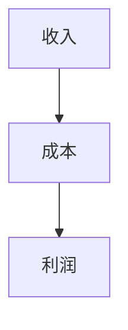
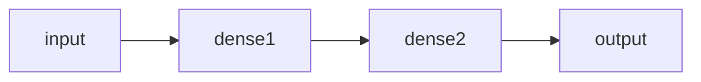
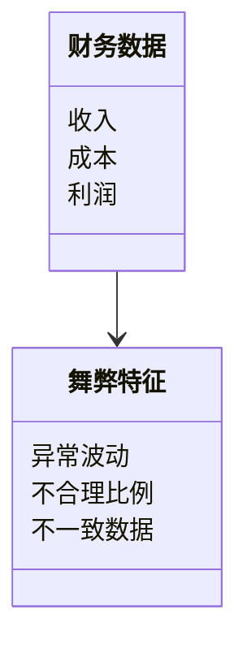
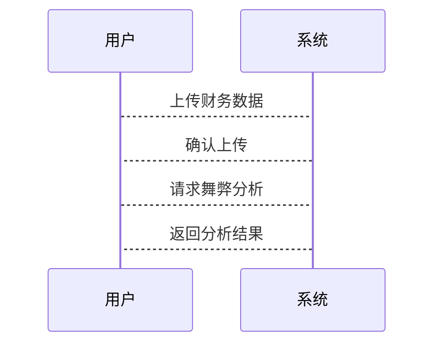

                 


# 智能财务报表舞弊风险评估系统

**关键词**：智能财务报表、舞弊风险评估、机器学习、深度学习、财务数据分析

**摘要**：随着企业财务造假现象的日益严重，传统的财务报表分析方法已难以满足风险评估的需求。本文提出了一种基于人工智能的智能财务报表舞弊风险评估系统，通过机器学习算法对财务数据进行深度分析，识别潜在的舞弊行为，从而为企业管理者和审计人员提供有效的决策支持。

---

# 第1章: 财务报表舞弊风险评估的背景与挑战

## 1.1 财务报表舞弊的背景与现状

### 1.1.1 财务报表舞弊的定义与表现形式
财务报表舞弊是指企业在编制财务报表时，故意虚构、隐瞒或篡改财务数据，以误导利益相关者的行为。常见的舞弊形式包括虚增收入、虚减费用、隐瞒债务等。

**表1-1：常见财务报表舞弊形式对比**

| 舞弊类型 | 具体表现 | 后果 |
|----------|----------|------|
| 虚增收入 | 虚构交易、提前确认收入 | 高估资产，误导投资者 |
| 虚减费用 | 忽略或延迟确认费用 | 高估利润，虚增资产 |
| 调整资产 | 虚增资产、虚减负债 | 骗取贷款或投资 |

### 1.1.2 财务报表舞弊对企业的影响
企业财务报表舞弊可能导致以下后果：
- 损失投资者信任，影响企业声誉。
- 导致企业决策失误，甚至面临法律风险。
- 影响企业的融资能力，增加融资成本。

### 1.1.3 当前财务报表舞弊的风险与挑战
- 数据量大：企业财务数据复杂且多变，传统方法难以处理。
- 舞弊手段隐蔽：舞弊者不断改进手段，传统审计方法难以发现。
- 数据真实性：财务数据的真实性和完整性难以保证。

## 1.2 智能化舞弊风险评估的必要性

### 1.2.1 传统财务报表分析的局限性
- 依赖人工经验：传统方法依赖审计师的主观判断，存在人为误差。
- 处理效率低：面对海量数据，人工分析效率低下。
- 难以发现隐蔽性舞弊：传统方法难以发现复杂的舞弊手段。

### 1.2.2 人工智能技术在财务分析中的应用前景
- 高效性：AI可以快速处理海量数据，提高分析效率。
- 精准性：通过机器学习算法，AI可以发现数据中的隐藏模式，提高舞弊识别的准确性。
- 实时性：AI系统可以实时监控财务数据，及时发现异常情况。

### 1.2.3 智能财务报表舞弊风险评估系统的价值
- 提高审计效率：通过自动化分析，减少人工干预。
- 降低舞弊风险：及时发现潜在舞弊行为，保护企业利益。
- 提供决策支持：为管理者提供可靠的财务数据，支持决策。

## 1.3 本书的核心目标与内容框架

### 1.3.1 本书的核心目标
通过介绍人工智能技术在财务报表舞弊风险评估中的应用，提供一套完整的智能评估系统解决方案，帮助读者理解和实现智能财务分析。

### 1.3.2 本书的主要内容框架
- 第一部分：智能财务报表舞弊风险评估系统概述。
- 第二部分：核心概念与原理。
- 第三部分：算法原理与实现。
- 第四部分：系统分析与架构设计。
- 第五部分：项目实战与案例分析。
- 第六部分：总结与展望。

### 1.3.3 本书的读者群体与适用场景
- 读者群体：财务管理人员、审计人员、数据科学家、IT开发人员。
- 适用场景：企业财务风险管理、审计工作、智能财务分析系统开发。

---

# 第2章: 财务报表数据与舞弊特征分析

## 2.1 财务报表数据的结构化与特征提取

### 2.1.1 财务报表数据的结构化处理
财务报表数据通常包括收入、成本、利润、资产、负债等关键指标。通过结构化处理，可以将这些数据转化为机器学习算法可处理的格式。

**代码示例：将财务数据结构化为表格形式**

```python
import pandas as pd

# 假设财务数据存储在Excel文件中
df = pd.read_excel('financial_data.xlsx')
print(df.head())
```

### 2.1.2 舞弊特征的识别与分类
舞弊特征通常包括异常波动、不合理比例、不一致数据等。通过分析这些特征，可以识别潜在的舞弊行为。

**表2-1：常见舞弊特征**

| 特征类型 | 具体特征 | 示例 |
|----------|----------|------|
| 异常波动 | 收入增长远超行业平均水平 | 收入同比增长率异常 |
| 不合理比例 | 资产与负债比例失调 | 资产负债率异常 |
| 不一致数据 | 财务数据与业务数据不符 | 销售收入与订单数据不符 |

### 2.1.3 数据预处理与特征工程
数据预处理包括数据清洗、数据转换等步骤。特征工程则是将原始数据转化为更有意义的特征，以提高模型的准确性。

**代码示例：数据预处理**

```python
# 清洗数据
df.dropna()  # 删除缺失值
df.drop_duplicates()  # 删除重复值

# 数据转换
df['收入增长率'] = (df['收入'] - df['收入'].shift(1)) / df['收入'].shift(1)
```

## 2.2 舞弊行为的模式识别与关联分析

### 2.2.1 舞弊行为的模式识别方法
模式识别方法包括聚类分析、分类分析等。聚类分析可以发现数据中的异常群体，分类分析可以将数据分为正常和舞弊两类。

**代码示例：聚类分析**

```python
from sklearn.cluster import KMeans

# 聚类分析
kmeans = KMeans(n_clusters=2)
clusters = kmeans.fit_predict(df[['收入', '成本']])
```

### 2.2.2 财务数据中的关联分析
关联分析可以发现数据中的关联关系，如收入与成本之间的关联。

**图2-1：关联分析的mermaid图**



### 2.2.3 舞弊行为的时空分布特征
舞弊行为通常具有一定的时空分布特征，如区域性、季节性等。通过分析这些特征，可以更好地识别舞弊行为。

## 2.3 财务报表舞弊风险评估的核心要素

### 2.3.1 财务数据的完整性与真实性
数据完整性是指数据的完整性和一致性，数据真实性是指数据的可靠性和准确性。

### 2.3.2 财务报表的逻辑性与合理性
财务报表的逻辑性是指各项数据之间的关系符合会计准则，合理性是指数据的变化符合企业的实际情况。

### 2.3.3 舞弊风险的量化评估标准
舞弊风险评估标准通常包括定量指标和定性指标。定量指标如财务比率，定性指标如行业标准。

**表2-2：常见舞弊风险评估指标**

| 指标类型 | 具体指标 | 计算公式 |
|----------|----------|----------|
| 财务比率 | 资产负债率 | 负债总额 / 资产总额 |
| 行业标准 | 行业平均收入增长率 | 行业平均收入增长率 |

---

# 第3章: 基于机器学习的舞弊风险评估算法

## 3.1 常见的机器学习算法及其特点

### 3.1.1 监督学习算法（如决策树、随机森林）
监督学习算法需要标注好的训练数据，适用于分类和回归问题。

**代码示例：随机森林分类**

```python
from sklearn.ensemble import RandomForestClassifier

# 训练随机森林模型
model = RandomForestClassifier(n_estimators=100)
model.fit(X_train, y_train)

# 预测结果
y_pred = model.predict(X_test)
```

### 3.1.2 非监督学习算法（如聚类分析）
非监督学习算法适用于无标注数据，主要用于聚类分析。

### 3.1.3 深度学习算法（如神经网络）
深度学习算法适用于复杂的数据模式识别，但需要大量的训练数据和计算资源。

**图3-1：深度学习网络结构的mermaid图**



## 3.2 舞弊风险评估的算法选择与优化

### 3.2.1 算法选择的依据与标准
算法选择需要考虑数据类型、任务类型、计算资源等因素。

**表3-1：算法选择的依据与标准**

| 依据 | 标准 |
|------|------|
| 数据类型 | 分类/回归 |
| 任务类型 | 监督/非监督 |
| 计算资源 | 高/低 |

### 3.2.2 算法优化策略
算法优化包括参数调优、模型集成等。参数调优可以通过网格搜索等方法实现。

**代码示例：网格搜索调优**

```python
from sklearn.model_selection import GridSearchCV

# 参数网格
param_grid = {'n_estimators': [100, 200], 'max_depth': [None, 10]}

# 网格搜索调优
grid_search = GridSearchCV(RandomForestClassifier(), param_grid)
grid_search.fit(X_train, y_train)
```

### 3.2.3 算法性能评估
算法性能评估包括准确率、召回率、F1分数等指标。

**表3-2：常见算法性能指标**

| 指标 | 公式 |
|------|------|
| 准确率 | 正确预测数 / 总样本数 |
| 召回率 | 正确预测的正例数 / 实际正例数 |
| F1分数 | 2 * (准确率 * 召回率) / (准确率 + 召回率) |

---

# 第4章: 系统分析与架构设计

## 4.1 问题场景介绍

### 4.1.1 系统目标
系统目标是实现智能财务报表舞弊风险评估，帮助用户识别潜在的舞弊行为。

### 4.1.2 项目介绍
项目介绍包括项目背景、项目目标、项目范围等。

### 4.1.3 问题描述
问题描述包括财务报表舞弊的常见形式、舞弊行为对企业的影响等。

## 4.2 系统功能设计

### 4.2.1 领域模型设计
领域模型设计包括实体识别、实体关系设计等。

**图4-1：领域模型的mermaid类图**



### 4.2.2 系统架构设计
系统架构设计包括数据层、业务逻辑层、用户界面层等。

**图4-2：系统架构的mermaid架构图**


### 4.2.3 系统接口设计
系统接口设计包括数据接口、用户接口、日志接口等。

### 4.2.4 系统交互设计
系统交互设计包括用户登录、数据上传、舞弊分析等流程。

**图4-3：系统交互的mermaid序列图**



---

# 第5章: 项目实战与案例分析

## 5.1 环境配置与数据准备

### 5.1.1 环境安装
环境安装包括安装Python、Jupyter Notebook、机器学习库等。

**代码示例：安装环境**

```bash
pip install numpy pandas scikit-learn
```

### 5.1.2 数据收集与预处理
数据收集包括从数据库、Excel文件等来源获取数据。数据预处理包括数据清洗、特征提取等。

**代码示例：数据预处理**

```python
import pandas as pd

# 数据加载
df = pd.read_csv('financial_data.csv')

# 数据清洗
df.dropna()
df.drop_duplicates()

# 特征提取
df['收入增长率'] = (df['收入'] - df['收入'].shift(1)) / df['收入'].shift(1)
```

## 5.2 模型训练与优化

### 5.2.1 模型训练
模型训练包括选择算法、训练模型等。

**代码示例：训练随机森林模型**

```python
from sklearn.ensemble import RandomForestClassifier

# 训练模型
model = RandomForest

