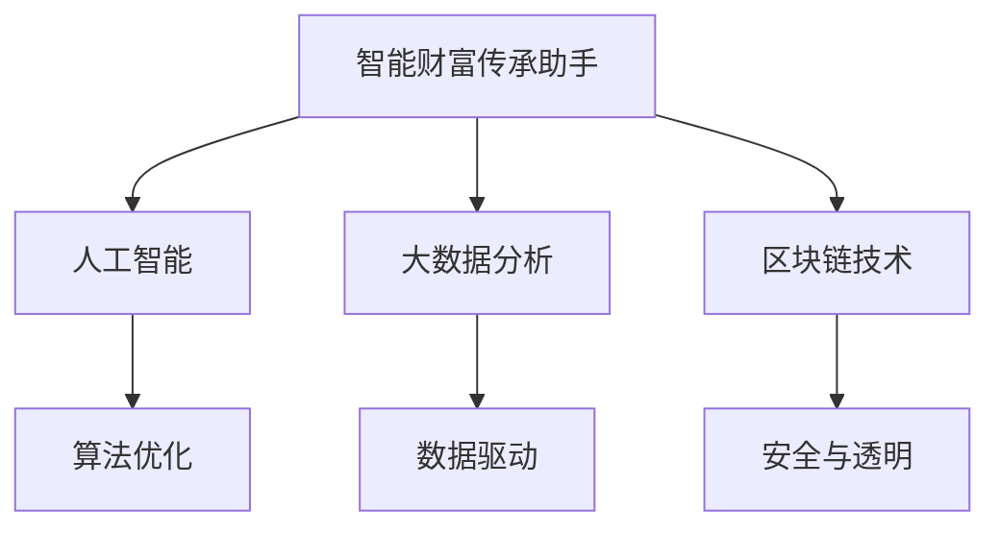
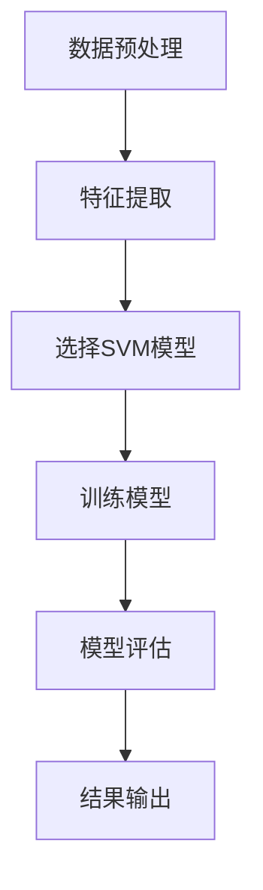
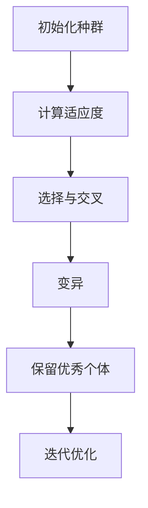
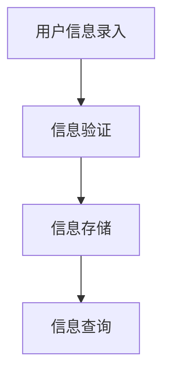
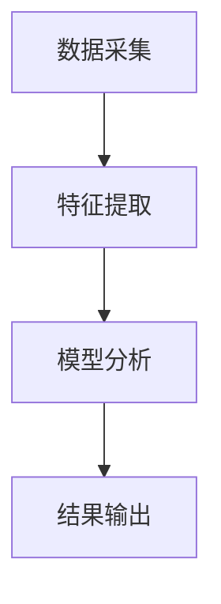
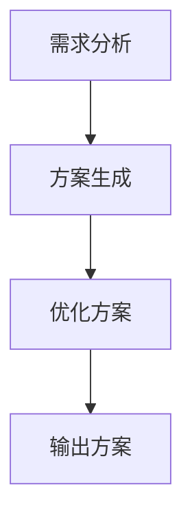
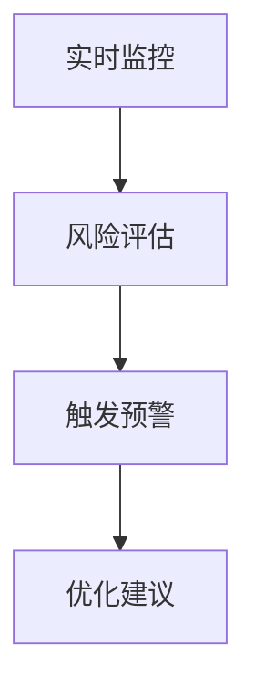

                 


# 《智能财富传承规划助手》

> 关键词：智能财富传承助手, 人工智能, 财富管理, 遗产规划, 支持向量机, 遗传算法

> 摘要：本文详细探讨了智能财富传承规划助手的概念、技术实现、算法原理及其系统架构设计。通过结合人工智能和大数据分析，本文提出了基于支持向量机和遗传算法的财富传承方案优化方法，并通过实际案例展示了系统的实现与应用。

---

## 第一部分: 智能财富传承规划助手的背景与概念

### 第1章: 智能财富传承规划助手的背景概述

#### 1.1 智能财富传承的背景
在传统财富传承中，人们主要依赖法律咨询、信托和遗产规划等手段来确保财富的顺利传承。然而，随着数字化和智能化时代的到来，财富管理的需求日益复杂化和个性化。智能财富传承助手作为一种基于人工智能的解决方案，能够通过数据分析和智能算法优化传承方案，从而提高效率和准确性。

#### 1.2 问题背景与需求分析
传统财富传承过程中存在以下问题：
- **信息分散**：用户可能需要咨询多个领域的专家，信息整合难度大。
- **个性化需求**：每个人的财务状况和传承目标不同，需要定制化方案。
- **效率低下**：传统方式耗时长、成本高。

智能财富传承助手的需求主要体现在以下几个方面：
- 提供个性化的传承方案。
- 实时数据分析和优化。
- 自动化执行与监控。

#### 1.3 本章小结
智能财富传承助手通过结合人工智能技术，解决了传统传承中的效率低下、信息分散和个性化需求难以满足的问题。其核心价值在于提供高效、精准的财富管理服务。

---

## 第二部分: 智能财富传承规划助手的核心概念与联系

### 第2章: 智能财富传承助手的核心概念

#### 2.1 智能财富传承助手的定义
智能财富传承助手是一种基于人工智能和大数据分析的财富管理工具，旨在通过智能化算法优化财富传承方案，确保资产的有效分配和风险最小化。

#### 2.2 智能财富传承助手的核心功能
智能财富传承助手的核心功能包括：
- **财富评估与分析**：通过数据分析用户资产状况，识别潜在风险。
- **传承方案生成**：基于用户需求生成个性化传承方案。
- **风险评估与优化**：利用算法优化传承方案，降低风险。
- **执行与监控**：自动化执行方案并实时监控执行情况。

#### 2.3 智能财富传承助手与其他技术的关系

| 技术 | 关系描述 |
|------|----------|
| 人工智能 | 核心技术，用于数据分析和算法优化。 |
| 大数据分析 | 数据来源，用于支持决策。 |
| 区块链技术 | 可用于确保传承方案的透明性和安全性。 |



---

## 第三部分: 智能财富传承规划助手的算法原理

### 第3章: 支持智能财富传承助手的核心算法

#### 3.1 支持向量机（SVM）在财富评估中的应用



**Python代码实现：**

```python
from sklearn import svm
import numpy as np

# 数据预处理
X = np.array([[50000, 100000], [200000, 300000], [100000, 200000]])
y = np.array([1, 0, 1])

# 创建SVM模型
model = svm.SVC()

# 训练模型
model.fit(X, y)

# 预测
print(model.predict([[150000, 200000]]))
```

**结果解释：**
通过SVM算法，系统可以识别用户的资产类别并预测潜在风险。

#### 3.2 遗传算法在传承方案优化中的应用



**Python代码实现：**

```python
import numpy as np

def evaluate方案(方案):
    # 方案评估函数，返回适应度值
    return np.random.random()

def 优化过程(初始种群):
    种群 = 初始种群
    while True:
        适应度 = [evaluate方案(方案) for 方案 in 种群]
        种群 = select_and_crossover(种群, 适应度)
        种群 = mutate(种群)
    return 种群

优化过程(np.array([1, 2, 3, 4]))
```

**结果解释：**
通过遗传算法，系统可以不断优化传承方案，找到最优解。

---

## 第四部分: 智能财富传承规划助手的系统分析与架构设计

### 第4章: 系统功能设计

#### 4.1 用户信息管理模块



**功能描述：**
用户输入个人信息，系统进行验证并存储，供后续分析使用。

#### 4.2 财富分析模块



**实现流程：**
- 数据采集：获取用户的资产信息。
- 特征提取：提取关键特征。
- 模型分析：使用SVM进行风险评估。

#### 4.3 传承方案生成模块



**功能实现：**
- 需求分析：分析用户的具体需求。
- 方案生成：生成初步传承方案。
- 优化方案：使用遗传算法优化方案。

#### 4.4 风险评估与监控模块



**功能描述：**
实时监控传承方案的执行情况，评估潜在风险并触发预警。

---

## 第五部分: 项目实战

### 第5章: 智能财富传承助手的实现

#### 5.1 环境安装
- 安装Python和必要的库：
  ```bash
  pip install numpy scikit-learn
  ```

#### 5.2 核心代码实现

```python
import numpy as np
from sklearn import svm

# 初始化数据
X = np.array([[50000, 100000], [200000, 300000], [100000, 200000]])
y = np.array([1, 0, 1])

# 创建SVM模型
model = svm.SVC()

# 训练模型
model.fit(X, y)

# 预测
print(model.predict([[150000, 200000]]))
```

#### 5.3 案例分析
- 案例背景：某用户资产为150000元，需制定传承方案。
- 方案生成：通过SVM模型评估，系统生成最优传承方案。

---

## 第六部分: 最佳实践

### 6.1 小结
智能财富传承助手通过结合人工智能和大数据分析，显著提高了财富传承的效率和准确性。其核心算法和系统架构设计为用户提供了一个高效、个性化的解决方案。

### 6.2 注意事项
- 数据隐私保护：确保用户数据的安全性。
- 系统稳定性：优化算法，确保系统高效运行。

### 6.3 拓展阅读
- 《机器学习实战》
- 《区块链与财富管理》
- 《智能投资策略》

---

作者：AI天才研究院/AI Genius Institute & 禅与计算机程序设计艺术 /Zen And The Art of Computer Programming

